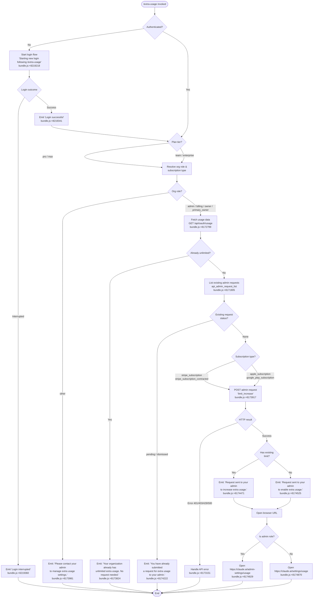

# `/extra-usage`

> Analysis basis: CC v2.1.143 bundle.js (AST extraction + Claude interpretation)
> Minimum version: v2.1.143

---

## Overview

The `/extra-usage` command lets users configure extra usage capacity so that Claude Code continues working after plan-level rate limits are reached. It inspects the authenticated user's subscription tier, organizational role, and any existing admin requests, then either opens the appropriate usage settings URL in a browser, submits a new admin request for a limit increase, or guides the user to contact their organization admin. When no authenticated session exists the command triggers an interactive login flow before proceeding.

---

## Registration

| Field | Value |
|---|---|
| type | `local-jsx` |
| name | `extra-usage` |
| description | `Configure extra usage to keep working when limits are hit` |
| module_id | `Hb1` |
| loc_line | 3116 |

Analysis basis: CC v2.1.143 bundle.js:+8219991

---

## Input Branching

The command entry point (`oJ6`) resolves the current authentication state, subscription plan, and organizational role before routing execution through one of several distinct paths.



Analysis basis: CC v2.1.143 bundle.js:+8219035, +8219043, +8219113, +8174603, +8174660

---

## Behavioral Spec

### Command Entry Point

```
function extraUsageCommandHandler(context):
    authState = resolveAuthState(context)           // fq → Uw
    telemetryEmit("tengu_ember_latch")              // +8218998
    planTier = getPlanTier(authState)               // lV

    if planTier not in ["pro", "max", "team", "enterprise"]:
        return showUnsupportedPlanMessage()

    if not authState.isAuthenticated:
        startLoginFlow(context)                     // H
        return

    extraUsageFlow(authState)                       // lf8
```

Analysis basis: CC v2.1.143 bundle.js:+8218951, +8218962, +8218973, +8218995, +8219113

---

### Authentication State Resolution

```
function resolveAuthState(context):
    rawConfig   = readRawConfig()                   // Cl8
    parsedConfig = parseConfig(rawConfig)           // Rl8
    authDetails = buildAuthDetails(parsedConfig)    // Uw

    authDetails.checkEnvVar("ANTHROPIC_API_KEY")    // +2910507
    authDetails.apiKeyHelper = lookupHelper("apiKeyHelper")  // +2910532
    return authDetails
```

Analysis basis: CC v2.1.143 bundle.js:+2928506, +2928519, +2928529, +2910507, +2910532

---

### Subscription and Role Gate

```
function resolveSubscriptionAndRole(authState):
    subscriptionType = getSubscriptionType(authState)   // QMH → L5
    // Valid subscription types: "stripe_subscription", "stripe_subscription_contracted",
    //                           "apple_subscription", "google_play_subscription"
    // +2928259, +2928286, +2928324, +2928350

    orgRole = getOrgRole(authState)                     // HA
    // Privileged roles: "admin", "billing", "owner", "primary_owner"
    // +2023434, +2023442, +2023452, +2023460

    return { subscriptionType, orgRole }
```

Analysis basis: CC v2.1.143 bundle.js:+2928212, +2928234, +2927969, +2928259, +2928350

---

### Usage Data Fetch

```
function fetchUsageData(authToken):
    request = {
        method:  "GET",
        url:     "/api/oauth/usage",               // +8172799
        timeout: 5000,                             // +8172827
        headers: { "Content-Type": "application/json" }  // +8172841, +8172856
    }
    response = httpClient.get(request)             // vK.get → +8172792

    if response.status == 401:
        refreshToken()
        response = httpClient.get(request)         // 401→refresh→retry +8173026

    if fetchFails:
        logError(response)
    return response.data
```

Analysis basis: CC v2.1.143 bundle.js:+8172799, +8172827, +8172856, +8173026

---

### Admin Request Eligibility Check

```
function checkAdminRequestEligibility(orgUUID):
    // Telemetry action key: "api_admin_request_eligibility"  +8172256
    // Uses teleport-org header: "teleport-org"               +8172404
    response = httpClient.get("/api/oauth/usage", orgUUID)    // vK.get +8172310
    if response.error:
        throw Error(response)                                  // +8172436
    return response.data
```

Analysis basis: CC v2.1.143 bundle.js:+8172253, +8172256, +8172404, +8172436

---

### Admin Request List

```
function listAdminRequests(orgUUID):
    // Action key: "api_admin_request_list"   +8171905
    params = { statuses: ["pending", "dismissed"] }  // +8172008, +8174153, +8174163
    response = httpClient.get(
        buildOrgPath(orgUUID, "admin_requests"),      // A.append +8171999
        params
    )
    if response.error:
        throw Error(response)                         // +8172138
    return response.data
```

Analysis basis: CC v2.1.143 bundle.js:+8171902, +8172008, +8174153, +8174163

---

### Admin Request Creation

```
function createAdminRequest(orgUUID, requestType):
    // Action key: "api_admin_request_create"           +8171640
    // Endpoint:   /api/oauth/organizations/:orgUUID/admin_requests  +8171697
    body = { type: "limit_increase" }                  // +8173917
    response = httpClient.post(
        "/api/oauth/organizations/" + orgUUID + "/admin_requests",
        body
    )
    if response.error:
        throw Error(response)                          // +8171788
    return response.data
```

Analysis basis: CC v2.1.143 bundle.js:+8171637, +8171640, +8171697, +8173917

---

### API Error Handler

```
function handleAPIError(error):
    if isAxiosError(error):                            // o8.isAxiosError +8173151
        status = error.response.status
        detail = error.response.data.detail            // +8173440

        if status in [401, 403, 429]:                  // +172567, +172576, +172585
            return emitAuthOrRateLimitError(detail)
        if status >= 500:                              // +8173234
            return emitServerError(detail)

    emitGenericError(error.message)                    // +8173808
```

Analysis basis: CC v2.1.143 bundle.js:+8173151, +8173234, +8173440, +172567, +172576, +172585

---

### Browser URL Launch

```
function openBrowserURL(url, isAdmin):
    targetURL = isAdmin
        ? "https://claude.ai/admin-settings/usage"    // +8174829
        : "https://claude.ai/settings/usage"          // +8174870

    platform = process.platform
    if platform == "darwin":                           // +7543375
        exec("open", targetURL)                        // +7543549
    else if platform == "win32":                       // +7543391
        exec("rundll32", "url,OpenURL", targetURL)     // +7543475, +7543487
    else:
        exec("xdg-open", targetURL)                    // +7543556

    emitStatus("browser-opened")                       // +8174937
```

Analysis basis: CC v2.1.143 bundle.js:+8174829, +8174870, +7543375, +7543391, +7543549, +8174987

---

### Login Flow (Unauthenticated Path)

```
function startLoginFlow(context):
    // Random jitter before launching: Math.random() * 2   +12638154, +12638156
    delay = Math.random() * 2
    setTimeout(delay, function():
        print("Starting new login following /extra-usage. Exit with Ctrl-C to use existing account.")
        // +8219218
        result = triggerOAuthLogin()                        // _.onChangeAPIKey +8219318
        if result == "success":
            print("Login successful")                       // +8219341
            extraUsageFlow(newAuthState)
        else:
            print("Login interrupted")                      // +8219360
    )
```

Analysis basis: CC v2.1.143 bundle.js:+8219148, +8219218, +8219318, +8219341, +8219360, +12638156, +12638193

---

### Telemetry Routing

```
function resolveTelemetryRoute(context):
    // Route keys used during auth/telemetry resolution
    // "essential-traffic"  +959080
    // "no-telemetry"       +959139
    // "default"            +959213

    route = getTelemetryConfig(context)               // A$A → xH +959157
    if route == "no-telemetry":
        return noOp()
    if route == "essential-traffic":
        return sendEssentialOnly()
    return sendDefault()
```

Analysis basis: CC v2.1.143 bundle.js:+959080, +959139, +959213, +959244

---

### Event Record Creation

```
function createEventRecord(eventData):
    record = {
        id:        generateID(),                   // x6 +3161125
        timestamp: Date.now(),                     // +3161214
        data:      eventData
    }
    writeToStorage(record)                         // nhL +3161267
    return record
```

Analysis basis: CC v2.1.143 bundle.js:+3161125, +3161139, +3161158, +3161162, +3161214, +3161267

---

## State & Side Effects

| Item | Detail |
|---|---|
| Telemetry | `tengu_ember_latch` fired once on command entry (bundle.js:+8218998) |
| API calls | `GET /api/oauth/usage` (timeout 5000 ms, bundle.js:+8172799, +8172827) |
| API calls | `GET` admin request eligibility check via `api_admin_request_eligibility` (bundle.js:+8172256) |
| API calls | `GET` admin request list via `api_admin_request_list` (bundle.js:+8171905) |
| API calls | `POST /api/oauth/organizations/:orgUUID/admin_requests` via `api_admin_request_create` (bundle.js:+8171640, +8171697) |
| Token refresh | 401 response triggers a token refresh and single retry (bundle.js:+8173026) |
| Browser launch | Opens `https://claude.ai/admin-settings/usage` or `https://claude.ai/settings/usage` depending on role (bundle.js:+8174829, +8174870); platform-specific open command used (bundle.js:+7543375, +7543391, +7543549) |
| Login trigger | Unauthenticated users launch a new OAuth login flow via `_.onChangeAPIKey` (bundle.js:+8219318) |
| Console output | Several fixed-string messages emitted to stdout (bundle.js:+8173824, +8173981, +8174222, +8174471, +8174525, +8219218, +8219341, +8219360) |
| appState changes | <!-- TODO: not found in depth-2 traversal; needs --depth 4 --> |
| Sound | <!-- TODO: not found in depth-2 traversal; needs --depth 4 --> |
| Hook registration | <!-- TODO: not found in depth-2 traversal; needs --depth 4 --> |

---

## Version History

| Version | Change |
|---|---|
| v2.1.143 | Initial analysis |

---

## Common Mistakes

1. **Running the command without an active session** — if no authenticated session exists the command silently begins an OAuth login flow before doing anything else. Users who press Ctrl-C during that flow will see "Login interrupted" and the extra-usage configuration will not proceed.
2. **Non-privileged organizational role** — users whose role is not `admin`, `billing`, `owner`, or `primary_owner` receive a "Please contact your admin" message and no request is submitted. This is a gate enforced before any API call is made (bundle.js:+8173981).
3. **Duplicate request submission** — if a request with status `pending` or `dismissed` already exists the command will report it and exit without creating a new one (bundle.js:+8174222). Users must wait for the existing request to be resolved by their admin.
4. **Already-unlimited organizations** — organizations that already have unlimited extra usage receive an informational message and no request is made (bundle.js:+8173824). Attempting to re-run the command to "force" a request will yield the same result.
5. **Plan tier mismatch** — the command only proceeds for plans identified as `pro`, `max`, `team`, or `enterprise` (bundle.js:+8218962, +8218973, +8173576, +8173588). Users on other plan types will not reach the admin-request logic.
6. **Misinterpreting the browser-open step** — the browser URL is opened *after* the admin request is successfully submitted (bundle.js:+8174937), not as an alternative to it. Closing the browser does not cancel the submitted request.

---

## Appendix — Identifier Mapping

> For bundle debugging only. Identifiers change across versions.

| Identifier | Role |
|---|---|
| `oJ6` | Command entry point / top-level handler for `/extra-usage` |
| `fq` | Auth state builder (reads config, constructs auth details) |
| `Cl8` | Raw config reader |
| `Rl8` | Config parser |
| `Uw` | Auth details assembler (checks env vars, API key helper) |
| `lV` | Plan tier resolver |
| `G6` | Subscription / organization metadata resolver |
| `m76` | Subscription type extractor (first branch) |
| `p76` | Subscription type extractor (second branch) |
| `Ts` | Org-level metadata fetcher |
| `Ci6` | Cached org data accessor (set/get with deduplication) |
| `N6` | Event record creator (timestamp + storage write) |
| `QMH` | Subscription type gate / router |
| `L5` | Subscription type normalizer |
| `HA` | Org role resolver |
| `zq` | Telemetry route resolver |
| `A$A` | Telemetry config reader |
| `lf8` | Core extra-usage logic orchestrator |
| `Pu` | Eligibility pre-check handler |
| `LnH` | Usage data fetch handler (`api_usage_fetch`) |
| `v` | HTTP client utility / request builder |
| `hC1` | Admin request eligibility fetch handler (`api_admin_request_eligibility`) |
| `SC1` | Admin request list handler (`api_admin_request_list`) |
| `yC1` | Admin request creation handler (`api_admin_request_create`) |
| `CC1` | API error classifier (Axios error detection + status routing) |
| `NY` | Post-request outcome message selector |
| `XH` | String coercion utility |
| `NH` | Error notification / log dispatcher |
| `qK` | Platform-aware browser URL opener |
| `H` | Login flow launcher (random jitter + setTimeout wrapper) |
| `_` | Current user / session context object (exposes `onChangeAPIKey`) |