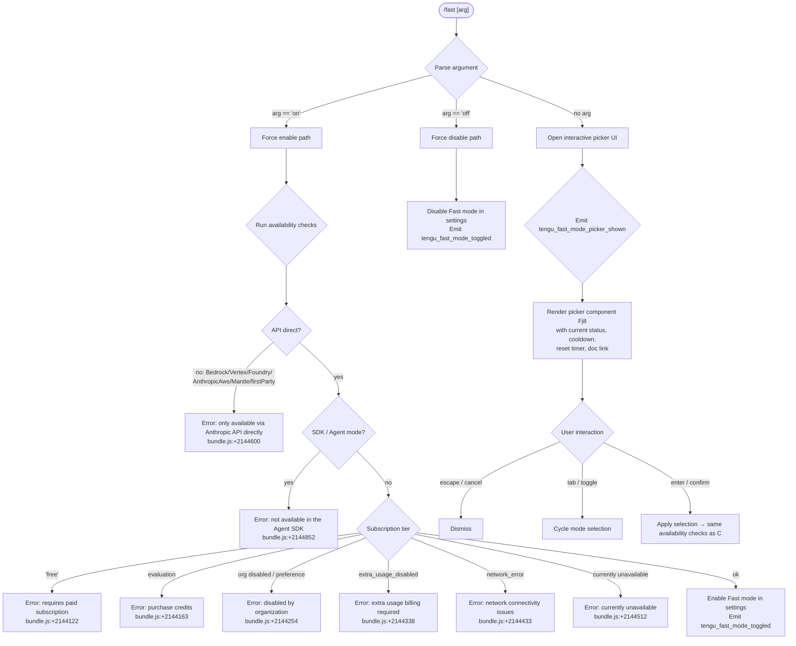

# `/fast`

> Analysis basis: CC v2.1.142 bundle.js (AST extraction + Claude interpretation)
> Minimum version: v2.1.142

---

## Overview

The `/fast` command toggles **Fast mode** — a research-preview feature that enables accelerated model responses via a dedicated backend path. When invoked without an argument, it opens an interactive picker UI; when given `on` or `off` explicitly, it applies the change immediately and emits telemetry. Multiple availability checks gate whether Fast mode can actually be enabled for the current user session.

---

## Registration

| Field | Value |
|---|---|
| type | `local-jsx` |
| name | `fast` |
| description | `Toggle fast mode ( ... )` |
| argumentHint | `[on\|off]` |
| immediate | `null` |
| thinClientDispatch | `control-request` |
| isHidden | `null` |
| module_id | `DXq` |
| load_inline | `true` |
| loc_byte | `11387289` |
| loc_byte_end | `11387561` |
| loc_line | `6977` |
| arbor_handler.name | `pV7` |
| arbor_handler.fqn | `claude-2.1.142::pV7` |
| arbor_handler.kind | `AsyncFunction` |
| arbor_handler.resolution_path | `module_id` |
| arbor_handler.n_hits | `3` |

Analysis basis: CC v2.1.142 bundle.js:+11387289

---

## Input Branching

The command has four or more distinct top-level branches based on the argument value and availability state, so a Mermaid flowchart is used.



Analysis basis: CC v2.1.142 bundle.js:+11386335 (handler entry), +2144096–2144668 (availability literals), +11386449 (`"off"` literal), +11386558 (`tengu_fast_mode_picker_shown`)

---

## Behavioral Spec

### Main Handler (`pV7`)

The Arbor-resolved handler is `pV7` (AsyncFunction, resolved via `module_id` → `DXq`). It orchestrates four sub-tasks in sequence.

```
async function fastCommandHandler(context):
    currentSettings = readCurrentSettings(KK)          // reads fastMode flag
    soundEffect    = playCooldownSound(H)               // Math.random, setTimeout
    availResult    = await checkFastAvailability(Pa)    // network + subscription check
    renderResult   = await renderFastUI(ExH)            // picker or immediate toggle
    displayBadge   = renderStatusBadge(Bj8)             // status line component
    return JSX via f7.createElement
```

Analysis basis: CC v2.1.142 bundle.js:+11386335–11386617

---

### Availability Check (`Pa` — fast-availability resolver)

`Pa` is the availability gate called by the handler. It contacts the backend and classifies the result into one of the named states found in literals.

```
async function checkFastAvailability(args):
    providerType = getProviderType(VA, KK)   // reads bH (config store)

    if providerType in [bedrock, foundry, anthropicAws, mantle, vertex, firstParty]:
        return { status: "unavailable",
                 reason: "Fast mode is only available when using the Anthropic API directly" }
    // bundle.js:+2144600

    if isAgentSdkMode():
        return { status: "unavailable",
                 reason: "Fast mode is not available in the Agent SDK" }
    // bundle.js:+2144852

    orgStatus = await fetchOrgFastStatus(G6)  // calls Ji6, IA_, CA_; emits tengu_penguins_off on failure

    match orgStatus:
        case "free":
            return { reason: "Fast mode requires a paid subscription" }          // +2144122
        case "evaluation":
            return { reason: "Fast mode unavailable during evaluation…" }        // +2144163
        case "preference" / org-disabled:
            return { reason: "Fast mode has been disabled by your organization" } // +2144254
        case "extra_usage_disabled":
            return { reason: "Fast mode requires extra usage billing…" }         // +2144338
        case "network_error":
            return { reason: "Fast mode unavailable due to network connectivity issues" } // +2144433
        case unavailable (generic):
            return { reason: "Fast mode is currently unavailable" }              // +2144512
        case "ok" / available:
            return { status: "available" }

    // Auth type check
    authType = getAuthType(xA, hfL)   // "oauth" | "api-key"  +2145149
    return availabilityResult
```

Analysis basis: CC v2.1.142 bundle.js:+2144568 (`Pa` entry), +2144600, +2144668, +2144852, +2144996

---

### Prefetch / Network Request (`ExH` — fast-mode UI executor)

`ExH` is the component that either immediately toggles the setting or renders the interactive UI after verifying a cached or freshly-fetched availability token.

```
async function fastModeUIExecutor(args):
    // Dedup in-flight requests
    if inFlightPromise exists:
        log("Fast mode prefetch in progress, returning in-flight promise")  // +2148262
        return inFlightPromise

    // Cache check
    if fetchedRecently():
        log("Skipping fast mode prefetch, fetched recently")                // +2148509
    else:
        token = await acquireAuthToken($q, CfL, q9)

        if not token:
            throw Error("No auth available")                                 // +2148685

        response = await httpRequest(v, $P, z3)   // uses oauth/api-key header  +2147861, +2147883

        if response.status == 401 or 403:
            handleOAuthRecovery(Du, zVL)           // tengu_oauth_401_* events

    // Apply selection
    if arg == "off" or userSelectedOff:
        setFastMode(false)                          // writes to config via p_
        emitTelemetry("tengu_fast_mode_toggled")   // +11382860
        return JSX "Fast mode OFF"                  // +11383031

    runAvailabilityChecks()
    if available:
        setFastMode(true)
        emitTelemetry("tengu_fast_mode_toggled")
        return JSX with enabled status "ON "        // +11385374

    return JSX with error reason and doc link:      // +11385820
        // "https://code.claude.com/docs/en/fast-mode"
```

Analysis basis: CC v2.1.142 bundle.js:+2148179 (`ExH` entry), +2148262, +2148509, +2148685, +2148820, +2149312 (`Ii8.emit`)

---

### Interactive Picker Component (`Fj8`)

When no argument is provided, `Fj8` renders the interactive picker. Telemetry `tengu_fast_mode_picker_shown` fires immediately on display.

```
function fastPickerComponent(props):
    state = useAppState($6, YL_)               // reads/writes fastMode flag
    [localMode, setLocalMode] = useState()

    useEffect:
        // register keyboard handler via o_
        on "escape"/"cancel" → dismiss
        on "tab"/"toggle"    → cycle selection
        on "enter"/"confirm" → applySelection()

    // Cooldown logic (Vi8):
    if cooldownActive:
        log("Fast mode cooldown expired, re-enabling fast mode")  // +2145823
        scheduleReEnable(Date.now + cooldownDelta)

    // Status display:
    if status == "overloaded":
        show warning: "Fast mode overloaded and is temporarily unavailable"  // +11385546
    if limitHit:
        show: "You've hit your fast limit · resets in <timer>"              // +11385600

    // Model labels displayed in picker:
    //   "Opus 4.6" (claude-opus-4-6)    +2145392, +2145343
    //   "Opus 4.7"                       +2145727, +2145354
    //   "Fast mode (research preview)"   +11384598

    // Theme/color rendering via lwH (Zs), wA (q$H) — full ANSI palette

    return JSX layout with column/row grid   // +11385200, +11385263
```

Analysis basis: CC v2.1.142 bundle.js:+11383184 (`Fj8` entry), +11383260 (useState), +11386558 (picker telemetry), +11385305, +11385374, +11385380

---

### Settings Persistence (`p_` — settings writer)

After the user's selection is confirmed, `p_` persists the `fastMode` key to disk via the settings layer.

```
async function writeSettings(key, value, scope):
    configPath = resolveConfigPath(eR6, jXH, Iy)   // ~/.claude/settings.json  +1194525
    lock = await acquireFileLock(TA6)
    existing = await readSettings($R6)
    merged  = Object.assign(existing, { fastMode: value })
    await atomicWrite($R6, merged)                  // mkdir + appendFile + rename
    emitEvent(DCH.emit)                             // internal event bus
    cacheInvalidate(kz)                             // clears DV6 and LZ8 caches  +26086
```

Analysis basis: CC v2.1.142 bundle.js:+1203275 (`p_` entry), +1194525, +1194535, +11382124 (`"fastMode"` key)

---

### Status Badge Component (`Bj8`)

`Bj8` renders the persistent status indicator shown in the prompt area.

```
function fastModeBadge(props):
    flagSettings = readFlagSettings(RLH, Uj8)   // reads "fastMode", "model", etc. +11382124, +11382207
    applyFlagSettings(cN, E$)                   // "apply_flag_settings"  +11382494
    modelLabel  = formatModel(TxH, uc)          // "claude-opus-4-6" | "opus"  +2145392, +2145410
    tokenWindow = "[1m]"                         // +2145424
    theme       = readTheme(lwH, Zs)            // dark/light/auto  +3310724
    colorize    = applyColorScheme(wA, q$H)     // full chalk color palette
    render "Fast mode OFF" | "ON " + modelLabel + tokenWindow
```

Analysis basis: CC v2.1.142 bundle.js:+11382775 (`Bj8` entry), +11383031, +11385305, +2145392

---

## State & Side Effects

| Item | Detail |
|---|---|
| Telemetry — `tengu_fast_mode_toggled` | Fired on every confirmed toggle (on or off). bundle.js:+11382860 |
| Telemetry — `tengu_fast_mode_picker_shown` | Fired when picker UI is opened (no argument case). bundle.js:+11386558 |
| Telemetry — `tengu_penguins_off` | Fired when org Fast-mode availability fetch fails. bundle.js:+2144706 |
| Telemetry — `tengu_org_penguin_mode_fetch_failed` | Fired on fetch failure from the availability endpoint. bundle.js:+2149681 |
| Telemetry — `tengu_oauth_401_sdk_callback_refreshed` | Fired when OAuth 401 is recovered via SDK callback. bundle.js:+2919147 |
| Telemetry — `tengu_oauth_401_recovered_from_disk` | Fired when OAuth 401 is recovered from disk token. bundle.js:+2919841 |
| Telemetry — `tengu_oauth_401_recovered_from_keychain` | Fired when OAuth 401 is recovered from keychain. bundle.js:+2920194 |
| Telemetry — `tengu_config_lock_contention` | Fired if config file lock takes longer than expected. bundle.js:+3152558 |
| Telemetry — `tengu_config_stale_write` | Fired on stale config write detection. bundle.js:+3152694 |
| Telemetry — `tengu_config_auth_loss_prevented` | Fired when a write that would wipe auth is blocked. bundle.js:+3153037 |
| Telemetry — `tengu_config_parse_error` | Fired on config JSON parse failure. bundle.js:+3155139 |
| appState changes | `fastMode` boolean key written to user/project/local settings via `p_`. Key literal: `"fastMode"` bundle.js:+11382124 |
| Config file | `~/.claude/settings.json` (user scope). bundle.js:+1194525, +1194535 |
| Cache invalidation | `DV6` and `LZ8` caches cleared on write via `kz`. bundle.js:+26086, +26098 |
| Cooldown timer | `Vi8` sets a re-enable timer using `Date.now` + delta when cooldown expires. bundle.js:+2145770, +2145823 |
| Keyboard hook | Interactive picker registers key handlers via `o_` / `K.registerHandler`. bundle.js:+3949775 |
| Sound effect | Random-interval sound cue via `H` (Math.random + setTimeout). bundle.js:+12592945 |
| HTTP prefetch | Background prefetch of availability token; deduplicated by in-flight promise. bundle.js:+2148262 |
| thinClientDispatch | `control-request` — dispatched in thin-client / remote session scenarios. |

---

## Version History

| Version | Change |
|---|---|
| v2.1.142 | Initial analysis. Fast mode registered as `local-jsx`, handler `pV7` (AsyncFunction). Interactive picker (`Fj8`), availability gating via `Pa`/`G6`, settings persistence via `p_`. Models: Opus 4.6 / Opus 4.7. |

---

## Common Mistakes

1. **Using `/fast on` in non-Anthropic-API sessions** — Fast mode is blocked when the provider is Bedrock, Vertex, Foundry, AnthropicAws, Mantle, or `firstParty`. The error message `"Fast mode is only available when using the Anthropic API directly"` is returned immediately (bundle.js:+2144600). Switching to a direct Anthropic API key resolves this.

2. **Using `/fast on` inside the Agent SDK** — The command explicitly checks for SDK / headless mode and returns `"Fast mode is not available in the Agent SDK"` (bundle.js:+2144852). There is no override.

3. **Expecting `/fast on` to succeed on a free-tier account** — The availability check returns `"Fast mode requires a paid subscription"` for accounts whose tier is `"free"` (bundle.js:+2144122).

4. **Toggling rapidly during cooldown** — A cooldown period is enforced. Rapid re-enabling is suppressed until `Vi8`'s timer fires. The log message `"Fast mode cooldown expired, re-enabling fast mode"` confirms when the cooldown clears (bundle.js:+2145823).

5. **Omitting the argument and pressing Enter without selecting** — Without an explicit `on`/`off`, the picker UI is shown. Pressing Escape or issuing cancel dismisses without making any change; only `enter`/`confirm` applies the selection (bundle.js:+11384921).

6. **Assuming Fast mode works when `extra_usage_disabled`** — If the org has disabled extra-usage billing, the command returns `"Fast mode requires extra usage billing · /extra-usage to enable"` (bundle.js:+2144338). The `/extra-usage` command must be used first.

---

## Appendix — Identifier Mapping

> For bundle debugging only. Identifiers change across versions.

| Identifier | Role |
|---|---|
| `pV7` | Main async handler for `/fast` command (Arbor-resolved entry point) |
| `KK` | Current settings reader (reads fastMode and related flags from config store) |
| `VA` | Provider/API-type resolver (determines Bedrock, Vertex, etc.) |
| `bH` | Config store accessor (low-level key-value read) |
| `H` | Sound-effect scheduler (Math.random + setTimeout for audio cue) |
| `Pa` | Fast-mode availability resolver (subscription + provider + org gating) |
| `G6` | Org-level Fast-mode availability fetcher |
| `Z76` | Availability sub-step A (part of G6 pipeline) |
| `V76` | Availability sub-step B (part of G6 pipeline) |
| `ws` | Availability sub-step C (calls bH, Ds) |
| `Ds` | Feature-flag or availability data reader |
| `Ji6` | Growthbook/experiment cache lookup (vA_.has/get/add, gMH.get) |
| `IA_` | Experiment event emitter (emits `GrowthbookExperimentEvent`, `growthbook_experiment`) |
| `CA_` | Availability result classifier (mY9, m_, GE9, WRH) |
| `y6` | Config file reader / backup writer |
| `x6` | Path resolver utility |
| `dA_` | Config data accessor |
| `cMH` | Config file read/write implementation (readFileSync, mkdirSync, copyFileSync) |
| `XhL` | File watcher (vi6.watchFile / unwatchFile) |
| `v` | Debug-level logger / log dispatcher |
| `f7K` | Log formatting function |
| `Zt_` | Log transport (MKK, $KK) |
| `RH` | JSON.stringify wrapper |
| `_` | Generic utility / string helper |
| `H5` | Redaction / sanitization helper (replaces sensitive values with `[REDACTED]`) |
| `H6A` | Header map builder (H7K.map) |
| `BhH` | Output writer wrapper (calls gHA) |
| `gHA` | Terminal write helper (H.write) |
| `O7K` | Transcript/log file writer (mkdir, appendFile, rotate via M6A) |
| `YhH` | Debounce/flush timer (clearTimeout, setTimeout, setImmediate) |
| `i8H` | Log batch assembler (K6A, ojH.join, b8, V6) |
| `Vv8` | EISDIR error guard for file writes |
| `$6A` | Log file path builder (ojH.join) |
| `M6A` | Log file rotation handler (stat, endsWith `.txt`, rename, unlink) |
| `$7K` | Log file append worker (mkdir, appendFile, rotate) |
| `C9` | Active-file-set tracker (fI8.add/delete, Object.assign) |
| `E_` | Environment / context flag |
| `HH6` | VS Code environment detector (`"claude-vscode"`) |
| `bv` | Background/session context value |
| `V8` | Settings loader orchestrator (HC6, OB) |
| `HC6` | Settings cache resolver (as_, Nm8, ss_) |
| `as_` | Settings cache read (DV6.has/get) |
| `Nm8` | Settings loader (GDA, W5H, $B, PDA, Dc) |
| `ss_` | Settings cache write (DV6.set) |
| `OB` | Settings object builder (assembles user/project/local settings) |
| `__` | Settings merge utility (calls JV) |
| `Ei8` | Fast-mode status formatter (calls bH) |
| `ExH` | Fast-mode UI executor / prefetch manager (main UI branch) |
| `$q` | Auth token acquirer (NMA → bH) |
| `NMA` | OAuth/API-key token reader |
| `$P` | HTTP client for availability endpoint (z3 pipeline) |
| `z3` | API request builder (OL, yu, f8_, GV, HH6, bH, Il8, NR, y6, DmH) |
| `OL` | Request header assembler (bH) |
| `yu` | Response parser (OL, V8, OA) |
| `f8_` | Request option builder |
| `GV` | API URL resolver |
| `Il8` | File-descriptor token reader (`CLAUDE_CODE_API_KEY_FILE_DESCRIPTOR`) |
| `NR` | Token trimmer (H.slice, length 20) |
| `hE` | Auth helper (xA) |
| `CfL` | Token cache manager (q9, o8.get) |
| `q9` | OAuth token validator (jfA, LIK, _.replace, qS6.includes) |
| `Du` | In-flight request deduplicator (L8_.get/delete/set, zVL) |
| `zVL` | OAuth 401 recovery orchestrator (RMH, YmH, ceH, SH, uH, Ja, oK, Oo, NH, DM) |
| `RMH` | Refresh-token reader (my) |
| `YmH` | Interactive OAuth re-auth helper (OL, Ja, xA, oK, NH) |
| `SH` | SDK OAuth callback invoker |
| `uH` | Disk-based token refresh reader |
| `Ja` | OAuth token writer (E4L, ZdA) |
| `oK` | Keychain token accessor (zeA) |
| `NH` | Network error handler / OAuth error reporter (k_, bH, $q, JvK, hRH.push, Yc.logError) |
| `DM` | OAuth refresh DM handler (z8_) |
| `p_` | Settings persistence writer (JO, OB, sj, $8, M1, hu8, jXH, TA6, RH, kz, $R6, Iy, __, ax, NH, DCH.emit) |
| `JO` | Settings write orchestrator (W5H, OB) |
| `W5H` | Settings file path resolver (uV.join, eR6, nhK, Iy, lhK) |
| `sj` | Settings pre-write validator (wc) |
| `wc` | Settings file reader for validation (x6, bM, v, IS6, _.readFileSync, vS6, L.slice, L.replaceAll) |
| `$8` | Error classifier (O8) |
| `hu8` | Settings write timestamp recorder (PR6.set, Date.now) |
| `jXH` | Settings write path resolver (eR6, OB) |
| `eR6` | Config path builder (uV.resolve, b8, uV.dirname) |
| `TA6` | Atomic file write helper (lstatSync, openSync, writeFileSync, fchmodSync, fsyncSync, renameSync, unlinkSync) |
| `kz` | Cache invalidator on write (DV6.clear, LZ8.clear) |
| `$R6` | Global config read/write (h6, Ju8, Wu8, JyK, MR6.dirname, _5H.mkdir/readFile/appendFile/writeFile) |
| `h6` | Git-ignore checker (VS6, __) |
| `Ju8` | Config schema validator (SL) |
| `Wu8` | Config write guard (O_) |
| `JyK` | Home-dir config path builder (MR6.join, MzA.homedir) |
| `Iy` | `.claude` directory path joiner (uV.join) |
| `ax` | Post-write hooks (iS, j1, km8, OB, wV6) |
| `iS` | Write completion signaller |
| `j1` | Memory usage sampler on write (W6A.has/add, hx, N6A.push, process.memoryUsage) |
| `km8` | Settings load telemetry recorder (Date.now, G8, JV6, Dc, f96, GDA, W5H, uV.resolve, $B, PDA; emits `settings_load_completed`) |
| `wV6` | Post-write state sync |
| `t6` | Transcript/snapshot writer (oA_, Z0, H, amH, CE9, smH, v, cMH, h76, d, rA_) |
| `oA_` | Config snapshot writer (Qz.dirname, x6, L.mkdirSync, Date.now, qeA, v, d, Z0, L.statSync, O8, cMH, h76, A, nv, RH, Qz.basename, aA_, L.readdirStringSync, V.startsWith, Number, X.split, Number.isNaN, Qz.join, L.copyFileSync, Z.slice, L.unlinkSync, TA6, f) |
| `qeA` | Snapshot metadata builder (ei8, Object.assign) |
| `h76` | Snapshot path helper |
| `aA_` | Backup directory path builder (Qz.join, b8; literal: `"backups"`) |
| `amH` | Snapshot pre-check helper |
| `CE9` | Snapshot entry enumerator (Object.entries) |
| `smH` | Snapshot timestamp recorder (Date.now) |
| `rA_` | Snapshot rollback helper (Qz.dirname, x6, nv, RH, TA6) |
| `K` | Output pad formatter (L.map, f.padEnd) |
| `Bj8` | Fast-mode status badge component (renders "Fast mode OFF" / "ON" in prompt) |
| `Uj8` | Flag-settings reader (RfH, p_, cN, E$, TxH, RLH, _, BY, n1, FJ) |
| `RfH` | Raw flag reader |
| `cN` | CCR context helper (E$; literal: `"ccr"`) |
| `E$` | Context tag emitter (xjH) |
| `TxH` | Model label formatter (`"claude-opus-4-6"`, `"opus"`, `"[1m]"`) |
| `uc` | Config value reader (bH) |
| `DP` | Display-property builder (wAH, JAH, VA, AA, qq) |
| `RLH` | Flag-type parser (reads `cacheBreakerPhrase`, `autoCompactWindow`, `briefTranscript`, `isBriefOnly`, `fastMode`, `model`; coerces String/Number/Boolean) |
| `BY` | Picker option builder (KK, FJ, n1, uc, q.includes) |
| `FJ` | Option formatter (AA, bB, xfH, vxH, lV, DP, xf, VA, YM, nV) |
| `n1` | Model-name normalizer (trim, toLowerCase, sG, replace, zAH; maps `opusplan`, `sonnet`, `haiku`, `best`) |
| `lwH` | Theme and border loader (Zs, L7, M6.dim, wA) |
| `Zs` | Theme reader (s76, Pr6, oMH, KI9) |
| `s76` | Theme value reader (bRL; literal: `"dark"`) |
| `Pr6` | Theme name validator (Cu8.includes; values: `light`, `light-ansi`, `dark-ansi`, `light-daltonized`, `dark-daltonized`) |
| `oMH` | Theme prefix stripper (H.startsWith, H.slice) |
| `L7` | Config context loader for theme (ix, V8, ZpH.includes, y6) |
| `ix` | Active-session tracker (eeH, _.add, uJ.filter, _.has) |
| `wA` | Foreground color resolver (`rgb(`, `ansi256(`, `ansi:`, chalk palette) |
| `q$H` | Chalk color dispatcher (full 32-color + hex + ansi256 + rgb palette) |
| `PF` | Fallback color emitter |
| `Yu` | Model display label builder (uc; literals: `"Opus 4.6"`, `"Opus 4.7"`) |
| `SE` | Token/cost formatter ($tA) |
| `$tA` | Number formatter (Number.isInteger, H.toFixed) |
| `K2H` | Cost-budget display (KK) |
| `Fj8` | Interactive Fast-mode picker React component (main UI) |
| `$6` | AppState reader (YL_, _.getState, R$H.useSyncExternalStore) |
| `YL_` | AppState context accessor (R$H.useContext, ReferenceError; error: `"useAppState/useSetAppState cannot be called outside of an <AppStateProvider />"`) |
| `l_` | AppState setter (YL_) |
| `Vi8` | Cooldown timer manager (Date.now, KK, v, ssA.emit) |
| `$` | Daemon status reader (zEq) |
| `zEq` | Daemon status file reader (Va, Date.now, u7, h06, RH; file: `"daemon.status.json"`) |
| `Va` | Daemon status parser (ufH) |
| `ufH` | Status string trimmer (Z_H, _.trim) |
| `u7` | AsyncLocalStorage store accessor (bcL.getStore) |
| `h06` | Daemon status path builder (OEq.join, b8) |
| `o_` | Keyboard event handler registrar (o2, n$H.useRef, Object.keys, n$H.useEffect, M.push, K.registerHandler, $) |
| `o2` | Handler context reader (l$H.useContext) |
| `M` | MCP client manager (IvH, Peq, L.get, v, L.values, $, n_5) |
| `IvH` | MCP server connection orchestrator |
| `Peq` | MCP update applier (H.applyMcpUpdate, SY8, A.cleanup, Ov, cY) |
| `n_5` | MCP client set reconciler (Object.entries, A.filter, _.getClients, Y78, q, a8, v, BrH, IvH, Peq, Object.fromEntries, K.map) |
| `t1` | Time-remaining formatter (Math.floor, Math.round; values: 86400000ms, 3600000ms, 60s; label `"0s"`) |
| `H_` | String identity helper (_) |
| `GH` | String coercer (String) |
| `BrH` | MCP result JSON serializer (RH) |