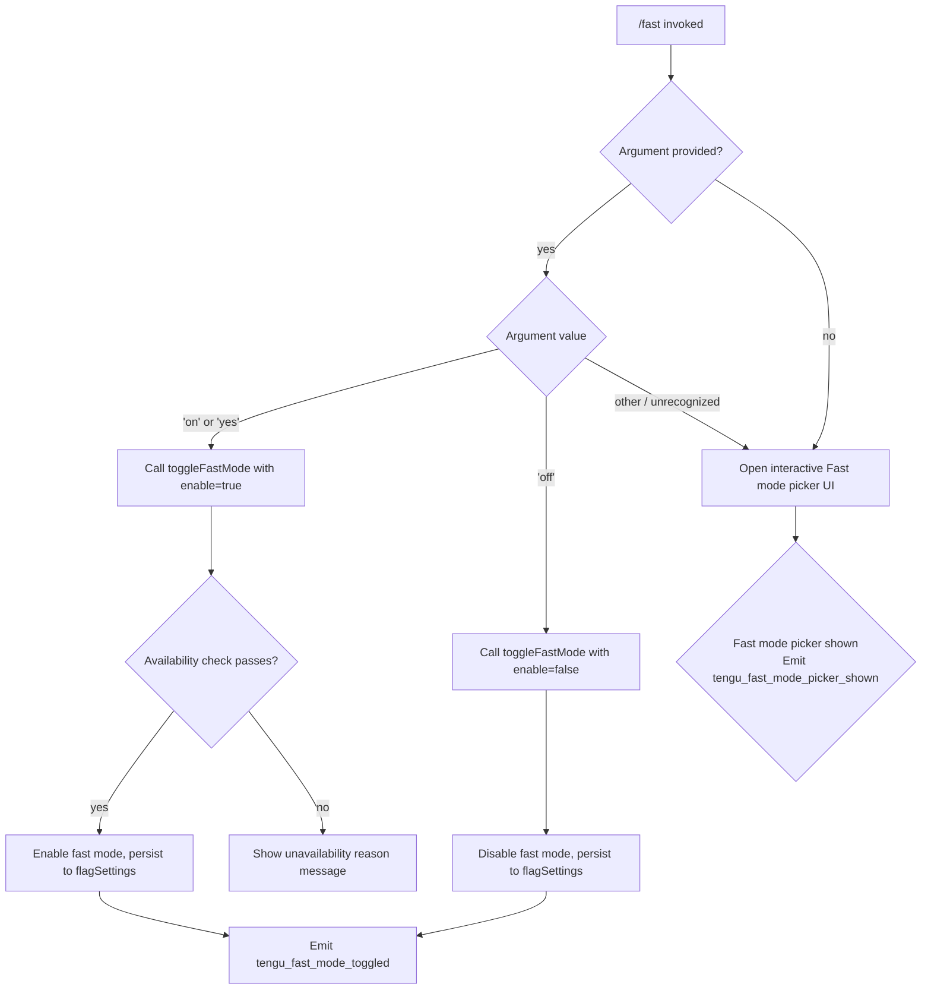

# `/fast`

> Analysis basis: CC v2.1.143 bundle.js (AST extraction + Claude interpretation)
> Minimum version: v2.1.143

---

## Overview

The `/fast` command toggles **Fast mode** (research preview) on or off for the current Claude Code session. When no argument is provided, it opens an interactive picker UI that displays the current state, usage limits, and availability constraints; when `on` or `off` is passed directly, it toggles the setting immediately. Fast mode availability is gated by API provider type, subscription tier, organization policy, Agent SDK context, and a real-time availability prefetch that is cached to avoid redundant network calls.

---

## Registration

| Field | Value |
|---|---|
| type | `local-jsx` |
| name | `fast` |
| description | `null` |
| argumentHint | `[on\|off]` |
| thinClientDispatch | `control-request` |
| module_id | `X2q` |

Analysis basis: CC v2.1.143 bundle.js:+11426313

---

## Input Branching

The command entry point (`commandHandler`) inspects the trimmed argument token and routes to one of three paths.



Analysis basis: CC v2.1.143 bundle.js:+11425359, +11425373, +11425420, +11425473, +11425492, +11425533, +11425580, +11425641

---

## Behavioral Spec

### 1. Argument Parsing

The command receives a raw string argument. The argument is trimmed and converted to lowercase before comparison.

```
function parseArgument(rawArg):
    token = rawArg.trim().toLowerCase()
    if token == "on" or token == "yes":
        return ENABLE
    if token == "off":
        return DISABLE
    return OPEN_PICKER
```

Accepted affirmative tokens: `"yes"`, `"on"` (bundle.js:+26422, +26428).
Accepted negative token: `"off"` (bundle.js:+11425473).

Analysis basis: CC v2.1.143 bundle.js:+26373, +26422, +26428

---

### 2. Provider Availability Check

Before enabling Fast mode, the availability checker (`checkAvailability`) resolves the current API provider type and applies a series of gating conditions in priority order.

```
function checkAvailability(providerType, subscriptionTier, orgPolicy, sdkContext, flagSettings):

    // Gate 1: Agent SDK context
    if sdkContext == true:
        return UNAVAILABLE("Fast mode is not available in the Agent SDK")

    // Gate 2: Provider must be first-party Anthropic API
    if providerType not in ["firstParty"]:
        // Covers: "bedrock", "foundry", "anthropicAws", "mantle", "vertex"
        return UNAVAILABLE("Fast mode is only available when using the Anthropic API directly")

    // Gate 3: Subscription tier
    if subscriptionTier == "free":
        return UNAVAILABLE("Fast mode requires a paid subscription")

    // Gate 4: Organization policy
    if orgPolicy == "preference" and orgDisabled:
        return UNAVAILABLE("Fast mode has been disabled by your organization")

    // Gate 5: Extra usage billing
    if flagSettings.extraUsage == "extra_usage_disabled":
        return UNAVAILABLE("Fast mode requires extra usage billing · /extra-usage to enable")

    // Gate 6: Network availability
    if networkStatus == "network_error":
        return UNAVAILABLE("Fast mode unavailable due to network connectivity issues")

    // Gate 7: General unavailability
    if remoteStatus == "disabled":
        return UNAVAILABLE("Fast mode is currently unavailable")

    return AVAILABLE
```

Provider type string constants (bundle.js:+2020544, +2020594, +2020650, +2020704, +2020752, +2020761):
- `"bedrock"`, `"foundry"`, `"anthropicAws"`, `"mantle"`, `"vertex"` → blocked
- `"firstParty"` → allowed to proceed

Unavailability message strings:
- `"Fast mode is only available when using the Anthropic API directly"` (bundle.js:+2147776)
- `"Fast mode is not available"` (bundle.js:+2147844)
- `"Fast mode requires a paid subscription"` (bundle.js:+2147298)
- `"Fast mode unavailable during evaluation. Please purchase credits."` (bundle.js:+2147339)
- `"Fast mode has been disabled by your organization"` (bundle.js:+2147430)
- `"Fast mode requires extra usage billing · /extra-usage to enable"` (bundle.js:+2147514)
- `"Fast mode unavailable due to network connectivity issues"` (bundle.js:+2147609)
- `"Fast mode is currently unavailable"` (bundle.js:+2147688)
- `"Fast mode is not available in the Agent SDK"` (bundle.js:+2148098)
- `"Fast mode unavailable: Fast mode is not available in the Agent SDK"` (bundle.js:+2148028)

Analysis basis: CC v2.1.143 bundle.js:+2147032, +2147068, +2147756, +2147776, +2147844, +2148028

---

### 3. Remote Availability Prefetch

The prefetch function (`prefetchFastModeAvailability`) performs a network request to determine whether Fast mode is currently enabled remotely. Results are cached; duplicate in-flight requests are deduplicated by returning the existing promise.

```
function prefetchFastModeAvailability(authContext):

    // Return cached in-flight promise if one exists
    if inFlightPromise != null:
        log("Fast mode prefetch in progress, returning in-flight promise")
        return inFlightPromise

    // Skip if fetched recently (recency check via Date.now)
    if timeSinceLastFetch < RECENCY_THRESHOLD:
        log("Skipping fast mode prefetch, fetched recently")
        return cachedResult

    // Resolve authentication
    if authContext == null:
        throw Error("No auth available")

    // Build request headers
    headers = {}
    if authContext.type == "oauth":
        headers["accessToken"] = authContext.accessToken
        headers["anthropic-beta"] = ...
    if authContext.type == "api-key":
        headers["x-api-key"] = authContext.key

    // Execute network request
    result = await networkRequest(headers)

    // Handle HTTP error responses
    if response.status == 401:
        // OAuth token revoked
        setStatus("OAuth token has been revoked")
        return DISABLED
    if response.status == 403:
        setStatus("disabled")
        return DISABLED

    // On network error
    if isAxiosError(error):
        setStatus("network_error")
        return NETWORK_ERROR

    // Cache positive result
    cacheResult("enabled")
    return ENABLED
```

Status values observed: `"enabled"` (bundle.js:+2151404), `"disabled"` (bundle.js:+2148159), `"network_error"` (bundle.js:+2148194), `"unknown"` (bundle.js:+2148223), `"pending"` (bundle.js:+2152219), `"enabled (cached)"` (bundle.js:+2152784), `"disabled (network_error)"` (bundle.js:+2152803).

HTTP status codes handled: `401` (bundle.js:+2151996), `403` (bundle.js:+2152022).

Analysis basis: CC v2.1.143 bundle.js:+2151355, +2151371, +2151386, +2151438, +2151540, +2151658, +2151855, +2151861, +2151954, +2152157

---

### 4. Fast Mode Toggle

When enabling or disabling Fast mode, the toggle function (`toggleFastMode`) persists the new state to `flagSettings` in the configuration layer and emits a telemetry event.

```
function toggleFastMode(enable: boolean, currentState, configPersist):

    if enable == false:
        newState = { fastMode: false }
        persistConfig("flagSettings", newState)
        emitTelemetry("tengu_fast_mode_toggled", { value: false })
        return

    availabilityResult = checkAvailability(...)

    if availabilityResult != AVAILABLE:
        displayMessage(availabilityResult.reason)
        return

    newState = { fastMode: true }
    persistConfig("flagSettings", newState)
    emitTelemetry("tengu_fast_mode_toggled", { value: true })
```

Configuration key: `"flagSettings"` (bundle.js:+2147993).
Telemetry event emitted on toggle: `tengu_fast_mode_toggled` (bundle.js:+11421884).

Analysis basis: CC v2.1.143 bundle.js:+11421518, +11421799, +11421884, +2147993

---

### 5. Interactive Picker UI

When `/fast` is invoked without a recognized argument, a JSX-rendered interactive picker is displayed. The picker shows current Fast mode state, model information, usage limits, and availability warnings.

```
function renderFastModePicker(fastModeState, usageState, availabilityState):

    display header: " Fast mode (research preview)"
    display toggle row:
        label: "Fast mode"
        value: fastModeState.enabled ? "ON " : "OFF"

    if availabilityState.status == "overloaded":
        display warning: "Fast mode overloaded and is temporarily unavailable"

    if usageState.limitHit:
        display: "You've hit your fast limit"
        display: " · resets in " + formatDuration(usageState.resetTime)

    display model selector:
        options: ["Opus 4.6", "Opus 4.7"]

    display docs link: "https://code.claude.com/docs/en/fast-mode"

    // Key bindings registered:
    // escape → cancel
    // tab    → toggle (cycle mode)
    // enter  → confirm

    if userConfirms:
        emitTelemetry("tengu_fast_mode_picker_shown")
        applySelection()
    if userCancels:
        display "Kept Fast mode OFF"
```

Model identifiers available in picker: `"opus-4-6"` (bundle.js:+2148849), `"opus-4-7"` (bundle.js:+2148903).
Display labels: `"Opus 4.6"` (bundle.js:+2148519), `"Opus 4.7"` (bundle.js:+2148530).
Documentation URL: `"https://code.claude.com/docs/en/fast-mode"` (bundle.js:+11424844).
"Kept Fast mode OFF" message (bundle.js:+11423017).
"Fast mode OFF" label (bundle.js:+11422055).
" Fast mode (research preview)" header string (bundle.js:+11423622).

Picker key binding event strings: `"confirm:yes"` (bundle.js:+11423236), `"confirm:nextField"` (bundle.js:+11423252), `"confirm:next"` (bundle.js:+11423274), `"confirm:previous"` (bundle.js:+11423291), `"confirm:cycleMode"` (bundle.js:+11423312), `"confirm:toggle"` (bundle.js:+11423334).

Analysis basis: CC v2.1.143 bundle.js:+11425492, +11425580, +11425582, +11425641, +11422055, +11423622, +11424329, +11424398, +11424404

---

### 6. Cooldown Re-enable Logic

A cooldown state machine monitors Fast mode status. When the cooldown period expires, Fast mode is automatically re-enabled.

```
function cooldownWatcher(fastModeState, timestampRef):

    if fastModeState.status == "cooldown":
        waitUntil(fastModeState.cooldownExpiry)
        log("Fast mode cooldown expired, re-enabling fast mode")
        setFastModeStatus("active")
        emitEvent(ItA.emit, { status: "active" })
```

Status values in cooldown cycle: `"cooldown"` (bundle.js:+2148946), `"active"` (bundle.js:+2149082).
Log message: `"Fast mode cooldown expired, re-enabling fast mode"` (bundle.js:+2148999).

Analysis basis: CC v2.1.143 bundle.js:+2148946, +2148958, +2148986, +2148997, +2148999, +2149059, +2149082

---

### 7. Duration Formatting (Usage Reset Timer)

The duration formatter (`formatDuration`) converts a millisecond epoch value into a human-readable countdown string for the "resets in" display.

```
function formatDuration(milliseconds):
    if milliseconds < 1000:       // bundle.js:+205969
        return "0s"               // bundle.js:+205945
    if milliseconds < 60000:      // bundle.js:+205923
        seconds = floor(milliseconds / 1000)
        return seconds + "s"
    if milliseconds < 3600000:    // bundle.js:+206084
        minutes = round(milliseconds / 60000)
        return minutes + "m"
    if milliseconds < 86400000:   // bundle.js:+206050
        hours = round(milliseconds / 3600000)
        return hours + "h"
    days = round(milliseconds / 86400000)
    return days + "d"
```

Time constants (all in milliseconds):
- 1 second: `1000` (bundle.js:+205969)
- 1 minute: `60000` (bundle.js:+205923)
- 1 hour: `3600000` (bundle.js:+206084)
- 1 day: `86400000` (bundle.js:+206050)
- 60 (integer divisor): (bundle.js:+206157)

Analysis basis: CC v2.1.143 bundle.js:+205923, +205945, +205969, +206050, +206084, +206125, +206157

---

### 8. Config Persistence Layer

Persisting Fast mode state traverses a layered settings hierarchy. The write function (`saveConfig`) resolves config at four levels and merges changes.

```
function saveConfig(layer, patch):
    // Layers in resolution order:
    // "policySettings"    → org-managed, read-only from user perspective
    // "userSettings"      → global user config, utf-8 encoded
    // "projectSettings"   → per-project config
    // "localSettings"     → local override config

    resolvedPath = resolvePath(layer)     // uses PXH.dirname
    existing = readConfig(resolvedPath, encoding="utf-8")

    // Safety guard: refuse write if auth is missing from re-read config
    // when cache still has auth (GH #3117 guard)
    if existing.auth == null and cache.auth != null:
        log("saveGlobalConfig fallback: re-read config is missing auth that cache has; refusing to write. See GH #3117.")
        emitTelemetry("tengu_config_auth_loss_prevented")
        return

    merged = deepMerge(existing, patch)
    writeConfig(resolvedPath, merged, encoding="utf-8")
    emitEvent(WCH.emit, { layer, patch })
```

Config layer keys: `"policySettings"` (bundle.js:+1206298), `"userSettings"` (bundle.js:+1206856), `"projectSettings"` (bundle.js:+1206971), `"localSettings"` (bundle.js:+1206994).
Encoding: `"utf-8"` (bundle.js:+1206908).
GH #3117 guard log message (bundle.js:+3159506).

Analysis basis: CC v2.1.143 bundle.js:+1206298, +1206395, +1206410, +1206432, +1206438, +1206856, +1206875, +1206971, +1206994, +3159506, +3159634

---

### 9. thinClientDispatch Behavior

The command registration sets `thinClientDispatch: "control-request"`. This instructs thin-client environments (e.g., `claude-vscode`, bundle.js:+49017) to forward the `/fast` invocation as a control-plane request rather than treating it as a standard message-stream command. The `$SH` → `E_` call chain handles the VSCode context dispatch path.

Analysis basis: CC v2.1.143 bundle.js:+11426313, +48995, +49017

---

## State & Side Effects

| Item | Detail |
|---|---|
| Telemetry: `tengu_fast_mode_picker_shown` | Emitted when the interactive picker UI is rendered (bundle.js:+11425582) |
| Telemetry: `tengu_fast_mode_toggled` | Emitted on every successful toggle (on or off) via the `$P8` handler (bundle.js:+11421884) |
| Telemetry: `tengu_penguins_off` | Emitted when fast mode is turned off via the availability checker path (bundle.js:+2147882) |
| Telemetry: `tengu_org_penguin_mode_fetch_failed` | Emitted when the remote availability prefetch fails (bundle.js:+2152857) |
| Telemetry: `tengu_config_auth_loss_prevented` | Emitted when the GH #3117 auth-loss safety guard triggers during config write (bundle.js:+3159634) |
| Config write | Persists `fastMode` boolean under `"flagSettings"` key (bundle.js:+2147993, +11420519) |
| Cooldown state | Managed via `ci8` / cooldown watcher; transitions through `"cooldown"` → `"active"` (bundle.js:+2148946, +2149082) |
| In-flight promise deduplication | A single pending prefetch promise is stored and re-used to prevent duplicate network calls (bundle.js:+2151438) |
| `appState` changes | Fast mode state (`fastMode` field) is updated in app state via `applyFlagSettings` (`"apply_flag_settings"` action, bundle.js:+11421518) |
| Sound | <!-- TODO: not found in depth-2 traversal; needs --depth 4 --> |
| Hook registration | `r_` registers a handler under the `"Global"` scope (bundle.js:+3961620, +3961807) |
| Random jitter | `H` uses `Math.random` with a multiplier of `2` and `setTimeout` for jitter in prefetch scheduling (bundle.js:+12638154, +12638156, +12638193) |
| File unlink | `q` calls `n8K.unlinkSync` as part of error cleanup (bundle.js:+14482768) |
| Event bus emissions | `li8.emit` and `ItA.emit` are called on state transitions (bundle.js:+2149059, +2152488) |

---

## Version History

| Version | Change |
|---|---|
| v2.1.143 | Initial analysis — Fast mode picker, provider gating, cooldown watcher, prefetch cache, GH #3117 guard |

---

## Common Mistakes

1. **Using `/fast` on a non-first-party provider**: Fast mode is silently unavailable on AWS Bedrock, GCP Vertex, Azure Foundry, `anthropicAws`, and `mantle` endpoints. The command will display `"Fast mode is only available when using the Anthropic API directly"` rather than toggling (bundle.js:+2147776).

2. **Expecting `/fast on` to work without extra-usage billing enabled**: If the account has not enabled extra usage, the toggle will be refused with `"Fast mode requires extra usage billing · /extra-usage to enable"`. Run `/extra-usage` first (bundle.js:+2147514).

3. **Using `/fast` inside the Agent SDK**: Fast mode is explicitly disabled in Agent SDK contexts. The error `"Fast mode is not available in the Agent SDK"` will be shown regardless of subscription tier (bundle.js:+2148098).

4. **Expecting immediate re-enable after hitting the rate limit**: Fast mode enters a `"cooldown"` state when the usage limit is hit; it is re-enabled automatically only after the cooldown expiry timestamp, displayed as `"resets in <duration>"` in the picker (bundle.js:+2148946, +11424653).

5. **Passing an unrecognized argument**: Any argument other than `on`, `yes`, or `off` (case-insensitive) silently falls through to opening the interactive picker rather than producing an error (bundle.js:+26422, +26428, +11425473).

6. **Expecting the command to work in the VSCode extension without a control-plane connection**: The `thinClientDispatch: "control-request"` registration means `/fast` is forwarded as a control request in thin-client environments; if the control channel is unavailable the command will not execute (bundle.js:+11426313).

---

## Appendix — Identifier Mapping

> For bundle debugging only. Identifiers change across versions.

| Identifier | Role |
|---|---|
| `hv7` | Command entry-point / top-level handler for `/fast` |
| `MK` | Provider type resolver (maps auth context to provider string) |
| `DA` | Provider type string normalizer / enum mapper |
| `xH` | String coercion utility |
| `H` | Prefetch jitter scheduler (uses `Math.random` + `setTimeout`) |
| `Va` | Fast mode availability checker (applies all gating conditions) |
| `G6` | Remote availability state machine / cache manager |
| `v` | Log/debug message emitter |
| `E_` | Thin-client / VSCode dispatch adapter |
| `$SH` | VSCode context forwarder (calls `E_`) |
| `Fv` | Flag settings reader |
| `I8` | Auth credential resolver |
| `Qi8` | String-to-status enum converter |
| `dML` | Agent SDK context detector |
| `NxH` | Remote availability prefetch executor |
| `zq` | Essential-traffic network client |
| `YP` | Result promise wrapper |
| `yE` | Response array/includes validator |
| `N6` | Availability result recorder (timestamps + stores result) |
| `nML` | Auth token accessor (reads `accessToken` from cache) |
| `q` | Error cleanup handler (calls `unlinkSync`) |
| `Eu` | In-flight promise deduplication cache manager |
| `p_` | Config read/write/persist function |
| `a6` | Global config save with auth-loss guard (GH #3117) |
| `d` | React state dispatcher / setter |
| `K` | Column formatter (uses `padEnd`) |
| `$P8` | Fast mode toggle apply handler (persists + emits telemetry) |
| `_` | Identity / passthrough utility |
| `MP8` | Flag settings applicator (`apply_flag_settings` action dispatcher) |
| `_JH` | Theme/UI state renderer for fast mode indicator |
| `cY` | Model selector state handler (Opus 4.6 / 4.7) |
| `Tu` | Model display name resolver |
| `SE` | Usage/subscription status checker |
| `f2H` | Fast mode enabled-state reader |
| `OP8` | Interactive picker JSX component (main UI) |
| `O6` | App state store accessor (uses `useSyncExternalStore`) |
| `bL_` | App state context reader (throws on missing `AppStateProvider`) |
| `i_` | App state setter hook |
| `ci8` | Cooldown watcher / re-enable trigger |
| `A` | Text case normalizer (`toLowerCase`) |
| `f` | Terminal/stream close handler |
| `$` | Event timestamp recorder |
| `JZq` | Telemetry event emitter with timestamp |
| `r_` | Global key-binding handler registrar |
| `r2` | Key-binding context reader |
| `M` | Key-binding registry map manager |
| `Hq` | Duration formatter (ms → human-readable string) |