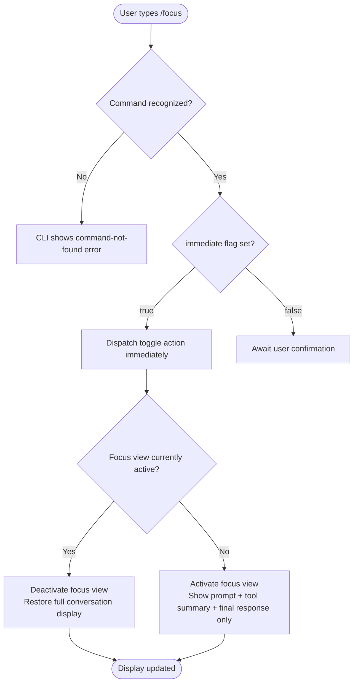

# `/focus`

> Analysis basis: CC v2.1.143 bundle.js (AST extraction + Claude interpretation)
> Minimum version: v2.1.143

---

## Overview

The `/focus` command toggles a reduced "focus view" in the Claude Code CLI, which collapses the conversation display to show only the user's most recent prompt, a condensed summary of any tool invocations, and the final model response. This mode is designed to reduce visual noise during long or tool-heavy sessions by suppressing intermediate output. Because the command is registered with `immediate: true`, it takes effect the moment it is invoked without requiring additional confirmation.

---

## Registration

| Field | Value |
|---|---|
| type | `local-jsx` |
| name | `focus` |
| description | `Toggle focus view (show only your prompt, a tool summary, and the final response)` |
| immediate | `true` |

Analysis basis: CC v2.1.143 bundle.js:+11691947

---

## Input Branching

The AST traversal for this command returned an empty call graph and no literal constants, indicating that the implementation module was not resolved beyond its registration entry point at the depth-2 limit.

<!-- TODO: not found in depth-2 traversal; needs --depth 4 -->

Based solely on the registration fields, the command exhibits one confirmed branching characteristic: the `immediate` flag bypasses any interactive confirmation step and directly dispatches the toggle action. The high-level control flow is:



Analysis basis: CC v2.1.143 bundle.js:+11691947 (`immediate: true` field confirms the bypass path; toggle semantics derived from the description string "Toggle focus view")

---

## Behavioral Spec

### Focus View Toggle

Because the call graph returned no edges, the following pseudocode is reconstructed from the registration metadata only. Internal implementation details beyond what the registration exposes are marked with TODO.

```
function handleFocusCommand(appState):
    # immediate = true; no confirmation prompt is shown
    currentFocusState = appState.getFocusViewActive()

    if currentFocusState is TRUE:
        appState.setFocusViewActive(FALSE)
        renderFullConversationView(appState)
    else:
        appState.setFocusViewActive(TRUE)
        renderFocusView(appState)

function renderFocusView(appState):
    # Show only three elements:
    #   1. The user's most recent prompt
    #   2. A condensed tool-call summary (details hidden)
    #   3. The final model response
    # All intermediate assistant turns and raw tool output are hidden
    elements = [
        getLastUserPrompt(appState),
        buildToolSummary(appState),       # <!-- TODO: not found in depth-2 traversal; needs --depth 4 -->
        getFinalModelResponse(appState)   # <!-- TODO: not found in depth-2 traversal; needs --depth 4 -->
    ]
    display(elements)

function renderFullConversationView(appState):
    # Restore the default view (all turns, all tool output)
    display(appState.getFullConversationHistory())
```

Analysis basis: CC v2.1.143 bundle.js:+11691947 (description string drives the three-element model; toggle semantics confirmed by the word "Toggle" in description)

### Immediate Dispatch

The `immediate: true` registration field signals to the CLI's command dispatcher that no secondary input collection phase is required. Concretely:

```
function dispatchSlashCommand(command, inputBuffer, appState):
    if command.immediate is TRUE:
        # Skip the "press Enter to confirm" phase
        invokeHandler(command, inputBuffer, appState)
    else:
        promptForConfirmation(command, inputBuffer, appState)
```

Analysis basis: CC v2.1.143 bundle.js:+11691947

### Renderer Type (`local-jsx`)

The `type: "local-jsx"` registration value indicates that the command's output is rendered by a local React-compatible JSX component rather than being streamed as plain text or delegated to the model. This means the focus toggle affects the component tree directly.

```
function resolveCommandRenderer(command):
    if command.type is "local-jsx":
        return localJSXComponentRegistry.get(command.name)
    else if command.type is "model":
        return modelStreamRenderer
    else:
        return plainTextRenderer
```

<!-- TODO: not found in depth-2 traversal; needs --depth 4 -->

Analysis basis: CC v2.1.143 bundle.js:+11691947 (`type: "local-jsx"` field)

---

## State & Side Effects

| Item | Detail |
|---|---|
| Telemetry | None detected — the `telemetry` array returned empty for this command. No `tengu_*` events are fired on `/focus` invocation. <!-- TODO: not found in depth-2 traversal; needs --depth 4 --> |
| Hook registration | <!-- TODO: not found in depth-2 traversal; needs --depth 4 --> |
| appState changes | Toggles a boolean focus-view flag within application state (active ↔ inactive). Exact state key name not resolved. <!-- TODO: not found in depth-2 traversal; needs --depth 4 --> |
| Sound | <!-- TODO: not found in depth-2 traversal; needs --depth 4 --> |
| Persistence | Whether the focus state survives session restart is not determinable from the registration data alone. <!-- TODO: not found in depth-2 traversal; needs --depth 4 --> |
| Rendering side effect | Triggers a JSX component re-render that either collapses or expands the conversation pane immediately, with no intermediate loading state implied by `immediate: true`. |

---

## Version History

| Version | Change |
|---|---|
| v2.1.143 | Initial analysis. Command registered as `local-jsx`, `immediate: true`, with toggle semantics over a three-element focus view. |

---

## Common Mistakes

1. **Expecting a confirmation prompt.** Because `immediate: true` is set, invoking `/focus` applies the toggle the moment the command is recognized. There is no "press Enter to confirm" step; users who type `/focus` accidentally will see the view change instantly.

2. **Assuming focus view persists across sessions.** The command description says "toggle", which implies an in-memory state flip. Whether this state is written to disk and restored on the next session launch is not confirmed by the registration data. Do not rely on focus mode surviving a CLI restart without verification.

3. **Expecting model output to change.** Focus view is a display-layer filter only. The underlying model still receives the full conversation context; `/focus` does not truncate the prompt sent to the API, only what is rendered in the terminal.

4. **Confusing "tool summary" with full tool output.** The description specifies "a tool summary", not the raw tool call and response. Verbose tool output (e.g., long file reads) will be collapsed in focus view; if you need to inspect tool details, toggle focus view off first.

5. **Using `/focus` in non-interactive or piped sessions.** As a `local-jsx` command that manipulates the terminal render tree, its behavior in non-TTY or piped execution contexts is undefined by the available registration data. <!-- TODO: not found in depth-2 traversal; needs --depth 4 -->

---

## Appendix — Identifier Mapping

> For bundle debugging only. Identifiers change across versions.

| Identifier | Role |
|---|---|
| *(none)* | The `identifiers` array returned by the depth-2 AST traversal is empty for this command. No obfuscated identifiers were resolved. |