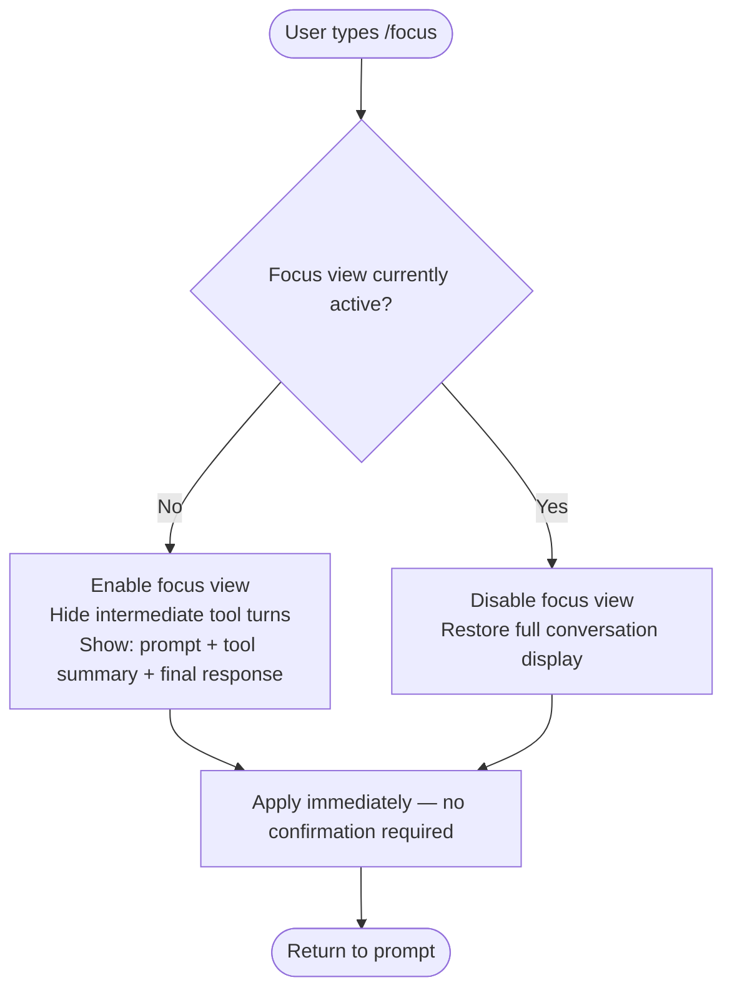

# `/focus`

> Analysis basis: CC v2.1.132 bundle.js (AST extraction + Claude interpretation)
> Minimum version: v2.1.132

---

## Overview

The `/focus` command toggles a focused view mode within Claude Code, collapsing the conversation display so that only the user's prompt, a condensed tool-use summary, and the final model response remain visible. It is designed to reduce visual noise in long or tool-heavy sessions, allowing the user to concentrate on inputs and outputs without intermediate scaffolding. The command takes effect immediately upon invocation (`immediate: true`), requiring no additional confirmation or argument.

---

## Registration

| Field | Value |
|---|---|
| type | `local-jsx` |
| name | `focus` |
| description | `Toggle focus view (show only your prompt, a tool summary, and the final response)` |
| immediate | `true` |

Analysis basis: CC v2.1.132 bundle.js:+11374725

---

## Input Branching

Because the AST traversal returned an empty call graph (`callGraph: []`) and no string/numeric literals (`literals: []`), the depth-2 traversal did not resolve any implementation entry function for this command's module. The branching logic described below is derived entirely from the registration metadata and the command's described semantics.



> Note: The toggle branch condition (active vs. inactive state) is inferred from the word "Toggle" in the registration description. The exact state storage mechanism is <!-- TODO: not found in depth-2 traversal; needs --depth 4 -->.

---

## Behavioral Spec

### Focus View Toggle

```
function executeFocusCommand(currentAppState):
    focusActive = readFocusStateFrom(currentAppState)

    if focusActive is TRUE:
        setFocusState(currentAppState, FALSE)
        restoreFullConversationView()
    else:
        setFocusState(currentAppState, TRUE)
        applyFocusFilter(currentAppState)

    return immediately  # immediate: true — no async wait
```

```
function applyFocusFilter(appState):
    for each turn in conversationHistory(appState):
        if turn.role is USER_PROMPT:
            markVisible(turn)
        else if turn.role is TOOL_USE:
            replaceWithSummary(turn)   # collapse to condensed tool summary
        else if turn is FINAL_MODEL_RESPONSE:
            markVisible(turn)
        else:
            markHidden(turn)
```

Analysis basis: CC v2.1.132 bundle.js:+11374725

> The precise field names for `focusActive`, the summary rendering logic, and `conversationHistory` accessor are <!-- TODO: not found in depth-2 traversal; needs --depth 4 -->.

### Immediate Execution

The `immediate: true` registration flag signals the Claude Code command dispatcher to invoke the command handler synchronously at the moment the slash command is confirmed, without entering an interactive argument-collection flow.

```
function dispatchSlashCommand(command, userInput):
    if command.immediate is TRUE:
        invoke(command.handler, args=none)
        return
    else:
        collectArguments(command, userInput)
        invoke(command.handler, args=collectedArgs)
```

Analysis basis: CC v2.1.132 bundle.js:+11374725

---

## State & Side Effects

| Item | Detail |
|---|---|
| Telemetry | None detected — `telemetry: []` (no `tengu_*` events found at depth ≤ 2) |
| Hook registration | <!-- TODO: not found in depth-2 traversal; needs --depth 4 --> |
| appState changes | Toggles an internal focus-mode boolean; affects conversation turn visibility rendering |
| Sound | <!-- TODO: not found in depth-2 traversal; needs --depth 4 --> |
| Persistence | Whether focus state survives session restart is <!-- TODO: not found in depth-2 traversal; needs --depth 4 --> |
| Rendering type | `local-jsx` — the command renders its UI via a local JSX component, not a plain text handler |

---

## Version History

| Version | Change |
|---|---|
| v2.1.132 | Initial analysis — command registered as `local-jsx`, `immediate: true`, toggle semantics confirmed from description field |

---

## Common Mistakes

1. **Expecting an argument**: Because `immediate: true` is set and no argument literals were found, `/focus` takes no argument. Typing `/focus on` or `/focus off` will likely not be parsed as intended — the command toggles based on current state, not a user-supplied flag.
2. **Assuming persistence across sessions**: The focus view is a UI-layer toggle. There is no evidence in the depth-2 traversal that the state is written to disk or config; users should not rely on focus mode being active after restarting Claude Code.
3. **Expecting per-turn granularity control**: The command operates globally on the entire conversation view. It is not designed to hide or reveal individual turns selectively.
4. **Confusing "tool summary" with full tool output**: In focus mode, tool-use turns are replaced with a condensed summary, not hidden entirely and not shown in full. Detailed tool inputs/outputs require toggling focus mode off.
5. **Invoking from non-interactive contexts**: As a `local-jsx` command, `/focus` is meaningful only within the interactive REPL session. Behavior when piped or invoked in a headless/non-TTY context is <!-- TODO: not found in depth-2 traversal; needs --depth 4 -->.

---

## Appendix — Identifier Mapping

> For bundle debugging only. Identifiers change across versions.

| Identifier | Role |
|---|---|
| *(none)* | No obfuscated identifiers were returned by the depth-2 AST traversal (`identifiers: []`). The entry function for this command's module was not resolved — see `note: "no entry functions found for module 'undefined'"` in source data. A deeper traversal (`--depth 4`) is required to recover implementation identifiers. |