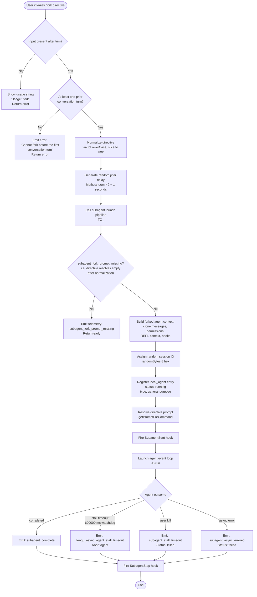

# `/fork`

> Analysis basis: CC v2.1.143 bundle.js (AST extraction + Claude interpretation)
> Minimum version: v2.1.143

---

## Overview

The `/fork` command spawns a background (asynchronous) agent that inherits the full conversation history of the current session and begins executing a user-supplied directive independently. It clones the conversation state — including messages, tool permission context, REPL contexts, and hooks — into a new sub-agent context, then launches that agent without blocking the foreground session. The parent session continues normally while the forked agent runs concurrently.

---

## Registration

| Field | Value |
|---|---|
| type | `local-jsx` |
| name | `fork` |
| description | `Spawn a background agent that inherits the full conversation` |
| argumentHint | `<directive>` |
| module\_id | `Kkq` |

Analysis basis: CC v2.1.143 bundle.js:+12025087

---

## Input Branching



Analysis basis: CC v2.1.143 bundle.js:+12024692, +12024716, +12024825, +12024784, +10047929, +10047947

---

## Behavioral Spec

### 1. Input Validation and Directive Normalization

```
function validateAndNormalizeInput(rawInput):
    trimmed = rawInput.trim()                          // loc +12024692
    if trimmed is empty:
        display "Usage: /fork <directive>"             // loc +12024716
        return ERROR

    if conversationHistory has zero turns:
        display "Cannot fork before the first conversation turn"  // loc +12024825
        return ERROR

    normalized = trimmed.toLowerCase()                 // loc +14528099
    directive  = normalized.slice(0, DIRECTIVE_LIMIT)  // loc +10048184
    return directive
```

- Directive is lower-cased before being passed downstream. Analysis basis: CC v2.1.143 bundle.js:+14528099
- Slice limit constants used: `50` and `49` appear as slice boundary values. Analysis basis: CC v2.1.143 bundle.js:+10048181, +10048194
- The string `"system"` is injected as the role for the directive message. Analysis basis: CC v2.1.143 bundle.js:+12024756

### 2. Pre-launch Jitter Delay

```
function computeJitterDelay():
    // Prevents thundering-herd when multiple forks are issued rapidly
    base    = Math.random()        // [0, 1)   loc +12638156
    jitter  = base * 2 + 1        // [1, 3) seconds  loc +12638154, +12638170
    setTimeout(launchPipeline, jitter * 1000)  // loc +12638193
```

Analysis basis: CC v2.1.143 bundle.js:+12638156, +12638193

### 3. Subagent Launch Pipeline

```
function subagentLaunchPipeline(directive, parentSession):
    // Step 1 – guard: directive must not be blank after all normalization
    if directive is blank:
        recordEvent("subagent_fork_prompt_missing")    // loc +10047947
        return

    // Step 2 – snapshot parent state
    appState        = parentSession.getAppState()      // loc +10049504
    toolPermCtx     = parentSession.getToolPermissionContext()  // loc +10049615
    replContexts    = parentSession.getReplContexts()  // loc +10048036
    messageHistory  = Array.from(parentSession.messages)       // loc +10049604

    // Step 3 – trim history to last N turns
    trimmedHistory  = trimConversationHistory(messageHistory)   // loc +10049934
    // History trimming uses limits: 3 and 24  loc +10049964, +10050065

    // Step 4 – generate a unique session identifier
    sessionId = randomBytes(8).toString("hex")          // loc +5423655, +5423671, +5423683

    // Step 5 – record launch timestamp
    launchTimestamp = Date.now()                        // loc +10048238

    // Step 6 – register the new local agent
    registerLocalAgent({
        id:     sessionId,
        type:   "local_agent",                          // loc +9768289
        status: "running",                             // loc +9768334
        kind:   "general-purpose",                     // loc +9768408
    })                                                  // loc +9768600

    // Step 7 – resolve permission mode
    //   Modes considered: bypassPermissions, acceptEdits, auto, bubble
    //   loc +9226588, +9226619, +9226644, +9226696

    // Step 8 – build forked REPL context and initial messages
    buildForkedContext(replContexts, trimmedHistory, directive)

    // Step 9 – attach hooks
    hookContext = buildHookContext(sessionId)           // SubagentStart loc +9228003
    hookContext.additionalContext = "hook_additional_context"  // loc +9227957

    // Step 10 – launch async agent event loop
    agentEventLoop.run(forkedContext)                   // loc +9233713
```

Analysis basis: CC v2.1.143 bundle.js:+10047909, +10048131, +10048163, +10048211, +10048238, +10048251

### 4. Message History Construction for the Fork

```
function buildForkedMessageHistory(parentMessages, directive):
    // Only assistant and user roles are carried over
    //   role "assistant"  loc +8896715
    //   role "user"       loc +8896737

    filtered = []
    for message in parentMessages:
        if message.role in ["assistant", "user"]:
            filtered.push(cloneMessage(message))        // loc +8896627

    // Append the fork directive as a new user turn
    filtered.push({
        role:    "user",
        content: directive,
    })
    return filtered
```

Analysis basis: CC v2.1.143 bundle.js:+8896627, +8896715, +8896737, +8896790

### 5. Async Agent Event Loop and Watchdog

```
function agentEventLoop(context):
    WATCHDOG_INTERVAL_MS = 600000    // 10 minutes  loc +8139172
    WATCHDOG_TICK_COUNT  = 10        // loc +8139167
    STALL_DELAY_MS       = 1000      // loc +8140255

    startWatchdog(WATCHDOG_INTERVAL_MS)

    loop:
        event = awaitNextEvent(context)

        switch event.type:
            case "message_start":                      // loc +9231776
                handleMessageStart(event)
            case "message_delta":                      // loc +9231947
                handleDelta(event)
            case "tool_use":                           // loc +8140925
                handleToolUse(event)
                trackToolUse(Z.add)                    // loc +8140944
            case "tool_result":                        // loc +8141079
                handleToolResult(event)
                trackToolResult(Z.delete)              // loc +8141109
            case "query_progress":                     // loc +8140598
                reportProgress(event)
            case "api_error":                          // loc +8141172
                handleApiError(event)
            case "completed":                          // loc +8141440
                finalizeAgent(status="completed")
                emitTelemetry("subagent_complete")     // loc +8140300
                break loop
            case "cancelled":                          // loc +8142041
                finalizeAgent(status="killed")
                emitTelemetry("user_kill_async")       // loc +8142235
                break loop

    on watchdog stall timeout:
        emitTelemetry("tengu_async_agent_stall_timeout")  // loc +8140063
        emitTelemetry("subagent_stall_timeout")            // loc +8140320
        context.abort()                                    // loc +8140177
        finalizeAgent(status="failed")                     // loc +8140392

    on async error:
        emitTelemetry("subagent_async_errored")           // loc +8142542
        finalizeAgent(status="failed")

    // Progress minimum: 0.1 fraction reported  loc +8140538
    // Max transcript tail: 80 messages         loc +8142501
```

Analysis basis: CC v2.1.143 bundle.js:+8139172, +8140063, +8140300, +8140320, +8141440, +8142041, +8142542

### 6. Hook Lifecycle

```
function hookLifecycle(agentSession):
    // Fire before agent begins
    fireHook("SubagentStart", {              // loc +9228003
        sessionId:   agentSession.id,
        hookEvent:   "hookEvent",            // loc +9231564
    })

    // During execution: progress hooks
    on progressEvent:
        fireHook("progress", {              // loc +9231645
            type: "hook_progress",          // loc +9231673
        })

    // Stream forwarded to parent
    on streamEvent:
        forwardEvent("stream_event")        // loc +9231744

    // Fire after agent ends (any outcome)
    fireHook("SubagentStop", {              // loc +9231619
        sessionId:   agentSession.id,
        outcome:     agentSession.status,
    })

    // Clear all timers on stop
    agentEventLoop.clearAllTimers()         // loc +9233487

    // Restore parent REPL context
    parentSession.setReplContext(savedReplContexts)  // loc +9233507
```

Analysis basis: CC v2.1.143 bundle.js:+9228003, +9231619, +9231644, +9231673, +9233487, +9233507

### 7. Agent Session Identifier Generation

```
function generateSessionId():
    // Two mechanisms present in the call graph:
    //   (a) randomBytes(8).toString("hex")  — crypto-grade  loc +5423655
    //   (b) crypto.randomUUID()             — UUID v4       loc +9228029

    // Mechanism (a) is used for the agent's short hex ID
    shortId = GK1.randomBytes(8).toString("hex")    // loc +5423655, +5423671, +5423683

    // Mechanism (b) is used for internal message correlation IDs
    correlationId = dk_.randomUUID()                // loc +9228029
    return { shortId, correlationId }
```

Analysis basis: CC v2.1.143 bundle.js:+5423655, +9228029

### 8. Subagent Context Fields

The forked agent session object is initialized with the following named fields (derived from string literals):

| Field | Value / Purpose |
|---|---|
| `sessionHooks` | Copied hook registrations from parent session (loc +9232915) |
| `promptCacheTracking` | Initialized fresh for the fork (loc +9232990) |
| `readFileState` | Inherited or reset (loc +9233044) |
| `sentSkillNames` | Reset for the fork (loc +9233100) |
| `initialMessages` | Snapshot of trimmed parent history (loc +9233139) |
| `liveMessages` | Live accumulator for the fork's own messages (loc +9233185) |
| `replHydrationSnapshot` | Snapshot of parent REPL state (loc +9233235) |
| `perfetto` | Performance tracing handle (loc +9233300) |
| `transcriptSubdir` | Subdirectory for fork transcript storage (loc +9233333) |
| `todos` | Todo list state (loc +9233374) |
| `replContext` | Active REPL context, inherited from parent (loc +9233428) |
| `mcpMonitors` | MCP connection monitors (loc +9233542) |
| `shellTasks` | Active shell tasks (loc +9233592) |

Analysis basis: CC v2.1.143 bundle.js:+9232915 – +9233592

### 9. Agent Mode Inheritance

```
function resolveAgentMode(parentPermissionContext):
    // The fork inherits one of these permission modes from the parent:
    //   "bypassPermissions"  loc +9226588
    //   "acceptEdits"        loc +9226619
    //   "auto"               loc +9226644
    //   "bubble"             loc +9226696

    // Model provider resolution for the forked agent:
    //   "default"   loc +8031921
    //   "inherit"   loc +8032024   ← fork prefers inherit
    //   "bedrock"   loc +8032095

    return inheritedMode
```

Analysis basis: CC v2.1.143 bundle.js:+9226588, +8032024

### 10. Subagent Attachment and Skill Handling

```
function buildAttachments(directive, parentContext):
    // Two attachment subtypes observed:
    //   "attachment"     loc +9230353
    //   "skill_listing"  loc +9230388

    // Context label for attachments:
    //   "attachments_subagent"  loc +9229185

    attachments = []
    if parentContext has skills:
        skillAttachment = buildSkillListing(parentContext.skills)
        // skill_listing disabled check  loc +9229612
        if not skillAttachment.disabled:
            attachments.push(skillAttachment)

    return attachments
```

Analysis basis: CC v2.1.143 bundle.js:+9229185, +9230353, +9230388, +9229612

### 11. Async Storage Context

```
function runWithAsyncStorage(agentFn):
    // FtA.run wraps the agent in an AsyncLocalStorage context  loc +2164158
    // FtA.getStore retrieves the current store                  loc +2164119
    // p2 provides the store backing                            loc +2167572

    FtA.run(newStore, agentFn)
```

Analysis basis: CC v2.1.143 bundle.js:+2164158, +2164119

---

## State & Side Effects

| Item | Detail |
|---|---|
| Telemetry: `tengu_feature_ok` | Fired on successful subagent launch (loc +955068) |
| Telemetry: `tengu_feature_bad` | Fired on launch failure / validation error (loc +955126) |
| Telemetry: `tengu_async_agent_stall_timeout` | Fired when the watchdog timer expires after 600,000 ms of stall (loc +8140063) |
| Telemetry: `tengu_agent_tool_terminated` | Fired when an in-flight tool call is terminated during agent shutdown (loc +8142065) |
| Telemetry: `tengu_slim_subagent_claudemd` | Fired related to CLAUDE.md context injection for the sub-agent (loc +9226350) |
| Hook registration | `SubagentStart` hook fired before event loop; `SubagentStop` hook fired on any terminal outcome (loc +9228003, +9231619) |
| `appState` changes | A new `local_agent` entry with status `"running"` is registered via `K.register` (loc +9768600); status transitions to `"completed"`, `"failed"`, or `"killed"` on exit |
| REPL context | Parent REPL contexts are snapshotted and restored after the fork completes (loc +9233507) |
| Async storage | The forked agent runs inside a dedicated `AsyncLocalStorage` store, isolated from the parent (loc +2164158) |
| Timers | Watchdog uses `setTimeout` / `clearTimeout`; cleared unconditionally via `clearAllTimers()` on agent stop (loc +9233487) |
| Transcript | Written to a dedicated `transcriptSubdir` subdirectory separate from the parent session (loc +9233333) |
| Sound | <!-- TODO: not found in depth-2 traversal; needs --depth 4 --> |

---

## Constants and Limits

| Constant | Value | Analysis basis |
|---|---|---|
| Watchdog stall timeout | 600,000 ms (10 minutes) | bundle.js:+8139172 |
| Watchdog tick count | 10 | bundle.js:+8139167 |
| Stall notification delay | 1,000 ms | bundle.js:+8140255 |
| Minimum progress fraction | 0.1 | bundle.js:+8140538 |
| Maximum transcript tail | 80 messages | bundle.js:+8142501 |
| Session ID byte length | 8 bytes → 16 hex chars | bundle.js:+5423671 |
| Jitter delay range | 1–3 seconds | bundle.js:+12638154, +12638170 |
| Directive slice limit | 50 / 49 characters | bundle.js:+10048181, +10048194 |
| History trim — minimum turns | 3 | bundle.js:+10049964 |
| History trim — maximum turns | 24 | bundle.js:+10050065 |
| Max turns reached sentinel | `"max_turns_reached"` | bundle.js:+9232236 |
| Internal timeout | 5,000 ms | bundle.js:+9232771 |

---

## Version History

| Version | Change |
|---|---|
| v2.1.143 | Initial analysis |

---

## Common Mistakes

1. **Invoking `/fork` before any conversation turn.** The command explicitly guards against an empty conversation history and returns the error `"Cannot fork before the first conversation turn"`. At least one exchange must have occurred. Analysis basis: CC v2.1.143 bundle.js:+12024825

2. **Omitting the directive argument.** Without a `<directive>`, the command prints `"Usage: /fork <directive>"` and exits immediately. The argument is mandatory, not optional. Analysis basis: CC v2.1.143 bundle.js:+12024716

3. **Expecting the forked agent to share live state with the parent.** The fork receives a *snapshot* of the parent's message history and REPL context at launch time. Subsequent changes in the parent session are not reflected in the fork, and vice versa.

4. **Assuming the fork starts instantly.** A random jitter delay of 1–3 seconds is applied before the launch pipeline begins, so forked agents do not all start simultaneously when multiple forks are issued in quick succession. Analysis basis: CC v2.1.143 bundle.js:+12638154, +12638156

5. **Expecting unlimited run time.** The forked agent is subject to a 600,000 ms (10-minute) watchdog stall timer. If no output or tool activity is observed within that window, the agent is aborted and its status set to `"failed"`. Analysis basis: CC v2.1.143 bundle.js:+8139172

6. **Assuming the directive is case-preserved.** The directive text is converted to lowercase via `toLowerCase()` before it is processed. Analysis basis: CC v2.1.143 bundle.js:+14528099

---

## Appendix — Identifier Mapping

> For bundle debugging only. Identifiers change across versions.

| Identifier | Role |
|---|---|
| `Nu7` | Top-level fork command handler function |
| `TC_` | Subagent launch pipeline orchestrator |
| `qO7` | App-state and permission context snapshot helper |
| `mH` | Feature telemetry dispatcher (ok / bad) |
| `s38` | Message history builder / role filter |
| `n1q` | Conversation history trimmer |
| `pm` | Random hex session ID generator (randomBytes wrapper) |
| `VnH` | Local agent registration handler |
| `Wf` | Agent context writer / state updater |
| `uYH` | Model provider / mode resolver for sub-agent |
| `QB` | Async storage run wrapper |
| `CD` | Async storage store retriever |
| `dB` | Async storage backing store provider |
| `elH` | Async agent event loop (watchdog + event dispatch) |
| `hb` | Full sub-agent context builder and runner |
| `w8` | Message correlation ID generator (randomUUID wrapper) |
| `T$6` | Agent-type label resolver |
| `AdH` | Agent descriptor / metadata builder |
| `SH` | Telemetry emission helper |
| `LH7` | Assistant-role message cloner |
| `fH7` | User-role message cloner |
| `KH7` | Message content normalizer |
| `MH7` | Message sequence finalizer |
| `A` | Input normalization / lowercase handler (inner scope) |
| `f` | Session close / cleanup handler |
| `H` | Jitter delay scheduler |