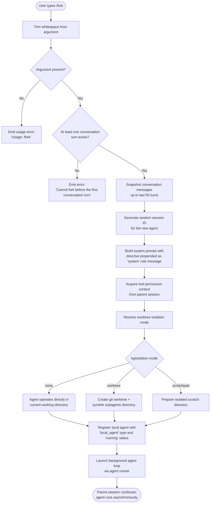

# `/fork`

> Analysis basis: CC v2.1.143 bundle.js (AST extraction + Claude interpretation)
> Minimum version: v2.1.143

---

## Overview

The `/fork` command spawns a background agent that inherits the complete current conversation history. It takes a mandatory directive string as its argument, which is injected as a system-level instruction to the newly created agent. The parent session continues unaffected while the child agent runs asynchronously in a dedicated worktree or scratch environment.

---

## Registration

| Field | Value |
|---|---|
| type | `local-jsx` |
| name | `fork` |
| description | Spawn a background agent that inherits the full conversation |
| argumentHint | `<directive>` |
| module_id | `Kkq` |

Analysis basis: CC v2.1.143 bundle.js:+12025087

---

## Input Branching

The command handler first validates the input directive, then resolves the current conversation state before launching the background agent.



Analysis basis: CC v2.1.143 bundle.js:+12024692, +12024716, +12024825, +10047909, +10048163, +10048184

---

## Behavioral Spec

### Argument Validation

```
function validateForkArgument(rawInput):
    trimmed = rawInput.trim()
    if trimmed is empty:
        display "Usage: /fork <directive>"
        return error
    return trimmed
```

Analysis basis: CC v2.1.143 bundle.js:+12024692, +12024716

---

### Turn Guard

The command refuses to execute if no assistant turn has yet occurred in the conversation.

```
function guardFirstTurn(conversationMessages):
    if conversationMessages contains no completed assistant turn:
        display "Cannot fork before the first conversation turn"
        abort
```

Analysis basis: CC v2.1.143 bundle.js:+12024825

---

### Conversation Snapshot

The handler slices the parent conversation history to derive the child's initial message list. The slice length is bounded.

```
function snapshotConversation(messages):
    sliceStart = max(0, messages.length - 50)
    slice = messages.slice(sliceStart)
    normalizedMessages = normalizeMessageRoles(slice)
    // Roles accepted: "user", "assistant", "tool_use", "tool_result"
    return normalizedMessages
```

Maximum snapshot depth: 50 messages (bundle.js:+10048181, +10048194)

Analysis basis: CC v2.1.143 bundle.js:+10048184

---

### Subagent Identity Generation

A cryptographically random session identifier is generated for the forked agent.

```
function generateAgentSessionId():
    randomBytes = crypto.randomBytes(8)
    return randomBytes.toString("hex")
    // Produces a 16-character hex string
```

Random bytes length: 8 bytes → 16 hex characters (bundle.js:+5423671, +5423683)

Analysis basis: CC v2.1.143 bundle.js:+10048211, +5423655

---

### System Prompt Construction

The directive supplied by the user is injected as a `system`-role message prepended to the assembled context. The system prompt builder assembles a full prompt comprising environment info, memory context, tool permissions, worktree mode, model identity, and the user's directive.

```
function buildForkSystemPrompt(directive, parentAppState, toolPermissionContext, worktreeMode):
    sections = []

    // Static identity block
    sections.push(buildBaseSystemPrompt(parentAppState))

    // Environment section
    sections.push(buildEnvironmentInfo(worktreeMode))

    // Memory context (personal + team if enabled)
    memoryBlock = buildCombinedMemoryPrompt(parentAppState)
    sections.push(memoryBlock)

    // Directive from user — role: "system"
    sections.push({ role: "system", content: directive })

    return joinSections(sections)
```

The `role` field for the directive message is the string `"system"`.
Analysis basis: CC v2.1.143 bundle.js:+12024756, +10047909, +10048036

---

### Worktree Isolation Setup

```
function setupWorktreeIsolation(isolationMode, parentWorkdir, agentSessionId):
    if isolationMode == "none":
        // Agent runs in place; no EnterWorktree call expected
        agentWorkdir = parentWorkdir

    else if isolationMode == "worktree":
        worktreeDir = createGitWorktree(parentWorkdir, agentSessionId)
        subagentsDir = joinPath(worktreeDir, "subagents")
        ensureDirectory(subagentsDir)
        createSymlink(parentWorkdir + "/subagents", subagentsDir)
        agentWorkdir = worktreeDir

    else if isolationMode == "scratchpad":
        scratchDir = joinPath(parentWorkdir, ".claude", "subagents", agentSessionId)
        ensureDirectory(scratchDir)
        agentWorkdir = scratchDir

    return agentWorkdir
```

Worktree isolation uses `xr.mkdir`, `xr.symlink`, and `xr.unlink` for lifecycle management.
The string `"subagents"` is used as the sub-directory name under the session path.
Analysis basis: CC v2.1.143 bundle.js:+12196285, +3193278, +12333418, +12333599

---

### Agent Registration

After the workspace is prepared, the new agent is registered in the global agent registry.

```
function registerForkedAgent(agentSessionId, directive, agentWorkdir):
    agentRecord = {
        id: agentSessionId,
        type: "local_agent",
        status: "running",
        kind: "general-purpose",
        workdir: agentWorkdir,
        startTime: Date.now(),
        directive: directive
    }
    globalAgentRegistry.add(agentRecord)
    return agentRecord
```

String constants used: `"local_agent"` (bundle.js:+9768289), `"running"` (bundle.js:+9768334), `"general-purpose"` (bundle.js:+9768408).

Analysis basis: CC v2.1.143 bundle.js:+9768284, +9768289, +9768334, +9768408

---

### Stall Watchdog

The background agent runner installs a watchdog timer. If no progress event is received within the stall window, the agent is marked stalled and a telemetry event is emitted.

```
function installStallWatchdog(agentHandle, stallTimeoutMs):
    timer = setTimeout(() => {
        emitTelemetry("subagent_stall_timeout")
        agentHandle.abort()
    }, stallTimeoutMs)

    agentHandle.onProgress(() => {
        clearTimeout(timer)
        timer = setTimeout(watchdogCallback, stallTimeoutMs)
    })
```

Stall timeout interval: 600,000 ms (10 minutes) (bundle.js:+8139172).
Watchdog polling granularity: 1,000 ms (bundle.js:+8140255).

Analysis basis: CC v2.1.143 bundle.js:+8139172, +8140255, +8140320

---

### Agent Completion and Cleanup

When the agent finishes (success or error), cleanup removes the worktree and updates the registry.

```
function cleanupForkedAgent(agentRecord, result):
    if agentRecord.isolationMode == "worktree":
        filesystem.unlink(worktreePath)  // xr.unlink
    globalAgentRegistry.delete(agentRecord.id)

    if result.status == "completed":
        emitTelemetry("subagent_complete")
        updateAgentStatus(agentRecord.id, "completed")
    else if result.status == "error":
        emitTelemetry("subagent_async_errored")
        updateAgentStatus(agentRecord.id, "error")
    else if result.status == "cancelled":
        updateAgentStatus(agentRecord.id, "cancelled")
```

Analysis basis: CC v2.1.143 bundle.js:+8140300, +8142542, +14513628, +14513638

---

### Safety Classifier Handoff

Before the forked agent's output is surfaced to the parent session, a safety classifier runs. If the classifier is unavailable, a warning is prepended to the output.

```
function applySafetyClassifier(agentOutput):
    classifierResult = runHandoffClassifier(agentOutput)
    if classifierResult.status == "unavailable":
        emitTelemetry("tengu_auto_mode_decision")
        prependWarning(agentOutput,
            "Note: The safety classifier was unavailable when reviewing " +
            "this sub-agent's work. Please carefully verify the sub-agent's " +
            "actions and output before acting on them.")
    return agentOutput
```

Analysis basis: CC v2.1.143 bundle.js:+8138327, +8137805

---

## State & Side Effects

| Item | Detail |
|---|---|
| Telemetry — fork launch | `subagent_launch` (bundle.js:+10047929) |
| Telemetry — missing directive | `subagent_fork_prompt_missing` (bundle.js:+10047947) |
| Telemetry — agent stalled | `subagent_stall_timeout` (bundle.js:+8140320) |
| Telemetry — agent complete | `subagent_complete` (bundle.js:+8140300) |
| Telemetry — agent errored | `subagent_async_errored` (bundle.js:+8142542) |
| Telemetry — forked agent default turns exceeded | `tengu_forked_agent_default_turns_exceeded` (bundle.js:+5430086) |
| Telemetry — async agent stall timeout | `tengu_async_agent_stall_timeout` (bundle.js:+8140063) |
| Telemetry — auto mode decision | `tengu_auto_mode_decision` (bundle.js:+8137805) |
| Telemetry — memory load | `tengu_moth_copse`, `tengu_memdir_disabled`, `tengu_herring_clock`, `tengu_team_memdir_disabled` (bundle.js:+3257576, +3258533, +3258729, +3258757) |
| Telemetry — slim subagent Claude MD | `tengu_slim_subagent_claudemd` (bundle.js:+9226350) |
| Hook registration | `K.register` is called on the new agent handle to wire up progress and completion callbacks (bundle.js:+9768600) |
| appState changes | `getAppState` is read from parent to seed child; child calls `setAppState` internally as it progresses (bundle.js:+10049504, +5426268) |
| Filesystem side effects | Git worktree created (`xr.mkdir`, `xr.symlink`); removed on completion (`xr.unlink`); transcript written as `.jsonl` (bundle.js:+12112939, +12196285, +12196344) |
| Sound | <!-- TODO: not found in depth-2 traversal; needs --depth 4 --> |
| Conversation snapshot | Last 50 messages of parent conversation copied to child (bundle.js:+10048181) |
| Session ID | 8-byte random hex string generated via `crypto.randomBytes` (bundle.js:+5423671) |

---

## Version History

| Version | Change |
|---|---|
| v2.1.143 | Initial analysis |

---

## Common Mistakes

1. **Calling `/fork` before any conversation turn.** The command hard-blocks with `"Cannot fork before the first conversation turn"` if no assistant message exists yet. Send at least one message and receive a reply before forking.

2. **Omitting the `<directive>` argument.** The argument is mandatory. Invoking `/fork` with no text after the command name causes the usage error `"Usage: /fork <directive>"` to be displayed and no agent is spawned.

3. **Expecting synchronous output.** The forked agent runs entirely in the background. The parent session does not block or wait for the child to finish. Results are surfaced asynchronously through the agent panel, not inline in the current chat.

4. **Assuming the child can access the parent's live state.** The child receives a snapshot of up to 50 messages at fork time. Subsequent parent conversation turns are not visible to the child.

5. **Using relative paths in the forked agent's shell commands.** Forked agents run in a separate working directory (worktree or scratchpad). All file paths used by the agent should be absolute, as the system prompt instructs: `"Agent threads always have their cwd reset between bash calls"` (bundle.js:+12332405).

6. **Trusting forked-agent output without review when the safety classifier was unavailable.** If the classifier handoff fails, the output is flagged with an explicit warning. Users should manually verify agent actions in this case before acting on the results.

---

## Appendix — Identifier Mapping

> For bundle debugging only. Identifiers change across versions.

| Identifier | Role |
|---|---|
| `Nu7` | Fork command handler / top-level executor |
| `TC_` | Subagent launch orchestrator |
| `qO7` | Agent context builder (reads appState, tool permission context) |
| `qG` | System prompt assembler for forked agents |
| `Ad_` | Base system prompt builder |
| `yz8` | Plugin/tool list serialiser for system prompt |
| `R_` | Locale/language resolver |
| `_U7` | Model identity injector (includes `"claude-opus-4-7"` default) |
| `AU7` | Model override resolver (`ant_model_override`) |
| `fd_` | Output style section builder |
| `CU7` | Output style wrapper |
| `QO6` | Doing-tasks section builder |
| `qU7` | Task section wrapper |
| `jU7` | Tool permission / using-your-tools section builder |
| `K56` | Memory prompt loader (personal + team CLAUDE.md) |
| `LU7` | `ant_model_override` section builder |
| `ZU7` | Static environment info builder (rich) |
| `EU7` | Simple environment info builder (worktree path, additional dirs) |
| `fU7` | Language section builder |
| `MU7` | Output style section builder |
| `IU7` | Background-session marker injector |
| `vU7` | Scratchpad section builder |
| `NU7` | FRC section builder |
| `yU7` | Brief-mode checker (`HU7.isBriefEnabled`) |
| `RU7` | Focus/reproduce-verify section builder |
| `WU7` | Growthbook / env flags section builder |
| `NK1` | Tool compute runner (parallel tool resolution via `Promise.all`) |
| `XU7` | Extra context section builder |
| `$U7` | Additional context section builder |
| `OU7` | System section builder |
| `zU7` | Verified-vs-assumed permissions section builder |
| `YU7` | Output style wrapper (delegates to `fd_`) |
| `DU7` | Tool use section builder |
| `PU7` | Tone and style section builder |
| `VV9` | Memory prompt finaliser |
| `FMH` | Auth provider classifier (`firstParty`, `anthropicAws`) |
| `Tb` | System prompt reader for parent session |
| `HK` | Header key resolver |
| `_J` | JSON normaliser for messages |
| `mH` | Generic logger/debug emitter |
| `s38` | Conversation message normaliser (role coercion) |
| `LH7` | Assistant-turn filter |
| `fH7` | Tool-result normaliser |
| `KH7` | Tool-use filter |
| `Ml1` | Message role validator |
| `MH7` | Tool-use content validator |
| `n1q` | Directive text trimmer |
| `pm` | Random-bytes session ID generator |
| `VnH` | Local agent spawner and state machine |
| `rIH` | Worktree filesystem operations (mkdir, symlink, unlink) |
| `R28` | Active-agent set manager (add / finally / delete) |
| `xQ_` | Worktree directory creator (`xr.mkdir`) |
| `S$` | Path joiner for agent state files |
| `L8` | Agent log file handle |
| `NH` | Error logger with stack capture |
| `Kf8` | Agent file opener (`xr.open`) |
| `_T` | Session path resolver (reads `U9_.get`, joins `A$H`) |
| `CU` | Config utility (reads `GV`) |
| `__` | Utility / config accessor (reads `GV`) |
| `V6` | Working directory resolver (reads `GV`) |
| `Wf` | Async signal / wakeup emitter |
| `eN` | AbortController wrapper with max-listeners guard |
| `xq` | AbortSignal max-listeners setter |
| `A84` | Abort listener (deref pattern) |
| `q84` | Abort listener variant (deref pattern) |
| `KW` | Agent status writer (`Date.now` + `S$`) |
| `K` | Agent list renderer (pad + map) |
| `uYH` | Agent query / model invocation orchestrator |
| `iG` | Model selector |
| `Na` | Model name resolver (TV, h8H, _A, BB) |
| `rV` | Sonnet model resolver |
| `oV` | Haiku model resolver |
| `r1` | Model alias normaliser (sonnet, opus, haiku, best, etc.) |
| `nG` | Model name lookup helper |
| `zAH` | Model inclusion-list checker |
| `yxH` | zM-based model resolver |
| `UtA` | rV-based model resolver |
| `BM` | DA-based model builder |
| `YF6` | Model whitelist checker (`q$L.includes`) |
| `SxH` | xH-based model wrapper |
| `bU6` | ARN/Bedrock prefix detector |
| `V7L` | ARN substring extractor |
| `hw` | Provider type classifier (bedrock, mantle, vertex, etc.) |
| `pU6` | DA + xH provider builder |
| `I7L` | `anthropic.` prefix checker |
| `DA` | xH-based provider wrapper |
| `mU6` | Provider enum normaliser (toLowerCase, Object.values) |
| `_xH` | bU6 + replace path normaliser |
| `Wl8` | `startsWith` prefix guard |
| `Kh1` | Model capability checker (lowercase + includes) |
| `G1` | BU6 / Cw model resolver |
| `qh1` | G1 + dc + jP model resolver |
| `dc` | wAH + G1 + includes + hw composite resolver |
| `jP` | wAH + DA + HA + fq resolver |
| `M` | MCP server manager (SvH + THK) |
| `SvH` | MCP tool inventory builder |
| `THK` | MCP update applier |
| `v` | Message formatter / string builder |
| `$` | JZq-based disposable wrapper |
| `B95` | MCP client registry builder |
| `qE_` | Query error handler |
| `QB` | Async context runner (`FtA.run`) |
| `CD` | Async context reader (`FtA.getStore`) |
| `dB` | Secondary store reader (`p2`) |
| `p2` | `ti8.getStore` accessor |
| `elH` | Background agent event loop / main runner |
| `Q` | File-based event queue (readFile + unlink) |
| `LW6` | Queue item reader (`cb.readFile`) |
| `B7q` | Queue item deleter (`cb.unlink`) |
| `y` | Stream writer wrapper (`z.write`) |
| `z` | Daemon stream (SH, mH, xN, Ox) |
| `C` | File watcher / stat checker (Z_K + NH + MK5 + z.write) |
| `Z_K` | Realpath + stat resolver |
| `MK5` | p58-based mtime comparator |
| `S` | Backoff / jitter calculator (NF + Math.min + N) |
| `N` | Turn-level progress tracker |
| `V` | Agent state variable |
| `jlq` | Jitter function |
| `hJ6` | Agent progress updater (`A.update`, `nh_`, `zz`) |
| `nh_` | Agent heartbeat recorder (`RvH`, `Date.now`) |
| `zz` | Agent flush / delete from S28 |
| `fKH` | Agent file content updater (`K.update`, `S$`, `c5`) |
| `c5` | XML entity escaper (`H.replaceAll`) |
| `tlH` | Turn length limiter (`DK`) |
| `DK` | Message text filter |
| `aVH` | Agent variance handler |
| `sVH` | Tool permission snapshot (`eq`) |
| `eq` | Permission cache resolver (TZ9, EZ9, ORL) |
| `lz6` | Agent summary / compaction loop |
| `wj_` | Tool set mutator (add/filter/some/has) |
| `W` | Debounced change broadcaster (setTimeout + clearTimeout + z) |
| `XZ` | Streaming event processor |
| `w8` | UUID generator (`gZ.randomUUID`) |
| `LW4` | Lookahead window calculator |
| `bz1` | Agent state updater (`A.update`, `Jo`, `kf8`) |
| `P` | Subprocess stdout reader (Buffer.concat, indexOf, subarray) |
| `O` | AbortSignal carrier (`N8`) |
| `Z` | Active-turn set |
| `Y` | Agent output renderer / spinner manager |
| `XJH` | Output line writer (d1, L8, eF_, XH) |
| `cIq` | Output width calculator (Object.keys, Math.max, D3) |
| `T` | Keyboard event handler (preventDefault + c2 + Y + H) |
| `G_K` | Heartbeat interval manager (`Zs`) |
| `cYH` | Tool classification wrapper (`hvH`) |
| `hvH` | Tool-use permission classifier |
| `CJ6` | Agent state commit (`A.update`) |
| `MKH` | Agent metadata recorder (`RJ6`) |
| `RJ6` | Agent run-record persister |
| `Sf8` | Agent stop-hook runner |
| `hf8` | MKH + kf8 compound finaliser |
| `kf8` | Turn finaliser (`tN`, `Date.now`) |
| `yf8` | Agent output post-processor and safety classifier |
| `ZT` | Last-assistant-message finder (`H.findLast`) |
| `c$6` | Output classifier input builder |
| `sQ4` | Classifier result cacher |
| `D` | Background process registry (G6, dispose, freemem) |
| `jM` | xH-based message formatter |
| `_k` | Tool name lowercase normaliser |
| `OL` | Event emitter (DV8, v, dFH, wH6, L.split, Object.entries) |
| `h1H` | Tool name hasher (sha256, createHash) |
| `tQ4` | Classifier cache checker (`Xf8.has`, `Wf8`) |
| `Cf8` | Agent state updater with timestamp and heartbeat |
| `SH` | Generic side-effecting logger (`d`) |
| `Rf8` | Auto-mode classifier runner (JR1 + NJ6) |
| `JR1` | Classifier request builder (YR1, zR1, wR1) |
| `NJ6` | Full classifier pipeline (request → response → decision) |
| `hx` | Classifier result extractor |
| `$KH` | Agent state updater with timestamp and heartbeat (variant) |
| `XH` | String coercer |
| `x` | Buffered subprocess output writer |
| `h` | Output buffer |
| `m` | Subprocess handle |
| `A7H` | Agent async error recorder |
| `Uz6` | y98 store cleanup |
| `hb` | Top-level agent query function (full conversation loop entry) |
| `tZ9` | Session path setter (`U9_.set`) |
| `KqH` | Query context configurator |
| `PA8` | Agent process tracking (zq1, Oq1, JA8.set, RO4) |
| `zq1` | Process tracking get/set (`Hw_`) |
| `Oq1` | Process age checker (`Math.abs`, `RRH`) |
| `RO4` | Process list pusher (`tD_.push`) |
| `k1H` | REPL session loader (`NC`, `_.load`, `H.dump`) |
| `NC` | REPL context manager |
| `G6` | Tool permission gate (m76, p76, Ts, Ci6, N6) |
| `m76` | Permission check helper |
| `p76` | Permission check helper (variant) |
| `Ts` | Permission result formatter (xH, jF) |
| `Ci6` | Permission cache (nA_, sMH) |
| `N6` | Permission call recorder (x6, N0, z9_, H$H, Date.now, nhL) |
| `t` | Session runner / conversation loop |
| `Rj8` | Pre-turn validator (__,  A.some, iM, Zq) |
| `qT` | Trace event emitter (cw, GbL, PbL, jbL) |
| `F` | Tool filter (c6.filter, P6.has) |
| `PHH` | Agent message processor (tool dispatch, stream events) |
| `yG` | Global event emitter (`xV6.emit`) |
| `dX` | Context diff calculator |
| `$E6` | Transcript file writer (xh.join, x8, YO, __, V6, basename, rename) |
| `rQ` | Session loader (`KL`) |
| `S_8` | Session serialiser (sY_, seH) |
| `OvH` | Session context builder (`KL`) |
| `CkH` | Session display formatter (uU, nJH, v, TV, hG, r1) |
| `YE6` | Session event handler |
| `lB` | Latency recorder (`gq6`, `Date.now`) |
| `F6H` | Session finaliser (`KL`) |
| `DE6` | Working directory changer (rf, pb, S6, process.chdir) |
| `B6H` | Session metadata appender (KL, g5, H.reAppendSessionMetadata) |
| `v_` | Error formatter (Error, String) |
| `Si` | Tool permission syncer and scheduler |
| `mE_` | Message deduplication filter |
| `DO` | Display output formatter (ShK, EE, hhK, H.substring, yhK) |
| `w` | Background process supervisor |
| `ZP` | Permission context builder ($F, Sq, xH, G6) |
| `J` | Background process killer (`A.values`, `y.kill`) |
| `G` | Tool batch runner (f26, iT8) |
| `X` | SDK tool executor (iT8, Rk, vp, Promise.all, aKH, Dn, NH, v_) |
| `nz` | xH-based error formatter |
| `XL` | Permission set validator |
| `pR1` | G6-based permission gate |
| `MH` | Main UI event loop / TUI renderer |
| `jkH` | Keypress dispatcher |
| `WT6` | Keyboard shortcut table |
| `wH` | UI event object |
| `R` | Render cycle coordinator |
| `HH` | Timeout-based render scheduler (T.current, Q.setTimeout, v, r) |
| `p` | Buffered write flusher (clearTimeout, $.write) |
| `o` | Voice/recording UI handler |
| `aH` | Tool list renderer |
| `s` | w + zH compositor |
| `zH` | Stream enqueue wrapper (F9q, bR, x.push, y.enqueue, V6) |
| `N8` | Session status reporter |
| `rH` | MCP tool descriptor builder |
| `GT6` | WT6 + Md7 keymap builder |
| `LH` | MCP client lifecycle manager |
| `n6H` | Notification handler |
| `rsH` | Result set manager |
| `TT6` | rsH + $d7 result wrapper |
| `YH` | Display options |
| `gH` | Message scroller (FG6, Math.max, Promise.resolve, GH.slice, yr) |
| `e` | Debounced scroll handler (W.current, Q.setTimeout, v, r) |
| `DH` | zH + w stream pair |
| `lA7` | System prompt reader for sub-agents (K.map, H.getSystemPrompt, wj6) |
| `wj6` | TU7-based system prompt transformer |
| `xH` | String coercer (wraps `String`) |
| `KX6` | Agent start message builder (L4, L2, p28.randomUUID) |
| `L4` | Agent effort/model resolver (V6, Yy, QX, sE, QZ, S6) |
| `L2` | Full agent turn executor (the primary agentic loop body) |
| `L9` | UUID generator (`yt1.randomUUID`) |
| `Ej` | Tool inclusion checker (I8, Array.isArray, _.includes) |
| `I8` | Tool registry resolver (jC6, WB) |
| `c1H` | Built-in tool set checker (`B54.has`) |
| `na1` | Tool name set builder (Object.keys, v, H.add) |
| `FK` | GV config reader |
| `GV` | Global config store |
| `nA7` | Skill listing builder (qX6, m1, _.find) |
| `qX6` | Tk-based skill resolver |
| `m1` | String slicer (H.indexOf, H.slice) |
| `RnH` | Model name sorter (Tk, ReferenceError, _.map, C4, q.localeCompare) |
| `Tk` | Tool/skill finder (_.find, gkq) |
| `C4` | Tool capability comparator |
| `T6` | Agent output batch writer (p6.filter, u6.slice, v, M, t.writeBatch) |
| `p6` | Message display component (kwq, l6, LK.createElement, eH, N8) |
| `u6` | Message scroller/paginator (R, RH.preventDefault, J, S, wH) |
| `kH` | Agent state reporter (t.reportState, t.reportMetadata) |
| `U6` | Prompt-for-command resolver (bO, u6, cH, h.push) |
| `bO` | Command resolver |
| `cH` | Command prompt builder (mv, iH, qyH, Bh, i, fX, jx) |
| `J6` | Timer / scheduler registry |
| `dA7` | Tool attachment builder (c1H, Ej, v, Promise.all, Yb, Object.entries) |
| `Yb` | Enterprise/project/local tool loader (YW, Ej) |
| `PzH` | Permission context resolver (tS, qZH, sIH, Sy_) |
| `tS` | Permission standard resolver (iS_, v, DA, bf) |
| `qZH` | Permission mode normaliser (toLowerCase, j47, _.includes) |
| `sIH` | Permission "some" checker (H.some, XL) |
| `Sy_` | Deferred tools pool manager |
| `Sw_` | Sub-agent context initialiser (eN, H.getAppState, k1H, YOH) |
| `YOH` | App state hydrator |
| `Br9` | Permission context normaliser |
| `rA8` | Conversation history rehydrator |
| `ck_` | MCP tool binding manager |
| `Sz8` | MCP tool set snapshot |
| `GKH` | MCP tool bundle builder (pkq, _.add, H.filter, _.has, v) |
| `o1H` | MCP tool availability checker (H.filter, _.some, gkq) |
| `pU` | Permission union resolver |
| `yX` | Token count estimator (xH, parseInt, isNaN, nG, dc) |
| `Pw` | Prompt watch handler |
| `PY_` | Deferred tool pool updater |
| `t1H` | Exponential backoff calculator (N6, Date.now, Math.pow, Math.max) |
| `rG` | r1 + G1 + A$L.has resolver |
| `j` | w-based subprocess wrapper |
| `lk_` | Session loader by ID (`KL`) |
| `KL` | Session store accessor (`h9`) |
| `je` | Session context joiner (KL, vvH) |
| `vvH` | Context filter (H.filter, j28, I28, im7) |
| `Yj6` | Agent metadata file writer (ekq, xL.mkdir, xL.writeFile, KL) |
| `ekq` | _T-based path resolver |
| `hH` | JSON stringifier |
| `BH` | gH + yq message list accessor |
| `yq` | HH.push + K6 message appender |
| `iC` | Agent context initialiser (FA7, K98) |
| `FA7` | Full agent conversation runner (the deepest agentic loop) |
| `K98` | Agent cleanup on exit (q98, rC.get/delete, mK1, xw_.delete) |
| `cA7` | Conversation attachment builder |
| `oa1` | Agent result recorder (_.get, Rj, RvH) |
| `Rj` | Result journal writer |
| `RvH` | Heartbeat timestamp setter |
| `xKH` | Agent session context builder (V6, Dh, ZT, DK, L4, _T, L2, fSq.randomUUID) |
| `Dh` | Agent display metadata (Qg, aY, mU, Sx) |
| `Xg` | xH + _i9 agent label builder |
| `_i9` | Agent label formatter |
| `Oi9` | Agent exit recorder (Xm.delete, RTH) |
| `RTH` | Agent exit file writer (Ai9, qi9, hH, _68.mkdir, _68.writeFile) |
| `ra1` | vz8 entry deleter |
| `nEH` | JA8 + Hw_ cleanup |
| `eZ9` | U9_ entry deleter |
| `Qi1` | Tool permission update loop (Object.entries, _.all, QI, v, lIH) |
| `QI` | Permission item resolver |
| `lIH` | Permission debounced updater (_.update, QI, v, NH, clearTimeout, Date.now, zz) |
| `T$6` | Trace/span context builder |
| `AdH` | Additional context injector |