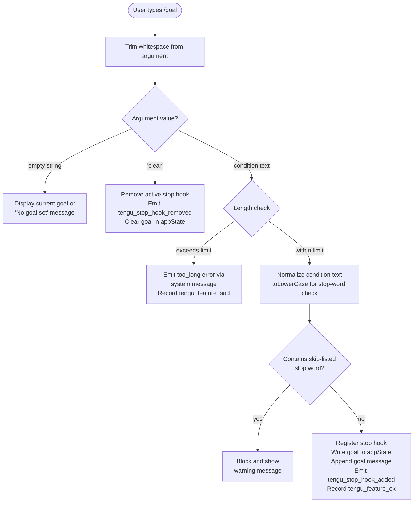

# `/goal`

> Analysis basis: CC v2.1.143 bundle.js (AST extraction + Claude interpretation)
> Minimum version: v2.1.143

---

## Overview

The `/goal` command sets a persistent session-level goal condition that Claude Code will pursue until the stated condition is met. When a goal is active, a stop hook is registered that evaluates whether the condition has been satisfied after each agent turn; the goal is cleared and the hook removed once completion is confirmed. Passing the literal argument `clear` removes any active goal without triggering the evaluation loop.

---

## Registration

| Field | Value |
|---|---|
| type | `local-jsx` |
| name | `goal` |
| description | `Set a goal — keep working until the condition is met` |
| argumentHint | `[<condition> \| clear]` |
| immediate | `true` |
| module_id | `bvq` |

Analysis basis: CC v2.1.143 bundle.js:+11937578

---

## Input Branching

The command entry point trims the raw argument string, then routes execution through one of four paths depending on the content.



Analysis basis: CC v2.1.143 bundle.js:+11936167, +11936255, +11936273, +11936301, +11936326, +11936409, +11936412, +11936423, +11936535

---

## Behavioral Spec

### Command Entry Point

```
function handleGoalCommand(rawArgument):
    condition = rawArgument.trim()                    // +11936167

    if condition == "":
        return displayCurrentGoalOrNotice()           // +11936326

    if condition.toLowerCase() == "clear":
        return removeActiveGoal()                     // +11936287

    if isStopWord(condition.toLowerCase()):           // +11936273, +11936287
        return showStopWordWarning()

    if condition.length > MAX_CONDITION_LENGTH:
        emitSystemMessage(ERROR_TOO_LONG)             // +11936423
        recordTelemetry("tengu_feature_sad")          // implicit via J8 path
        return

    registerGoal(condition)
```

### Stop-Word Guard

```
function isStopWord(normalizedText):
    // Checks normalizedText against a built-in blocked-term set.
    // The literal "skip" is one confirmed member of that set.
    return stopWordSet.has(normalizedText)            // +9108002, +11936273
```

The string `"skip"` is a confirmed blocked term.
Analysis basis: CC v2.1.143 bundle.js:+11936273, +9108002, +9108010

### Goal Registration

```
function registerGoal(condition):
    sessionId  = generateUUID()                       // +9109547
    appState   = getAppState()                        // +9108788

    // Append a goal-typed attachment message to the conversation
    applyMessageOp("append", {                        // +9109423, +9109529
        type: "attachment",
        subtype: "goal",                              // +9109488
        content: condition
    })

    // Write the goal condition into application state
    setAppState({ goal: condition })                  // +9108990

    // Register a stop hook that will be called after each agent turn
    registerStopHook({                                // +9109074
        id: sessionId,
        condition: condition
    })

    recordTelemetry("tengu_stop_hook_added")          // +9109089
    recordOutcome(SUCCESS)                            // tengu_feature_ok via SH +955068
```

Analysis basis: CC v2.1.143 bundle.js:+9108784, +9108990, +9109032, +9109074, +9109089

### Stop Hook Evaluation (per turn)

```
function evaluateStopHook(turnResult):
    // Called by the hook runner after each completed agent turn.
    // Reads output token count to determine whether to continue.
    outputTokenCount = getMetric(turnResult, "outputTokens")   // +41769

    statusPayload = buildGoalStatus(turnResult)                 // +9109616

    if goalConditionMet(statusPayload):
        removeActiveGoal()
        return STOP
    else:
        return CONTINUE
```

The hook runner uses `Date.now()` for timing metadata and `Object.values()` to enumerate turn metrics.
Analysis basis: CC v2.1.143 bundle.js:+9108952, +41736, +41740, +41769, +9109616

### Goal Removal

```
function removeActiveGoal():
    closeFileHandles()                                // +14513628, +14513638
    unlinkTempFile()                                  // +14482768

    applyMessageOp("append", { type: "goal_status", status: "cleared" })
    setAppState({ goal: null })

    deregisterStopHook(activeHookId)                  // +9109457
    recordTelemetry("tengu_stop_hook_removed")        // +9109457
```

Analysis basis: CC v2.1.143 bundle.js:+9109331, +9109400, +9109442, +9109457

### Gate Checks Before Hook Registration

Two gate checks run before the stop hook is written:

1. **Hooks gate** (`"hooks_gate"`) — verifies that the hooks feature flag is enabled for the current session.
2. **Trust gate** (`"trust_gate"`) — verifies that the current operator policy permits hook registration.

If either gate fails, the stop hook is not registered and no goal is persisted.
Analysis basis: CC v2.1.143 bundle.js:+9108599, +9108653

### Policy Settings Resolution

```
function resolvePolicySettings(context):
    // Retrieves the active policySettings object used by both gate checks.
    settings = readPolicySettings(context)            // +5388645
    return settings
```

Analysis basis: CC v2.1.143 bundle.js:+5388642, +5388645

### Display Helper — Current Goal Notice

```
function displayCurrentGoalOrNotice():
    appState = getAppState()
    if appState.goal is null or undefined:
        showMessage("No goal set")                    // +11936326
    else:
        showMessage("Current goal: " + appState.goal)
```

Analysis basis: CC v2.1.143 bundle.js:+11936326

### System Message Emission

```
function emitSystemErrorMessage(kind):
    // Appends a role="system" message to the conversation.
    appendMessage({
        role: "system",                               // +11936370
        content: kind                                 // e.g. "too_long" +11936423
    })
```

Analysis basis: CC v2.1.143 bundle.js:+11936370, +11936423

### Jitter Helper (internal)

```
function computeJitter():
    // Used internally by the hook runner for retry back-off.
    base   = Math.random() * 2                        // +12638154, +12638156
    offset = 1                                        // +12638170
    return base + offset
    // Scheduled via setTimeout                       // +12638193
```

Analysis basis: CC v2.1.143 bundle.js:+12638154, +12638156, +12638170, +12638193

### Column Formatting Helper

```
function formatColumnOutput(rows):
    // Used when rendering the goal status in the terminal.
    lines = rows.map(row => row.padEnd(40, " "))      // +14528173, +14526181
    return lines.join("  ")                           // separator "  " +14526202
```

Column padding width: **40 characters**.
Analysis basis: CC v2.1.143 bundle.js:+14528173, +14526181, +14526202

---

## State & Side Effects

| Item | Detail |
|---|---|
| Telemetry — goal set success | `tengu_stop_hook_added` (bundle.js:+9109089) |
| Telemetry — goal cleared | `tengu_stop_hook_removed` (bundle.js:+9109457) |
| Telemetry — outcome ok | `tengu_feature_ok` (bundle.js:+955068) |
| Telemetry — outcome sad | `tengu_feature_sad` (bundle.js:+955201) |
| Hook registration | A stop hook keyed by a `crypto.randomUUID()`-generated ID is registered on goal set and deregistered on clear or completion (bundle.js:+9109089, +9109457, +9109547) |
| appState changes | `goal` field set to condition string on activation; set to `null` on clear/completion (bundle.js:+9108990, +9109331) |
| Message append | An `"attachment"` sub-typed message with subtype `"goal"` is appended to the conversation on activation; a `"goal_status"` message is appended on completion/clear (bundle.js:+9109423, +9109529, +9109616) |
| File handles | Two file handles are closed and a temporary file is unlinked during goal removal (bundle.js:+14513628, +14513638, +14482768) |
| Sound | <!-- TODO: not found in depth-2 traversal; needs --depth 4 --> |
| Gate checks | `hooks_gate` and `trust_gate` policy checks must pass before hook is written (bundle.js:+9108599, +9108653) |

---

## Version History

| Version | Change |
|---|---|
| v2.1.143 | Initial analysis |

---

## Common Mistakes

1. **Passing `skip` as the condition** — the string `"skip"` is on the internal stop-word blocklist and will be rejected silently with a warning instead of registering a goal. Choose a more descriptive condition string.
2. **Condition too long** — if the condition text exceeds the internal character limit the command emits a `"too_long"` system message and does not set the goal. Keep conditions concise.
3. **Expecting `/goal clear` to confirm completion** — `clear` forcibly removes the goal regardless of whether the condition was met. The `goal_status` telemetry event is emitted in both the success and the manual-clear paths, so external log analysis must distinguish between them.
4. **Hooks or trust gate disabled** — if the operator policy has `hooks_gate` or `trust_gate` disabled, `/goal` will appear to accept the condition (no error is shown at the UI layer) but the stop hook will not be registered and Claude will not automatically continue toward the goal.
5. **Calling `/goal` with no argument to set a goal** — omitting the argument only displays the current goal (or "No goal set"); it does not prompt for interactive input.

---

## Appendix — Identifier Mapping

> For bundle debugging only. Identifiers change across versions.

| Identifier | Role |
|---|---|
| `gb7` | Command entry point / main handler for `/goal` |
| `A` | Trimmed argument string / text normalization context |
| `f` | File handle or async operation handle (close path) |
| `q` | Secondary file handle (close + unlink path) |
| `L` | Hook lifecycle manager (add/delete/finally) |
| `H` | Jitter / random delay utility; also lowercase normalization context |
| `RO8` | Stop-word guard / blocked-term checker |
| `diH` | Goal removal orchestrator (getAppState / setAppState / applyMessageOp) |
| `V6` | Internal state accessor utility |
| `GV` | Low-level state primitive |
| `giH` | Message builder / prompt assembler |
| `KDH` | State map setter |
| `K` | Column/row formatter (map + padEnd) |
| `pm1` | Row map helper |
| `Go1` | UUID generator wrapper (crypto.randomUUID) |
| `d` | Telemetry dispatcher |
| `J8` | Outcome recorder (tengu_feature_ok / tengu_feature_sad router) |
| `QiH` | Goal registration orchestrator (full activation path) |
| `Yk_` | Gate check runner (hooks_gate + trust_gate) |
| `bm` | Policy settings reader |
| `I8` | Policy settings resolver (policySettings key) |
| `aY` | Secondary policy resolver |
| `E_` | Gate evaluation result handler |
| `L7` | Path resolver utility |
| `QhL` | File-system path builder (lz.resolve, ".." literal) |
| `_` | App state accessor for QiH path (getAppState / setAppState / applyMessageOp) |
| `tj` | Turn metrics collector (outputTokens, Object.values) |
| `SH` | Success outcome emitter (tengu_feature_ok) |
| `CO8` | Post-registration side-effect handler |