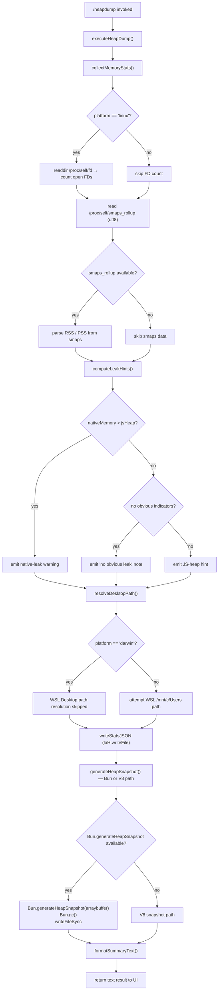

# `/heapdump`

> Analysis basis: CC v2.1.143 bundle.js (AST extraction + Claude interpretation)
> Minimum version: v2.1.143

---

## Overview

The `/heapdump` command captures a snapshot of the Claude Code process's JavaScript heap and memory statistics, then writes them to the user's Desktop directory. It collects V8/Bun heap metrics, OS-level memory figures, open file descriptors (Linux only), and `/proc/self/smaps_rollup` data, then generates a `.heapsnapshot` file viewable in Chrome DevTools. The command is hidden from the standard help listing and is intended as a developer diagnostic tool.

---

## Registration

| Field | Value |
|---|---|
| type | `local` |
| name | `heapdump` |
| description | `Dump the JS heap to ~/Desktop` |
| supportsNonInteractive | `true` |
| isHidden | `true` |
| module_id | `MGq` |

Analysis basis: CC v2.1.143 bundle.js:+11578312

---

## Input Branching

The command entry point (`commandEntryPoint`) delegates immediately to the core execution function (`executeHeapDump`). There are no user-supplied arguments parsed; all branching is driven by the runtime environment detected at execution time.



Analysis basis: CC v2.1.143 bundle.js:+11577181, +11575842, +11573574, +11573649, +11574960, +11576881, +11576938

---

## Behavioral Spec

### Command Entry Point

```
function commandEntryPoint(context):
    result = executeHeapDump(context)
    lines = []
    lines.push(result.summary)
    lines.join("\n")
    return { type: "text", content: lines }
```

Analysis basis: CC v2.1.143 bundle.js:+11577181, +11577327, +11577449

---

### Memory Statistics Collection

```
function collectMemoryStats():
    stats = {}
    stats.memoryUsage       = process.memoryUsage()
    stats.heapStatistics    = v8.getHeapStatistics()           // vP8 alias
    stats.resourceUsage     = process.resourceUsage()
    stats.uptime            = process.uptime()
    stats.heapSpaceStats    = v8.getHeapSpaceStatistics()      // vP8 alias

    stats.activeHandleCount  = process._getActiveHandles().length
    stats.activeRequestCount = process._getActiveRequests().length

    // Linux-only: open file descriptors
    try:
        fds = readdir("/proc/self/fd")                         // laH.readdir
        stats.openFDCount = fds.length
    catch:
        stats.openFDCount = null

    // Linux-only: smaps_rollup for native memory
    try:
        smapsText = readFile("/proc/self/smaps_rollup", "utf8") // laH.readFile
        stats.smaps = parseSmaps(smapsText)
    catch:
        stats.smaps = null

    // Load bun:jsc module for additional JSC stats if available
    try:
        jsc = require("bun:jsc")
        stats.jscStats = jsc.heapStats()
    catch:
        stats.jscStats = null

    return stats
```

Analysis basis: CC v2.1.143 bundle.js:+11573343, +11573367, +11573393, +11573419, +11573444, +11573486, +11573523, +11573574, +11573636, +11573675, +11573734

---

### Leak Hint Computation

The heuristic compares native (RSS-based) memory against the JS heap size. The threshold ratio used is 100 (i.e., the native overhead is expressed as a percentage).

```
function computeLeakHints(stats):
    heapUsed   = stats.memoryUsage.heapUsed
    rss        = stats.memoryUsage.rss
    external   = stats.memoryUsage.external

    nativeApprox = rss - heapUsed

    hints = []

    // Ratio expressed to fixed decimal places
    ratio = (nativeApprox / heapUsed * 100).toFixed(/* precision */)

    if nativeApprox > heapUsed:
        hints.push("Native memory > heap - leak may be in native addons (node-pty, sharp, etc.)")
    else if noSignificantIndicators(stats):
        hints.push("No obvious leak indicators. Check heap snapshot for retained objects.")

    // Append per-space breakdown (1 048 576 bytes == 1 MiB divisor)
    for space in stats.heapSpaceStats:
        if space.space_used_size > 0:
            sizeMiB = space.space_used_size / 1048576
            hints.push(formatSpaceLine(space.space_name, sizeMiB))

    // Open FD warning: threshold 3600 FDs, unit divisor 1048576
    if stats.openFDCount != null and stats.openFDCount > 3600:
        hints.push(formatFDWarning(stats.openFDCount))

    return hints
```

- FD warning threshold: **3600** (bundle.js:+11573875)
- MiB divisor: **1 048 576** (bundle.js:+11573880)
- Percentage multiplier: **100** (bundle.js:+11574027)
- Native-leak advisory string: `"Native memory > heap - leak may be in native addons (node-pty, sharp, etc.)"` (bundle.js:+11574113)
- No-indicator fallback string: `"No obvious leak indicators. Check heap snapshot for retained objects."` (bundle.js:+11575232)

---

### Desktop Path Resolution

```
function resolveDesktopPath():
    home = os.homedir()                          // vx8.homedir

    // Primary: ~/Desktop
    desktopPath = path.join(home, "Desktop")     // _5.join, literal "Desktop"

    // WSL fallback: scan /mnt/c/Users, skip pseudo-accounts
    if platform != "darwin" and isWSL():
        wslBase = "/mnt/c/Users"
        skipAccounts = ["Public", "Default", "Default User", "All Users"]
        for entry in listdir(wslBase):
            if entry not in skipAccounts:
                desktopPath = path.join(wslBase, entry, "Desktop")
                break

    ensureDir(desktopPath)
    return desktopPath
```

Analysis basis: CC v2.1.143 bundle.js:+1004504, +1004540, +1004772, +1004816, +1004835, +1004855, +1004880

- Desktop literal: `"Desktop"` (bundle.js:+1004550)
- WSL base path: `"/mnt/c/Users"` (bundle.js:+1004772)
- Skipped WSL accounts: `"Public"`, `"Default"`, `"Default User"`, `"All Users"` (bundle.js:+1004816, +1004835, +1004855, +1004880)
- Platform check string: `"darwin"` (bundle.js:+11575386)

---

### Statistics JSON Write

```
function writeStatsJSON(desktopPath, stats, hints):
    filename = buildTimestampedFilename("claude-memory", ".json")
    fullPath  = path.join(desktopPath, filename)  // DB_.join

    payload = JSON.stringify({
        collected_at: new Date().toISOString(),
        memory:       stats.memoryUsage,
        heap:         stats.heapStatistics,
        heapSpaces:   stats.heapSpaceStats,
        resource:     stats.resourceUsage,
        uptime:       stats.uptime,
        handles:      stats.activeHandleCount,
        requests:     stats.activeRequestCount,
        openFDs:      stats.openFDCount,
        smaps:        stats.smaps,
        jsc:          stats.jscStats,
        hints:        hints
    })                                            // hH → JSON.stringify

    writeFile(fullPath, payload, { mode: 0o600 }) // laH.writeFile, mode 384 (octal 0600)
    return fullPath
```

- File mode: **384** (decimal) = `0o600` (bundle.js:+11576325)

Analysis basis: CC v2.1.143 bundle.js:+11576247, +11576290, +11576306

---

### Heap Snapshot Generation

```
function generateHeapSnapshot(desktopPath):
    snapshotFile = path.join(desktopPath, buildTimestampedFilename("claude", ".heapsnapshot"))

    if typeof Bun != "undefined" and Bun.generateHeapSnapshot != null:
        // Bun fast-path
        buf = Bun.generateHeapSnapshot("arraybuffer")  // format: "arraybuffer"
        Bun.gc(/* synchronous */)
        writeFileSync(snapshotFile, buf)               // KGq.writeFileSync
    else:
        // V8 path — snapshot format "v8"
        generateV8Snapshot(snapshotFile)

    return snapshotFile
```

- Bun snapshot format literal: `"arraybuffer"` (bundle.js:+11576911)
- V8 format literal: `"v8"` (bundle.js:+11576906)
- Memory trigger label: `"auto-1.5GB"` (bundle.js:+11576498)

Analysis basis: CC v2.1.143 bundle.js:+11576861, +11576881, +11576938

---

### Summary Text Formatting

```
function formatSummaryText(statsFilePath, snapshotFilePath, stats, hints):
    lines = []

    heapMiB  = (stats.memoryUsage.heapUsed  / 1073741824 * 1024).toFixed(8)  // 1 GiB = 1073741824
    rssMiB   = (stats.memoryUsage.rss       / 1073741824 * 1024).toFixed(8)

    // Classify dominant memory type
    if stats.memoryUsage.rss - stats.memoryUsage.heapUsed > stats.memoryUsage.heapUsed:
        dominance = "— most memory is native (NOT in the .heapsnapshot)"
    else:
        dominance = "— most memory is JS heap (inspect the .heapsnapshot)"

    if hints is empty:
        lines.push("  (no obvious leak indicators)")

    lines.push("Open the .heapsnapshot in Chrome DevTools → Memory → Load to inspect retainers.")

    // Format table of top entries, padded to fixed width
    for entry in topEntries:
        lines.push(entry.label.padEnd(/* width */) + "  " + entry.value)

    return lines.join("\n")
```

- GiB divisor: **1 073 741 824** (bundle.js:+11578230)
- `toFixed` precision: **8** (bundle.js:+11577956)
- Dominant-JS hint: `"— most memory is JS heap (inspect the .heapsnapshot)"` (bundle.js:+11577624)
- Dominant-native hint: `"— most memory is native (NOT in the .heapsnapshot)"` (bundle.js:+11577684)
- No-indicator line: `"  (no obvious leak indicators)"` (bundle.js:+11577821)
- User guidance string: `"Open the .heapsnapshot in Chrome DevTools → Memory → Load to inspect retainers."` (bundle.js:+11577337)
- Column padding separator: `"  "` (two spaces) (bundle.js:+14526202)

Analysis basis: CC v2.1.143 bundle.js:+11577213, +11577300, +11577327, +11577449, +11577556, +11577868

---

## State & Side Effects

| Item | Detail |
|---|---|
| Telemetry | `tengu_heap_dump` fired once per invocation (bundle.js:+11576432) |
| File created — stats JSON | `~/Desktop/claude-memory-<timestamp>.json`, mode `0o600` |
| File created — heap snapshot | `~/Desktop/claude-<timestamp>.heapsnapshot` |
| Bun GC triggered | `Bun.gc()` called synchronously after snapshot on the Bun path (bundle.js:+11576938) |
| Hook registration | `at_.register` called via `h9` sub-graph (bundle.js:+56977) — likely a process `beforeExit` / uncaught-exception hook; exact hook type not resolvable at depth 2 |
| appState changes | None observed in depth-2 traversal |
| Sound | None observed in depth-2 traversal |
| Platform restriction | `/proc/self/fd` and `/proc/self/smaps_rollup` reads attempted only when the path exists; silently skipped on macOS/Windows (bundle.js:+11573574, +11573649) |
| macOS label | String `"macos"` used in platform labeling within summary (bundle.js:+11574967) |

---

## Version History

| Version | Change |
|---|---|
| v2.1.143 | Initial analysis — `tengu_heap_dump` telemetry, Bun/V8 dual snapshot path, WSL Desktop fallback |

---

## Common Mistakes

1. **Expecting output in the current directory.** The command always writes to `~/Desktop` (or the WSL equivalent). No path argument is accepted.
2. **Running on a headless server without a Desktop directory.** If `~/Desktop` does not exist and cannot be created, the command will error. Pre-create the directory or run on a desktop OS.
3. **Opening the `.heapsnapshot` in a text editor.** The file is a large JSON graph best consumed by Chrome DevTools → Memory tab → "Load" button, as stated in the output guidance string (bundle.js:+11577337).
4. **Assuming the JSON stats file contains the heap graph.** The `.json` file holds flat memory counters and hints only; the heap object graph is in the separate `.heapsnapshot` file.
5. **Interpreting the native-leak warning as definitive.** The message `"Native memory > heap - leak may be in native addons (node-pty, sharp, etc.)"` is a heuristic based on RSS vs. heap-used ratio, not a confirmed leak detection (bundle.js:+11574113).
6. **Ignoring the open-FD count.** On Linux, FD counts above **3600** will trigger an advisory in the output (bundle.js:+11573875). This is independent of heap size and may indicate a handle leak unrelated to JS memory.
7. **Expecting the command to appear in `/help`.** The command is registered with `isHidden: true` and will not appear in the standard slash-command listing (bundle.js:+11578312).

---

## Appendix — Identifier Mapping

> For bundle debugging only. Identifiers change across versions.

| Identifier | Role |
|---|---|
| `Zk7` | Command entry point / top-level handler |
| `LGq` | Core `executeHeapDump` orchestration function |
| `Tk7` | `collectMemoryStats` — gathers V8, process, and OS memory data |
| `Ek7` | `generateHeapSnapshot` — Bun/V8 snapshot writer |
| `Vk7` | `formatSummaryText` — assembles the human-readable result |
| `q3A` | `resolveDesktopPath` — resolves `~/Desktop` with WSL fallback |
| `V6` | Utility: async file-system wrapper (used for write operations) |
| `GV` | Lower-level I/O primitive called by `V6` |
| `G` | `require`/module loader helper (loads `bun:jsc`) |
| `f26` | Module registry lookup used by loader |
| `iT8` | Module initialisation helper used by loader |
| `X` | Transport/connection manager |
| `NH` | Connection state machine / error dispatcher |
| `v_` | Error constructor wrapper |
| `P` | Subprocess / IPC channel object |
| `j` | Byte-buffer / chunk accumulator |
| `w` | Background-session supervisor |
| `Vf` | Stream-end helper |
| `cq5` | Daemon protocol message dispatcher |
| `XH` | String-coercion utility |
| `v` | Log / telemetry emit function |
| `G5K` | Structured log formatter |
| `tt_` | Log level router (`TLK` / `ELK`) |
| `H` | Retry / jitter timer helper |
| `hH` | `JSON.stringify` wrapper |
| `_` | Generic string-transform utility |
| `P7` | Path-segment formatter / redactor |
| `h6A` | Path mapping helper |
| `q` | File handle / cleanup registry |
| `A` | Lowercase-normalisation utility |
| `cSH` | Stream write coordinator |
| `X6A` | Buffered write helper |
| `Z5K` | Append-file logging subsystem |
| `PSH` | Batched-line flusher with timeout |
| `i8H` | Log-file path builder |
| `x6` | Directory-ensure utility (`mkdir -p`) |
| `gv8` | `L8` caller — likely a stat/size helper |
| `U6A` | Log-file path joiner |
| `p6A` | Log-file rotation helper (stat → rename → unlink) |
| `E5K` | Log-file append-with-rotation writer |
| `h9` | Process exit / signal hook registrar |
| `K` | Table row formatter with `padEnd` |
| `L` | Promise-tracking set (add / delete / finally) |
| `f` | Resource closer (closes handles on settle) |
| `d` | Generic deferred / promise utility |
| `D7H` | Error-response formatter |
| `naH` | Numeric formatting / unit helper used in summary |