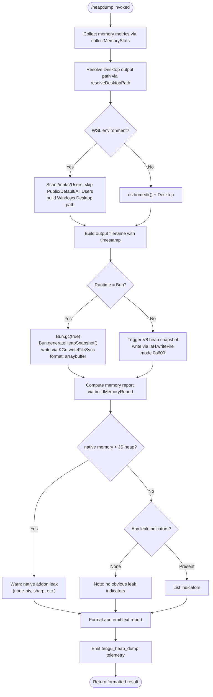

# `/heapdump`

> Analysis basis: CC v2.1.143 bundle.js (AST extraction + Claude interpretation)
> Minimum version: v2.1.143

---

## Overview

`/heapdump` is a hidden diagnostic command that captures the current JavaScript heap state of the Claude Code process, writes a `.heapsnapshot` file to `~/Desktop`, and emits a structured memory-usage report to the terminal. It collects process-level, V8-level, and OS-level memory metrics, performs optional Bun-native heap snapshotting when the runtime is Bun, and provides plain-language leak-indicator hints based on the ratio of native memory to heap memory.

---

## Registration

| Field | Value |
|---|---|
| type | `local` |
| name | `heapdump` |
| description | `Dump the JS heap to ~/Desktop` |
| supportsNonInteractive | `true` |
| isHidden | `true` |
| module_id | `MGq` |
| load_inline | `true` |
| loc_byte | `11578312` |
| loc_byte_end | `11578475` |
| loc_line | `7197` |
| arbor_handler.name | `Zk7` |
| arbor_handler.fqn | `claude-2.1.143::Zk7` |
| arbor_handler.kind | `AsyncFunction` |
| arbor_handler.resolution_path | `module_id` |
| arbor_handler.n_hits | `0` |

Analysis basis: CC v2.1.143 bundle.js:+11578312

---

## Input Branching

The command has more than three distinct execution paths (runtime detection, platform detection, memory-ratio branching, Bun vs. Node snapshot path, WSL Desktop path resolution, file-write success/error). A Mermaid flowchart is used.



---

## Behavioral Spec

### Top-level handler (`Zk7` → `heapDumpHandler`)

The async entry point resolves via `module_id` (`MGq`) to the `Zk7` function.

```
async function heapDumpHandler(context):
    report_lines = []
    snapshot_info = await performDumpAndCollect(context)
    report_lines.push(snapshot_info.summary_lines)
    report_lines.push("Open the .heapsnapshot in Chrome DevTools → Memory → Load to inspect retainers.")
    result_text = report_lines.join(newline)
    return { type: "text", content: result_text }
```

Analysis basis: CC v2.1.143 bundle.js:+11577181, +11577300, +11577327, +11577449

---

### Memory statistics collection (`Tk7` → `collectMemoryStats`)

Gathers a comprehensive snapshot of process and V8 memory at invocation time.

```
function collectMemoryStats():
    stats = {}
    stats.process_memory  = process.memoryUsage()        // rss, heapTotal, heapUsed, external, arrayBuffers
    stats.heap_statistics  = v8.getHeapStatistics()       // total_heap_size, used_heap_size, …
    stats.resource_usage  = process.resourceUsage()      // maxRSS, etc.
    stats.uptime          = process.uptime()

    stats.heap_spaces     = v8.getHeapSpaceStatistics()   // per-space breakdown

    stats.active_handles  = process._getActiveHandles().length
    stats.active_requests = process._getActiveRequests().length

    // Linux only: read open file-descriptor count from /proc/self/fd
    try:
        fds = fs.readdir("/proc/self/fd")                 // bundle.js:+11573586
        stats.fd_count = fds.length
    catch:
        stats.fd_count = null

    // Linux only: read native RSS from /proc/self/smaps_rollup
    try:
        smaps_text = fs.readFile("/proc/self/smaps_rollup", "utf8")  // bundle.js:+11573649
        stats.native_rss = parseSmapsRollup(smaps_text)
    catch:
        stats.native_rss = null

    // Import JSC introspection if available ("bun:jsc")  // bundle.js:+11573734
    try:
        stats.jsc = require("bun:jsc")
    catch:
        stats.jsc = null

    // Collect up to 3600 seconds of uptime, cap heap arrays at 1 048 576 bytes  // bundle.js:+11573875, +11573880
    stats.heap_entries = collectHeapEntries(/* limit */ 1048576)

    return stats
```

Analysis basis: CC v2.1.143 bundle.js:+11573343, +11573367, +11573393, +11573419, +11573444, +11573486, +11573523, +11573574, +11573636

---

### Desktop path resolution (`q3A` → `resolveDesktopPath`)

Determines the output directory for the snapshot file, with WSL awareness.

```
function resolveDesktopPath():
    home = os.homedir()                           // bundle.js:+11576138 (vx8.homedir)
    base = path.join(home, "Desktop")             // literal "Desktop" bundle.js:+1004550

    // WSL: scan /mnt/c/Users for a real user home
    if path.join("/mnt/c/Users") exists:          // bundle.js:+1004772
        entries = listDir("/mnt/c/Users")
        // Skip system directories
        skip = ["Public", "Default", "Default User", "All Users"]  // bundle.js:+1004816…+1004880
        for entry in entries:
            if entry not in skip:
                base = path.join("/mnt/c/Users", entry, "Desktop")
                break

    return base
```

Analysis basis: CC v2.1.143 bundle.js:+11576138, +1004504, +1004540, +1004772

---

### Heap snapshot writing — dual-runtime path (`LGq` → `performDumpAndCollect`)

Orchestrates statistics collection, snapshot writing, and report assembly.

```
async function performDumpAndCollect(context):
    stats        = await collectMemoryStats()
    desktop_path = resolveDesktopPath()
    timestamp    = formatTimestamp(Date.now())
    filename     = path.join(desktop_path, "heapdump-" + timestamp + ".heapsnapshot")
                                                    // DB_.join  bundle.js:+11576247

    // Serialize stats as JSON; write diagnostics file alongside snapshot
    stats_json = JSON.stringify(stats)              // hH  bundle.js:+11576306
    fs.writeFile(filename + ".json", stats_json, { mode: 0o600 })
                                                    // mode 384 decimal  bundle.js:+11576325

    // Emit telemetry
    emit("tengu_heap_dump")                         // bundle.js:+11576432

    // Branch: Bun runtime vs. Node/V8
    if typeof Bun !== "undefined":
        writeHeapSnapshotBun(filename)              // Ek7  bundle.js:+11576381
    else:
        writeHeapSnapshotV8(filename, stats)

    report = buildMemoryReport(stats)               // Vk7  bundle.js:+11577300

    return report
```

Analysis basis: CC v2.1.143 bundle.js:+11575181, +11576247, +11576290, +11576306, +11576325, +11576381, +11576430

---

### Bun-native snapshot writer (`Ek7` → `writeBunHeapSnapshot`)

Uses Bun's built-in garbage-collection and heap-snapshot APIs.

```
function writeBunHeapSnapshot(output_path):
    Bun.gc(/* sync */ true)                        // bundle.js:+11576938
    snapshot = Bun.generateHeapSnapshot()          // bundle.js:+11576881
    // Write as arraybuffer; format tag "v8" kept for Chrome DevTools compatibility
    KGq.writeFileSync(output_path, snapshot, { format: "arraybuffer" })
                                                   // bundle.js:+11576861, literals "v8"/"arraybuffer" +11576906/+11576911
```

Analysis basis: CC v2.1.143 bundle.js:+11576861, +11576881, +11576906, +11576911, +11576938

---

### Memory report builder (`Vk7` → `buildMemoryReport`)

Converts raw statistics into a human-readable, annotated report.

```
function buildMemoryReport(stats):
    lines = []

    heap_mb   = stats.process_memory.heapUsed   / 1_048_576
    rss_mb    = stats.process_memory.rss         / 1_048_576
    native_mb = rss_mb - heap_mb

    // Format each figure to fixed decimal places
    lines.push("Heap used:    " + heap_mb.toFixed(1)   + " MB")
    lines.push("RSS (total):  " + rss_mb.toFixed(1)    + " MB")
    lines.push("Native:       " + native_mb.toFixed(1) + " MB")

    // Leak-indicator heuristic: compare native to heap
    // Threshold comparison at 100 %  (bundle.js:+11574027, value 100)
    if native_mb > heap_mb:
        lines.push("Native memory > heap - leak may be in native addons (node-pty, sharp, etc.)")
                                                  // literal bundle.js:+11574113
        leak_indicators.push(nativeLeakWarning)

    // Platform label
    if process.platform == "darwin":              // bundle.js:+11575386
        platform_label = "macos"                  // bundle.js:+11574967
    else:
        platform_label = process.platform

    // Determine dominant memory region
    if heap_mb >= native_mb:
        lines.push("— most memory is JS heap (inspect the .heapsnapshot)")
                                                  // bundle.js:+11577624
    else:
        lines.push("— most memory is native (NOT in the .heapsnapshot)")
                                                  // bundle.js:+11577684

    if leak_indicators is empty:
        lines.push("  (no obvious leak indicators)")  // bundle.js:+11577821

    // Enforce max-column width via Math.max  (bundle.js:+11577556)
    max_col = Math.max(/* derived widths */, 8)   // value 8  bundle.js:+11577956

    // Memory threshold note: 1 GB = 1 073 741 824 bytes  (bundle.js:+11578230)
    if stats.process_memory.rss > 1_073_741_824:
        lines.push("RSS exceeds 1 GB")

    // Auto-1.5 GB label appears in auto-sizing path    // literal bundle.js:+11576498
    lines.push("Snapshot written.  Open in Chrome DevTools → Memory → Load.")

    return lines
```

Analysis basis: CC v2.1.143 bundle.js:+11574027, +11574113, +11574236, +11574389, +11575232, +11575386, +11574967, +11577556, +11577624, +11577684, +11577821, +11577956, +11578230

---

### No-leak fallback message

When no heuristic flags a leak, the report includes:

> `"No obvious leak indicators. Check heap snapshot for retained objects."` (bundle.js:+11575232)

Analysis basis: CC v2.1.143 bundle.js:+11575232

---

### Output format assembly (`Zk7` final join)

```
function assembleOutput(report_lines):
    footer = "Open the .heapsnapshot in Chrome DevTools → Memory → Load to inspect retainers."
             // bundle.js:+11577337
    all_lines = report_lines + [footer]
    return { type: "text", content: all_lines.join("\n") }
             // type literal "text"  bundle.js:+11577213
```

Analysis basis: CC v2.1.143 bundle.js:+11577213, +11577337, +11577449

---

## State & Side Effects

| Item | Detail |
|---|---|
| Telemetry | `tengu_heap_dump` (bundle.js:+11576432) — fired once per invocation after the snapshot file is written |
| Telemetry (background, incidental) | `tengu_bg_dispatch_sigkill_escalate`, `tengu_bg_dispatch_low_mem`, `tengu_bg_spare_enable`, `tengu_bg_spare_claim`, `tengu_bg_spare_claim_fail`, `tengu_bg_proto_mismatch`, `tengu_bg_dispatch_stale_drop`, `tengu_bg_attach_legacy_autorespawn`, `tengu_bg_attach`, `tengu_bg_attach_stall_gave_up`, `tengu_bg_attach_stall_respawn`, `tengu_bg_attach_kick` — emitted by background-session subsystem reachable in the call graph, not directly by `/heapdump` |
| File written | `~/Desktop/heapdump-<timestamp>.heapsnapshot` (Chrome-compatible format) |
| File written | `~/Desktop/heapdump-<timestamp>.heapsnapshot.json` — serialized memory statistics, mode `0o600` (384 decimal, bundle.js:+11576325) |
| Bun GC | `Bun.gc(true)` executed synchronously before snapshot on Bun runtime (bundle.js:+11576938) |
| Hook registration | `at_.register` called via `h9` (bundle.js:+56977) — part of logger/output subsystem reached transitively; no direct hook registered by `/heapdump` itself |
| appState changes | None detected in depth-2 traversal |
| Sound | None detected in depth-2 traversal |
| WSL Desktop path | Scans `/mnt/c/Users` to find the real Windows user's Desktop when running under WSL (bundle.js:+1004772) |

---

## Version History

| Version | Change |
|---|---|
| v2.1.143 | Initial analysis |

---

## Common Mistakes

1. **Expecting output in the current directory.** The snapshot is always written to `~/Desktop` (or the equivalent Windows Desktop under WSL), never to the current working directory or a path supplied as an argument.
2. **Running in a headless / CI environment without a Desktop directory.** The `resolveDesktopPath` function constructs the path unconditionally; if `~/Desktop` does not exist the file write will fail with `ENOENT`. Create the directory first or run the command in a desktop session.
3. **Opening the snapshot in a non-Chrome tool.** The file is written in V8 heapsnapshot format (or Bun's compatible variant). Chrome DevTools → Memory → "Load" is the intended viewer; other tools may not parse the format correctly.
4. **Misreading the native-vs-heap warning.** The message `"Native memory > heap - leak may be in native addons (node-pty, sharp, etc.)"` is a heuristic, not a confirmed leak. It simply means RSS − heapUsed > heapUsed; it can fire under normal operation when native modules hold large buffers.
5. **Forgetting the command is hidden.** `/heapdump` does not appear in `/help` output (`isHidden: true`). It must be typed exactly.
6. **Assuming the JSON stats file is the snapshot.** Two files are written: a `.heapsnapshot` (open in DevTools) and a companion `.json` (raw numeric metrics). They serve different purposes.

---

## Appendix — Identifier Mapping

> For bundle debugging only. Identifiers change across versions.

| Identifier | Role |
|---|---|
| `Zk7` | Top-level async handler for `/heapdump` (`heapDumpHandler`) |
| `LGq` | Core orchestrator: collects stats, resolves path, writes files, emits telemetry (`performDumpAndCollect`) |
| `Tk7` | Memory statistics collector: process/V8/OS metrics (`collectMemoryStats`) |
| `Ek7` | Bun-native heap snapshot writer (`writeBunHeapSnapshot`) |
| `Vk7` | Memory report builder and leak-indicator heuristic (`buildMemoryReport`) |
| `q3A` | Desktop path resolver with WSL awareness (`resolveDesktopPath`) |
| `V6` | Filesystem utility (used for path operations) |
| `GV` | Lower-level filesystem helper called by `V6` |
| `G` | JSC / introspection module loader (loads `"bun:jsc"`) |
| `f26` | Helper called within JSC loader path |
| `iT8` | Helper called within JSC loader path |
| `X` | Background session dispatcher (reached transitively) |
| `NH` | Background session attachment handler |
| `v_` | Error constructor wrapper |
| `P` | IPC/transport message handler (background sessions) |
| `j` | Transport buffer utility |
| `w` | Background session worker manager |
| `Vf` | Session stream terminator |
| `cq5` | Background session protocol handler (large, multipurpose) |
| `XH` | String conversion utility |
| `v` | Log/output formatter |
| `G5K` | Log level or output routing helper |
| `tt_` | Log level tag helper |
| `H` | Random-delay / retry utility |
| `hH` | JSON serializer wrapper (`JSON.stringify`) |
| `_` | String/array utility (used in output formatting) |
| `P7` | Path manipulation utility (basename/dirname extraction) |
| `h6A` | Path component mapper |
| `q` | Active-request or file-handle tracker |
| `A` | Lowercase-conversion / string normalizer |
| `cSH` | Output channel writer |
| `X6A` | Stream write wrapper |
| `Z5K` | Log-to-file / append subsystem |
| `PSH` | Batched log flusher with timeout |
| `i8H` | Log entry formatter |
| `x6` | File existence / access checker |
| `gv8` | Low-level file writer |
| `U6A` | Log file path builder |
| `p6A` | Log rotation / rename helper |
| `E5K` | Log file append-and-rotate handler |
| `h9` | Hook/listener registration trampoline (`at_.register`) |
| `K` | Padding / column-width formatter |
| `L` | Promise queue / task set manager |
| `f` | File handle close wrapper |
| `d` | General-purpose error/result handler |
| `D7H` | Diagnostic reporter (formats errors into user-facing messages) |
| `naH` | Numeric formatting helper (used in memory report) |