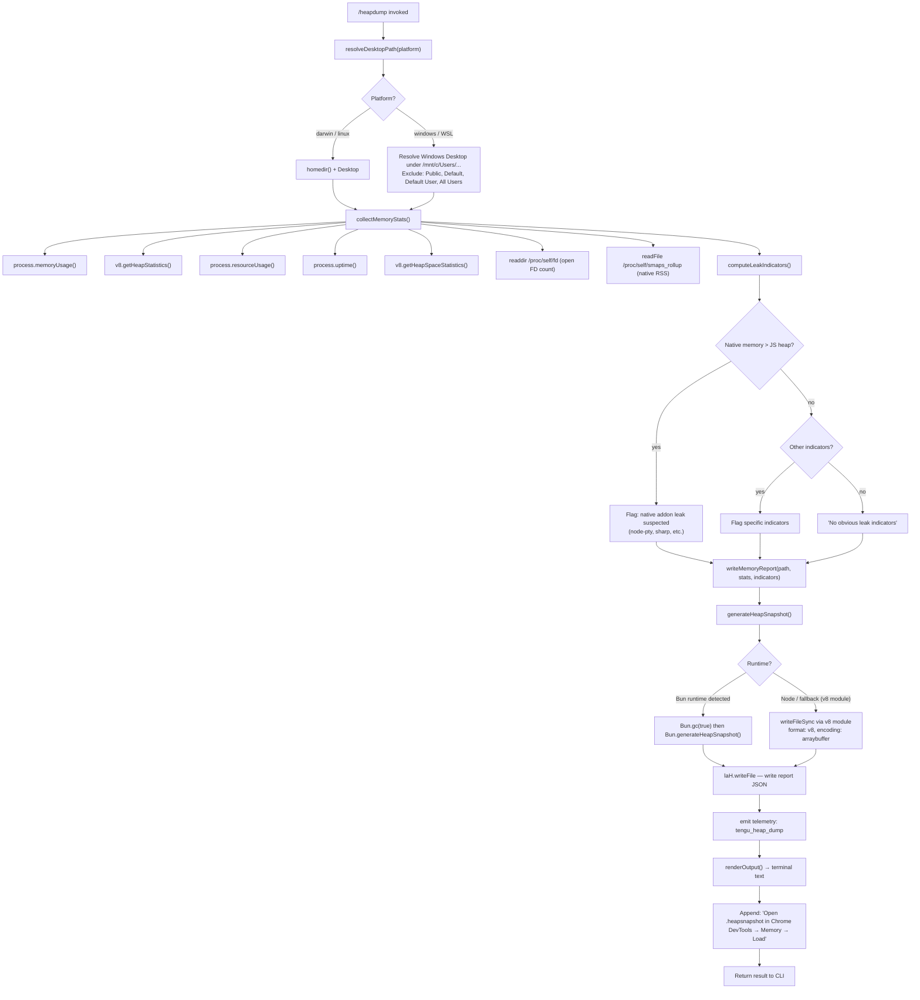

# `/heapdump`

> Analysis basis: CC v2.1.143 bundle.js (AST extraction + Claude interpretation)
> Minimum version: v2.1.143

---

## Overview

The `/heapdump` command captures a snapshot of the Claude Code process's JavaScript heap and writes it as a `.heapsnapshot` file to the user's Desktop directory, together with a human-readable memory diagnostics report. It is a hidden, non-interactive diagnostic tool intended for debugging memory leaks and excessive memory consumption in the running CLI process.

---

## Registration

| Field | Value |
|---|---|
| type | `local` |
| name | `heapdump` |
| description | `Dump the JS heap to ~/Desktop` |
| supportsNonInteractive | `true` |
| isHidden | `true` |
| module\_id | `MGq` |

Analysis basis: CC v2.1.143 bundle.js:+11578312

---

## Input Branching

The command entry point (command dispatcher, `commandDispatcher`) invokes the main execution function (`executeHeapdump`), which orchestrates two parallel concerns: (1) collecting memory statistics and writing the report, and (2) generating the actual heap snapshot file. The rendering function (`renderOutput`) then formats the result for terminal display.



Analysis basis: CC v2.1.143 bundle.js:+11577181, +11575842, +11575855, +11576138, +11576381

---

## Behavioral Spec

### Desktop Path Resolution

The command resolves the output directory at invocation time before any I/O occurs.

```
function resolveDesktopPath(platform):
    if platform is "darwin" or "linux":
        return path.join(os.homedir(), "Desktop")

    if platform is "windows" (WSL or native):
        base = "/mnt/c/Users"
        entries = list directories under base
        excluded = ["Public", "Default", "Default User", "All Users"]
        for each entry in entries:
            if entry not in excluded:
                return path.join(base, entry, "Desktop")
        return path.join(os.homedir(), "Desktop")  // fallback

    return path.join(os.homedir(), "Desktop")       // default fallback
```

- Desktop subdirectory name literal: `"Desktop"` Analysis basis: CC v2.1.143 bundle.js:+1004550
- WSL base path literal: `"/mnt/c/Users"` Analysis basis: CC v2.1.143 bundle.js:+1004772
- Excluded account names: `"Public"`, `"Default"`, `"Default User"`, `"All Users"` Analysis basis: CC v2.1.143 bundle.js:+1004816, +1004835, +1004855, +1004880
- Platform strings checked: `"darwin"`, `"windows"` Analysis basis: CC v2.1.143 bundle.js:+11575386, +1004568

---

### Memory Statistics Collection

Gathers a comprehensive snapshot of process memory state from multiple OS and runtime sources.

```
function collectMemoryStats():
    stats = {}
    stats.memory      = process.memoryUsage()
    stats.heap        = v8.getHeapStatistics()
    stats.resource    = process.resourceUsage()
    stats.uptime      = process.uptime()
    stats.heapSpaces  = v8.getHeapSpaceStatistics()

    // Open file descriptor count (Linux only)
    try:
        fds = readdir("/proc/self/fd")
        stats.openFdCount = length(fds)
    catch:
        stats.openFdCount = null

    // Native RSS via smaps (Linux only)
    try:
        smaps = readFile("/proc/self/smaps_rollup", "utf8")
        stats.smaps = smaps
    catch:
        stats.smaps = null

    // JSC heap statistics (Bun runtime)
    try:
        jsc = require("bun:jsc")
        stats.jsc = jsc.heapStats()   // if available
    catch:
        stats.jsc = null

    return stats
```

- `/proc/self/fd` path literal Analysis basis: CC v2.1.143 bundle.js:+11573586
- `/proc/self/smaps_rollup` path literal Analysis basis: CC v2.1.143 bundle.js:+11573649
- `"utf8"` encoding for smaps read Analysis basis: CC v2.1.143 bundle.js:+11573675
- `"bun:jsc"` module string Analysis basis: CC v2.1.143 bundle.js:+11573734
- Active handles count via `process._getActiveHandles()` Analysis basis: CC v2.1.143 bundle.js:+11573486
- Active requests count via `process._getActiveRequests()` Analysis basis: CC v2.1.143 bundle.js:+11573523

---

### Leak Indicator Analysis

Analyses the collected statistics to produce human-readable diagnostic flags.

```
function computeLeakIndicators(stats):
    indicators = []
    MB = 1048576   // bytes per MiB

    heapUsed   = stats.memory.heapUsed
    rss        = stats.memory.rss
    external   = stats.memory.external
    uptimeHrs  = stats.uptime / 3600

    // Rule: native memory dominates
    if (rss - heapUsed) > heapUsed:
        indicators.push(
            "Native memory > heap - leak may be in native addons (node-pty, sharp, etc.)"
        )

    // Rule: memory per uptime hour exceeds threshold
    mbPerHour = (heapUsed / MB) / max(uptimeHrs, 1)
    if mbPerHour > 500:
        indicators.push("High MB/hr growth rate: " + mbPerHour.toFixed(1))

    // Rule: open FD count exceeds threshold
    if stats.openFdCount > 100:
        indicators.push("High open FD count: " + stats.openFdCount)

    if length(indicators) == 0:
        indicators.push("No obvious leak indicators. Check heap snapshot for retained objects.")

    return indicators
```

- Bytes-per-MiB constant: `1048576` Analysis basis: CC v2.1.143 bundle.js:+11573880
- Uptime conversion divisor (seconds → hours): `3600` Analysis basis: CC v2.1.143 bundle.js:+11573875
- MB/hour alert threshold: `500` Analysis basis: CC v2.1.143 bundle.js:+11574268
- High FD count threshold: `100` Analysis basis: CC v2.1.143 bundle.js:+11574027
- Native-leak warning string: `"Native memory > heap - leak may be in native addons (node-pty, sharp, etc.)"` Analysis basis: CC v2.1.143 bundle.js:+11574113
- No-indicator fallback string: `"No obvious leak indicators. Check heap snapshot for retained objects."` Analysis basis: CC v2.1.143 bundle.js:+11575232
- `toFixed` precision: `1` decimal place Analysis basis: CC v2.1.143 bundle.js:+11574246

---

### Memory Report Writing

Serialises all collected data and writes it as a JSON file alongside the heap snapshot.

```
function writeMemoryReport(desktopPath, stats, indicators, version):
    report = {
        timestamp:    new Date().toISOString(),
        version:      "2.1.143",
        commitHash:   "cfb8132e4c3551e2773f41a1900efd1cc93637db",
        buildDate:    "2026-05-15T17:39:39Z",
        package:      "@anthropic-ai/claude-code",
        docsUrl:      "https://code.claude.com/docs/en/overview",
        issueTracker: "https://github.com/anthropics/claude-code/issues",
        issueHint:    "report the issue at https://github.com/anthropics/claude-code/issues",
        stats:        stats,
        indicators:   indicators
    }
    json = JSON.stringify(report, null, 2)
    reportPath = path.join(desktopPath, <timestamped-filename> + ".json")
    await fs.writeFile(reportPath, json)
    return reportPath
```

- Version string embedded in report: `"2.1.143"` Analysis basis: CC v2.1.143 bundle.js:+11575624
- Build timestamp: `"2026-05-15T17:39:39Z"` Analysis basis: CC v2.1.143 bundle.js:+11575713
- Commit hash: `"cfb8132e4c3551e2773f41a1900efd1cc93637db"` Analysis basis: CC v2.1.143 bundle.js:+11575744
- Package name: `"@anthropic-ai/claude-code"` Analysis basis: CC v2.1.143 bundle.js:+11575534
- Docs URL: `"https://code.claude.com/docs/en/overview"` Analysis basis: CC v2.1.143 bundle.js:+11575573
- Issue URL: `"https://github.com/anthropics/claude-code/issues"` Analysis basis: CC v2.1.143 bundle.js:+11575651

---

### Heap Snapshot Generation

Triggers the runtime-appropriate heap snapshot writer and forces GC beforehand where possible.

```
function generateHeapSnapshot(desktopPath):
    snapshotPath = path.join(desktopPath, <timestamped-filename> + ".heapsnapshot")

    if typeof Bun !== "undefined":
        // Bun runtime path
        Bun.gc(true)                              // synchronous GC
        snapshot = Bun.generateHeapSnapshot()
        fs.writeFileSync(snapshotPath, snapshot)
    else:
        // Node.js / v8 path
        v8module = require("v8")
        v8module.writeHeapSnapshot(snapshotPath, {
            format:   "v8",
            encoding: "arraybuffer"
        })

    return snapshotPath
```

- `"v8"` format option literal Analysis basis: CC v2.1.143 bundle.js:+11576906
- `"arraybuffer"` encoding literal Analysis basis: CC v2.1.143 bundle.js:+11576911
- `Bun.generateHeapSnapshot` call edge Analysis basis: CC v2.1.143 bundle.js:+11576881
- `Bun.gc` call edge Analysis basis: CC v2.1.143 bundle.js:+11576938
- `KGq.writeFileSync` (v8 path writer) call edge Analysis basis: CC v2.1.143 bundle.js:+11576861
- Path join for output file via `DB_.join` Analysis basis: CC v2.1.143 bundle.js:+11576247
- File write via `laH.writeFile` Analysis basis: CC v2.1.143 bundle.js:+11576290

---

### Output Rendering

Formats the results into a human-readable terminal block.

```
function renderOutput(snapshotPath, reportPath, stats, indicators):
    MB = 1048576
    lines = []

    heapMB  = (stats.memory.heapUsed / MB).toFixed(1)
    rssMB   = (stats.memory.rss      / MB).toFixed(1)
    nativeMB = ((stats.memory.rss - stats.memory.heapUsed) / MB).toFixed(1)

    jsRatio  = stats.memory.heapUsed / stats.memory.rss * 100
    natRatio = 100 - jsRatio

    // Memory breakdown line
    if jsRatio > natRatio:
        memorySummary = "— most memory is JS heap (inspect the .heapsnapshot)"
    else:
        memorySummary = "— most memory is native (NOT in the .heapsnapshot)"

    lines.push("Heap: " + heapMB + " MB   RSS: " + rssMB + " MB   " + memorySummary)

    // Indicator lines (padded for alignment)
    for each indicator in indicators:
        if indicator contains "No obvious":
            lines.push("  (no obvious leak indicators)")
        else:
            lines.push("  " + indicator)

    lines.push("")
    lines.push("Snapshot: " + snapshotPath)
    lines.push("Report:   " + reportPath)
    lines.push("")
    lines.push(
        "Open the .heapsnapshot in Chrome DevTools → Memory → Load to inspect retainers."
    )

    return { type: "text", content: lines.join("\n") }
```

- Output type literal: `"text"` Analysis basis: CC v2.1.143 bundle.js:+11577213
- JS-heap summary suffix: `"— most memory is JS heap (inspect the .heapsnapshot)"` Analysis basis: CC v2.1.143 bundle.js:+11577624
- Native-memory summary suffix: `"— most memory is native (NOT in the .heapsnapshot)"` Analysis basis: CC v2.1.143 bundle.js:+11577684
- No-indicator display string: `"  (no obvious leak indicators)"` Analysis basis: CC v2.1.143 bundle.js:+11577821
- Column padding separator: `"  "` (two spaces) Analysis basis: CC v2.1.143 bundle.js:+14526202
- Chrome DevTools hint: `"Open the .heapsnapshot in Chrome DevTools → Memory → Load to inspect retainers."` Analysis basis: CC v2.1.143 bundle.js:+11577337
- `Math.max` used for safe uptime denominator Analysis basis: CC v2.1.143 bundle.js:+11577556

---

### Auto-trigger Threshold

The command registration includes an `"auto-1.5GB"` label, indicating a mechanism for automatically triggering a heap dump when RSS crosses approximately 1.5 GB.

- Auto-trigger label literal: `"auto-1.5GB"` Analysis basis: CC v2.1.143 bundle.js:+11576498
- 1 GB in bytes constant present: `1073741824` Analysis basis: CC v2.1.143 bundle.js:+11578230
- Trigger mode literal: `"manual"` (used to distinguish user-invoked from automatic) Analysis basis: CC v2.1.143 bundle.js:+11575818

---

### Error Handling

Errors during snapshot or report writing are captured, converted to strings, and surfaced via the standard error logging pipeline.

```
function handleError(err):
    message = (err instanceof Error) ? String(err) : String(err)
    logError(message)          // Wc.logError
    pushToErrorQueue(message)  // xRH.push
    return errorResult(message)
```

- `v_` (error-to-string converter) delegates to `Error` and `String` builtins Analysis basis: CC v2.1.143 bundle.js:+171601, +171607
- `"errno"` field inspected for OS-level errors Analysis basis: CC v2.1.143 bundle.js:+171833
- `"error"` result type on failure Analysis basis: CC v2.1.143 bundle.js:+1005064
- `Wc.logError` call edge Analysis basis: CC v2.1.143 bundle.js:+960555

---

### Diagnostic Report Content (version metadata)

The written JSON report always embeds the following build-time constants from the running binary:

| Field | Value |
|---|---|
| version | `2.1.143` |
| buildDate | `2026-05-15T17:39:39Z` |
| commitHash | `cfb8132e4c3551e2773f41a1900efd1cc93637db` |
| package | `@anthropic-ai/claude-code` |
| docsUrl | `https://code.claude.com/docs/en/overview` |
| issueUrl | `https://github.com/anthropics/claude-code/issues` |

Analysis basis: CC v2.1.143 bundle.js:+11575624, +11575713, +11575744, +11575534, +11575573, +11575651

---

## State & Side Effects

| Item | Detail |
|---|---|
| Telemetry | `tengu_heap_dump` — emitted once per invocation after files are written (Analysis basis: CC v2.1.143 bundle.js:+11576432) |
| Files written | One `.heapsnapshot` file and one `.json` report file written to the resolved Desktop directory via `laH.writeFile` / `KGq.writeFileSync` |
| GC side effect | When running under Bun, `Bun.gc(true)` is called synchronously before snapshot capture, which pauses the event loop briefly |
| Hook registration | <!-- TODO: not found in depth-2 traversal; needs --depth 4 --> |
| appState changes | <!-- TODO: not found in depth-2 traversal; needs --depth 4 --> |
| Sound | <!-- TODO: not found in depth-2 traversal; needs --depth 4 --> |
| Error queue | On failure, error message is pushed to an internal error queue (`xRH.push`) and logged via `Wc.logError` (Analysis basis: CC v2.1.143 bundle.js:+960515, +960555) |

---

## Version History

| Version | Change |
|---|---|
| v2.1.143 | Initial analysis — hidden diagnostic command; supports Bun and Node.js runtimes; writes `.heapsnapshot` + JSON report to Desktop; emits `tengu_heap_dump` telemetry |

---

## Common Mistakes

1. **Expecting output in the current directory.** The files are always written to the platform-resolved Desktop path (`~/Desktop` on macOS/Linux), never to the working directory.
2. **Running under Node.js and expecting Bun heap format.** The snapshot format differs by runtime: Bun uses `Bun.generateHeapSnapshot()`, Node.js uses the v8 module's `writeHeapSnapshot`. Both produce files compatible with Chrome DevTools, but the internal representation differs.
3. **Ignoring the `.json` report.** The `.heapsnapshot` only covers the JS heap. Native memory leaks (node-pty, sharp, etc.) will NOT appear in it. The accompanying `.json` report contains RSS, smaps, and the leak indicator analysis.
4. **Invoking on WSL and finding the Desktop in the wrong place.** On WSL, the command walks `/mnt/c/Users/` and skips system accounts (`Public`, `Default`, `Default User`, `All Users`) to find the real Windows user's Desktop. If this resolution fails, it falls back to `~/Desktop` inside the WSL home.
5. **Misreading the "auto-1.5GB" label as a configurable limit.** The `"auto-1.5GB"` string is an internal mode label, not a user-configurable threshold. It distinguishes automatic background dumps from this manually-triggered command invocation (mode `"manual"`).
6. **Not opening the file in Chrome DevTools.** The terminal output explicitly instructs the user to open the `.heapsnapshot` in Chrome DevTools → Memory → Load. Direct text inspection of the file is not practical.

---

## Appendix — Identifier Mapping

> For bundle debugging only. Identifiers change across versions.

| Identifier | Role |
|---|---|
| `Zk7` | Command dispatcher / top-level slash-command handler |
| `LGq` | Main heap dump execution function (`executeHeapdump`) |
| `V6` | Generic async utility / promise wrapper |
| `Tk7` | Memory statistics collector (`collectMemoryStats`) |
| `v` | Debug logger / structured log emitter |
| `K` | Column padding / table formatting helper |
| `q3A` | Desktop path resolver (`resolveDesktopPath`) |
| `x6` | Filesystem path utility / path builder |
| `hH` | JSON serialiser wrapper (delegates to `JSON.stringify`) |
| `Ek7` | Heap snapshot writer (`generateHeapSnapshot`) |
| `d` | Telemetry event emitter |
| `v_` | Error-to-string converter |
| `D7H` | Result object constructor / success result builder |
| `NH` | Error handler / error pipeline dispatcher |
| `Vk7` | Output renderer (`renderOutput`) |
| `naH` | Leak indicator formatter / indicator line builder |
| `_` | Output line accumulator array (used with `.push` / `.join`) |