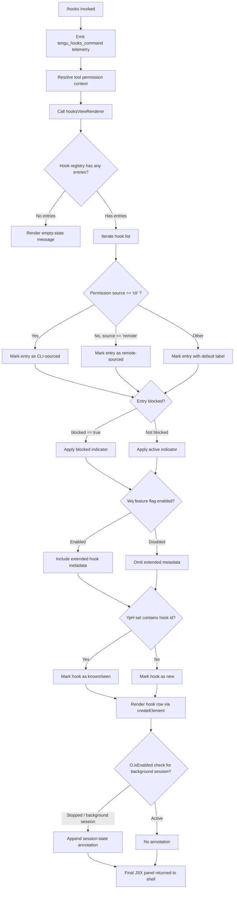

# `/hooks`

> Analysis basis: CC v2.1.143 bundle.js (AST extraction + Claude interpretation)
> Minimum version: v2.1.143

---

## Overview

The `/hooks` command renders an inline JSX panel that displays all currently registered hook configurations for tool events. It queries the active tool-permission context, collects hook entries from internal registries, and presents them in a structured list within the Claude Code terminal UI. The command is immediate (no async wait) and fires a telemetry event on every invocation.

---

## Registration

| Field | Value |
|---|---|
| type | `local-jsx` |
| name | `hooks` |
| description | `View hook configurations for tool events` |
| immediate | `true` |
| module\_id | `qWq` |

Analysis basis: CC v2.1.143 bundle.js:+11472793

---

## Input Branching

The command entry point (`hooksCommandHandler`) performs no free-text argument parsing; the only input path is the invocation itself. Internal rendering (`hooksViewRenderer`) does branch on multiple conditions sourced from the tool-permission context and hook registry state.



Analysis basis: CC v2.1.143 bundle.js:+11472573, +11472638, +9074386, +9074425, +9074601, +9074629, +9074652, +9074743, +9074782

---

## Behavioral Spec

### Entry Point — Hooks Command Handler

```
function hooksCommandHandler(commandContext):
    emit telemetry("tengu_hooks_command")
    toolPermCtx = commandContext.getToolPermissionContext()
    panel = hooksViewRenderer(toolPermCtx)
    return createElement(panel)
```

Analysis basis: CC v2.1.143 bundle.js:+11472573, +11472575, +11472607, +11472638, +11472668

---

### Hook Registry Lookup

```
function hookRegistryLookup(permissionContext):
    // Normalize boolean-like strings for enabled/disabled flags
    // Accepted truthy values: "yes", "on"
    // Accepted falsy values:  "no", "off"
    entries = flatMapHookSources(permissionContext)
    filtered = entries.filter(isActiveHookEntry)
    return filtered
```

Truthy string literals recognized: `"yes"`, `"on"` (bundle.js:+26422, +26428).
Falsy string literals recognized: `"no"`, `"off"` (bundle.js:+26573, +26578).

Analysis basis: CC v2.1.143 bundle.js:+9074457, +9073738

---

### Hook Source Classification

```
function classifyHookSource(hookEntry):
    source = hookEntry.source
    if source == "cli":
        return label("CLI argument")
    else if source == "remote":
        return label("Remote configuration")
    else:
        return label("Unknown / SDK source")
```

Source string literals: `"cli"` (bundle.js:+3192692), `"remote"` (bundle.js:+3192703).

Additional SDK-origin labels recognized in the registry pipeline:
- `"sdk-ts"` (bundle.js:+3192949)
- `"sdk-py"` (bundle.js:+3192963)
- `"sdk-cli"` (bundle.js:+3192977)
- `"local-agent"` (bundle.js:+3192992)

These values influence how the source tag is rendered in the hook row but do not suppress display.

Analysis basis: CC v2.1.143 bundle.js:+3192692, +3192703, +3192719

Telemetry fired during source resolution: `tengu_slate_harbor` (bundle.js:+3192722).

---

### Hook Entry Rendering

```
function renderHookEntry(hookEntry, featureFlags, seenSet):
    row = newRow()

    // Source label
    row.source = classifyHookSource(hookEntry)

    // Blocked indicator
    if hookEntry.status == "blocked":
        row.indicator = BLOCKED_SYMBOL
    else:
        row.indicator = ACTIVE_SYMBOL

    // Extended metadata (feature-flag gated)
    if featureFlags.wqEnabled:
        row.metadata = hookEntry.extendedMeta
    else:
        row.metadata = null

    // New-vs-known badge
    if seenSet.has(hookEntry.id):
        row.badge = "known"
    else:
        row.badge = "new"

    // Pad columns for alignment (width constant: 40 chars)
    row.formattedSource = hookEntry.source.padEnd(40)

    return row
```

Blocked status literal: `"blocked"` (bundle.js:+9073799).
Column padding width: `40` characters (bundle.js:+14528173).
Column separator: `"  "` (two spaces, bundle.js:+14526202).

Analysis basis: CC v2.1.143 bundle.js:+9073799, +9074743, +9074652, +14528173, +14526202

---

### Permission Context Evaluation

```
function evaluatePermissionContext(toolPermCtx):
    // Windows platform requires special path handling
    if platform == "windows":
        applyWindowsPathNormalization()

    // Resolve deny-listed tools
    denyList = resolveDenyList(toolPermCtx)   // literal "deny" at +9891032
    
    // Resolve narrowing from CLI args
    cliArgNarrowing = resolveCliArgNarrowing(toolPermCtx)   // "cliArg" at +9891618

    // Resolve tool-set narrowing
    toolsNarrowing = resolveToolsNarrowing(toolPermCtx)   // "toolsNarrowing" at +9891639

    return PermissionSummary(denyList, cliArgNarrowing, toolsNarrowing)
```

Platform literal: `"windows"` (bundle.js:+3194022).
Deny literal: `"deny"` (bundle.js:+9891032).
CLI-arg narrowing literal: `"cliArg"` (bundle.js:+9891618).
Tools narrowing literal: `"toolsNarrowing"` (bundle.js:+9891639).

Telemetry fired during permission resolution: `tengu_cobalt_ridge` (bundle.js:+3194116).
Telemetry fired during agent-teams flag evaluation: `tengu_amber_flint` (bundle.js:+5298220).

Analysis basis: CC v2.1.143 bundle.js:+3194015, +3194022, +9891032, +9891618, +9891639

---

### Background Session State Annotation

```
function resolveSessionAnnotation(sessionState):
    if sessionState == "stopped":
        return annotation("background session")
    else:
        return null
```

Literals: `"stopped"` (bundle.js:+14538107), `"background session"` (bundle.js:+14538150).

Analysis basis: CC v2.1.143 bundle.js:+14538107, +14538145, +14538150

---

### Daemon Status Integration

```
function loadDaemonStatus():
    statusPath = joinPath(workingDirectory, "daemon.status.json")
    raw = readFile(statusPath)
    return JSON.parse(raw)
```

Status filename literal: `"daemon.status.json"` (bundle.js:+11707334).

Analysis basis: CC v2.1.143 bundle.js:+11707334, +11707329

---

### Tool-Search Feature-Flag Guard

```
function checkToolSearchFlag(provider):
    if provider == "vertex":
        if ENABLE_TOOL_SEARCH env var not set:
            log("[ToolSearch:optimistic] disabled: Vertex AI does not accept " +
                "the tool-search beta header. Set ENABLE_TOOL_SEARCH=true to override.")
            return DISABLED
    return ENABLED
```

Vertex AI tool-search suppression message literal (bundle.js:+9595991).
Provider literals checked: `"bedrock"` (+2020544), `"foundry"` (+2020594), `"anthropicAws"` (+2020650), `"mantle"` (+2020704), `"vertex"` (+2020752), `"firstParty"` (+2020761).
Canonical API host: `"api.anthropic.com"` (bundle.js:+2021450).

Analysis basis: CC v2.1.143 bundle.js:+9595455, +9595991, +2020544

---

### Hook Deduplication Guard

```
function deduplicateHookRegistration(hookId, registeredSet, pendingMap):
    if registeredSet.has(hookId):
        existing = pendingMap.get(hookId)
        return existing   // skip re-registration
    registeredSet.add(hookId)
    entry = buildHookEntry(hookId)
    pendingMap.set(hookId, entry)
    scheduleHookActivation(entry)
    return entry
```

Analysis basis: CC v2.1.143 bundle.js:+3139736, +3139760, +3139776, +3142184, +3142207

---

### Timestamp Stamping on Hook Entries

```
function stampHookEntry(entry):
    entry.createdAt = Date.now()
    entry.sessionId = generateSessionId()
    return entry
```

`Date.now` is called at two distinct sites: bundle.js:+3161214 (hook entry stamping) and bundle.js:+11707446 (daemon status timestamp).

Analysis basis: CC v2.1.143 bundle.js:+3161214, +11707446

---

### Random Jitter for Hook Retry Scheduling

```
function scheduleWithJitter(callback):
    jitter = Math.floor(Math.random() * 2)   // range 0–1
    delay = BASE_DELAY + jitter
    setTimeout(callback, delay)
```

Numeric literal `2` used as upper bound for `Math.random()` multiplication (bundle.js:+12638154).

Analysis basis: CC v2.1.143 bundle.js:+12638154, +12638156, +12638193

---

## State & Side Effects

| Item | Detail |
|---|---|
| Telemetry — invocation | `tengu_hooks_command` fired on every `/hooks` call (bundle.js:+11472575) |
| Telemetry — source resolution | `tengu_slate_harbor` fired during hook-source classification (bundle.js:+3192722) |
| Telemetry — permission context | `tengu_cobalt_ridge` fired during permission-context evaluation (bundle.js:+3194116) |
| Telemetry — agent teams | `tengu_amber_flint` fired during agent-teams feature-flag check (bundle.js:+5298220) |
| Hook registry reads | Reads from `sMH` (pending-map) and `nA_` (registered-set); no writes triggered by display alone |
| Seen-set read | Reads `YpH` set to determine new-vs-known badge; no mutation on display |
| appState changes | None observed at depth-2 traversal; the command is display-only |
| Daemon status file | Reads `daemon.status.json` from working directory for session-state annotation |
| Sound | <!-- TODO: not found in depth-2 traversal; needs --depth 4 --> |
| File system (cleanup) | `unlinkSync` reachable via file-handle close path (`q` → `n8K.unlinkSync`, bundle.js:+14482768); triggered only on handle teardown, not on `/hooks` display |

---

## Version History

| Version | Change |
|---|---|
| v2.1.143 | Initial analysis — `local-jsx` immediate command; four telemetry events; Vertex AI tool-search guard; daemon status integration |

---

## Common Mistakes

1. **Expecting argument parsing** — `/hooks` accepts no arguments. Anything typed after `/hooks` is ignored; the command always renders the full hook list.
2. **Confusing `immediate: true` with async behavior** — `immediate` means the command renders synchronously without waiting for a model turn. It does not mean hooks themselves execute immediately.
3. **Assuming the display mutates hook state** — the command is read-only. It reads registry sets (`sMH`, `nA_`, `YpH`) but does not register, unregister, or modify any hook entry.
4. **Expecting Vertex AI tool-search hooks to appear active** — if the provider is `"vertex"` and `ENABLE_TOOL_SEARCH` is not set, tool-search hooks are suppressed and will not appear in the list (bundle.js:+9595991).
5. **Misreading source labels** — `"cli"` and `"remote"` are the two primary source discriminators. SDK-origin values (`"sdk-ts"`, `"sdk-py"`, `"sdk-cli"`, `"local-agent"`) are secondary labels within the same classification system, not separate hook types.
6. **Expecting `daemon.status.json` to always exist** — the background-session annotation is only rendered when the file is present and its status field equals `"stopped"`. Missing file silently suppresses the annotation.

---

## Appendix — Identifier Mapping

> For bundle debugging only. Identifiers change across versions.

| Identifier | Role |
|---|---|
| `av7` | Hooks command handler (entry point) |
| `d` | Telemetry emit helper |
| `pZ` | Hooks view renderer (main JSX component) |
| `xH` | String coercion / display formatter |
| `ZP` | Hook source classifier |
| `$F` | Source label builder |
| `Sq` | Secondary string converter |
| `G6` | Hook deduplication and registry coordinator |
| `m76` | Registry pre-check helper A |
| `p76` | Registry pre-check helper B |
| `Ts` | Hook entry formatter |
| `Ci6` | Hook registration deduplication guard |
| `N6` | Hook entry timestamp stamper |
| `UHH` | Hook list filter (active entries) |
| `H` | Utility collection / array with random-jitter scheduler |
| `pP6` | Permission context resolver |
| `HLH` | Deny-list flat-mapper |
| `yR_` | CLI-arg and tool-narrowing resolver |
| `H9q` | Narrowing result assembler |
| `_k_` | Hook row builder |
| `Qu` | Windows-path-aware row constructor |
| `s_` | ES-module export initializer |
| `dZ6` | Module export binder |
| `YK` | Hook row data assembler |
| `FHH` | Full hook panel renderer |
| `nz` | Inline string normalizer |
| `oY` | Alternate string converter |
| `CiH` | Blocked-status indicator renderer |
| `B87` | Hook row sub-renderer A |
| `q1` | Agent-teams flag evaluator |
| `$$4` | Agent-teams flag reader |
| `p87` | Hook row sub-renderer B |
| `U87` | Hook row sub-renderer C |
| `tS` | Tool-search / provider feature-flag guard |
| `iS_` | TST / standard mode resolver |
| `v` | Provider type classifier |
| `DA` | Provider-specific branch handler |
| `bf` | Final flag state emitter |
| `A` | File-handle registry (toLowerCase normalizer wrapper) |
| `f` | File-handle manager |
| `q` | Temp-file set (unlinkSync site) |
| `L` | File-handle lifecycle coordinator |
| `K` | Column formatter / padEnd applier |
| `XL` | Extra layout helper |
| `O` | Background-session state checker |
| `N8` | Session stopped-state resolver |
| `$` | Daemon / background session includes-checker |
| `JZq` | Daemon status loader |
| `ha` | Daemon status file path helper |
| `d1` | Async-local storage store reader |
| `r06` | Daemon status JSON path builder |
| `hH` | JSON serializer wrapper |