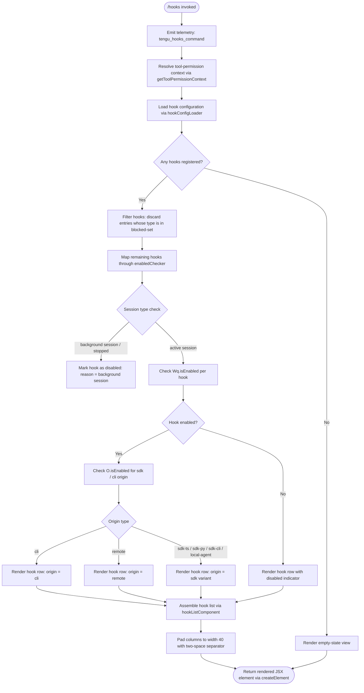

# `/hooks`

> Analysis basis: CC v2.1.143 bundle.js (AST extraction + Claude interpretation)
> Minimum version: v2.1.143

---

## Overview

The `/hooks` command renders a read-only view of all hook configurations that are currently registered for tool events in the active Claude Code session. It resolves the current tool-permission context, collects hook entries from configuration, evaluates their enabled state and any blocking conditions, and renders the result as a JSX component directly in the terminal UI. The command executes immediately upon invocation — no sub-command or argument is required.

---

## Registration

| Field | Value |
|---|---|
| type | `local-jsx` |
| name | `hooks` |
| description | `View hook configurations for tool events` |
| immediate | `true` |
| module\_id | `qWq` |

Analysis basis: CC v2.1.143 bundle.js:+11472793

---

## Input Branching

The command entry point (`commandHandler`) takes no user-supplied arguments. All branching is driven by internal state: the current tool-permission context, the set of registered hook entries, and per-hook enabled/blocked flags.



Analysis basis: CC v2.1.143 bundle.js:+11472573, +11472607, +11472638, +11472668

---

## Behavioral Spec

### 1. Command Handler (`commandHandler`)

```
function commandHandler(appState, permissionContext):
    emitTelemetry("tengu_hooks_command")
    ctx = getToolPermissionContext(appState)
    output = buildHooksView(ctx, appState)
    return createElement(output)
```

Analysis basis: CC v2.1.143 bundle.js:+11472573, +11472607, +11472638, +11472668

---

### 2. Boolean String Normalisation (`booleanStringNormaliser`)

During hook-enabled evaluation, string values are normalised to boolean. The strings `"yes"` and `"on"` are treated as truthy; all other string values fall through to standard truthiness rules.

```
function booleanStringNormaliser(value):
    s = String(value)           // coerce via String()
    if s == "yes": return true
    if s == "on":  return true
    return Boolean(value)
```

Analysis basis: CC v2.1.143 bundle.js:+26373, +26422, +26428

---

### 3. Hook Configuration Loader (`hookConfigLoader`)

Reads the flat hook registry and partitions entries by origin class. The origin classes recognised are: `"cli"`, `"remote"`, `"sdk-ts"`, `"sdk-py"`, `"sdk-cli"`, and `"local-agent"`. The index `0` is used as the base offset when iterating entries.

```
function hookConfigLoader(permissionContext):
    allHooks = readHookRegistry()          // flat list
    blocked  = buildBlockedSet()           // entries with type == "blocked"
    result   = []
    for entry in allHooks:
        if entry.origin in ["cli", "remote",
                            "sdk-ts", "sdk-py",
                            "sdk-cli", "local-agent"]:
            result.append(entry)
    return result
```

Analysis basis: CC v2.1.143 bundle.js:+3192540, +3192557, +3192602, +3192642, +3192692, +3192703, +3192949, +3192963, +3192977, +3192992

---

### 4. Blocked-Hook Filter (`blockedHookFilter`)

Iterates the hook list and removes any entry whose resolved type equals the string `"blocked"`.

```
function blockedHookFilter(hooks):
    return hooks.filter(h => resolveHookType(h) != "blocked")
```

Analysis basis: CC v2.1.143 bundle.js:+9073738, +9073753, +9073799

---

### 5. Hook Row Builder (`hookRowBuilder`)

Constructs the display row for a single hook. Column widths are padded to **40 characters** using a **two-space** (`"  "`) separator between columns.

```
function hookRowBuilder(hook):
    nameCol   = hook.name.padEnd(40)       // pad to 40 chars
    statusCol = deriveStatusLabel(hook)
    return nameCol + "  " + statusCol      // two-space separator
```

Analysis basis: CC v2.1.143 bundle.js:+14526168, +14526181, +14526202, +14528099, +14528173

---

### 6. Enabled-State Resolver (`enabledStateResolver`)

Checks whether a given hook is active. Two fast-exit conditions exist before the per-hook flag is consulted:

1. If the session state is `"stopped"`, the hook is considered inactive regardless of its own flag.
2. If the session is a `"background session"`, the hook is also considered inactive.

```
function enabledStateResolver(hook, session):
    if session.state == "stopped":         return false
    if session.type  == "background session": return false
    return booleanStringNormaliser(Wq.isEnabled(hook))
```

Analysis basis: CC v2.1.143 bundle.js:+14538107, +14538145, +14538150

---

### 7. Hook List Component (`hookListComponent`)

Assembles the full display, iterating over the filtered and mapped hook rows. Delegates per-row rendering to `hookRowBuilder` and per-hook enabled resolution to `enabledStateResolver`. Uses `YpH.has` to gate inclusion of hooks whose event type is present in a tracked set, and `$.includes` (backed by `JZq`) to verify allowed event categories.

```
function hookListComponent(hooks, trackedEventSet, allowedCategories):
    rows = []
    for hook in hooks.filter(h => trackedEventSet.has(h.eventType)):
        if allowedCategories.includes(hook.category):
            enabled = enabledStateResolver(hook, currentSession)
            rows.append(hookRowBuilder(hook, enabled))
    return renderRows(rows)
```

Analysis basis: CC v2.1.143 bundle.js:+9073114, +9073130, +9073251, +9073344, +9073415, +9073434, +9073475, +9073481, +9073487, +9073626, +9073667, +9073694, +9074601, +9074629, +9074641, +9074652, +9074728, +9074743, +9074771, +9074782, +9074824, +9074869

---

### 8. Platform Guard (`platformGuard`)

Before rendering certain hook controls, a Windows platform check is performed. The string `"windows"` is matched against the resolved platform identifier.

```
function platformGuard(platform):
    if platform == "windows":
        return WINDOWS_RESTRICTED_MODE
    return DEFAULT_MODE
```

Analysis basis: CC v2.1.143 bundle.js:+3194158, +3194165, +3194191

---

### 9. Telemetry Emission (`emitSlateHarbor`)

A secondary telemetry event `"tengu_slate_harbor"` is fired within the hook configuration loading path (inside `ZP`), distinct from the command-invocation event. This event appears to track hook-config resolution activity.

```
function emitSlateHarbor(context):
    emitTelemetry("tengu_slate_harbor", context)
```

Analysis basis: CC v2.1.143 bundle.js:+3192722

---

## State & Side Effects

| Item | Detail |
|---|---|
| Telemetry — invocation | `tengu_hooks_command` emitted immediately on command entry (bundle.js:+11472575) |
| Telemetry — config load | `tengu_slate_harbor` emitted during hook-config resolution (bundle.js:+3192722) |
| Hook registration | Command is registered as `local-jsx` / `immediate: true`; no hooks are mutated — this command is read-only (bundle.js:+11472793) |
| `appState` changes | None observed within depth-2 traversal; command renders current state without writing back |
| Column padding | Hook name column padded to **40 characters**; columns separated by `"  "` (two spaces) (bundle.js:+14528173, +14526202) |
| Platform handling | Windows path (`"windows"`) triggers a restricted rendering mode (bundle.js:+3194165) |
| Session-state gating | Hooks are shown as inactive when session state is `"stopped"` or session type is `"background session"` (bundle.js:+14538107, +14538150) |
| Sound | <!-- TODO: not found in depth-2 traversal; needs --depth 4 --> |

---

## Version History

| Version | Change |
|---|---|
| v2.1.143 | Initial analysis — command registered as `local-jsx`, immediate, module `qWq` |

---

## Common Mistakes

1. **Expecting `/hooks` to modify configuration** — the command is strictly read-only. Use the settings file or the dedicated hook-registration API to add or remove hooks; `/hooks` only displays what is already registered.
2. **Misreading disabled hooks as absent** — a hook shown with a disabled indicator is still registered; it is suppressed because the session is stopped or is a background session, not because the hook was deleted.
3. **Assuming all origin types are displayed equally** — hooks are partitioned by origin (`"cli"`, `"remote"`, `"sdk-ts"`, `"sdk-py"`, `"sdk-cli"`, `"local-agent"`); entries that do not match a recognised origin class are silently excluded from the view.
4. **Overlooking the `"blocked"` filter** — hooks whose resolved type is `"blocked"` are removed before display. If a hook is missing from the `/hooks` output, verify it has not been placed in the blocked set.
5. **Treating `"yes"` / `"on"` as non-boolean** — the enabled-state resolver normalises the strings `"yes"` and `"on"` to `true`; configuration values stored as these strings will show the hook as enabled.
6. **Windows-specific rendering differences** — on a Windows platform the display enters a restricted rendering mode; column layout or control availability may differ from non-Windows environments.

---

## Appendix — Identifier Mapping

> For bundle debugging only. Identifiers change across versions.

| Identifier | Role |
|---|---|
| `av7` | Command handler — entry point for `/hooks`, emits telemetry and calls `buildHooksView` |
| `d` | Telemetry emitter utility — general-purpose event dispatch called at command entry |
| `pZ` | Hook view builder — orchestrates config loading, filtering, mapping, and JSX assembly |
| `xH` | Boolean/string normaliser — coerces values via `String()`, recognises `"yes"` / `"on"` |
| `ZP` | Hook configuration loader — reads registry, partitions by origin, emits `tengu_slate_harbor` |
| `UHH` | Blocked-hook filter — applies `Array.filter` to remove `"blocked"`-type entries |
| `_k_` | Hook state collector — calls enabled-check helpers `Qu`, `piH`, `s_` |
| `YK` | Platform guard — checks for `"windows"` platform string before rendering controls |
| `FHH` | Hook list component — assembles all hook rows, delegates to `YK`, `nz`, `oY`, `xH`, `CiH`, `B87`, `q1`, `p87`, `U87`, `_k_`, `er1`, `tS` |
| `A` | Tool-name set — stores lowercase tool names; uses `f.toLowerCase` for normalisation |
| `K` | Hook display row set — uses `L.map` and `f.padEnd` for column formatting |
| `XL` | Auxiliary enabled-state checker — consulted alongside `Wq.isEnabled` |
| `O` | SDK/session enabled resolver — checks `N8` for `"stopped"` / `"background session"` state |
| `nz` | Hook name formatter — delegates to `xH` for string normalisation |
| `$` | Allowed-category list — backed by `JZq`; used with `Array.includes` to gate hook display |