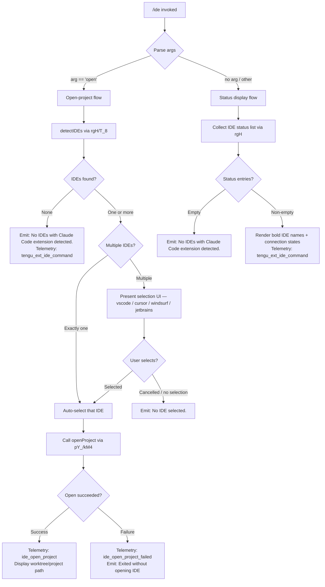

# `/ide`

> Analysis basis: CC v2.1.143 bundle.js (AST extraction + Claude interpretation)
> Minimum version: v2.1.143

---

## Overview

The `/ide` command manages IDE integrations for Claude Code, allowing users to inspect connected IDE instances and optionally open the current project in a detected IDE. It scans for running IDE processes (VS Code, Cursor, Windsurf, JetBrains family), displays their connection status, and supports an `open` sub-command that launches the project in a chosen IDE. The command is implemented as an async handler (`EP7`) resolved via the `Zfq` module.

---

## Registration

| Field | Value |
|---|---|
| type | `local-jsx` |
| name | `ide` |
| description | `Manage IDE integrations and show status` |
| argumentHint | `[open]` |
| module_id | `Zfq` |
| load_inline | `true` |
| loc_byte | `10635236` |
| loc_byte_end | `10635392` |
| loc_line | `5833` |
| arbor_handler.name | `EP7` |
| arbor_handler.fqn | `claude-2.1.143::EP7` |
| arbor_handler.kind | `AsyncFunction` |
| arbor_handler.resolution_path | `module_id` |
| arbor_handler.n_hits | `0` |

Analysis basis: CC v2.1.143 bundle.js:+10635236

---

## Input Branching

The command has 4+ distinct branches based on argument and IDE detection results.



Analysis basis: CC v2.1.143 bundle.js:+10631296 (EP7 entry), +10631404 (literal `"open"`), +10631513 (no-IDE message), +10631651 (no-selection message)

---

## Behavioral Spec

### 1. Main Handler (`EP7`)

```
async function ideCommandHandler(args, appContext):
    emit telemetry("tengu_ext_ide_command", ...)         # +10631298

    subCommand = args[0]                                  # argumentHint "[open]"

    ideList = await detectIDEs(appContext)                 # calls rgH

    if subCommand == "open":                              # +10631404
        if ideList is empty:
            display("No IDEs with Claude Code extension detected.")  # +10631513
            return

        if ideList.length == 1:
            chosen = ideList[0]
        else:
            chosen = await promptIDESelection(ideList)    # renders vscode/cursor/windsurf/jetbrains choices
            if chosen is null:
                display("No IDE selected.")              # +10631651
                return

        result = await openProjectInIDE(chosen, appContext)  # calls pY_/kM4

        if result.ok:
            emit telemetry("ide_open_project", {type: worktreeOrProject})  # +10631851/+10631896
        else:
            emit telemetry("ide_open_project_failed", ...)                 # +10631958
            display("Exited without opening IDE")                          # +10632248
    else:
        # Status display path
        if ideList is empty:
            display("No IDEs with Claude Code extension detected.")
            return

        for each ide in ideList:
            display bold(ide.name) + connectionStatus(ide)   # M6.bold +10631912

        optionally display restart hint:                  # "restart your IDE" +10632516
            if any IDE is in degraded/disconnected state
```

Analysis basis: CC v2.1.143 bundle.js:+10631296–10632907

---

### 2. IDE Detection (`rgH` / `T_8` / `TM4`)

```
async function detectIDEs(appContext):
    # rgH entry +5210586
    port = parseInt(env or config)                       # rgH +5210586
    candidates = await buildIDECandidates()              # T_8 +5207140

    # T_8 / TM4: enumerate IDE install paths
    #   - checks ~/.claude directory             +5208470
    #   - checks homedir                         +5208456
    #   - on WSL: scans /mnt/c/Users/...        +5208677
    #   - skips Public, Default, Default User, All Users  +5208771/5208790/5208810/5208835
    #   - resolves symlinks, verifies isDirectory / isSymbolicLink
    #   - deduplicates via Set.has/add

    results = await Promise.all(candidates.map(checkCandidate))  # T_8 +5207159

    # On linux: runs ps-aux grep for code|cursor|windsurf|idea|pycharm|...
    #   literal grep command at +5215463

    detectedIDEs = []
    for each candidate in results:
        ideType = classifyIDE(candidate)                 # Vj +5216338
        # Vj.toLowerCase comparison → vscode/cursor/windsurf/jetbrains
        if ideType is known:
            detectedIDEs.push({name, type: ideType, path: ...})

    emit telemetry("ide_detect", ...)                    # +5211929
    if any failure:
        emit telemetry("ide_detect_failed", ...)         # +5211993

    return detectedIDEs
```

Analysis basis: CC v2.1.143 bundle.js:+5210586 (rgH), +5207140 (T_8), +5208379 (TM4), +5215463 (linux ps command), +5216338 (Vj classifier)

---

### 3. IDE Classification (`Vj`)

```
function classifyIDEType(processOrPath):
    # Vj +5216338
    lower = processOrPath.toLowerCase()

    if lower contains "cursor"   → return "cursor"       # +10631752
    if lower contains "windsurf" → return "windsurf"     # +10631793
    if lower contains "code"     → return "vscode"       # +10631711
    if lower contains any jetbrains marker
        (idea, pycharm, webstorm, phpstorm, rubymine,
         clion, goland, rider, datagrip, dataspell,
         aqua, gateway, fleet, android-studio, appcode)  # +5215837/+5207036
         → return "jetbrains"

    # Extract display name via m1 (indexOf/slice helpers)
    name = extractBasename(processOrPath)                # uI.basename +5216396
    return {type, displayName: name}
```

Analysis basis: CC v2.1.143 bundle.js:+5216338 (Vj), +5216382 (m1), +5216396 (basename)

---

### 4. Open Project (`pY_` / `kM4`)

```
async function openProjectInIDE(ideInfo, appContext):
    # pY_ +5215975 → kM4 +5214574
    config = loadConfig(appContext)                          # d6 +5214574

    # Determine if current context is a worktree or regular project
    contextType = appContext.isWorktree ? "worktree" : "project"  # +10631885/+10631896

    platformEntries = Object.entries(config.ideSettings)    # +5214877
    for each [platform, settings]:
        if settings includes ideInfo.type:                   # q.includes +5214934
            push open-request to queue                       # H.push +5214949

    # On macOS/Windows/Linux: invokes IDE-specific open protocol
    # Checks platform (linux/windows/macos in literals +5215437/+14502797/+11972225)
    # Uses KXH (config accessor) for IDE socket/port resolution

    result = await sendOpenRequest(ideInfo, projectPath)
    return result
```

Analysis basis: CC v2.1.143 bundle.js:+5215975 (pY_), +5214574 (kM4), +10631885 (worktree), +10631896 (project)

---

### 5. Connection Status Normalization

Connection states encountered in the status display path use the following string literals:

| Literal | Meaning |
|---|---|
| `"unknown"` | IDE detected but state unresolvable |
| `"local"` | IDE connected locally |
| `"migrated"` | Connection migrated from a previous session |
| `"native"` | Native protocol connection |
| `"installed"` | Extension installed but not yet active |
| `"disabled"` | Extension disabled |
| `"enabled"` | Extension enabled and active |
| `"no_permissions"` | Extension lacks required permissions |
| `"not_configured"` | Extension present but not configured |
| `"global"` | Connection via global scope |

Analysis basis: CC v2.1.143 bundle.js:+3159959–3160165 (state strings from G6/N6 scope)

---

## State & Side Effects

| Item | Detail |
|---|---|
| Telemetry: `tengu_ext_ide_command` | Fired on every `/ide` invocation (status or open); loc +10631298 |
| Telemetry: `ide_detect` | Fired after IDE scan completes; loc +5211929 |
| Telemetry: `ide_detect_failed` | Fired when IDE scan encounters an error; loc +5211993 |
| Telemetry: `ide_open_project` | Fired on successful project-open action; loc +10631851 |
| Telemetry: `ide_open_project_failed` | Fired when the open action fails; loc +10631958 |
| Hook registration | None detected in depth-2 traversal for this command directly |
| appState changes | IDE selection state updated via `kM4`; config read via `KXH` |
| File I/O | On linux, forks a `ps aux` subprocess to enumerate running IDE processes; loc +5215463 |
| UI rendering | Renders bold IDE names via `M6.bold` (+10631912); presents an interactive selection list when multiple IDEs are found |
| Restart hint | Conditionally displays "restart your IDE" guidance (+10632516) when extension state is degraded |

---

## Version History

| Version | Change |
|---|---|
| v2.1.143 | Initial analysis |

---

## Common Mistakes

1. **Running `/ide open` with no IDE running** — If no IDE process with the Claude Code extension is detected, the command exits immediately with `"No IDEs with Claude Code extension detected."` No project is opened.
2. **Dismissing the IDE selection prompt** — If multiple IDEs are found and the user cancels the selection UI, the command exits silently with `"No IDE selected."` and does not open any IDE.
3. **Extension not enabled** — An IDE process may be detected but the extension state may be `"installed"` or `"disabled"`, resulting in a status display rather than a functional connection. The hint to "restart your IDE" is shown in this path.
4. **WSL path confusion** — On WSL environments the scanner checks `/mnt/c/Users/...` paths but skips system accounts (`Public`, `Default`, `Default User`, `All Users`). Using `/ide open` from a WSL shell targeting a Windows IDE may produce unexpected path mappings.
5. **JetBrains IDE not listed** — JetBrains IDEs are detected via `ps aux` grep on Linux, which requires the IDE to currently be running. Installed-but-not-running JetBrains IDEs will not appear.

---

## Appendix — Identifier Mapping

> For bundle debugging only. Identifiers change across versions.

| Identifier | Role |
|---|---|
| `EP7` | Main async handler for `/ide` command (arbor_handler) |
| `ix_` | IDE connection/session listing helper (maps over active IDE connections) |
| `rgH` | IDE detection orchestrator (scans processes, builds candidate list) |
| `T_8` | IDE candidate path builder (enumerates install locations) |
| `TM4` | Per-candidate IDE path resolver (handles symlinks, WSL paths, dedup) |
| `WM4` | IDE candidate mapper (maps raw entries through dtA classifier) |
| `dtA` | IDE process-string parser (extracts PID and name tokens) |
| `Vj` | IDE type classifier (lowercases process name, maps to vscode/cursor/windsurf/jetbrains) |
| `m1` | String slice/indexOf helper used by Vj for name extraction |
| `bA1` | Regex match helper used in IDE name extraction |
| `pY_` | Open-project dispatcher (entry point for `open` sub-command) |
| `kM4` | Open-project implementation (resolves config, sends open request per IDE type) |
| `KP` | Config accessor used within open-project flow |
| `KXH` | Core config loader/accessor (reads IDE settings, rejects on pre-init access) |
| `iA1` | Process kill helper used during IDE detection cleanup |
| `S6` | Async store getter used in status collection |
| `Uh6` | Store accessor helper (calls ph6.getStore) |
| `Fd` | Fallback/default value helper used in store retrieval |
| `__` | Utility function called by S6 (delegates to GV) |
| `GV` | Lower-level utility reached from `__` |
| `D` | IDE daemon/session normalizer (normalizes connection state, manages sessions) |
| `G6` | IDE connection state resolver (checks sMH/nA_ sets, maps to status strings) |
| `N6` | IDE file watcher / state persistence coordinator |
| `H$H` | Config file reader with backup/migration logic |
| `nhL` | File watch setup helper (calls di6.watchFile/unwatchFile) |
| `Ci6` | IDE connection registrar (checks for duplicates, adds to nA_ set) |
| `lA_` | New IDE connection initializer (generates UUID, emits event) |
| `eA_` | IDE connection event handler (wD9, R_, aE9, VRH sub-handlers) |
| `$o_` | Daemon background spare process spawner |
| `Oo_` | Background session claim handler (connects via Unix socket) |
| `jo_` | Background job lifecycle manager (handles job states: done/killed/stopped/failed/crashed/blocked/working/idle/resuming) |
| `w` | Active daemon session manager (dispatches to IDE workers, manages memory) |
| `C` | IDE worker session object (handles write/kill/NH operations) |
| `Z_K` | Worker path resolver (realpath + stat) |
| `MK5` | Worker version verifier |
| `p58` | Version join/format helper |
| `z` | Daemon stop controller (emits daemon_stop / daemon_stop_failed) |
| `xN` | Stop request writer (pushes to wF queue) |
| `Ox` | Stop sequencer (Promise.race/all, process.exit) |
| `NH` | Error normalizer (xH + zq + kNK pipeline) |
| `v_` | Error-to-string converter |
| `zq` | Error code extractor |
| `A$A` | Error code formatter |
| `kNK` | Circular queue shift/push helper |
| `x` | Worker idle/retire timer (retireIfSettled, setTimeout/clearTimeout) |
| `cq5` | Daemon protocol message dispatcher (handles all message types: ping/nudge/yield/lease/shutdown/dispatch/reply/resize/attach/stream/state/subscribe etc.) |
| `s8K` | Stale dispatch detector / timeout calculator |
| `Qq5` | Spare-pool size calculator |
| `dq5` | Job phase inspector / kill coordinator |
| `SoH` | Roster file reader/writer |
| `Qp` | Roster parse/validate helper |
| `_j7` | Roster write helper (mkdir + atomic write via eO) |
| `jo_` | Job roster entry manager |
| `Bf` | File write coordinator (uses eO for atomic writes) |
| `eO` | Atomic file write helper (randomBytes temp name → rename) |
| `rw` | Active-state labeler (maps to "active" string) |
| `lE` | Activity state helper (bGH sub-function) |
| `Gd_` | Claim file writer (mkdir + writeFile + JSON.stringify) |
| `zW6` | Socket path resolver |
| `Ex_` | Auth path builder |
| `wLH` | PID file path builder |
| `gp` | PTY path builder |
| `Wx_` | tJ7 wrapper |
| `koH` | PTY socket path helper |
| `Bk` | PTY-PID file path builder |
| `DNH` | PTY-PID directory resolver |
| `pq5` | Argument array validator (JM helper) |
| `JM` | Array.isArray check helper |
| `bq5` | Spawn result object builder (Object.assign) |
| `IK` | Job path resolver (SP.join + b0) |
| `b0` | Base job directory resolver |
| `s1` | Job metadata file reader/writer (stat, readFile, JSON cache) |
| `R6` | JSON.parse wrapper |
| `K` | Column formatter (L.map + padEnd) |
| `p` | Write buffer flusher |
| `V` | Generic value container/accessor |
| `z6H` | <!-- TODO: not found in depth-2 traversal; needs --depth 4 --> |
| `N` | Away-summary generator (cache-age check, rate-limit guard, KM8/Te7/jlq) |
| `AH` | Voice/focus session manager (G.current, setTimeout, recording state) |
| `r` | Permission-allow handler |
| `F` | MCP tool filter (c6.filter, P6.has) |
| `g` | MCP tool runner composite (F + $) |
| `l` | Write relay (Oc_ sub-function) |
| `c` | Output filter (o.filter) |
| `HZ6` | Socket frame writer (H.destroy / H.write) |
| `G` | Transport factory (f26 + iT8) |
| `X` | SDK/SSE transport handler (Promise.all, aKH, Dn, NH) |
| `iT8` | Transport type discriminator |
| `IG6` | Platform memory checker (macos → 1024 MB threshold) |
| `JZq` | Daemon status file writer (daemon.status.json) |
| `ha` | lfH helper used in status write |
| `d1` | AsyncLocalStorage store reader (znL.getStore) |
| `r06` | Status file path builder (wZq.join + x8) |
| `hH` | JSON.stringify wrapper |
| `F1` | Feature flag reader (SH + mH helpers) |
| `SH` | Feature flag "yes"/"on" check |
| `mH` | Feature flag negative check |
| `rf` | <!-- TODO: not found in depth-2 traversal; needs --depth 4 --> |
| `Y8` | $_ + S6 composite (used in EP7 branching) |
| `$_` | Config/state lookup (KXH, D, _SK, NH) |
| `igH` | <!-- TODO: not found in depth-2 traversal; needs --depth 4 --> |
| `TT` | <!-- TODO: not found in depth-2 traversal; needs --depth 4 --> |
| `pn` | <!-- TODO: not found in depth-2 traversal; needs --depth 4 --> |
| `jP7` | <!-- TODO: not found in depth-2 traversal; needs --depth 4 --> |
| `L4` | Config-change event handler (V6, Yy, QX, sE, S6) |
| `j2` | Hook runner (full hook execution pipeline) |
| `I3H` | Hook + config-change dispatcher |
| `IBH` | Hook presence checker (H.some) |
| `rHH` | Policy settings handler (PqH, Cz8, Ft1, LY8) |
| `W` | Skills/debounce dispatcher (z.add, clearTimeout, setTimeout, I3H, IBH) |
| `JrH` | vz8.clear helper |
| `P` | Daemon protocol frame parser/writer |
| `j` | Inner write stream (→ w) |
| `Vf` | Frame end writer (H.end + hH) |
| `mp` | Binary frame builder (Buffer.alloc, writeUInt32BE, writeUInt8, copy) |
| `mq5` | Socket connect helper (qE8.connect, K.once, K.end) |
| `uq5` | Claim send with timeout (5000 ms; +14485619) |
| `xq5` | Claim frame builder (fU.buildClaimFrame) |
| `M` | Lease table manager (SvH, THK, L.get/values) |
| `Bw` | Background-service label helper (tMH) |
| `Do_` | <!-- TODO: not found in depth-2 traversal; needs --depth 4 --> |
| `C2` | Path join + hV + YO composite |
| `d$` | Path realpath + normalize helper |
| `A5H` | File open + readline interface helper |
| `LY8` | <!-- TODO: not found in depth-2 traversal; needs --depth 4 --> |
| `PqH` | <!-- TODO: not found in depth-2 traversal; needs --depth 4 --> |
| `Cz8` | <!-- TODO: not found in depth-2 traversal; needs --depth 4 --> |
| `Ft1` | <!-- TODO: not found in depth-2 traversal; needs --depth 4 --> |