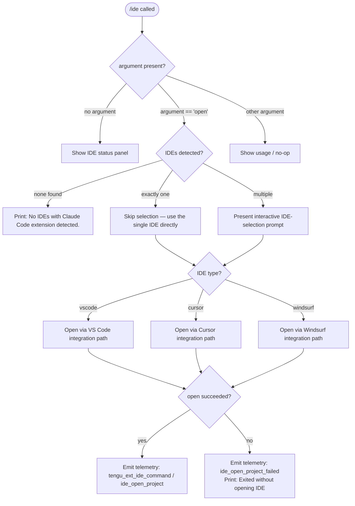

# `/ide`

> Analysis basis: CC v2.1.143 bundle.js (AST extraction + Claude interpretation)
> Minimum version: v2.1.143

---

## Overview

The `/ide` command manages IDE integrations for Claude Code, providing the ability to detect connected IDEs that have the Claude Code extension installed, display their status, and optionally open the current project directly inside a supported IDE. When invoked with the `open` sub-command argument, it presents an interactive IDE-selection prompt and triggers the appropriate IDE launch sequence. Without any argument it reports the current integration status.

---

## Registration

| Field | Value |
|---|---|
| type | `local-jsx` |
| name | `ide` |
| description | `Manage IDE integrations and show status` |
| argumentHint | `[open]` |
| module_id | `Zfq` |

Analysis basis: CC v2.1.143 bundle.js:+10635236

---

## Input Branching

The top-level handler (see `commandEntryPoint` in the Appendix) inspects the first argument token after the command name. The resulting control flow has three distinct paths.



Analysis basis: CC v2.1.143 bundle.js:+10631296 – +10632907

---

## Behavioral Spec

### 1. IDE Detection (`detectConnectedIDEs`)

At invocation time the handler calls the IDE-detection subsystem to enumerate all IDE processes that are currently running and have the Claude Code extension active.

```
function detectConnectedIDEs():
    connectedList = []
    rawList = listAvailableIDEConnections()   // reads active SSE-IDE / WS-IDE sockets
    for each entry in rawList:
        normalizedPath = normalizePath(entry, "NFC")   // Unicode NFC normalisation
        connectedList.append(normalizedPath)
    return connectedList
```

On Linux the detection additionally executes a `ps aux` scan whose grep pattern covers: `code`, `cursor`, `windsurf`, `idea`, `pycharm`, `webstorm`, `phpstorm`, `rubymine`, `clion`, `goland`, `rider`, `datagrip`, `dataspell`, `aqua`, `gateway`, `fleet`, `android-studio`.

Analysis basis: CC v2.1.143 bundle.js:+10634736 (entry), +10634829 (NFC normalization), +5215463 (Linux ps-aux pattern)

**Connection socket name constants**

| Socket tag | Value |
|---|---|
| SSE-based IDE socket | `sse-ide` |
| WebSocket-based IDE socket | `ws-ide` |

Analysis basis: CC v2.1.143 bundle.js:+10629283, +10629303

---

### 2. Status Display (`renderIDEStatusPanel`)

When no argument is supplied the command renders the IDE integration status panel. The panel iterates over the detected IDE list and formats each entry. Extension status values observed in the bundle are:

| Status token | Meaning |
|---|---|
| `unknown` | Extension state could not be determined |
| `local` | Extension installed locally |
| `migrated` | Extension migrated from a prior installation |
| `native` | Extension using the native (bundled) binary |
| `installed` | Extension installed and active |
| `disabled` | Extension present but disabled |
| `enabled` | Extension enabled |
| `no_permissions` | Extension present but lacking required permissions |
| `global` | Extension installed at the global scope |
| `not_configured` | Extension present but not yet configured |

Analysis basis: CC v2.1.143 bundle.js:+3159959 through +3160165

---

### 3. `open` Sub-command Flow (`handleIDEOpen`)

```
function handleIDEOpen(ideList):
    if ideList is empty:
        print("No IDEs with Claude Code extension detected.")
        emitTelemetry("ide_detect", {result: "none"})
        return

    if length(ideList) == 1:
        selectedIDE = ideList[0]
    else:
        selectedIDE = promptUserToSelectIDE(ideList)
        if selectedIDE is null:
            print("No IDE selected.")
            return

    ideType = classifyIDEType(selectedIDE)   // returns "vscode" | "cursor" | "windsurf" | "jetbrains"

    emitTelemetry("tengu_ext_ide_command", {ideType: ideType})

    result = openProjectInIDE(selectedIDE, currentWorktreePath())

    if result.success:
        emitTelemetry("ide_open_project", {ide: ideType, scope: detectScope()})
    else:
        emitTelemetry("ide_open_project_failed", {ide: ideType, error: result.error})
        print("Exited without opening IDE")
        suggestAction("restart your IDE")
```

Analysis basis: CC v2.1.143 bundle.js:+10631296 (telemetry anchor), +10631404 (`open` literal), +10631513 (no-IDEs message), +10631651 (no-selection message), +10631851 (success telemetry key), +10631958 (failure telemetry key), +10632248 (failure user message), +10632516 (restart suggestion)

---

### 4. IDE-type Classification (`classifyIDEType`)

```
function classifyIDEType(idePath):
    lowerPath = idePath.toLowerCase()
    if lowerPath contains "cursor":    return "cursor"
    if lowerPath contains "windsurf":  return "windsurf"
    if lowerPath contains "jetbrains" or matches jetbrains product list:
                                       return "jetbrains"
    return "vscode"   // default
```

Supported product-name tokens for the JetBrains branch (found in the process-name normaliser): `idea`, `pycharm`, `webstorm`, `phpstorm`, `rubymine`, `clion`, `goland`, `rider`, `datagrip`, `dataspell`, `aqua`, `gateway`, `fleet`, `android-studio`, `appcode`.

Analysis basis: CC v2.1.143 bundle.js:+10631711, +10631752, +10631793, +5207036, +5215837

---

### 5. Project-path Resolution (`resolveProjectScope`)

Before opening the IDE the handler determines whether to pass a **worktree** path or the **project** root path:

```
function resolveProjectScope():
    if currentContext is worktree:
        return ("worktree", worktreePath)
    else:
        return ("project", projectRootPath)
```

The scope strings emitted to telemetry are the literals `"worktree"` and `"project"`.

Analysis basis: CC v2.1.143 bundle.js:+10631885, +10631896

---

### 6. `onInstallIDEExtension` Hook Registration

During command initialisation the renderer registers a callback named `onInstallIDEExtension`. This hook is invoked if the user triggers an in-session IDE-extension installation from the status panel.

Analysis basis: CC v2.1.143 bundle.js:+10632425

---

### 7. IDE Detection Telemetry (`detectIDEsWithTelemetry`)

The IDE-detection function emits two distinct events depending on outcome:

```
function detectIDEsWithTelemetry():
    try:
        result = detectConnectedIDEs()
        emitTelemetry("ide_detect", {count: length(result)})
        return result
    catch error:
        emitTelemetry("ide_detect_failed", {error: error.message})
        return []
```

Analysis basis: CC v2.1.143 bundle.js:+5211929 (`ide_detect` literal), +5211993 (`ide_detect_failed` literal)

---

## State & Side Effects

| Item | Detail |
|---|---|
| Telemetry — primary command event | `tengu_ext_ide_command` (emitted at every `/ide open` invocation) |
| Telemetry — detection success | `ide_detect` |
| Telemetry — detection failure | `ide_detect_failed` |
| Telemetry — open project success | `ide_open_project` |
| Telemetry — open project failure | `ide_open_project_failed` |
| Telemetry — background daemon (indirect) | `tengu_bg_spare_claim`, `tengu_bg_spare_spawn`, `tengu_bg_dispatch_sigkill_escalate`, `tengu_daemon_control`, `tengu_bg_sendclaim_failed`, `tengu_bg_attach`, `tengu_bg_attach_kick`, `tengu_bg_attach_stall_ms`, `tengu_bg_attach_stall_gave_up`, `tengu_bg_attach_stall_respawn`, `tengu_bg_attach_legacy_autorespawn`, `tengu_bg_roster_parse_failed`, `tengu_bg_proto_mismatch`, `tengu_bg_dispatch_stale_drop`, `tengu_bg_dispatch_low_mem`, `tengu_bg_low_mem_mb`, `tengu_bg_spare_enable`, `tengu_daemon_idle_exit`, `tengu_config_parse_error` |
| Telemetry — feature flags (indirect) | `tengu_feature_ok`, `tengu_feature_bad`, `tengu_feature_sad` |
| Hook registration | `onInstallIDEExtension` callback registered on render |
| appState changes | IDE-connection map updated; SSE-IDE / WS-IDE socket entries read |
| Socket types touched | `sse-ide` (SSE connection), `ws-ide` (WebSocket connection) |
| Sound | <!-- TODO: not found in depth-2 traversal; needs --depth 4 --> |
| File I/O (indirect, daemon path) | `daemon.status.json` read/written for daemon handshake |

---

## Version History

| Version | Change |
|---|---|
| v2.1.143 | Initial analysis. Supports VS Code, Cursor, Windsurf, and JetBrains-family IDEs. `open` sub-command with interactive selection. SSE and WebSocket IDE socket modes present. |

---

## Common Mistakes

1. **Invoking `/ide open` before the extension is installed** — The command detects IDEs only through active SSE-IDE or WS-IDE sockets. If no IDE has the Claude Code extension running, the message "No IDEs with Claude Code extension detected." appears and no further action is taken. Install and enable the extension in the IDE first.

2. **Expecting `/ide` to launch an IDE from scratch** — The command connects to an already-running IDE instance via its socket. It does not start a new IDE process; an IDE must already be open.

3. **Running on Linux without a visible process list** — On Linux, detection falls back to a `ps aux` grep. If the IDE process name does not match any of the recognised patterns (e.g. a non-standard wrapper script), detection will silently return zero results.

4. **Assuming JetBrains IDEs are always detected on macOS** — JetBrains IDE detection uses a separate normalisation path (`jetbrains` literal). The IDE must be running and the Claude Code plugin must have registered its socket; merely having the IDE open is insufficient.

5. **Using an unrecognised argument** — The command only recognises `open` as a sub-command argument (per `argumentHint: "[open]"`). Any other string is silently ignored and the status panel is shown instead.

---

## Appendix — Identifier Mapping

> For bundle debugging only. Identifiers change across versions.

| Identifier | Role |
|---|---|
| `ix_` | Top-level `/ide` command entry-point function |
| `EP7` | JSX render function for the `/ide` UI component |
| `S6` | App-state store accessor (reads global app state) |
| `Uh6` | State-store subscription helper |
| `Fd` | State field selector / getter |
| `__` | Command output / print utility |
| `GV` | Terminal output renderer |
| `A` | Active IDE-connection map (Map object) |
| `D` | Daemon / background-session manager |
| `G6` | IDE-connection normaliser and registry |
| `m76` | IDE-connection entry constructor |
| `p76` | IDE-connection entry validator |
| `Ts` | String normalisation utility (Unicode) |
| `xH` | Raw string-to-normalised-form converter |
| `jF` | Feature-flag / experiment resolver |
| `Ci6` | IDE-connection registration handler |
| `lA_` | Growthbook experiment event emitter |
| `eA_` | IDE-connection event dispatcher |
| `N6` | Config file watcher initialiser |
| `x6` | Config path resolver |
| `z9_` | Config change debouncer |
| `H$H` | Config file reader and migration helper |
| `nhL` | File-watch subscription manager |
| `JZq` | Daemon status file writer (`daemon.status.json`) |
| `ha` | Daemon log helper |
| `d1` | Async-local-storage store getter |
| `r06` | Daemon status path resolver |
| `hH` | JSON serialiser wrapper |
| `IG6` | Platform memory sampler (macOS gate) |
| `$o_` | Background spare PTY process spawner |
| `F1` | Feature-flag reader (ok path) |
| `SH` | Feature-flag "sad" state handler |
| `mH` | Feature-flag "bad" state handler |
| `o7q` | Spare-socket path builder |
| `eQ` | Auth-socket path resolver |
| `a7q` | Alternate spare-socket path builder |
| `pq5` | Spawn argument array validator |
| `JM` | Array type guard |
| `bq5` | Spawned background-process descriptor builder |
| `Bk` | PTY-pid-file path resolver |
| `DNH` | PTY-pid directory path builder |
| `NH` | Error-normaliser / logger |
| `v_` | Error constructor wrapper |
| `zq` | Error string formatter |
| `A$A` | Error code extractor |
| `kNK` | Circular log-buffer manager |
| `w` | Background-session dispatch loop |
| `C` | Session supervisor connector |
| `Z_K` | Real-path / stat resolver for session socket |
| `$8` | Filesystem error code classifier |
| `MK5` | Version-file path builder for Claude binary |
| `p58` | Claude binary version-path joiner |
| `z` | Daemon stop / control socket writer |
| `xN` | Outbound daemon message builder |
| `Ox` | Daemon shutdown race-condition handler |
| `x` | Session idle-timeout manager |
| `h` | Idle-timer handle holder |
| `m` | Idle-timer interval reference |
| `Oo_` | Daemon claim-frame sender |
| `Gd_` | Auth-token directory writer |
| `zW6` | Auth directory path builder |
| `Ex_` | Auth file path resolver |
| `v` | Log-level formatter |
| `XH` | String coercion wrapper |
| `uq5` | Claim-send timeout wrapper |
| `mq5` | Net-socket claim connector |
| `L8` | Promise-timeout utility |
| `r8` | Retrying socket connector |
| `xq5` | Claim-frame serialiser |
| `mp` | Binary frame encoder (Buffer-based) |
| `jo_` | Daemon session lifecycle manager |
| `K` | Session-state column formatter |
| `IK` | Job-directory path resolver |
| `b0` | Job-directory base path builder |
| `s1` | Job-roster file reader / parser |
| `R6` | JSON parser wrapper |
| `rw` | Roster active-state classifier |
| `lE` | Active-entry filter helper |
| `Bf` | Job-file atomic writer |
| `eO` | Atomic file write (randomised temp + rename) |
| `o2` | Job-cache invalidator |
| `SoH` | Roster file watcher |
| `Qp` | Roster file reader with error handling |
| `_j7` | Roster directory + file initialiser |
| `wLH` | PTY-pid-file path builder (secondary) |
| `gp` | PTY socket path resolver |
| `Wx_` | PTY transport-type selector |
| `koH` | PTY socket directory path builder |
| `rf` | IDE-list formatter for display |
| `rgH` | IDE scanning and enumeration orchestrator |
| `T_8` | Per-IDE connection-file scanner |
| `TM4` | Single IDE directory enumerator |
| `C9` | Filesystem access-error classifier |
| `WM4` | IDE process name → IDE type mapper |
| `dtA` | Shell command runner for process scanning |
| `$_` | Shell execution wrapper |
| `bA1` | Process-output regex extractor |
| `W` | Skills / tools change debouncer |
| `I3H` | Config-change hook dispatcher |
| `L4` | Policy-settings hook runner |
| `j2` | Generic hook executor |
| `IBH` | Hook-eligibility checker |
| `LY8` | Hook result accumulator |
| `rHH` | Hook type-router |
| `PqH` | Prompt-hook handler |
| `Cz8` | MCP-tool hook handler |
| `Ft1` | Function-hook handler |
| `JrH` | Hook state-cache clearer |
| `P` | IPC message framer / parser |
| `j` | IPC write-channel reference |
| `Vf` | IPC connection ender |
| `cq5` | Daemon protocol message dispatcher |
| `lq5` | Lease record constructor |
| `M` | Session-state aggregator |
| `Bw` | Background-service label provider |
| `Do_` | Dispatch-pending-set manager |
| `s8K` | Dispatch stale-drop timer |
| `C2` | Claude binary path joiner |
| `d$` | Real-path normaliser for binary path |
| `A5H` | JSONL tail-file reader |
| `Qq5` | Session memory-pressure checker |
| `p` | Periodic write flusher |
| `V` | Snapshot version tracker |
| `z6H` | Session-state serialiser for snapshots |
| `dq5` | Attach-and-resume orchestrator |
| `N` | Away-summary generator |
| `AH` | Voice / audio-session manager |
| `r` | Permission-response filter |
| `F` | MCP tool-use filter |
| `g` | Composite filter (MCP + permission) |
| `l` | PTY write-channel reference |
| `c` | Outbound message filter |
| `HZ6` | IPC connection data-writer |
| `G` | Session-stream subscription handler |
| `X` | MCP connection state manager |
| `iT8` | MCP transport initialiser |
| `iA1` | Process signal sender (`process.kill`) |
| `Vj` | IDE display-name formatter |
| `m1` | String index-based slicer |
| `J8` | Feature-sad logger |
| `Y8` | State-store initialiser |
| `pY_` | IDE-open project orchestrator |
| `kM4` | IDE-specific project-open command builder |
| `KP` | Claude config reader entry point |
| `KXH` | Full config loader (reads all config layers) |
| `pn` | IDE-status panel sub-renderer |
| `jP7` | IDE-status footer renderer |