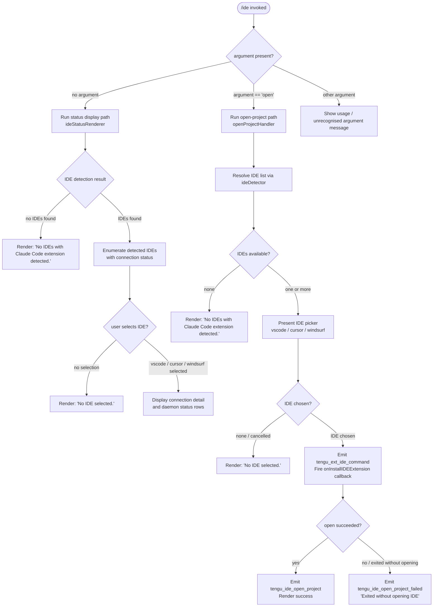

# `/ide`

> Analysis basis: CC v2.1.143 bundle.js (AST extraction + Claude interpretation)
> Minimum version: v2.1.143

---

## Overview

The `/ide` slash command manages IDE integrations for Claude Code by detecting running IDE instances that have the Claude Code extension installed, displaying their connection status, and optionally opening a project directory in a selected IDE. When invoked with the `open` sub-command argument, it attempts to launch or focus an IDE session for the current project; without arguments it renders a status panel listing all detected IDE connections and their daemon states.

---

## Registration

| Field | Value |
|---|---|
| type | `local-jsx` |
| name | `ide` |
| description | Manage IDE integrations and show status |
| argumentHint | `[open]` |
| module_id | `Zfq` |

Analysis basis: CC v2.1.143 bundle.js:+10635236

---

## Input Branching

The command entry-point (`ideCommandHandler`) inspects the first argument token to decide which execution path to follow.



Analysis basis: CC v2.1.143 bundle.js:+10631296 – +10634975

---

## Behavioral Spec

### IDE Detection (`ideDetector`)

The detection sub-system discovers running IDE processes and checks whether the Claude Code extension is active on each.

```
function ideDetector(platform):
    if platform == "linux":
        run shell command:
            "ps aux | grep -E \"code|cursor|windsurf|idea|pycharm|webstorm|
             phpstorm|rubymine|clion|goland|rider|datagrip|dataspell|aqua|
             gateway|fleet|android-studio\" | grep -v grep"
        parse output lines into candidate process list
    else:                          // macOS / Windows use native APIs
        query running application list via platform API

    results = []
    for each candidate in candidateList:
        ideName = normalizeIdeName(candidate)   // toLowerCase, basename
        if ideName in ["vscode", "cursor", "windsurf", "jetbrains", "appcode", ...]:
            connectionState = probeExtensionConnection(ideName)
            results.push({ name: ideName, state: connectionState })

    emit "ide_detect" telemetry on success
    emit "ide_detect_failed" telemetry on error
    return results
```

Analysis basis: CC v2.1.143 bundle.js:+5211929, +5211993, +5215437, +5215463, +5216283

---

### IDE Name Normalisation (`normalizeIdeName`)

```
function normalizeIdeName(rawName):
    lower = rawName.toLowerCase()
    base  = path.basename(lower)          // strip directory components
    // map well-known aliases, e.g. "code" -> "vscode"
    return canonicalName
```

Analysis basis: CC v2.1.143 bundle.js:+5216338, +5216396

---

### Open-Project Handler (`openProjectHandler`)

Handles the `open` sub-command: resolves the project root, selects an IDE, and launches it.

```
function openProjectHandler(args, appState):
    emit tengu_ext_ide_command telemetry

    ideList = ideDetector(currentPlatform)
    if ideList is empty:
        return render("No IDEs with Claude Code extension detected.")

    selectedIde = presentIdePicker(ideList)   // interactive prompt
    if selectedIde is null:
        return render("No IDE selected.")

    // Determine open mode: "worktree" or "project"
    openMode = resolveOpenMode(appState)      // "worktree" | "project"

    success = launchIdeWithProject(selectedIde, projectPath, openMode)
    if not success:
        emit tengu_ide_open_project_failed
        return render("Exited without opening IDE")

    emit tengu_ide_open_project
    appState.callback(_.onInstallIDEExtension, selectedIde)
    return render("IDE opened successfully")
```

Analysis basis: CC v2.1.143 bundle.js:+10631296, +10631418, +10631442, +10631851, +10631885, +10631896, +10631958, +10632248, +10632425

---

### Status Display Renderer (`ideStatusRenderer`)

Renders a table of detected IDEs, their connection type, and daemon health.

```
function ideStatusRenderer(appState):
    ideList = ideDetector(currentPlatform)
    if ideList is empty:
        return render("No IDEs with Claude Code extension detected.")

    rows = []
    for each ide in ideList:
        connectionType = ide.connectionType    // "sse-ide" | "ws-ide"
        daemonStatus   = queryDaemonStatus(ide)
        // possible states: "idle", "active", "working", "bg", "spare",
        //                  "resuming", "crashed", "blocked", "stopped",
        //                  "killed", "failed", "done", "unknown"
        rows.push(formatStatusRow(ide.name, connectionType, daemonStatus))

    return renderTable(rows)
```

Analysis basis: CC v2.1.143 bundle.js:+10629283, +10629303, +14508097, +14508123, +14508222, +14508542, +14508657, +14509348

---

### Daemon Lifecycle Manager (`daemonLifecycleManager`)

Controls the background daemon processes that service IDE connections. Called transitively from the status renderer and open-project handler.

```
function daemonLifecycleManager(action, context):
    switch action:

        case "normalize":
            // Reconcile active daemon map against detected IDE list
            for each entry in activeDaemons.values():
                retireIfSettled(entry)       // cleans up daemons in terminal states
            checkMemoryPressure()            // fE8.freemem()
            if memFree < LOW_MEM_THRESHOLD:
                emit tengu_bg_dispatch_low_mem

        case "spawn":
            socketPath = generateSocketPath(randomBytes(4, "hex"))
            mkdir(socketDir, mode=448)       // octal 0o700
            spawnArgs = [
                "--bg-pty-host", "200", "50", "--",
                "--bg-spare"
            ]
            proc = Bun.spawn(claudeCodeBinary, spawnArgs, { stdio: "ignore" })
            proc.unref()
            emit tengu_bg_spare_spawn
            registerExitHandler(proc)

        case "dispose":
            // Graceful shutdown: SIGTERM, escalate to SIGKILL after timeout
            proc.kill("SIGTERM")
            wait(SIGKILL_ESCALATION_DELAY_MS)
            if still running:
                proc.kill("SIGKILL")
                emit tengu_bg_dispatch_sigkill_escalate

        case "claim":
            // Promote a spare daemon to an active session
            emit tengu_bg_spare_claim on success
            emit tengu_bg_spare_claim_fail on failure

        case "refill":
            // Maintain spare pool
            spawn new spare if pool below threshold
            label = "daemon_bg_spare_refill"
```

- Low-memory threshold: 1024 MB (Analysis basis: CC v2.1.143 bundle.js:+11972274)
- Platform string for macOS branch: `"macos"` (Analysis basis: CC v2.1.143 bundle.js:+11972225)
- Platform string for Windows branch: `"windows"` (Analysis basis: CC v2.1.143 bundle.js:+14502797)
- Socket directory permissions: octal `0o700` (448 decimal) (Analysis basis: CC v2.1.143 bundle.js:+14483797)
- Random socket name length: 4 bytes, hex-encoded (Analysis basis: CC v2.1.143 bundle.js:+14483721, +14483733)
- Background spawn arguments: `--bg-pty-host 200 50 -- --bg-spare` (Analysis basis: CC v2.1.143 bundle.js:+14483921, +14483939, +14483945, +14483950, +14483962)
- SIGKILL escalation idle timeout: 2000 ms (Analysis basis: CC v2.1.143 bundle.js:+14502927)

---

### Connection Probe (`connectionProbe`)

Establishes a socket connection to a running IDE extension endpoint.

```
function connectionProbe(socketPath, options):
    socket = net.connect(socketPath)
    socket.on("data", handleDataFrame)
    socket.once("connect", onConnected)
    socket.once("kill",    onKill)
    socket.write(handshakePayload)

    // Frame reassembly
    buffer = Buffer.concat(incomingChunks)
    delimIdx = buffer.indexOf(FRAME_DELIMITER)
    if delimIdx == -1:
        if buffer.length > MAX_FRAME_SIZE:
            return error("ETOOLARGE")
        return waitForMore
    frame = buffer.subarray(0, delimIdx)
    decode frame as UTF-8

    socket.setTimeout(SOCKET_TIMEOUT_MS)
    on timeout -> return error("EUNKNOWN")

    on ENOENT / enoent     -> connection unavailable (socket file missing)
    on ECONNREFUSED / econnrefused -> daemon not accepting connections
```

- Maximum frame size before `ETOOLARGE`: 20 chunks (Analysis basis: CC v2.1.143 bundle.js:+14489781)
- Frame encoding: `"utf8"` (Analysis basis: CC v2.1.143 bundle.js:+14489903)
- Connection type identifiers: `"sse-ide"`, `"ws-ide"` (Analysis basis: CC v2.1.143 bundle.js:+10629283, +10629303)
- SDK mode identifier: `"sdk"` (Analysis basis: CC v2.1.143 bundle.js:+14376602)
- Connected state label: `"connected"` (Analysis basis: CC v2.1.143 bundle.js:+14376738)
- Connection failure message: `"Connection failed"` (Analysis basis: CC v2.1.143 bundle.js:+14376887)

---

### Session Roster Entry (`sessionRosterEntry`)

Tracks a single IDE session in the daemon roster.

```
function sessionRosterEntry(ide, daemonRef):
    entry = {
        ide:        ide.name,
        daemon:     daemonRef,
        status:     "idle",    // initial state
        rosterKey:  _.rosterEntry(ide)
    }

    // Status transitions driven by daemon lifecycle events:
    // idle -> active -> working -> bg -> resuming
    //      -> crashed | blocked | stopped | killed | failed | done

    on session end:
        Iz.unlink(socketPath)   // clean up socket file
        H.delete(rosterKey)     // remove from roster map
        record wLH log entry
```

Analysis basis: CC v2.1.143 bundle.js:+14509022, +14508866, +14509176, +14507808, +14507826, +14507835, +14507845, +14507983, +14508023

---

### Duplicate-Retry Exhaustion Handler

When a background session creation attempt is retried too many times without success:

```
function handleDupRetryExhausted(context):
    log label = "dup_retry_exhausted"
    emit tengu_bg_session_create telemetry
    escalate error to caller
```

Analysis basis: CC v2.1.143 bundle.js:+14503527, +14503554

---

### Idle-Exit Handler (`idleExitHandler`)

A settled daemon that has been idle for a configurable period exits voluntarily.

```
function idleExitHandler(daemonEntry):
    clearTimeout(existingTimer)
    timer = setTimeout(function():
        if daemonEntry.status == "transient":
            emit tengu_daemon_idle_exit
            daemonEntry.unref()
            exit gracefully
    , IDLE_EXIT_TIMEOUT_MS)
```

- Idle-exit timeout: 1000 ms (Analysis basis: CC v2.1.143 bundle.js:+14522028)
- Transient label: `"transient"` (Analysis basis: CC v2.1.143 bundle.js:+14521792)

---

### Supervisor Writer (`supervisorWriter`)

Writes structured messages to the daemon supervisor channel.

```
function supervisorWriter(channel, message):
    channel.write({ role: "supervisor", content: message })
    // triggers "mtime changed" watch event on the supervisor socket
```

- Role label: `"supervisor"` (Analysis basis: CC v2.1.143 bundle.js:+14521406)
- Watch trigger string: `"mtime changed"` (Analysis basis: CC v2.1.143 bundle.js:+14521525)

---

### Feature-Flag Gate (`featureFlagGate`)

Wraps capability checks before the IDE command performs privileged operations.

```
function featureFlagGate(featureName, context):
    store = storeAccessor.getStore()
    result = evaluateFeatureFlag(store, featureName)
    if result == true:
        emit tengu_feature_ok
        return allowed
    elif result == false (bad):
        emit tengu_feature_bad
        return denied
    else:
        emit tengu_feature_sad
        return denied
```

Analysis basis: CC v2.1.143 bundle.js:+965046, +965067, +955068, +955126, +955201

---

### Argument Parser (`ideArgumentParser`)

Parses the raw argument string passed to `/ide`.

```
function ideArgumentParser(rawArgs):
    // Take at most 100 characters of input
    trimmed = rawArgs.slice(0, 100)

    // Split on whitespace; keep first 3 tokens
    tokens = trimmed.split(whitespace).slice(0, 3)

    // Normalise each token to NFC Unicode form
    normalized = tokens.map(t => t.normalize("NFC"))

    firstToken = normalized[0] ?? ""

    if firstToken.startsWith("open"):
        return { subCommand: "open", rest: normalized.slice(1) }
    else:
        return { subCommand: null, rest: normalized }
```

- Input character limit: 100 characters (Analysis basis: CC v2.1.143 bundle.js:+10634700)
- Maximum token count: 3 (Analysis basis: CC v2.1.143 bundle.js:+10634773)
- Unicode normalisation form: `"NFC"` (Analysis basis: CC v2.1.143 bundle.js:+10634841)
- Sub-command keyword: `"open"` (Analysis basis: CC v2.1.143 bundle.js:+10631404)
- List truncation separator: `", "` with overflow suffix `", …"` (Analysis basis: CC v2.1.143 bundle.js:+10634998, +10635012)

---

### Lock-File Manager (`lockFileManager`)

Prevents concurrent IDE open operations for the same project.

```
function lockFileManager(projectPath):
    lockFilePath = path.resolve(projectPath) + ".lock"

    acquire():
        try mkdir(lockDir)
        write lockFile
        register cleanup on process exit

    release():
        unlink(lockFilePath) via n8K.unlinkSync
        or Iz.unlink (async)
```

Analysis basis: CC v2.1.143 bundle.js:+5207250, +14482768, +14507898

---

### WSL Detection (`wslDetector`)

```
function wslDetector():
    if platform string contains "wsl":
        return true
    return false
```

Analysis basis: CC v2.1.143 bundle.js:+5210690

---

## State & Side Effects

| Item | Detail |
|---|---|
| Telemetry — `tengu_ext_ide_command` | Fired at the start of every `/ide open` invocation (bundle.js:+10631298) |
| Telemetry — `tengu_ide_open_project` | Fired when an IDE successfully opens the project (bundle.js:+10631851) |
| Telemetry — `tengu_ide_open_project_failed` | Fired when the IDE process exits without opening the project (bundle.js:+10631958) |
| Telemetry — `tengu_bg_spare_spawn` | Fired when a new spare background daemon is spawned (bundle.js:+14502994) |
| Telemetry — `tengu_bg_spare_claim` | Fired when a spare daemon is successfully claimed for a session (bundle.js:+14504532) |
| Telemetry — `tengu_bg_spare_claim_fail` | Fired when spare daemon claim fails (bundle.js:+14504795) |
| Telemetry — `tengu_bg_spare_enable` | Fired when the spare-daemon pool feature is enabled (bundle.js:+14502634) |
| Telemetry — `tengu_bg_dispatch_sigkill_escalate` | Fired when SIGTERM does not stop a daemon and SIGKILL is sent (bundle.js:+14503217) |
| Telemetry — `tengu_bg_dispatch_low_mem` | Fired when available system memory falls below threshold during dispatch (bundle.js:+14503796) |
| Telemetry — `tengu_bg_low_mem_mb` | Fired with memory figure on macOS low-memory detection (bundle.js:+11972252) |
| Telemetry — `tengu_bg_session_create` | Fired on background session creation (includes dup-retry-exhausted path) (bundle.js:+14503527) |
| Telemetry — `tengu_bg_sendclaim_failed` | Fired when sending a claim message to a spare daemon fails (bundle.js:+14485198) |
| Telemetry — `tengu_daemon_idle_exit` | Fired when a transient daemon exits after the idle timeout (bundle.js:+14522118) |
| Telemetry — `tengu_feature_ok` / `tengu_feature_bad` / `tengu_feature_sad` | Fired by the feature-flag gate (bundle.js:+955068, +955126, +955201) |
| Telemetry — `ide_detect` | String event emitted on successful IDE detection (bundle.js:+5211929) |
| Telemetry — `ide_detect_failed` | String event emitted on IDE detection failure (bundle.js:+5211993) |
| Hook registration — `onInstallIDEExtension` | Called on `appState` when an IDE is successfully opened; passes selected IDE name (bundle.js:+10632425) |
| Hook registration — `H.onExit` | Process-exit hook registered when a background daemon is spawned to ensure socket cleanup (bundle.js:+14484663) |
| appState changes | Daemon roster map (`A`) is updated: entries added on spawn (`A.set`), removed on session end (`H.delete`) (bundle.js:+14504494, +14509176) |
| File-system side effects | Socket directory created under temp path (mode `0o700`); socket file unlinked on session end; `.lock` file created and removed around open operations (bundle.js:+14483764, +14483823, +14507898, +14508866) |
| Process spawning | `Bun.spawn` used to launch background daemon with `--bg-pty-host` and `--bg-spare` flags; spawned process is `unref`-ed so it survives parent exit (bundle.js:+14483903, +14484062) |
| Sound | <!-- TODO: not found in depth-2 traversal; needs --depth 4 --> |

---

## Version History

| Version | Change |
|---|---|
| v2.1.143 | Initial analysis. Supports `open` sub-command; detects VS Code, Cursor, Windsurf, and JetBrains-family IDEs; manages spare background daemon pool; WSL environment detection present. |

---

## Common Mistakes

1. **Invoking `/ide open` with no extension installed** — The command will immediately print `"No IDEs with Claude Code extension detected."` and exit. Install the Claude Code extension in the target IDE before running `/ide open`.
2. **Cancelling the IDE picker** — If the interactive picker is dismissed without a selection the command prints `"No IDE selected."` and does nothing. This is not an error; re-run the command and confirm a selection.
3. **Passing more than 100 characters as the argument** — The argument parser silently truncates input at 100 characters before tokenising; arguments beyond that limit are dropped without warning (bundle.js:+10634700).
4. **Expecting more than 3 argument tokens to be honoured** — Only the first 3 whitespace-separated tokens are retained after parsing; any additional tokens are discarded (bundle.js:+10634773).
5. **Assuming the daemon survives low-memory conditions** — When free memory drops below 1024 MB the lifecycle manager emits `tengu_bg_dispatch_low_mem` and may decline to spawn new spare daemons, leading to slower session startup.
6. **Running `/ide` in a non-IDE terminal and expecting connection status** — The status path requires at least one IDE process with the Claude Code extension to be running; otherwise only the "no IDEs detected" message is shown.
7. **Confusing `sse-ide` and `ws-ide` connection types** — These identify two distinct transport protocols used by the extension. Only the type negotiated by the running extension instance will appear in the status table; switching transport requires restarting the IDE extension.

---

## Appendix — Identifier Mapping

> For bundle debugging only. Identifiers change across versions.

| Identifier | Role |
|---|---|
| `ix_` | IDE argument parser / command entry-point dispatcher |
| `S6` | Feature-flag store accessor |
| `Uh6` | Feature-flag store reader (calls `ph6.getStore` and `Fd`) |
| `__` | Feature-flag evaluator (calls `GV`) |
| `H` | Random-delay / retry helper (uses `Math.random`, `setTimeout`) |
| `A` | IDE name normaliser / active-daemon map (calls `f.toLowerCase`, `A.normalize`, `A.get`, `A.set`, `A.values`) |
| `f` | IDE connection object (calls `A.close`, `q.close`, `f.on`, `f.once`, `f.write`, `f.end`, `f.unref`, `f.emit`) |
| `q` | Lock-file / active-set manager (calls `n8K.unlinkSync`, `q.add`, `q.delete`, `q.map`, `q.includes`) |
| `D` | Daemon lifecycle manager / normalise orchestrator |
| `G6` | Spare-pool enable gate (reads `sMH.has`, `PF.has`, `PF.get`, calls `x76.add`, `N6`) |
| `$` | Disposable daemon wrapper (calls `JZq`, `$.dispose`) |
| `IG6` | macOS low-memory checker (emits `tengu_bg_low_mem_mb`) |
| `$o_` | Background daemon spawner (calls `Bun.spawn`, `l8K.randomBytes`, `XU.mkdir`, `XU.unlink`) |
| `d` | Internal logger / diagnostic emitter |
| `NH` | Error-log dispatcher (calls `v_`, `xH`, `zq`, `kNK`, `Wc.logError`) |
| `w` | Session manager / dispatch loop (drives `mH`, `SH`, `IG6`, `G6`, `NH`, `jo_`, `Oo_`) |
| `C` | Supervisor channel writer (writes with role label `"supervisor"`) |
| `mH` | Utility: reads `d` diagnostic store (loc +955124) |
| `SH` | Utility: reads `d` diagnostic store (loc +955066) |
| `x` | Idle-exit / retire-if-settled handler (uses `clearTimeout`, `setTimeout`, `z.write`) |
| `Oo_` | Connection probe / claim sender (calls `qE8.connect`, `fU.claim`) |
| `jo_` | Session roster-entry manager (manages lifecycle states, calls `Iz.rm`, `Iz.unlink`, `NH`, `_.rosterEntry`) |
| `L` | Session lifecycle helper (shared subset of `jo_` logic: `q.add`, `q.delete`, `f.finally`) |
| `L8` | Spare-pool refill trigger |
| `h` | Disposable timer handle used inside idle-exit handler |
| `EP7` | Open-project handler / IDE status renderer (JSX component) |
| `rf` | Project-root resolver helper |
| `rgH` | IDE detection orchestrator (parses process list, emits detect telemetry) |
| `T_8` | JetBrains-specific detection helper (uses `.lock` files, `Promise.all`) |
| `WM4` | Detection sub-helper calling `dtA` |
| `xH` | String coercion utility (wraps `String()`) |
| `bA1` | Process-name regex matcher (calls `H.match`) |
| `K` | IDE display formatter (calls `L.map`, `f.padEnd`) |
| `W` | Event-debounce / skills-event emitter (uses `clearTimeout`, `setTimeout`, `z.add`, `z.clear`) |
| `P` | Frame-reassembly / socket reader (uses `Buffer.concat`, `j.indexOf`, `j.subarray`) |
| `X` | SDK connection handler (manages `"connected"` / `"Connection failed"` states) |
| `iA1` | Process-kill helper (calls `process.kill`) |
| `M` | Multi-connection status aggregator (calls `L.get`, `L.values`, `B95`) |
| `Vj` | IDE-name canonicaliser (calls `H.toLowerCase`, `uI.basename`, `EEH`) |
| `_` | App-state / roster reference object |
| `J8` | Diagnostic feature state reader (calls `d`) |
| `Y8` | Worktree/project open-mode resolver (calls `$_`, `S6`) |
| `$_` | Open-mode detail resolver (calls `KXH`, `D`, `_SK`, `NH`) |
| `pY_` | IDE install-extension prompt renderer (calls `kM4`) |
| `kM4` | Extension availability checker (scans `Object.entries`, platform includes checks) |
| `pn` | UI prompt / picker component for IDE selection |
| `jP7` | Post-open follow-up action handler |