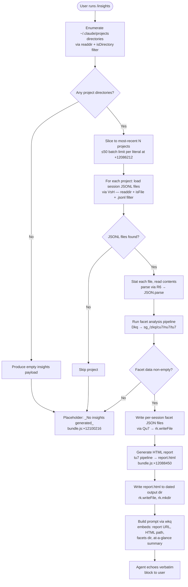

# `/insights`

> Analysis basis: CC v2.1.143 bundle.js (AST extraction + Claude interpretation)
> Minimum version: v2.1.143

---

## Overview

`/insights` generates a self-contained HTML usage report that aggregates and analyses all recorded Claude Code session data (JSONL facet files) for the current user, writes the report to disk, and then instructs the agent to surface a shareable link to that report as its sole response. The command is implemented as an inline `getPromptForCommand` method that first invokes a heavyweight data-aggregation pipeline, then constructs a prompt embedding the results and a pre-formed response message for the agent to echo verbatim.

---

## Registration

| Field | Value |
|---|---|
| type | `prompt` |
| name | `insights` |
| description | `Generate a report analyzing your Claude Code sessions` |
| loc_byte | `12099145` |
| loc_byte_end | `12100449` |
| loc_line | `8875` |
| handler_method | `getPromptForCommand` |
| handler_method_start | `12099319` |
| handler_method_end | `12100448` |
| prompt_body.length | `513` characters |
| prompt_body.trace | `call→wkq(...) (1 literals)` |
| arbor_handler.name | `getPromptForCommand` |
| arbor_handler.fqn | `claude-2.1.143::getPromptForCommand` |
| arbor_handler.kind | `Method` |
| arbor_handler.resolution_path | `direct` |
| arbor_handler.n_hits | `1` |

Analysis basis: CC v2.1.143 bundle.js:+12099145

---

## Input Branching

The handler's control flow has more than three distinct branches: project-directory enumeration may produce zero or more projects, session loading may find zero or more sessions, facet data may be absent or present for each session, and the final prompt path branches on whether any insights were generated at all. A Mermaid flowchart is therefore used.



Analysis basis: CC v2.1.143 bundle.js:+12099325, +12085801, +12086212, +12088450, +12100216, +12100351

---

## Behavioral Spec

### 1. Handler Entry — `getPromptForCommand`

The handler is an inline `ObjectMethod` on the registration object. Arbor resolved it directly (resolution_path: `direct`, n_hits: 1). It is the sole entry point for `/insights`.

```
async function getPromptForCommand(context):
    // Step 1 — collect session data
    aggregatedData = await collectInsightsData(context)

    // Step 2 — build the prompt string
    promptText = await buildPromptString(aggregatedData)   // calls wkq

    // Step 3 — return prompt to the agent runtime
    return { prompt: promptText }
```

Analysis basis: CC v2.1.143 bundle.js:+12099319

---

### 2. Project & Session Discovery — `sessionDirectoryLister` (`Hm7`)

Enumerates the `~/.claude/projects` directory tree to locate all recorded sessions.

```
async function sessionDirectoryLister(baseDir):
    entries = await fs.readdir(baseDir)                          // rk.readdir +12085820
    projectDirs = entries.filter(e => e.isDirectory())          // _.filter +12085874, K.isDirectory +12085888

    allSessions = []
    for each projectDir in projectDirs:
        sessionFiles = await jsonlFileScanner(projectDir)        // VsH +12085978
        allSessions.push(...sessionFiles)                        // q.push +12086005

    // Yield control between batches of 10 (literal at +12086070)
    // with a cap of 9 parallel tasks (literal at +12086075)
    if allSessions.length > 0:
        await setImmediate()                                     // +12086100

    allSessions.sort(byTimestamp)                                // q.sort +12086124
    return allSessions
```

Analysis basis: CC v2.1.143 bundle.js:+12085801, +12085820, +12086005, +12086070, +12086075, +12086100, +12086124

---

### 3. JSONL Session File Scanner — `jsonlFileScanner` (`VsH`)

Scans a single project directory for `.jsonl` session files and retrieves their metadata.

```
async function jsonlFileScanner(projectDir):
    entries = await fs.readdir(projectDir)                       // xL.readdir +12166028
    files   = entries.filter(e => e.isFile())                   // K.isFile +12166105
    jsonlFiles = files.filter(f => mimeTypeFilter(f.name))      // nn +12166159 — regex test Oz4.test
    // Extension literal: ".jsonl" +12166134

    fileInfoList = []
    for each file in jsonlFiles:
        baseName = path.basename(file)                           // Kw.basename +12166162
        fullPath = path.join(projectDir, baseName)              // Kw.join +12166236
        stat     = await fs.stat(fullPath)                      // xL.stat +12166337
        metadata = mimeTypeResolver(stat)                        // v +12166436
        fileInfoList.push({ path: fullPath, ...metadata })      // q.push +12166207

    results = await Promise.all(fileInfoList.map(loadAndParse)) // Promise.all +12166269
    return results
```

Analysis basis: CC v2.1.143 bundle.js:+12166028, +12166134, +12166159, +12166236, +12166269

---

### 4. Facet Data Loader — `facetDataLoader` (`gu7`)

Reads per-session usage data from the `usage-data` subdirectory of the facets store.

```
async function facetDataLoader(sessionPath):
    facetsDir  = pathBuilder(sessionPath)           // og_ → uG6, literals "usage-data" +12025588, "session-meta" +12025684
    reportPath = path.join(facetsDir, ...)          // KU.join +12031652

    rawBytes   = await fs.readFile(reportPath, "utf-8")  // rk.readFile +12031695, "utf-8" +12031719
    parsed     = safeJsonParse(rawBytes)                  // R6 → JSON.parse +12031736
    return parsed
```

Analysis basis: CC v2.1.143 bundle.js:+12031652, +12031695, +12031719, +12031736

---

### 5. Core Aggregation Pipeline — `insightsAggregator` (`Dkq`)

Orchestrates all data loading, statistical computation, and HTML generation. This is the heaviest function in the call graph.

```
async function insightsAggregator(context):
    // 1. Discover sessions
    sessionList = await sessionDirectoryLister(baseDir)         // Hm7 +12086193

    // 2. Batch-load sessions (up to 200 at once, literal +12086217;
    //    slice the 50 most recent, literal +12086212)
    batches = sessionList.slice(0, 50)                          // A.slice +12086266
    sessionData = await Promise.all(batches.map(loadSession))   // Promise.all +12086289

    // 3. Load facet files for each session
    facets = await facetDataLoader(...)                         // gu7 +12086346

    // 4. Compute statistical facets
    rawStats     = computeRawFacets(sessionData)                // sg_/zkq +12086900
    toolStats    = computeToolStats(sessionData)                // cu7 +12088113
    timelineData = buildTimeline(sessionData)                   // nu7 +12088161
    htmlSections = renderHTMLSections(timelineData, rawStats)   // tu7 +12088172

    // 5. Persist per-session facet JSON
    for each session in sessionData:
        await writeFacetFile(session)                           // Qu7 +12087034, Fu7 +12087871

    // 6. Construct timestamped output directory
    now = new Date()
    dirName = formatDateComponents(now)                         // C.getFullYear +12088282, C.getMonth +12088303,
                                                               // C.getDate +12088324, C.getHours +12088342,
                                                               // C.getMinutes +12088360, C.getSeconds +12088380
    outputDir = path.join(baseOutputDir, dirName)              // KU.join +12088400
    await fs.mkdir(outputDir, { recursive: true })             // rk.mkdir +12088191

    // 7. Write HTML report
    await fs.writeFile(path.join(outputDir, "report.html"),    // "report.html" +12088450
                       htmlSections, "utf-8")                  // rk.writeFile +12088478

    return { outputDir, htmlSections, facets }
```

Analysis basis: CC v2.1.143 bundle.js:+12086193, +12086212, +12086217, +12086266, +12086289, +12086346, +12086900, +12087034, +12087871, +12088113, +12088161, +12088172, +12088191, +12088282, +12088400, +12088450, +12088478

---

### 6. Statistical Facet Computation — `rawFacetComputer` (`sg_`) and `sessionEventParser` (`zkq`)

Processes raw JSONL event records into typed facets. Key categorisations found in literals:

| Category | Literal | loc_byte |
|---|---|---|
| Tool names tracked | `"WebSearch"`, `"WebFetch"`, `"Edit"`, `"Write"` | +12026281–+12026424 |
| Commit events | `"git commit"`, `"git push"` | +12026668–+12026700 |
| Error labels | `"Command Failed"`, `"Edit Failed"`, `"File Changed"`, `"File Too Large"`, `"File Not Found"`, `"User Rejected"` | +12027299–+12027695 |
| Session hour grouping | Hour threshold: 3600 seconds | +12027085 |
| Max tokens per session | 4096 | +12033094 |
| Facet retention window | 1800000 ms (30 min) | +12033618 |

```
function rawFacetComputer(events):
    facetMap = {}
    for each event in events:
        parsed = sessionEventParser(event)       // zkq +12028358
        if parsed.type in ["WebSearch","WebFetch","Edit","Write"]:
            facetMap[parsed.type].count++
        if parsed.content includes "git commit" or "git push":
            facetMap.commits++
        classify error signals by keyword match
        bucket session by hour-of-day
    return facetMap

function sessionEventParser(rawEvent):
    // Validates array structure, checks startsWith for known prefixes
    // Calls extension resolver cuT7 for file-type hints
    // Detects diff operations via LOH → gn9.diff
    // Returns typed event object
```

Analysis basis: CC v2.1.143 bundle.js:+12026122, +12026247, +12026281, +12026668, +12027085, +12027299, +12027695, +12028358, +12028412

---

### 7. HTML Report Renderer — `htmlReportBuilder` (`tu7`)

Produces the full self-contained HTML string written to `report.html`.

Key rendering sub-functions and literals:

| Sub-function | Role | loc_byte |
|---|---|---|
| `sectionRenderer` (`eLH`) | Renders individual stat sections with bar charts | +12080006 |
| `chartColorMapper` (`ou7`) | Maps chart series to hex color literals | +12080698 |
| `axisLabelBuilder` (`au7`) | Builds axis label arrays | +12083531 |
| `htmlEscaper` (`g7` → `c5`) | Escapes HTML entities (`&amp;`, `&lt;`, `&gt;`, `&quot;`, `&apos;`) | +12044027 |
| `lineFormatter` (`L28`) | Applies `<strong>$1</strong>` bold and `• ` bullet transforms | +12044405 |

Chart color palette found in literals:

| Color hex | loc_byte |
|---|---|
| `#2563eb` | +12080028 |
| `#0891b2` | +12080166 |
| `#10b981` | +12080338 |
| `#8b5cf6` | +12080481 |
| `#dc2626` | +12083744 |
| `#16a34a` | +12083993 |
| `#eab308` | +12084486 |

Time-of-day buckets embedded in the HTML report:

| Label | Hours included | loc_byte |
|---|---|---|
| `"Morning (6-12)"` | 7, 11 | +12043211 |
| `"Afternoon (12-18)"` | 12, 13, 14, 16, 17 | +12043258 |
| `"Evening (18-24)"` | 18, 19, 21, 22, 23 | +12043312 |
| `"Night (0-6)"` | 0–4 | +12043364 |

Response-time buckets:

`"2-10s"`, `"10-30s"`, `"30s-1m"`, `"1-2m"`, `"2-5m"`, `"5-15m"`, `">15m"` (loc_byte +12042363–+12042423); thresholds include 120 s (+12042583) and 900 s (+12042665).

Maximum HTML content size: 8192 characters per section (literal +12041532).

```
async function htmlReportBuilder(facetMap, sessionList):
    sections = []
    for each facetKey in facetMap:
        html = sectionRenderer(facetKey, facetMap[facetKey])    // eLH
        if html is empty: html = "<p class=\"empty\">No data</p>"  // +12041854
        sections.push(html)

    // Time-of-day chart
    todHtml = buildTimeOfDayChart(sessionList)                   // hour buckets +12043211
    sections.push(todHtml)

    // Response time chart
    rtHtml  = buildResponseTimeChart(sessionList)                // buckets +12042363
    sections.push(rtHtml)

    // Error breakdown
    errHtml = buildErrorChart(facetMap.errors)                   // +12083744
    sections.push(errHtml)

    fullHtml = assembleHTMLDocument(sections)
    return fullHtml
```

Analysis basis: CC v2.1.143 bundle.js:+12044027, +12044069, +12044112, +12044142, +12041532, +12041854, +12042363, +12043161, +12080006, +12080028, +12083531

---

### 8. Facet File Writers — `facetFileWriter` (`Qu7`) and `sessionFacetWriter` (`Fu7`)

```
async function facetFileWriter(sessionId, facetData, outputDir):
    await fs.mkdir(outputDir, { recursive: true })              // rk.mkdir +12031793
    facetsPath = path.join(outputDir, "facets", sessionId)      // KU.join +12031830, "facets" +12025638
    await fs.writeFile(facetsPath,
                       JSON.stringify(facetData),               // hH → JSON.stringify +12031874
                       "utf-8")                                  // +12031889
    if writeError:
        logError(error)                                         // NH +12031940

async function sessionFacetWriter(session, data):
    // Mirrors facetFileWriter with an additional path-builder step
    dir = sessionPathBuilder(session)                           // f28 → uG6 +12031488
    await fs.mkdir(dir, { recursive: true })                    // rk.mkdir +12031479
    filePath = path.join(dir, ...)                              // KU.join +12031523
    await fs.writeFile(filePath, JSON.stringify(data))          // rk.writeFile +12031567
```

Analysis basis: CC v2.1.143 bundle.js:+12031479, +12031523, +12031567, +12031793, +12031830, +12031874

---

### 9. Prompt Construction — `promptStringBuilder` (`wkq`)

Called by `getPromptForCommand` at +12100351. Constructs the 513-character prompt sent to the agent.

The prompt body (as described in the pre-extracted prompt body section) instructs the agent to:

1. Acknowledge that the user ran `/insights`.
2. Receive a block labelled "full insights data" (the aggregated facets).
3. Receive three file-system paths: report URL, HTML file path, facets directory.
4. Receive an "at-a-glance summary" prefaced as for the model's context only — the user has not seen any output yet.
5. **Output the text between `<message>` tags verbatim** as its entire response, which confirms the report is ready and invites the user to explore sections or act on suggestions.

If no facets were generated the literal `"_No insights generated_"` (+12100216) is substituted into the prompt payload.

```
function promptStringBuilder(aggregatedPayload):
    if aggregatedPayload is empty:
        insightsBlock = "_No insights generated_"               // +12100216
    else:
        insightsBlock = formatInsightsBlock(aggregatedPayload)

    separator = " · "                                           // +12099777

    prompt = interpolate(PROMPT_TEMPLATE,
                 insightsBlock,
                 aggregatedPayload.reportUrl,
                 aggregatedPayload.htmlPath,
                 aggregatedPayload.facetsDir,
                 aggregatedPayload.atAGlance)                   // "at_a_glance" key +12039390

    return prompt
```

The agent is constrained to reply solely with the verbatim `<message>` block content. No analytical commentary or additional lines are expected.

Analysis basis: CC v2.1.143 bundle.js:+12100351, +12100369, +12100216, +12099777, +12039390

---

### 10. Parallel Session Loader with Batch Limits — `batchedSessionLoader` (`Uu7`)

Enforces concurrency caps during bulk session loading.

```
async function batchedSessionLoader(sessionPaths):
    // Batch sizes: 30000 and 25000 character soft limits
    // per literal at +12030908 and +12030929
    BATCH_SIZE    = 30000   // +12030908
    SOFT_LIMIT    = 25000   // +12030929
    MAX_RECORDS   = 500     // per session slice +12030131
    CHUNK_RECORDS = 8       // parallel chunks +12029869
    MAX_JOIN_LEN  = 300     // string join cap +12030423

    queue = []
    for each path in sessionPaths.slice(0, N):
        chunk = await rawFacetComputer(path)                    // sg_ +12031029
        queue.push(chunk)

    results = await Promise.all(queue.map(processChunk))        // Promise.all +12031003
    joined  = results.join(separator)                           // K.join +12031234
    return joined
```

Analysis basis: CC v2.1.143 bundle.js:+12029869, +12030131, +12030423, +12030908, +12030929, +12031003, +12031234

---

## State & Side Effects

| Item | Detail |
|---|---|
| **Files written** | `report.html` written to a timestamped directory under the Claude data root (literal `"report.html"` +12088450; `rk.writeFile` +12088478) |
| **Directories created** | Output directory (date-stamped) created with `rk.mkdir` (+12088191); facets subdirectory created per session (+12031793, +12031479) |
| **Files read** | JSONL session files from `~/.claude/projects/**/*.jsonl` (+12166134); per-session facet JSON from `usage-data` store (+12031695) |
| **Telemetry** | None directly attributed to `__handler_insights` in the depth-2 traversal; telemetry events listed below are emitted by called subsystems |
| **Telemetry (subsystems)** | `tengu_transcript_phantom_parent`, `tengu_transcript_parent_cycle`, `tengu_chain_parent_cycle`, `tengu_chain_timestamp_fallback`, `tengu_chain_parallel_tr_recovered`, `tengu_relink_walk_broken`, `tengu_daemon_yield`, `tengu_daemon_control`, `tengu_daemon_config_reload`, `tengu_bg_spare_enable`, `tengu_bg_spare_spawn`, `tengu_bg_dispatch_sigkill_escalate`, `tengu_bg_dispatch_low_mem`, `tengu_bg_spare_claim`, `tengu_bg_spare_claim_fail`, `tengu_daemon_idle_exit`, `tengu_voice_circuit_breaker_tripped`, `tengu_voice_recording_started`, `tengu_voice_stream_early_retry` |
| **appState changes** | None directly; session metadata Maps (`Q.set`/`Y.set`/`$.set`) updated during facet caching (+12086947, +12087102, +12086969) |
| **Sound** | None detected in traversal |
| **Hook registration** | None detected in traversal |
| **Agent response** | Agent is constrained to output the verbatim `<message>` block only; no tool calls are expected |

---

## Version History

| Version | Change |
|---|---|
| v2.1.143 | Initial analysis — `getPromptForCommand` inline handler, HTML report pipeline, facet file writers, batch session loader |

---

## Common Mistakes

1. **Running `/insights` in a workspace with no prior sessions**: if no `.jsonl` files are found under `~/.claude/projects`, the prompt will contain `"_No insights generated_"` (+12100216) and the agent will echo a correspondingly empty report link. There is no error message; the command silently produces no output beyond the canned `<message>` block.

2. **Expecting interactive analysis in the reply**: the agent is instructed to echo the `<message>` block verbatim as its **entire** response. Any follow-up analytical questions must be asked as a separate turn after the command completes.

3. **Assuming the report is ephemeral**: `report.html` is written to a new timestamped directory on every invocation. Repeated calls accumulate report directories; no rotation or cleanup is performed by this command.

4. **Large session histories causing slow execution**: the aggregator batches up to 50 sessions (literal +12086212) with a 200-session ceiling (literal +12086217) and per-session record limits of 500 records (+12030131) and 30 000-character soft batches (+12030908). Very large histories are truncated silently.

5. **Modifying or deleting facet files between invocations**: the loader calls `rk.readFile` expecting well-formed JSON; malformed or absent facet files will trigger `safeJsonParse` (`R6`) errors that are caught and skipped, potentially resulting in incomplete reports with no warning to the user.

---

## Appendix — Identifier Mapping

> For bundle debugging only. Identifiers change across versions.

| Identifier | Role |
|---|---|
| `__handler_insights` | Synthetic BFS entry point for the `/insights` command handler |
| `Dkq` | Core insights aggregation orchestrator (`insightsAggregator`) |
| `Hm7` | Session directory lister — enumerates project directories |
| `VF` | Path base-directory resolver (joins `"projects"` literal) |
| `VsH` | JSONL session file scanner per project directory |
| `nn` | MIME/extension filter — regex test for `.jsonl` files |
| `v` | File metadata resolver (stat result mapper) |
| `gu7` | Facet data loader — reads `usage-data` JSON from disk |
| `og_` | Facet path builder (session-meta level) |
| `uG6` | Facet root path builder (joins `"usage-data"`, `"facets"`) |
| `R6` | Safe JSON parser wrapper (`JSON.parse`) |
| `M` | MCP server state map manager (reached via deep call graph) |
| `SvH` | MCP server lifecycle orchestrator |
| `KHH` | MCP config constructor |
| `rI` | MCP transport resolver |
| `H_` | Generic async helper |
| `f26` | <!-- TODO: not found in depth-2 traversal; needs --depth 4 --> |
| `_57` | Timestamp / staleness checker (`Date.now` based) |
| `v78` | Object-key enumerating stat helper |
| `I78` | Internal data-key resolver (`dK`) |
| `A8` | MCP debug log pusher |
| `Yh_` | OAuth flow initiator for MCP servers |
| `Dh_` | OAuth callback handler |
| `x8q` | Async then-chain helper with timestamp |
| `Oh_` | MCP tool-call dispatcher |
| `NG_` | Allowlist include checker |
| `_7` | MCP error log pusher |
| `XH` | String coercion utility |
| `S8q` | Internal state query helper (`Yn`) |
| `M26` | Integer parser wrapper (`parseInt`) |
| `xh_` | Secondary integer parser wrapper (`parseInt`) |
| `THK` | MCP update applicator |
| `eY8` | Helper that calls `hH` (JSON stringify) |
| `wv` | MCP client cleanup coordinator |
| `$` | Session promise manager (`JZq`) |
| `JZq` | Async session tracker with `Date.now` |
| `B95` | MCP server batch reconnect manager |
| `k78` | Tool allowlist membership checker (`mm4`, `pm4`) |
| `r8` | Timeout-backed abort controller |
| `drH` | Helper that calls `hH` for error serialisation |
| `g` | Context object holding `F` and `$` sub-references |
| `M28` | Session metadata map accessor/updater (many `.get`/`.set` calls) |
| `XHH` | Full session-state initialiser and registry (large Map initialisation) |
| `Pm7` | Session state entry constructor |
| `p` | Session timeout/stream Map |
| `Ap` | Session state applicator |
| `V6A` | Recursive structure popper/pusher |
| `UP` | Session update propagator |
| `Qm7` | Binary JSONL parser (buffer-level, reads attribution snapshots) |
| `dm7` | Disk-based JSONL fast reader (openSync/readSync/closeSync) |
| `ckq` | Session chain re-linker and walk orchestrator |
| `gm7` | Buffer-level JSONL parser (compact boundary detection) |
| `YXH` | Platform-specific path/symbol kit (`pSK`, `USK`, `FSK`, `BSK`) |
| `C9` | Initialisation helper (`L8`) |
| `NH` | Structured error logger (pushes to `xRH`, calls `Wc.logError`) |
| `s` | Session watcher set (`w`, `zH`) |
| `o` | Voice recording session manager |
| `AH` | Audio session timeout handler |
| `Myq` | Session chain map get/set helper |
| `sqH` | Session chain builder — loads and orders parent chain |
| `hm7` | NaN-guarded chain validator |
| `Rm7` | Chain deduplicator and sorter |
| `ym7` | Chain queue processor (shift/push/sort) |
| `plH` | Session list mapper |
| `wQ_` | Prompt text cleaner and slicer |
| `P06` | Prompt content classifier (`isCompactSummary`, `command-args`, `bash-input`) |
| `jQ_` | Content type classifier (`Cm7`, `bm7`) |
| `Cm7` | Array-based content trimmer/sorter |
| `bm7` | Array-based content type tester |
| `X28` | Session map entry initialiser |
| `W28` | Session value array builder (`Array.from`) |
| `bu7` | NaN guard for session numeric fields |
| `sg_` | Raw facet computer — processes events into typed facets |
| `zkq` | Session event parser — classifies raw JSONL events |
| `xG6` | Extension classifier helper |
| `Cu7` | File extension extractor (`KU.extname`) |
| `LOH` | Diff detector (`gn9.diff`) |
| `H7` | String index searcher |
| `R` | String lower-caser and processor |
| `iM` | Intermediate math helper |
| `ag_` | <!-- TODO: not found in depth-2 traversal; needs --depth 4 --> |
| `Qu7` | Facet file writer — writes per-session facet JSON |
| `hH` | JSON stringify wrapper |
| `Bu7` | Session backup facet reader with cleanup (`rk.unlink`) |
| `f28` | Session-level path builder |
| `Jkq` | <!-- TODO: not found in depth-2 traversal; needs --depth 4 --> |
| `du7` | Report generation coordinator — calls `ZDH`, `Okq`, `DK`, `$kq` |
| `Uu7` | Batched session loader with concurrency controls |
| `uu7` | Inner session record processor for `Uu7` |
| `ZDH` | Transcript-to-report mapper (`HK`, `VY8`, `w8`) |
| `HK` | Transcript hydration helper |
| `VY8` | Per-session report builder (hash, UUID, file write) |
| `w8` | UUID generator wrapper (`gZ.randomUUID`) |
| `BNH` | Session assistant-message extractor |
| `y0` | Post-processing cleanup step |
| `Okq` | Report metadata resolver (`rV`) |
| `rV` | Binary metadata parser (`BM`, `zM`) |
| `DK` | Filtered history builder |
| `v_` | Error string coercer |
| `Fu7` | Session facet file writer (mirrors `Qu7` with different path) |
| `_m7` | Object-key enumerator for facet map |
| `cu7` | Statistical aggregator — median, percentile, tool usage counts |
| `ZsH` | Object entries iterator for nested facets |
| `m1` | String index/slice helper |
| `Ykq` | Percentile / histogram bucket builder |
| `nu7` | Full timeline aggregator — calls `$kq`, emits per-session report |
| `$kq` | Per-session report runner (`ZDH`, `HK`, `yu7`, `DK`) |
| `yu7` | Session path resolver (`rV`) |
| `tu7` | HTML report builder — renders all sections to HTML string |
| `g7` | HTML template renderer with escaping (`c5`) |
| `c5` | HTML entity escaper |
| `L28` | Line formatter — applies bold and bullet transforms |
| `su7` | HTML string serialiser (`hH`) |
| `eLH` | Section renderer with bar-chart HTML |
| `ou7` | Chart colour/value mapper |
| `au7` | Chart axis label builder |
| `wkq` | Prompt string builder — produces the final 513-char prompt |

---

Note: index built via Arbor fallback; some signals (telemetry, literals) may be missing — see arbor-fallback.js.