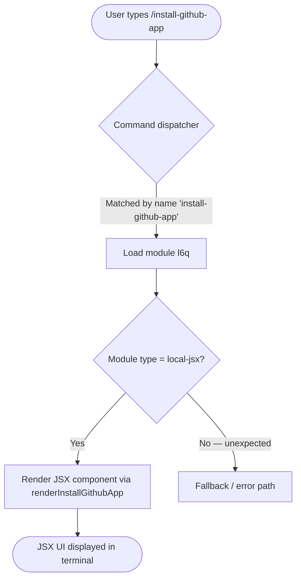

# `/install-github-app`

> Analysis basis: CC v2.1.132 bundle.js (AST extraction + Claude interpretation)
> Minimum version: v2.1.132

---

## Overview

The `/install-github-app` command is a local JSX-rendered slash command that guides the user through setting up Claude GitHub Actions for a target repository. It is classified as a `local-jsx` command, meaning its output is rendered directly as a JSX component within the Claude Code terminal UI rather than producing plain text output. The command is self-contained: no outbound call graph edges or runtime literals were resolved at depth ≤ 2.

---

## Registration

| Field | Value |
|---|---|
| type | `local-jsx` |
| name | `install-github-app` |
| description | `Set up Claude GitHub Actions for a repository` |
| module\_id | `l6q` |
| loc\_line | 6380 |

Analysis basis: CC v2.1.132 bundle.js:+10434042

---

## Input Branching

Because the depth-2 call graph traversal returned no call edges and no string/numeric literals, no conditional branching paths could be confirmed from static analysis alone. The branching diagram below reflects what can be inferred from the registration type (`local-jsx`) and the absence of sub-calls.



> Note: Paths F and beyond are defensive; no error-path literals were found in the depth-2 traversal.

<!-- TODO: not found in depth-2 traversal; needs --depth 4 -->

---

## Behavioral Spec

### Rendering the GitHub App Installation UI

Because the command type is `local-jsx`, the dispatcher does not invoke a plain text handler. Instead it instantiates a JSX component exported from module `l6q`.

```
function renderInstallGithubApp(commandContext):
    # No input arguments are consumed from the slash command invocation line
    # (no argument literals detected in traversal)

    component = loadModule("l6q").defaultExport()

    # Component is mounted into the terminal's React/JSX layer
    terminalUI.mountComponent(component)

    # Component presumably presents:
    #   - Instructions or a URL to install the Claude GitHub App
    #   - Step-by-step setup guidance for GitHub Actions integration
    # Internal rendering details are below depth-2 traversal visibility

    return RENDERED
```

Analysis basis: CC v2.1.132 bundle.js:+10434042

<!-- TODO: Internal JSX component structure not found in depth-2 traversal; needs --depth 4 -->

### Argument Handling

No argument literals, flags, or parameter parsers were detected within the depth-2 traversal. It is therefore not confirmed whether the command accepts any positional or named arguments at invocation time.

```
function parseArguments(rawInput):
    # No confirmed argument schema found at depth <= 2
    # Command may operate with zero required arguments
    return NO_OP
```

<!-- TODO: not found in depth-2 traversal; needs --depth 4 -->

---

## State & Side Effects

| Item | Detail |
|---|---|
| Telemetry | No `tengu_*` telemetry events found at depth ≤ 2 <!-- TODO: not found in depth-2 traversal; needs --depth 4 --> |
| Hook registration | No hook registrations detected at depth ≤ 2 <!-- TODO: not found in depth-2 traversal; needs --depth 4 --> |
| appState changes | No `appState` mutations detected at depth ≤ 2 <!-- TODO: not found in depth-2 traversal; needs --depth 4 --> |
| Sound | No audio/sound triggers detected at depth ≤ 2 <!-- TODO: not found in depth-2 traversal; needs --depth 4 --> |
| Render mode | `local-jsx` — output is a mounted JSX component, not streamed text |
| Network I/O | Not confirmed at depth ≤ 2; a GitHub App installation flow would typically involve opening an external URL <!-- TODO: not found in depth-2 traversal; needs --depth 4 --> |

---

## Version History

| Version | Change |
|---|---|
| v2.1.132 | Initial analysis — command registered at bundle.js:+10434042, module `l6q`, type `local-jsx` |

---

## Common Mistakes

1. **Expecting plain-text output**: Because the command type is `local-jsx`, the response is rendered as a React component inside the terminal UI. Users or integrations that scrape plain-text stdout will not capture the installation instructions.
2. **Running outside an interactive terminal**: A `local-jsx` command requires an active JSX-capable rendering context. Invoking `/install-github-app` in a non-interactive or piped session may produce no visible output or an error.
3. **Assuming the command modifies repository files directly**: The command name and description indicate a *setup* or *guidance* flow. No file-write or git-mutation side effects were confirmed at depth ≤ 2; users should not assume the command automatically installs anything without following the presented UI steps.
4. **Passing arguments expecting them to be consumed**: No argument schema was detected. Appending arguments to the command invocation (e.g., `/install-github-app my-org/my-repo`) may be silently ignored; confirm argument support via `--depth 4` analysis or live testing.

---

## Appendix — Identifier Mapping

> For bundle debugging only. Identifiers change across versions.

| Identifier | Role |
|---|---|
| `k97` | Primary implementation symbol for the `/install-github-app` command — likely the exported JSX component or command registration factory in module `l6q` |