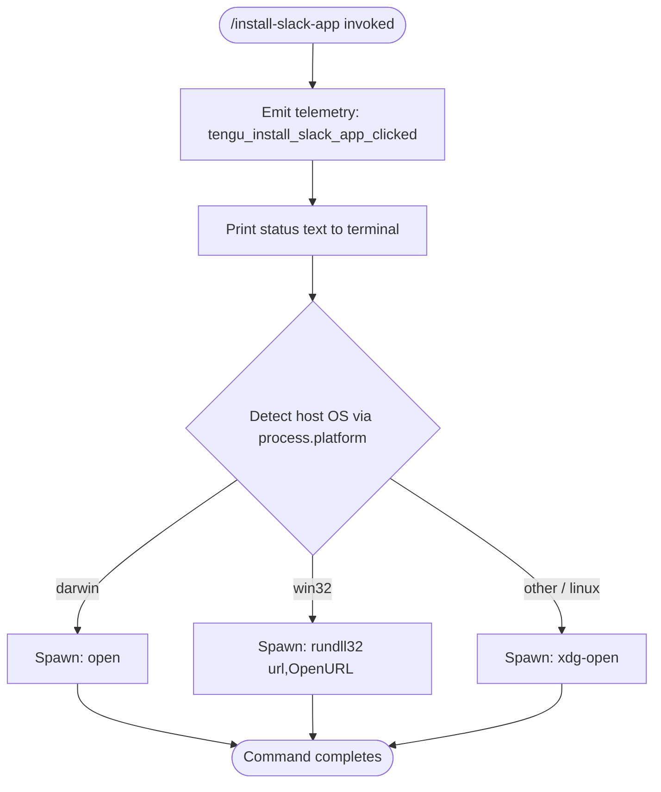

# `/install-slack-app`

> Analysis basis: CC v2.1.143 bundle.js (AST extraction + Claude interpretation)
> Minimum version: v2.1.143

---

## Overview

The `/install-slack-app` command opens the Claude Slack app installation page in the user's default browser. It is a local, interactive-only command: it emits a telemetry event, writes a status message to the terminal, and delegates URL-opening to a platform-specific browser launcher. No API call is made and no persistent configuration is written by the command itself.

---

## Registration

| Field | Value |
|---|---|
| type | `local` |
| name | `install-slack-app` |
| description | Install the Claude Slack app |
| supportsNonInteractive | `false` |
| module_id | `uMq` |

Analysis basis: CC v2.1.143 bundle.js:+10722310

---

## Input Branching

The command accepts no user-supplied arguments. Its branching logic is entirely determined by the host operating system at the point where a browser URL must be opened.



Analysis basis: CC v2.1.143 bundle.js:+10722029 (OS branching), +7543375 (`darwin`), +7543391 (`win32`), +7543549 (`open`), +7543475 (`rundll32`), +7543487 (`url,OpenURL`), +7543556 (`xdg-open`)

---

## Behavioral Spec

### Entry Point — Command Handler

```
function installSlackAppCommandHandler(context):
    emitTelemetry("tengu_install_slack_app_clicked")       // loc +10721916
    printToTerminal(kind="text",
                    message="Opening Slack app installation page in browser…")
    openUrlInBrowser(getSlackInstallUrl())
    return
```

Analysis basis: CC v2.1.143 bundle.js:+10721914, +10721954, +10722049, +10722062

---

### Sub-feature: URL Opening (platform dispatcher)

```
function openUrlInBrowser(url):
    validateUrl(url)                    // rejects non-http/https schemes
    platform = process.platform

    if platform == "darwin":
        spawnProcess("open", [url])

    else if platform == "win32":
        spawnProcess("rundll32", ["url,OpenURL", url])

    else:                               // linux and all other POSIX
        spawnProcess("xdg-open", [url])
```

Analysis basis: CC v2.1.143 bundle.js:+7543303 (URL validator entry), +7543016 (scheme error), +7543066 (`http:`), +7543088 (`https:`), +7543375, +7543391, +7543475, +7543487, +7543549, +7543556

---

### Sub-feature: URL Validation

```
function validateUrl(url):
    parsed = parseUrl(url)
    if parsed.protocol not in ["http:", "https:"]:
        raise Error("URL scheme not permitted")
```

Analysis basis: CC v2.1.143 bundle.js:+7543066, +7543088, +7543016

---

### Sub-feature: Terminal Status Message

The command renders exactly one piece of output before delegating to the browser. The output type is the literal string `"text"` and the message is the literal string `"Opening Slack app installation page in browser…"`.

Analysis basis: CC v2.1.143 bundle.js:+10722049 (`"text"`), +10722062 (`"Opening Slack app installation page in browser…"`)

---

### Sub-feature: Config Lock (invoked via config-read path)

Although `/install-slack-app` does not write configuration itself, the call graph shows that the command handler reaches the global config read/write subsystem (`a6` → `P9_`). The lock subsystem enforces mutual exclusion across Claude instances:

```
function acquireConfigLock(lockFilePath):
    attempt = 0
    deadline = Date.now() + LOCK_TIMEOUT_MS        // 60 000 ms — loc +3162978

    loop:
        try:
            createLockFile(lockFilePath)            // exclusive create
            registerLockForCleanup(lockFilePath)
            return success

        catch EEXIST:
            if Date.now() > deadline:
                emitTelemetry("tengu_config_lock_contention")
                logWarning("Lock acquisition took longer than expected"
                           " - another Claude instance may be running")
                                                   // loc +3162208
                break
            sleep(backoffMs)

    // proceed without lock (degraded)
```

Lock timeout: 60 000 ms
Analysis basis: CC v2.1.143 bundle.js:+3162978 (60 000), +3162297 (`tengu_config_lock_contention`), +3162208 (warning message), +3162165 (`"error"` severity)

---

### Sub-feature: Config Stale-Write Guard

If a re-read of the on-disk config is missing authentication data that the in-memory cache holds, the write is aborted to prevent wiping credentials (GitHub issue #3117):

```
function saveConfigWithLock(newConfig):
    diskConfig = readConfigFromDisk()

    if cacheHasAuth() and not diskConfig.hasAuth():
        emitTelemetry("tengu_config_auth_loss_prevented")  // loc +3162776
        logWarning("saveConfigWithLock: re-read config is missing auth"
                   " that cache has; refusing to write to avoid wiping"
                   " ~/.claude.json. See GH #3117.")        // loc +3162624
        return                  // abort write

    if staleWriteDetected():
        emitTelemetry("tengu_config_stale_write")           // loc +3162433

    writeConfigAtomic(newConfig)
```

Analysis basis: CC v2.1.143 bundle.js:+3162624, +3162776, +3162433

---

### Sub-feature: Config File Read with Backup Scanning

```
function readConfigFile(configPath):
    if not fileExists(configPath):
        // ENOENT — loc +3162563
        scanBackupDirectory(dirname(configPath) + "/backups")  // loc +3163809
        return defaultConfig()

    raw = readFileSync(configPath, encoding="utf-8")   // loc +3164324
    try:
        return JSON.parse(raw)                         // loc +182056
    catch ParseError:
        emitTelemetry("tengu_config_parse_error")      // loc +3164878
        raise Error("Config accessed before allowed.") // loc +3164241
```

Backup directory name: `"backups"` (literal)
Analysis basis: CC v2.1.143 bundle.js:+3164297, +3164324, +3164878, +3163809, +3162563

---

### Sub-feature: Atomic File Write (used by config subsystem)

```
function atomicWriteFile(targetPath, data, permissions):
    randomSuffix = randomBytes(6).toString("hex")   // 6 bytes — loc +1000956, +1000968
    tempPath = targetPath + "." + randomSuffix

    fd = openSync(tempPath, flags="wx", mode=permissions)
    writeFileSync(fd, data)
    fchmodSync(fd, originalPermissions)             // loc +1001434
    // log: "Applied original permissions to temp file" — loc +1001455
    fsyncSync(fd)                                   // loc +1001500
    closeSync(fd)
    renameSync(tempPath, targetPath)                // atomic replace — loc +1001628

    on cleanup:
        if tempPath still exists:
            unlinkSync(tempPath)                    // loc +1001785
```

Random suffix length: 6 bytes → 12 hex characters
Analysis basis: CC v2.1.143 bundle.js:+1000940, +1000956, +1000968, +1001376, +1001434, +1001500, +1001628, +1001785

---

### Sub-feature: Config Backup Rotation

```
function rotateConfigBackups(configPath):
    backupDir = join(dirname(configPath), "backups")  // loc +3163809
    baseName  = basename(configPath)
    entries   = readdirStringSync(backupDir)

    backups = [e for e in entries if e.startsWith(baseName + ".backup.")]
                                                      // loc +3163094
    backups.sort()                                    // ascending (oldest first)

    MAX_BACKUPS = 5                                   // loc +3163227
    while len(backups) >= MAX_BACKUPS:
        unlinkSync(join(backupDir, backups.shift()))

    timestamp = Date.now()
    destName  = baseName + ".backup." + timestamp
    copyFileSync(configPath, join(backupDir, destName))
```

Maximum backup count: 5
Analysis basis: CC v2.1.143 bundle.js:+3163094, +3163227, +3163809

---

## State & Side Effects

| Item | Detail |
|---|---|
| Telemetry (primary) | `tengu_install_slack_app_clicked` — fired immediately on command invocation (bundle.js:+10721916) |
| Telemetry (config subsystem) | `tengu_config_lock_contention`, `tengu_config_stale_write`, `tengu_config_parse_error`, `tengu_config_auth_loss_prevented` — fired only if the config path is exercised |
| Telemetry (background session subsystem) | `tengu_bg_dispatch_sigkill_escalate`, `tengu_bg_dispatch_low_mem`, `tengu_bg_spare_enable`, `tengu_bg_spare_claim`, `tengu_bg_spare_claim_fail`, `tengu_bg_spare_spawn` — reachable via deep call graph; not expected to fire during normal `/install-slack-app` execution |
| Terminal output | One `"text"` message: `"Opening Slack app installation page in browser…"` (bundle.js:+10722062) |
| Browser side effect | Opens the Slack app installation URL in the system default browser via platform-specific subprocess |
| File system | No writes expected during normal execution; config lock/backup paths activate only if config is read or written |
| appState changes | <!-- TODO: not found in depth-2 traversal; needs --depth 4 --> |
| Hook registration | None observed at depth ≤ 2 |
| Sound | None |
| Non-interactive support | `false` — command must not be invoked in non-interactive mode (bundle.js:+10722310) |

---

## Version History

| Version | Change |
|---|---|
| v2.1.143 | Initial analysis |

---

## Common Mistakes

1. **Running in non-interactive mode** — `supportsNonInteractive` is `false`. Piping stdin or using `--no-interactive` will cause the command to be rejected before it executes.
2. **Expecting config changes** — The command does not modify `~/.claude.json`. Users expecting a persisted Slack token or workspace record after running this command will not find one; the actual OAuth handshake happens in the browser.
3. **Blocked browser environments** — In headless or container environments where `open` / `xdg-open` / `rundll32` cannot launch a graphical browser, the subprocess will fail silently or error. The terminal message is printed regardless; users should manually open the URL.
4. **Misidentifying the OS branch** — On WSL (Windows Subsystem for Linux), `process.platform` reports `"linux"`, so `xdg-open` is used rather than `rundll32`. If `xdg-open` is not configured for the WSL environment, the URL will not open.
5. **Assuming HTTP URLs are accepted** — The URL validator permits only `http:` and `https:` schemes. Any internally constructed URL using a non-standard scheme will throw before the browser is invoked.

---

## Appendix — Identifier Mapping

> For bundle debugging only. Identifiers change across versions.

| Identifier | Role |
|---|---|
| `lP7` | Install-Slack-App command handler (entry point) |
| `a6` | Global config save/read coordinator |
| `P9_` | Config file read/write with lock and backup |
| `H$H` | Config file parser and backup scanner |
| `zZ9` | Backup directory scanner / entry enumerator |
| `X9_` | Backup path joiner utility |
| `j9_` | Config directory initializer / atomic writer setup |
| `yA6` | Atomic file write helper (temp-rename pattern) |
| `OZ9` | Config object entry iterator |
| `HpH` | Config lock timestamp helper |
| `emH` | Config encoding / serialization helper |
| `d76` | Config diff / validation helper |
| `jR` | String prefix stripper utility |
| `R6` | JSON parse wrapper |
| `NH` | Error logger / error reporter |
| `qK` | Platform-aware URL opener (browser launcher) |
| `ex4` | URL scheme validator |
| `hJ` | Browser subprocess spawner helper |
| `Y8` | Open-URL orchestrator |
| `$_` | Session / context initializer called by open-URL path |
| `KXH` | Connection / session factory |
| `D` | Background process / daemon context manager |
| `_SK` | String coercion utility |
| `S6` | Async store accessor |
| `Uh6` | Async local storage getter |
| `__` | Global variable / namespace accessor |
| `v` | HTTP request / fetch wrapper |
| `G5K` | HTTP transport selector |
| `hH` | JSON serializer wrapper |
| `P7` | HTTP response parser |
| `cSH` | HTTP header builder |
| `Z5K` | HTTP body / stream writer |
| `heA` | Request metadata builder |
| `Tr8` | Request context initializer |
| `L` | File-system abstraction (sync operations layer) |
| `q` | Secondary file-system abstraction |
| `f` | File handle / resource finalizer |
| `w` | Background session / daemon process manager |
| `H` | Retry / jitter helper |
| `X` | MCP / SDK connection manager |
| `v_` | Error wrapper utility |
| `iT8` | Transport factory |
| `A` | Process / handle map |
| `O` | Symlink / stat wrapper |
| `$8` | Stat error classifier |
| `d` | Logging / debug output sink |
| `_` | Core file-system primitives wrapper |
| `x6` | Path existence checker |
| `L8` | Structured error constructor |
| `N0` | Config schema validator |
| `tv` | Config serializer |
| `V` | Directory entry filter |
| `Z` | Backup list slicer |