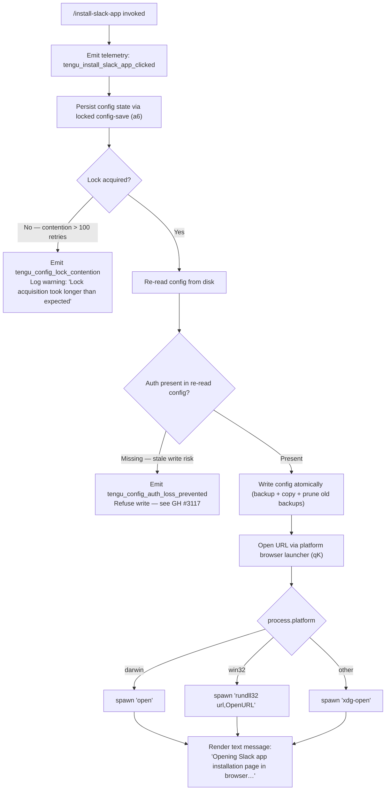

# `/install-slack-app`

> Analysis basis: CC v2.1.143 bundle.js (AST extraction + Claude interpretation)
> Minimum version: v2.1.143

---

## Overview

The `/install-slack-app` command launches the Claude Slack app installation page in the user's default system browser. It is a local, interactive-only slash command that fires a telemetry event, saves configuration state, and delegates URL opening to a platform-aware browser launcher. No arguments or sub-commands are accepted.

---

## Registration

| Field | Value |
|---|---|
| type | `local` |
| name | `install-slack-app` |
| description | Install the Claude Slack app |
| supportsNonInteractive | `false` |
| module_id | `uMq` |

Analysis basis: CC v2.1.143 bundle.js:+10722310

---

## Input Branching

Because the command takes no user-supplied arguments, branching occurs exclusively in the implementation's internal logic — specifically in the platform detection layer and the config-persistence layer.



Analysis basis: CC v2.1.143 bundle.js:+10721914, +10722029, +7543375, +7543391, +7543475, +7543549, +10722062

---

## Behavioral Spec

### Top-Level Command Handler

```
function installSlackAppHandler(context):
    emit telemetry("tengu_install_slack_app_clicked")
    saveGlobalConfig(context)                   // persists any pending config state
    openUrlInBrowser(slackInstallUrl)
    return textMessage("Opening Slack app installation page in browser…")
```

Analysis basis: CC v2.1.143 bundle.js:+10721914, +10721954, +10722029, +10722049, +10722062

---

### Global Config Save with File Lock

The config-save helper acquires a filesystem lock before writing `~/.claude.json` in order to prevent race conditions when multiple Claude instances run concurrently.

```
function saveGlobalConfigWithLock(configData):
    acquireFileLock():
        retries = 0
        loop:
            try create lock-directory (EEXIST signals contention)
            if EEXIST:
                retries += 1
                if retries > 100:
                    emit telemetry("tengu_config_lock_contention")
                    log warning("Lock acquisition took longer than expected - another Claude instance may be running")
                    break
                sleep(randomJitter)             // Math.random + setTimeout
            else:
                break                          // lock acquired

    reReadConfig = readConfigFromDisk()
    if reReadConfig missing auth AND cachedConfig has auth:
        emit telemetry("tengu_config_auth_loss_prevented")
        log error("saveConfigWithLock: re-read config is missing auth that cache has; refusing to write to avoid wiping ~/.claude.json. See GH #3117.")
        releaseFileLock()
        return

    backupCurrentConfig():
        timestamp = Date.now()
        copy current file to "<path>.backup.<timestamp>"
        prune backup files: keep newest 5, delete the rest

    writeConfigAtomic(configData, encoding="utf-8", mode=384)  // octal 0600
    releaseFileLock()
```

Lock contention threshold: 100 retries (Analysis basis: CC v2.1.143 bundle.js:+3162202)
Lock timeout ceiling: 60000 ms (Analysis basis: CC v2.1.143 bundle.js:+3162978)
Maximum backup files retained: 5 (Analysis basis: CC v2.1.143 bundle.js:+3163227)
File write mode: 384 (octal 0600 — owner read/write only) (Analysis basis: CC v2.1.143 bundle.js:+3163509)
File encoding: `utf-8` (Analysis basis: CC v2.1.143 bundle.js:+3163496)
Backup filename infix: `.backup.` (Analysis basis: CC v2.1.143 bundle.js:+3163094)

---

### Auth-Loss Guard (GH #3117 Fallback)

A second, lighter guard runs outside the lock path as an additional safety net:

```
function saveGlobalConfigFallback(configData, cachedConfig):
    diskConfig = readConfigFromDisk()
    if diskConfig missing auth AND cachedConfig has auth:
        log error("saveGlobalConfig fallback: re-read config is missing auth that cache has; refusing to write. See GH #3117.")
        return
    proceedWithWrite(configData)
```

Analysis basis: CC v2.1.143 bundle.js:+3159496, +3159506

---

### Config Parse Error Handling

When the config file cannot be parsed (e.g., corrupted JSON), a telemetry event is emitted and a hard error is thrown to prevent the command from operating on stale or missing config:

```
function readAndParseConfig(filePath):
    if not pathExists(filePath):
        throw Error("Config accessed before allowed.")
    raw = readFileSync(filePath)
    try:
        return JSON.parse(raw)
    except ParseError:
        emit telemetry("tengu_config_parse_error")
        throw
```

Analysis basis: CC v2.1.143 bundle.js:+3164235, +3164241, +3164878

---

### Platform-Aware Browser Launcher

```
function openUrlInBrowser(url):
    validate url:
        if not url.startsWith("http:") and not url.startsWith("https:"):
            throw Error("Invalid URL scheme")

    platform = process.platform
    if platform == "darwin":
        spawnProcess("open", [url])
    else if platform == "win32":
        spawnProcess("rundll32", ["url,OpenURL", url])
    else:
        spawnProcess("xdg-open", [url])
```

Analysis basis: CC v2.1.143 bundle.js:+7543066, +7543088, +7543375, +7543391, +7543475, +7543487, +7543549, +7543556

URL scheme validation enforces `http:` or `https:` prefixes only.
(Analysis basis: CC v2.1.143 bundle.js:+7543066, +7543088)

---

### Jitter Delay Helper

The lock retry loop uses a random jitter delay to reduce thundering-herd collisions between concurrent Claude processes:

```
function randomJitterDelay():
    delayMs = Math.random() * someBase
    return new Promise(resolve => setTimeout(resolve, delayMs))
```

Analysis basis: CC v2.1.143 bundle.js:+12638156, +12638193

---

### Config Object Iteration

When serialising configuration entries for disk write, the implementation iterates all key-value pairs:

```
function serializeConfigEntries(configObject):
    result = {}
    for [key, value] in Object.entries(configObject):
        result[key] = value
    return result
```

Analysis basis: CC v2.1.143 bundle.js:+3160481

---

### Timestamp-Based Stale Write Detection

Before committing a write, a timestamp comparison guards against writes that would overwrite a more recently modified file:

```
function checkTimestampFreshness(expectedTimestamp):
    currentTimestamp = Date.now()
    diskModTime = fs.statSync(configPath).mtimeMs
    if diskModTime > expectedTimestamp:
        emit telemetry("tengu_config_stale_write")
        log warning of potential stale write
```

Analysis basis: CC v2.1.143 bundle.js:+3162358, +3162373, +3162433

---

## State & Side Effects

| Item | Detail |
|---|---|
| Telemetry — `tengu_install_slack_app_clicked` | Fired once, immediately on command invocation (bundle.js:+10721916) |
| Telemetry — `tengu_config_lock_contention` | Fired when lock retry count exceeds 100; indicates a concurrent Claude instance (bundle.js:+3162297) |
| Telemetry — `tengu_config_stale_write` | Fired when the on-disk config has been modified more recently than the in-memory snapshot (bundle.js:+3162433) |
| Telemetry — `tengu_config_auth_loss_prevented` | Fired when a write is blocked to protect authentication credentials (bundle.js:+3162776) |
| Telemetry — `tengu_config_parse_error` | Fired when `~/.claude.json` cannot be parsed (bundle.js:+3164878) |
| Config write | Atomically updates `~/.claude.json` with file mode 0600 under a filesystem lock |
| Backup files | Creates a timestamped `.backup.` copy of `~/.claude.json` before each write; retains newest 5 backups |
| Browser process | Spawns a detached OS process (`open` / `rundll32` / `xdg-open`) to open the Slack install URL |
| Terminal output | Prints the text message `"Opening Slack app installation page in browser…"` (bundle.js:+10722062) |
| Hook registration | <!-- TODO: not found in depth-2 traversal; needs --depth 4 --> |
| appState changes | <!-- TODO: not found in depth-2 traversal; needs --depth 4 --> |
| Sound | <!-- TODO: not found in depth-2 traversal; needs --depth 4 --> |

---

## Version History

| Version | Change |
|---|---|
| v2.1.143 | Initial analysis |

---

## Common Mistakes

1. **Running in non-interactive mode** — `supportsNonInteractive` is `false`. Invoking this command from a script or pipe will fail. Use an interactive terminal session only.
2. **Expecting a return value or URL echo** — The command opens the browser silently and prints only a single status line. It does not print the target URL to stdout.
3. **Concurrent Claude instances during invocation** — If another Claude process holds the config lock, this command will retry up to 100 times before logging a contention warning. The browser open still proceeds, but the config write may be skipped.
4. **Corrupted `~/.claude.json`** — A parse error in the config file will cause the command to abort before opening the browser. Inspect and repair `~/.claude.json` manually if this occurs.
5. **Non-standard URL scheme** — The browser launcher validates that the URL starts with `http:` or `https:`. Any internal change introducing a non-HTTP scheme would cause an immediate error.
6. **Auth loss after manual config edits** — If the on-disk config file is edited externally and the `auth` key is removed, the GH #3117 guard will block the config write. This is intentional safety behaviour, not a bug.

---

## Appendix — Identifier Mapping

> For bundle debugging only. Identifiers change across versions.

| Identifier | Role |
|---|---|
| `lP7` | Top-level command handler for `/install-slack-app` |
| `a6` | Global config save orchestrator (lock + write + fallback) |
| `P9_` | Locked config write implementation (backup, atomic write, lock management) |
| `H` | Jitter delay helper (Math.random + setTimeout) |
| `emH` | Config entry serialisation / enumeration helper |
| `OZ9` | Object.entries-based config property iterator |
| `HpH` | Timestamp-based stale write detection helper |
| `v` | Config read / parse helper (with debug logging) |
| `H$H` | Config file read, parse, and error-handling function |
| `d76` | Auth-loss guard (GH #3117 fallback path) |
| `j9_` | Config directory initialisation / path resolution helper |
| `qK` | Platform-aware browser URL launcher |
| `ex4` | URL scheme validator (http/https enforcement) |
| `hJ` | Browser spawn helper (child process wrapper) |
| `Y8` | OS platform detection and command selector |
| `d` | Logging / telemetry emit utility |