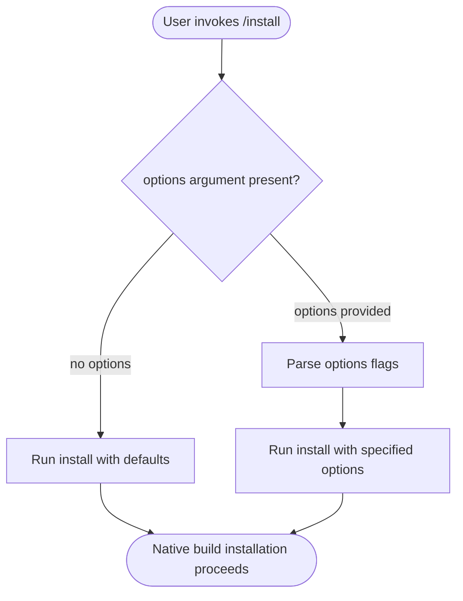

# `/install`

> Analysis basis: CC v2.1.132 bundle.js (AST extraction + Claude interpretation)
> Minimum version: v2.1.132

---

## Overview

The `/install` slash command initiates the installation of a Claude Code native build onto the host system. It is surfaced as a local JSX-rendered command, meaning its UI is handled by a React component rendered within the CLI. The command accepts optional arguments via `[options]` to customize the installation behavior.

---

## Registration

| Field | Value |
|---|---|
| type | `local-jsx` |
| name | `install` |
| description | `Install Claude Code native build` |
| argumentHint | `[options]` |

Analysis basis: CC v2.1.132 bundle.js:+12200298

---

## Input Branching

The AST traversal at depth ≤ 2 did not resolve an entry function for this command's module (the `callGraph` array is empty). A branching flowchart derived from call edges cannot be constructed from the available data.

<!-- TODO: not found in depth-2 traversal; needs --depth 4 -->

What can be confirmed from registration alone is that the command accepts an optional `[options]` argument hint, implying at least one branch between "no options provided" and "options provided" paths.



Analysis basis: CC v2.1.132 bundle.js:+12200298 (argumentHint field confirms optional argument pattern)

---

## Behavioral Spec

### Command Dispatch

Because the `callGraph` is empty and the note field records `"no entry functions found for module 'undefined'"`, the internal dispatch logic cannot be reconstructed from the available extraction data.

```
function handleInstallCommand(args):
    options = parseOptions(args)   # args may be empty; argumentHint = "[options]"
    # internal dispatch logic:
    # <!-- TODO: not found in depth-2 traversal; needs --depth 4 -->
    initiateNativeBuildInstall(options)
```

Analysis basis: CC v2.1.132 bundle.js:+12200298

### Rendering Model

The command type is `local-jsx`, which indicates the command's output and interaction surface are rendered as a JSX/React component inside the CLI process rather than emitting plain text to stdout. This is consistent with installation workflows that may require progress indicators, prompts, or multi-step UI.

```
function renderInstallUI(componentProps):
    # Rendered locally within the CLI React tree
    # Does NOT delegate to a remote API call for UI rendering
    return <InstallComponent {...componentProps} />
```

Analysis basis: CC v2.1.132 bundle.js:+12200298 (type = "local-jsx")

---

## State & Side Effects

| Item | Detail |
|---|---|
| Telemetry | <!-- TODO: not found in depth-2 traversal; needs --depth 4 --> |
| Hook registration | <!-- TODO: not found in depth-2 traversal; needs --depth 4 --> |
| appState changes | <!-- TODO: not found in depth-2 traversal; needs --depth 4 --> |
| Sound | <!-- TODO: not found in depth-2 traversal; needs --depth 4 --> |
| Rendering | JSX component rendered locally within the CLI process (type: `local-jsx`) |
| Native build artifact | Installation of a Claude Code native build onto the host system is the expected side effect |

---

## Version History

| Version | Change |
|---|---|
| v2.1.132 | Initial analysis. Registration confirmed at bundle.js:+12200298. Call graph extraction yielded no entry functions; deeper traversal required for full behavioral coverage. |

---

## Common Mistakes

1. **Assuming `/install` emits plain text**: Because `type` is `local-jsx`, the command renders a React component. Scripting or automation that scrapes stdout text lines may miss structured output from this command.
2. **Omitting options when they are required by context**: The `argumentHint` is `[options]`, indicating options are optional syntactically, but specific installation targets or flags may be required depending on the host environment. Check CLI `--help` output for runtime-required flags.
3. **Confusing `/install` with package-manager installation**: This command installs a *native build* of Claude Code itself, not a user-managed package or tool dependency. It operates on the Claude Code binary/runtime layer.
4. **Running without sufficient permissions**: Native build installation typically writes to system or user-level directories. Running without the necessary filesystem permissions may cause a silent failure or an unhandled error if error-path logic is not exposed at depth ≤ 2.
5. **Expecting telemetry confirmation in logs**: No telemetry event strings were found at the current traversal depth. Do not rely on `tengu_*` log events to confirm installation success without deeper bundle analysis.

---

## Appendix — Identifier Mapping

> For bundle debugging only. Identifiers change across versions.

| Identifier | Role |
|---|---|
| *(none)* | No obfuscated identifiers were present in the depth-2 AST extraction for this command. <!-- TODO: not found in depth-2 traversal; needs --depth 4 --> |