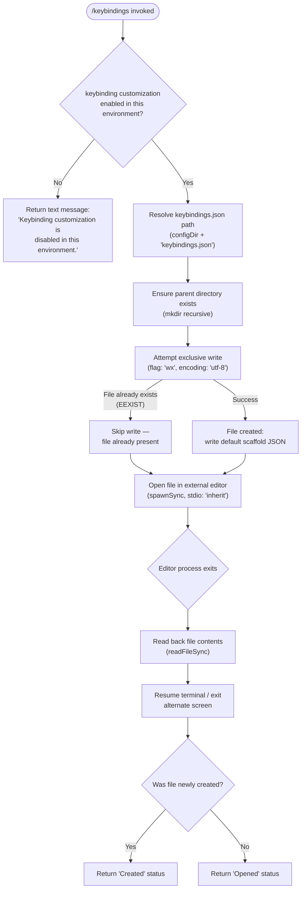

# `/keybindings`

> Analysis basis: CC v2.1.143 bundle.js (AST extraction + Claude interpretation)
> Minimum version: v2.1.143

---

## Overview

The `/keybindings` command opens or creates the user's keybindings configuration file (`keybindings.json`) in an external editor. If the file does not yet exist, the command first writes a default scaffold (including a schema reference and documentation URL) before launching the editor. The command is a local, interactive-only slash command and is disabled entirely in non-interactive environments.

---

## Registration

| Field | Value |
|---|---|
| type | `local` |
| name | `keybindings` |
| description | Open or create your keybindings configuration file |
| supportsNonInteractive | `false` |
| module_id | `bfq` |

Analysis basis: CC v2.1.143 bundle.js:+10670206

---

## Input Branching

The command handler (`commandHandler`) performs an environment check immediately upon invocation, then branches into either a disabled-environment early exit or the full file-open/create flow.



Analysis basis: CC v2.1.143 bundle.js:+10669600 (handler entry), +10669617 (disabled-environment text literal), +10669714 (mkdir call), +10669765 (writeFile call), +10669837 (EEXIST check), +10669923 (Opened literal), +10669932 (Created literal)

---

## Behavioral Spec

### Environment Guard

```
function checkCustomizationEnabled(context):
    enabled = isKeybindingCustomizationEnabled(context)
    if not enabled:
        return textResult("Keybinding customization is disabled in this environment.")
    // continue to file resolution
```

- The guard is the first operation performed by the handler.
- The disabled message is the string literal `"Keybinding customization is disabled in this environment."`.
- `supportsNonInteractive` is `false`, so the command is never reachable from a non-interactive invocation at the CLI dispatch layer.

Analysis basis: CC v2.1.143 bundle.js:+10669617, +10669630, +10670206

---

### Configuration Path Resolution

```
function resolveKeybindingsPath():
    configDir = getConfigDirectory()          // platform config root
    filename  = "keybindings.json"            // literal constant
    return joinPath(configDir, filename)
```

- The filename is the hard-coded constant `"keybindings.json"`.
- Path components are joined via an array `.join()` call on `[configDir, filename]`.

Analysis basis: CC v2.1.143 bundle.js:+3746231 (join call), +3746245 (filename literal)

---

### Keybinding Customization Feature-Flag Check

```
function isKeybindingCustomizationEnabled(context):
    emit telemetry event "tengu_keybinding_customization_release"
    // check internal feature registry (sMH set, PF map)
    // returns boolean
```

- Emits the telemetry event `tengu_keybinding_customization_release` as part of the feature-flag evaluation path.
- The check consults at least two internal data structures (a Set and a Map) before returning its boolean result.

Analysis basis: CC v2.1.143 bundle.js:+3745728 (featureFlag resolver), +3745731 (telemetry event)

---

### Default File Scaffold Generation

```
function buildDefaultKeybindingsContent(existingBindings):
    schemaUrl = "https://www.schemastore.org/claude-code-keybindings.json"
    docsUrl   = "https://code.claude.com/docs/en/keybindings"

    // Map each known action in the default set to its binding descriptor
    entries = existingBindings.map(buildBindingEntry)

    // Include schema URL and docs URL in root object
    root = {
        "$schema": schemaUrl,
        "documentation": docsUrl,
        "bindings": entries
    }
    return JSON.stringify(root, null, 2)   // pretty-printed, indent = 2
```

- Schema URL constant: `"https://www.schemastore.org/claude-code-keybindings.json"` Analysis basis: CC v2.1.143 bundle.js:+10669353
- Documentation URL constant: `"https://code.claude.com/docs/en/keybindings"` Analysis basis: CC v2.1.143 bundle.js:+10669418
- JSON serialisation uses `JSON.stringify` with indentation of `2` spaces. Analysis basis: CC v2.1.143 bundle.js:+181316 (stringify call), +10669500 (indent literal `2`)
- The scaffold builder iterates over available binding definitions with `.map()` and `Object.entries()` / `Object.keys()`. Analysis basis: CC v2.1.143 bundle.js:+10669117, +10669150, +10669186, +10669289

---

### File Creation (Exclusive Write)

```
function createKeybindingsFileIfAbsent(filePath, content):
    parentDir = dirname(filePath)
    fs.mkdir(parentDir, { recursive: true })

    try:
        fs.writeFile(filePath, content, { encoding: "utf-8", flag: "wx" })
        return CREATED          // file was newly written
    catch error:
        if error.code == "EEXIST":
            return ALREADY_EXISTS   // file was pre-existing; skip write
        raise error
```

- Parent directory is created with `mkdir` (recursive). Analysis basis: CC v2.1.143 bundle.js:+10669714
- `dirname` is sourced from the path utility `Cfq`. Analysis basis: CC v2.1.143 bundle.js:+10669724
- Write uses exclusive flag `"wx"` (fails if file exists) with encoding `"utf-8"`. Analysis basis: CC v2.1.143 bundle.js:+10669797, +10669810
- Error code checked: `"EEXIST"`. Analysis basis: CC v2.1.143 bundle.js:+10669837

---

### External Editor Launch

```
function openInExternalEditor(filePath):
    // Suspend terminal rendering
    terminal.enterAlternateScreen()
    terminal.pause()
    terminal.suspendStdin()

    editorCommand = resolveEditorCommand()   // checks $VISUAL, $EDITOR, fallback
    args = editorCommand.split(" ")
    args.append(filePath)

    result = spawnSync(args[0], args[1:], { stdio: "inherit" })

    content = fs.readFileSync(filePath)

    // Restore terminal
    terminal.exitAlternateScreen()
    terminal.resumeStdin()
    terminal.resume()

    return content
```

- Terminal is suspended before spawning and fully restored after. Analysis basis: CC v2.1.143 bundle.js:+10608712, +10608742, +10608752, +10609214, +10609243, +10609259
- Child process is spawned with `spawnSync` from `n5q` with `stdio` set to `"inherit"` so the editor gets the real terminal. Analysis basis: CC v2.1.143 bundle.js:+10608834, +10608866
- The editor command string is split by spaces to separate executable from arguments. Analysis basis: CC v2.1.143 bundle.js:+10608791
- File contents are read back after the editor exits via `readFileSync`. Analysis basis: CC v2.1.143 bundle.js:+10609136

---

### Editor Command Resolution

```
function resolveEditorCommand():
    // Check whether running inside an IDE integration
    if environmentTag == "IDE":
        return ideEditorCommand()
    // Otherwise inspect basename and lowercased name to select editor binary
    name = basename(editorPath).toLowerCase()
    return buildEditorArgs(name)
```

- The string `"IDE"` is checked as an environment tag to select the IDE code-open path. Analysis basis: CC v2.1.143 bundle.js:+5216283
- Editor name is normalised to lowercase before matching. Analysis basis: CC v2.1.143 bundle.js:+5216338
- `basename` from the path utility `uI` is used to extract the filename portion. Analysis basis: CC v2.1.143 bundle.js:+5216396

---

### Result Reporting

```
function buildResult(wasCreated):
    if wasCreated:
        statusWord = "Created"
    else:
        statusWord = "Opened"
    return textResult(statusWord + " " + resolvedFilePath)
```

- Status word `"Created"` is emitted when the file was newly written. Analysis basis: CC v2.1.143 bundle.js:+10669932
- Status word `"Opened"` is emitted when the file already existed. Analysis basis: CC v2.1.143 bundle.js:+10669923

---

## State & Side Effects

| Item | Detail |
|---|---|
| Telemetry | `tengu_keybinding_customization_release` — fired during feature-flag check (bundle.js:+3745731) |
| File system write | Creates `keybindings.json` with `flag: "wx"` only when the file is absent; creates parent directory with `mkdir` recursive |
| File system read | Reads back `keybindings.json` content via `readFileSync` after editor exits |
| Terminal state | Enters alternate screen, pauses rendering, suspends stdin before editor; fully restores all three on exit |
| External process | Spawns the user's configured editor via `spawnSync` with `stdio: "inherit"` |
| appState changes | <!-- TODO: not found in depth-2 traversal; needs --depth 4 --> |
| Sound | <!-- TODO: not found in depth-2 traversal; needs --depth 4 --> |
| Hook registration | <!-- TODO: not found in depth-2 traversal; needs --depth 4 --> |

---

## Version History

| Version | Change |
|---|---|
| v2.1.143 | Initial analysis — local interactive-only command; creates or opens `keybindings.json`; schema URL `https://www.schemastore.org/claude-code-keybindings.json`; docs URL `https://code.claude.com/docs/en/keybindings` |

---

## Common Mistakes

1. **Running in a non-interactive or restricted environment** — The command always returns the disabled message `"Keybinding customization is disabled in this environment."` when the feature flag evaluates to false; there is no way to force-enable it via command arguments.
2. **Expecting in-place editing without an editor configured** — The command relies entirely on the system's `$VISUAL` / `$EDITOR` resolution; if no editor is resolvable, `spawnSync` will fail. Ensure a valid editor is set in the shell environment before invoking `/keybindings`.
3. **Assuming the file is always recreated** — The write uses the exclusive flag `"wx"`. An existing `keybindings.json` is never overwritten by the scaffolding logic; only the editor can modify it.
4. **Expecting output in non-interactive scripting** — `supportsNonInteractive` is `false`; the command cannot be used in automated pipelines or `--print` mode.
5. **Manually editing the file while `/keybindings` is open** — Because the command reads back file content after the editor exits, any external writes made during the editor session may be overwritten or produce unexpected state.

---

## Appendix — Identifier Mapping

> For bundle debugging only. Identifiers change across versions.

| Identifier | Role |
|---|---|
| `RP7` | Top-level command handler function for `/keybindings` |
| `Hm` | Feature-flag / environment-check entry point (wraps `G6`) |
| `G6` | Core feature-flag evaluation logic (Set/Map lookups, telemetry emit) |
| `d9H` | Configuration file path resolver (joins config dir + `keybindings.json`) |
| `hfq` | Default keybindings file content builder (calls scaffold generator + stringify) |
| `hP7` | Keybindings scaffold generator (maps binding definitions, uses `Object.entries` / `Object.keys`) |
| `hH` | JSON serialisation wrapper (calls `JSON.stringify`) |
| `L8` | Post-write / result assembly helper |
| `cp` | External editor launch orchestrator (terminal suspend/resume, `spawnSync`, file read-back) |
| `x6` | Ink/terminal instance accessor |
| `lb` | Terminal pause helper (enters alternate screen, pauses rendering) |
| `oj7` | Editor command resolution entry point (IDE vs. shell editor) |
| `Vj` | Editor binary name normaliser (lowercase, basename extraction, arg builder) |
| `_` | Node `fs` module reference (used for `statSync`, `readFileSync`) |
| `A` | Terminal / Ink renderer control object (pause, resume, alternate screen, stdin) |
| `L` | Active-process tracking set manager (add/delete around `spawnSync`) |
| `f` | Ink renderer instance or render-lifecycle object (close, finally) |