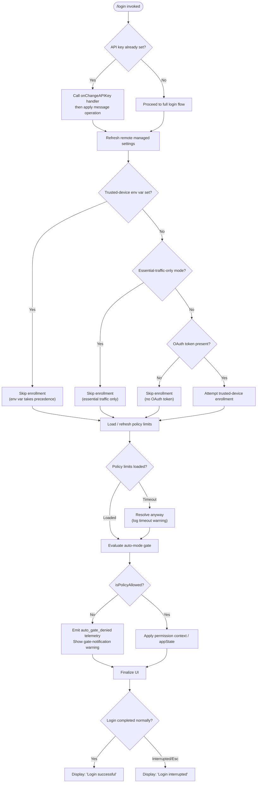

# `/login`

> Analysis basis: CC v2.1.143 bundle.js (AST extraction + Claude interpretation)
> Minimum version: v2.1.143

---

## Overview

The `/login` slash command initiates an interactive OAuth-based authentication flow within the Claude Code CLI. It renders a JSX confirmation UI, orchestrates API-key propagation, trusted-device enrollment, policy-limit loading, remote-managed-settings refresh, and auto-mode gating — then emits a final success or interruption message to the conversation. The command is implemented as a `local-jsx` type, meaning all UI is rendered in-process without spawning a subprocess.

---

## Registration

| Field | Value |
|---|---|
| type | `local-jsx` |
| name | `login` |
| description | *(null — not surfaced in help text)* |
| module\_id | `kC1` |

Analysis basis: CC v2.1.143 bundle.js:+10670424

---

## Input Branching

The command entry point (root handler) inspects application state and several environment signals before deciding which sub-flow to execute.



Analysis basis: CC v2.1.143 bundle.js:+8170225, +8170244, +8170300, +8170306, +8170312, +6628090, +6628105, +8170532, +8170667, +8170680, +8170699

---

## Behavioral Spec

### 1. Command Handler Dispatch

```
function loginCommandHandler(props, appState):
    applyMessageOperation(props, "update")
    onChangeAPIKey(appState, newKey)
    triggerRemoteSettingsRefresh(appState)
    triggerPolicyLimitsRefresh(appState)
    trustedDeviceEnroll(appState)
    applyPermissionContext(appState)
    renderLoginUI(props, appState)
```

The message-operation type is `"update"`.
Analysis basis: CC v2.1.143 bundle.js:+8170267, +8170225, +8170244

---

### 2. API Key Change Propagation

```
function onChangeAPIKey(appState, newKey):
    appState.setAPIKey(newKey)
    notifyChange("policySettings")          // triggers downstream listeners
    triggerRemoteSettingsRefresh(appState)
```

After an API key change, the system emits a `"policySettings"` notification and logs `"Remote settings: Refreshed after auth change"`.
Analysis basis: CC v2.1.143 bundle.js:+8170225, +6751947, +6751836

---

### 3. Remote Managed Settings Refresh

The settings refresh logic resolves the correct settings source based on account type, then fetches from the remote endpoint with cache-control semantics.

```
function triggerRemoteSettingsRefresh(appState):
    accountType = resolveAccountType(appState)
    // accountType is one of:
    //   "gateway" | "firstParty" | "local-agent" | "enterprise" | "team"

    result = fetchRemoteSettings(accountType)

    switch result.status:
        case FETCH_OK:
            log("Remote settings: Applied new settings successfully")
            emit("remote_managed_settings_pull")
            applyNewSettings(result.data)

        case NOT_MODIFIED_304:
            log("Remote settings: Cache still valid (304 Not Modified)")
            // no write needed

        case USER_REJECTED:
            log("Remote settings: User rejected new settings, using cached settings")

        case NOT_FOUND_404:
            unlinkCachedFile()
            log("Remote settings: Deleted cached file (404 response)")

        case FETCH_FAILED:
            emit("remote_managed_settings_fetch_failed")
            if staleCache exists:
                log("Remote settings: Using stale cache after fetch failure")
            else:
                log("Remote settings: Using stale cache after error")

        case ERROR_ENOENT:
            // cache file absent; treat as cold start, no action

        case UNEXPECTED_ERROR:
            emit("remote_managed_settings_unexpected")
            log("Remote settings: Using stale cache after error")
```

Account-type literals observed: `"gateway"`, `"firstParty"`, `"local-agent"`, `"enterprise"`, `"team"`.
Analysis basis: CC v2.1.143 bundle.js:+6746130, +6746167, +6746263, +6746408, +6746443, +6750243, +6750274, +6750325, +6750494, +6750732, +6750862, +6751027, +6751102, +6751193, +6751328, +6751377

---

### 4. Policy Limits Load / Refresh

```
function triggerPolicyLimitsRefresh(appState):
    clearPendingTimeout()
    promise = loadPolicyLimits(appState)

    timeoutHandle = setTimeout(function():
        log("Policy limits: Loading promise timed out, resolving anyway")
        resolvePromise()
    , POLICY_LIMITS_TIMEOUT_MS)      // timeout value not found in depth-2 traversal

    await promise
    clearTimeout(timeoutHandle)
    emit("policy_limits_load")
    log("Policy limits: Refreshed after auth change")
```

Analysis basis: CC v2.1.143 bundle.js:+10022061, +10022091, +10026722, +10026801, +10026929

---

### 5. Trusted-Device Enrollment

```
function trustedDeviceEnroll(appState):
    if env.CLAUDE_TRUSTED_DEVICE_TOKEN is set:
        log("[trusted-device] CLAUDE_TRUSTED_DEVICE_TOKEN env var is set, skipping enrollment (env var takes precedence)")
        return

    if trafficMode == "essential-traffic":
        log("[trusted-device] Essential traffic only, skipping enrollment")
        return

    if oauthToken is absent:
        log("[trusted-device] No OAuth token, skipping enrollment")
        return

    oauthEndpoint = resolveOAuthEndpoint(environment)
    // environment: "local" | "staging" | "prod"
    // custom endpoint validated against approved list;
    // if invalid → throw "CLAUDE_CODE_CUSTOM_OAUTH_URL is not an approved endpoint."

    payload = buildEnrollmentPayload(appState)
    response = httpPost(oauthEndpoint, payload,
                        contentType="application/json",
                        timeout=10000,          // ms
                        retryDelay=500)         // ms

    emit("bridge_trusted_device_enroll")

    if requestFailed:
        recordFailure("request_failed")
        return

    if response.status not in [200, 201]:
        recordFailure("http_error")
        return

    if response.body.device_token is missing:
        log("[trusted-device] Enrollment response missing device_token field")
        recordFailure("missing_token")
        return

    try:
        storeDeviceToken(response.body.device_token)
    catch storageError:
        recordFailure("storage_failed")
        return

    // On unexpected error:
    recordFailure("unexpected_error")
```

HTTP request timeout: 10 000 ms.
Analysis basis: CC v2.1.143 bundle.js:+6627966, +6628248, +6628361, +6628462, +6628607, +6628622, +6628650, +6628676, +6628752, +6628783, +6628822, +6628838, +6628957, +6629035, +6629136, +6629344, +6629704, +940188, +940213, +940243, +940373, +959252

Custom OAuth endpoint suffix appended to base URL: `"-custom-oauth"`.
Analysis basis: CC v2.1.143 bundle.js:+940889

macOS (`"darwin"`) hostname is read from `tz1.hostname` to populate enrollment payload.
Analysis basis: CC v2.1.143 bundle.js:+6628534, +6628557

---

### 6. Auto-Mode Gate Evaluation

```
function evaluateAutoModeGate(appState, policyContext):
    autoModeCfg = getAutoModeConfig()     // event: tengu_auto_mode_config

    if autoModeCfg.disableAutoMode in settings:
        log("auto mode disabled: disableAutoMode in settings")
        return DISABLED

    if autoModeCfg.enabled == "disabled":   // circuit-breaker path
        log("auto mode disabled: tengu_auto_mode_config.enabled === \"disabled\" (circuit breaker)")
        logLevel = "warn"
        logCategory = "circuit-breaker"
        return DISABLED

    allowed = policyContext.isPolicyAllowed()
    if not allowed:
        emit("auto_gate_denied")
        showNotification(
            id="auto-mode-gate-notification",
            severity="warning",
            priority="high"
        )
        return GATED

    // modes: "disabled" | "enabled" | "auto"
    // permission modes: "bypassPermissions" | "setMode" | "default" | "session"
    applyMode(autoModeCfg)
    return ALLOWED
```

Analysis basis: CC v2.1.143 bundle.js:+9916922, +9916925, +9917053, +9917162, +9917189, +9917718, +9917731, +9917788, +9917822, +9917842, +9918380, +8169695, +8169738, +8169757, +9919806, +9919839, +9919854, +9919876

`tengu_disable_bypass_permissions_mode` is emitted when bypass-permissions mode is forcibly disabled during login.
Analysis basis: CC v2.1.143 bundle.js:+9918898

---

### 7. Login UI Rendering

The UI component is a JSX element rendered via `YKH.createElement`. It manages an internal reducer-based state machine.

```
function renderLoginUI(props, appState):
    [state, dispatch] = useReducer(loginReducer, initialState)

    useEffect(function():
        subscribeToExternalStore()
    , [])

    memoizedContext = useMemo(function():
        return buildLoginContext(state, appState)
    , [state, appState])

    // Key bindings handled inside the UI:
    //   "Esc" / "cancel" → dispatch confirm:no → triggers "Login interrupted"
    //   Confirmation → triggers "Login successful"

    return createElement(
        LoginFrame,
        { label: "Login", permissionKey: "permission" },
        renderConfirmationWidget(state, dispatch)
    )
```

Confirmation widget supports the key binding `"confirm:no"` mapped to `"Esc"` / `"cancel"`.
Memo-cache sentinel string: `"react.memo_cache_sentinel"`.
Analysis basis: CC v2.1.143 bundle.js:+8170620, +8170667, +8170676, +8170751, +8170863, +8170874, +8170905, +8170934, +8170955, +8170979, +8170997, +8171376, +8171401

Internal React memo cache slot count observed: up to slot 14.
Analysis basis: CC v2.1.143 bundle.js:+8171449

---

### 8. Session Teardown on Process Exit

On process `"beforeExit"` and `"exit"` events, a cleanup handler fires that:

```
function cleanupOnExit():
    process.off("beforeExit", cleanupOnExit)
    process.off("exit", cleanupOnExit)
    clearCaches([
        sMH,   // settingsCache
        Ri6,   // requestCache
        x76,   // policyCache
        nA_,   // authCache
        PF     // featureCache
    ])
```

Analysis basis: CC v2.1.143 bundle.js:+3143018, +3143064, +3143006, +3143125, +3143137, +3143149, +3143161, +3143173

---

### 9. API-Key Normalisation

Before the key is committed to state the raw input undergoes normalisation:

```
function normaliseAPIKey(rawInput):
    trimmed = rawInput.trim()
    upper   = trimmed.toUpperCase()
    if upper contains known prefix list:
        validated = validateKeyFormat(upper)
    else:
        validated = upper
    return buildKeyRecord(validated)
```

Debug-level logging is enabled during this step (`"debug"` literal).
Analysis basis: CC v2.1.143 bundle.js:+201193, +201257, +201319, +201342, +201358

---

### 10. Result Message Emission

After the UI closes, the handler calls `applyMessageOperation` a second time to write the outcome into the conversation:

```
function emitLoginResult(outcome, appState):
    if outcome == SUCCESS:
        message = "Login successful"
    else:
        message = "Login interrupted"
    applyMessageOperation(appState, message)
    onDone(appState)
```

Analysis basis: CC v2.1.143 bundle.js:+8170680, +8170699, +8170799

---

## State & Side Effects

| Item | Detail |
|---|---|
| Telemetry: `tengu_auto_mode_config` | Fired when auto-mode configuration is evaluated during login (CC v2.1.143 bundle.js:+9916925) |
| Telemetry: `tengu_disable_bypass_permissions_mode` | Fired when bypass-permissions mode is forcibly disabled (CC v2.1.143 bundle.js:+9918898) |
| Telemetry: `tengu_slate_kestrel` | Fired from within the policy-limits load path (CC v2.1.143 bundle.js:+10022817) |
| Telemetry: `tengu_feature_ok` | Feature flag evaluated positively (CC v2.1.143 bundle.js:+955068) |
| Telemetry: `tengu_feature_bad` | Feature flag evaluated negatively (CC v2.1.143 bundle.js:+955126) |
| Inline telemetry: `remote_managed_settings_pull` | Remote settings fetched and applied (CC v2.1.143 bundle.js:+6750243) |
| Inline telemetry: `remote_managed_settings_fetch_failed` | Remote settings fetch failed (CC v2.1.143 bundle.js:+6750274) |
| Inline telemetry: `remote_managed_settings_unexpected` | Unexpected error in settings fetch (CC v2.1.143 bundle.js:+6751328) |
| Inline telemetry: `bridge_trusted_device_enroll` | Trusted-device enrollment attempted (CC v2.1.143 bundle.js:+6628752) |
| Inline telemetry: `policy_limits_load` | Policy limits successfully loaded (CC v2.1.143 bundle.js:+10026722) |
| Inline telemetry: `auto_gate_denied` | Auto-mode gated by policy (CC v2.1.143 bundle.js:+9918380) |
| Hook registration | `process.on("beforeExit")` and `process.on("exit")` registered during login; removed in cleanup handler (CC v2.1.143 bundle.js:+3143018, +3143064) |
| appState changes | API key written via `setAppState`; permission context updated; mode set to one of `"disabled"`, `"enabled"`, `"auto"` (CC v2.1.143 bundle.js:+8170532) |
| External store notification | `vS.notifyChange("policySettings")` fired after key change (CC v2.1.143 bundle.js:+6751931) |
| File-system side effects | Trusted-device token stored to disk; cached settings file unlinked on 404 (`XZH.unlink`, `k26.unlink`) (CC v2.1.143 bundle.js:+6751011, +10026890) |
| Timers | `Math.random` + `setTimeout` used for jittered retry delays; `clearTimeout` used on both the policy-limits timeout and the enrollment retry (CC v2.1.143 bundle.js:+12638156, +12638193, +10021944) |
| Sound | <!-- TODO: not found in depth-2 traversal; needs --depth 4 --> |

---

## Version History

| Version | Change |
|---|---|
| v2.1.143 | Initial analysis |

---

## Common Mistakes

1. **Running `/login` when `CLAUDE_TRUSTED_DEVICE_TOKEN` is already set in the environment.** The enrollment step is silently skipped; the token in the environment always takes precedence over a freshly fetched one. Clear the variable first if re-enrollment is required.

2. **Expecting a help description to appear in `/help`.** The `description` field is `null` in the command registration; `/login` will not show descriptive text in command listings.

3. **Pressing Esc during the confirmation prompt and assuming the session state is unchanged.** The `"Login interrupted"` outcome still calls `applyMessageOperation`, writing a message into the conversation, but API-key and permission-context changes made *before* the UI was shown are not rolled back.

4. **Assuming the policy-limits timeout is a hard failure.** When the loading promise exceeds its internal timeout, the command resolves anyway and logs a warning rather than aborting — subsequent commands may operate with stale or default policy limits.

5. **Using `CLAUDE_CODE_CUSTOM_OAUTH_URL` with an unapproved endpoint.** The URL is validated against an allowlist; an unapproved value throws `"CLAUDE_CODE_CUSTOM_OAUTH_URL is not an approved endpoint."` before any network call is made.

6. **Interpreting `"Login interrupted"` as an error condition requiring a retry.** It is a normal, user-initiated cancellation via the `"Esc"` / `"cancel"` key binding and carries no error state in `appState`.

---

## Appendix — Identifier Mapping

> For bundle debugging only. Identifiers change across versions.

| Identifier | Role |
|---|---|
| `df8` | Login command handler (root dispatch function) |
| `H` | Application state / context object passed through the command |
| `qSH` | Timestamp utility (wraps `Date.now`) |
| `hdH` | Authentication-change orchestrator (coordinates settings + policy + enrollment) |
| `ND1` | Settings initialisation helper (depth-1 callee of `hdH`) |
| `NP_` | Settings persistence helper (calls `cDA`) |
| `Li` | Account-type resolver (returns `"gateway"`, `"firstParty"`, `"local-agent"`, `"enterprise"`, `"team"`) |
| `kP_` | Policy-settings notifier (calls `vS.notifyChange`) |
| `SP_` | Remote managed settings fetch-and-apply controller |
| `v` | API-key normalisation / validation function |
| `k_H` | Key storage accessor |
| `vD1` | Post-auth state writer (calls `Li`, `Ge6`, `TG4`, `h9`) |
| `nJ6` | Policy limits load / refresh controller |
| `YC_` | Pending-policy-limits cancellation helper (calls `clearTimeout`) |
| `vD8` | Policy limits fetch executor (uses `setTimeout` for timeout guard) |
| `bp` | Policy limits data builder / parser |
| `ND8` | Policy limits path joiner (`V1q.join`) |
| `y26` | Policy limits refresh-after-auth coordinator |
| `cMH` | <!-- TODO: not found in depth-2 traversal; needs --depth 4 --> |
| `Y0H` | Process-exit cleanup registrar |
| `Ts` | Utility initialiser used during cleanup |
| `imH` | Cache-clear executor on exit (clears `sMH`, `Ri6`, `x76`, `nA_`, `PF`) |
| `NH` | Error logger / notifier (calls `Wc.logError`) |
| `v_` | Error-string constructor |
| `xj_` | OAuth / auth-state setup helper |
| `s_` | Module-initialisation bootstrap (ES-module interop) |
| `Sw` | Display-adapter helper |
| `JqH` | UI event emitter helper (wraps `G6`) |
| `dK` | Permission-encoding helper (wraps `peA`) |
| `JdH` | Trusted-device enrollment orchestrator |
| `tR` | Session-state manager (manages `sMH`, `x76`, `Ci6`) |
| `HY1` | Identity-module initialiser |
| `q` | Policy object (exposes `waitForPolicyLimitsToLoad`, `isPolicyAllowed`, `n8K.unlinkSync`) |
| `zq` | Traffic-mode checker (checks `"essential-traffic"`) |
| `A` | String normaliser (wraps `f.toLowerCase`) |
| `_` | Generic utility / lodash-like helper |
| `K9` | OAuth endpoint resolver and validator |
| `XH` | String-coercion helper |
| `mH` | Feature-flag evaluator (wraps `d`) |
| `hH` | JSON serialiser helper (wraps `JSON.stringify`) |
| `SH` | Storage write helper (wraps `d`) |
| `VC1` | <!-- TODO: not found in depth-2 traversal; needs --depth 4 --> |
| `QJ6` | App-state reader / bypass-permissions evaluator |
| `Qf8` | State snapshot helper (calls `H9_`) |
| `$ZH` | Feature-flag gate helper (calls `Ff`) |
| `oE_` | <!-- TODO: not found in depth-2 traversal; needs --depth 4 --> |
| `dJ6` | Permission-context builder (calls `cJ6`) |
| `cJ6` | Auto-mode configuration evaluator |
| `Nd4` | Login JSX component (outer wrapper, calls `df8`) |
| `rYH` | Login command registration object (wires `NC1.c`, `KD`, `UD`, `onDone`) |
| `KD` | Login UI state-machine component (uses `useReducer`, `useEffect`, `useMemo`) |
| `O6` | External-store subscription helper (`useSyncExternalStore`) |
| `ZC1` | UI sub-component managing reducer and effects |
| `r1` | Model/plan string normaliser (handles `"opusplan"`, `"sonnet"`, `"haiku"`, `"opus"`, `"best"`) |
| `nJ` | Context-aware render helper (handles `"mantle"` plan label) |
| `UD` | React context consumer (`useContext`) |