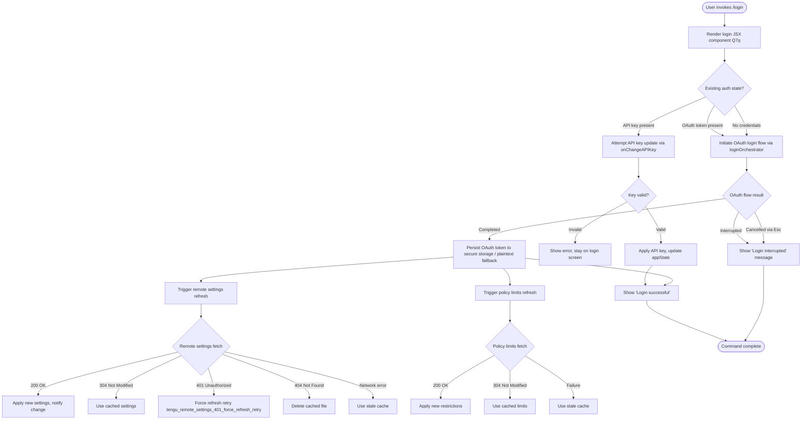

# `/login`

> Analysis basis: CC v2.1.141 bundle.js (AST extraction + Claude interpretation)
> Minimum version: v2.1.141

---

## Overview

The `/login` command allows users to switch Anthropic accounts or sign in with an Anthropic account from within the Claude Code CLI. It renders an interactive JSX-based login UI component, coordinates OAuth token acquisition, persists credentials, and triggers downstream refresh of remote settings and policy limits once authentication succeeds or is interrupted.

---

## Registration

| Field | Value |
|---|---|
| type | `local-jsx` |
| name | `login` |
| description | `Switch Anthropic accounts \| Sign in with your Anthropic account` |
| loc_byte | `10545049` |
| loc_byte_end | `10545282` |
| loc_line | `6288` |
| module_id | `lR1` |
| load_inline | `true` |
| arbor_handler.name | `Q7q` |
| arbor_handler.fqn | `claude-2.1.141::Q7q` |
| arbor_handler.kind | `Function` |
| arbor_handler.resolution_path | `direct` |
| arbor_handler.n_hits | `2` |

Analysis basis: CC v2.1.141 bundle.js:+10545049

---

## Input Branching

The `/login` flow has more than three distinct branches based on state transitions (API key vs. OAuth path, success vs. interruption, trusted-device enrollment conditional, and remote settings refresh), so a Mermaid flowchart is used.



---

## Behavioral Spec

### 1. Component Entry Point (handler `Q7q`)

The handler `Q7q` is resolved `direct`ly within the registration byte range and serves as the root JSX component for the login command.

```
function loginComponent(props):
    appState = getAppState()                    # H.getAppState
    [state, dispatch] = useReducer(initialLoginState)
    useEffect(setupAuthSubscription)

    render LoginConfirmationUI(
        onDone   = props.onDone,
        onCancel = () -> emitConfirmNo(),
        title    = "Login",
        escLabel = "Esc",
        cancelLabel = "cancel"
    )
```

Analysis basis: CC v2.1.141 bundle.js:+8088446

### 2. API Key Change Handler

When the user provides an API key (non-OAuth path):

```
function handleApiKeyChange(newKey):
    applyMessageOp("update")                   # literal "update" at +8088323
    onChangeAPIKey(newKey)                      # H.onChangeAPIKey at +8088281
    recordTimestamp()                           # XhH -> Date.now at +42048
```

Analysis basis: CC v2.1.141 bundle.js:+8088281

### 3. OAuth Login Orchestrator (`loginOrchestrator`, mapped from `cJ6`)

The OAuth orchestration function manages the full OAuth token lifecycle:

```
function loginOrchestrator(context):
    clearPendingTimeouts()                      # TR_ -> clearTimeout at +9899165
    buildLoginPath()                            # bY8 -> IAq.join, p8 at +9899421
    unlinkStaleTokenFile()                      # w26.unlink at +9904111

    startPollingSession()                       # J26 -> yAq -> rt6 (setInterval) at +9904495
    loadExistingAuth()                          # J26 -> NAq at +9903939

    return result
```

Analysis basis: CC v2.1.141 bundle.js:+9904076

### 4. Auth Token Load and Validation (`NAq`)

```
function loadAndValidateAuth(context):
    rawFile = readFileSync(authFilePath)        # vAq -> VAq.readFileSync at +9901991
    parsed  = parseAuthFile(rawFile)            # vAq -> Y1, PR_ at +9902025
    authType = detectAuthType(parsed)           # literal "api_key" at +9902473, "oauth" at +9902483

    hashInput = computeHash(parsed)             # if7 -> ZAq.createHash at +9899763
    invokeApiCall()                             # j$ at +9902426

    timestamp = Date.now()                      # +9902513
    emit telemetry("tengu_policy_limits_fetch") # +9902552

    if fetchFailed:
        log("Policy limits: Using stale cache after fetch failure")  # +9902759
        emit("stale_cache_used")                # +9902825
    elif http304:
        log("Policy limits: Cache still valid (304 Not Modified)")   # +9902928
    elif success:
        log("Policy limits: Applied new restrictions successfully")  # +9903082
    elif emptyCache:
        log("Policy limits: No restrictions (cached empty)")         # +9903137
    else:
        log("Policy limits: Using stale cache after error")          # +9903214
        emit("unexpected_error")                # +9903306
```

Analysis basis: CC v2.1.141 bundle.js:+9902371

### 5. Auth Token Persistence (`credentialWriter`, mapped from `IeA`)

Credential persistence uses a tiered storage approach with a secure storage primary path and plaintext fallback:

```
function persistCredentials(credentials):
    try:
        writeToSecureStorage(credentials)
        emit telemetry("secure_storage_credentials_write")   # +2182712
    catch SecureStorageError:
        emit telemetry("plaintext_fallback_used")            # +2182862
        writePlaintext(credentials)
    catch BothFailed:
        emit telemetry("primary_and_fallback_failed")        # +2182965
        raise

    notifySubscribers()                         # b9 -> Object.assign at +54916
```

Analysis basis: CC v2.1.141 bundle.js:+2182335

### 6. Remote Settings Refresh (`rdH` and sub-functions)

After successful authentication, remote settings are refreshed:

```
function refreshRemoteSettings(authContext):
    computeSettingsHash()                       # Vz1 -> Zz1.createHash, "sha256", "hex" at +6555826
    fetchRemoteSettings()                       # OP_ -> bW4 -> QY1 at +6666942

    case httpStatus:
        200, 204:
            log("Remote settings: Fetched successfully")     # +6668131
            applySettings()                     # xW4 -> A.writeFile, A.datasync at +6668821
            notifyChange()                      # Vh.notifyChange at +6671151
        304:
            log("Remote settings: Cache still valid (304 Not Modified)")  # +6669714
        401:
            emit telemetry("tengu_remote_settings_401_force_refresh_retry")  # +6668432
            log("Not authorized for remote settings")        # +6668518
        404:
            log("Remote settings: Deleted cached file (404 response)")   # +6670247
            unlinkCacheFile()                   # EZH.unlink at +6670231
        timeout:
            log("Remote settings: Request timeout")          # literal "timeout" at +6668573
        network error:
            log("Cannot connect to server")                  # +6668680
        default:
            emit telemetry("remote_managed_settings_unexpected")  # +6670548
            log("Remote settings: Using stale cache after error") # +6670597

    if backgroundPollChange:
        log("Remote settings: Changed during background poll")   # +6671432
        notifyChange()                          # Vh.notifyChange at +6671483
```

Analysis basis: CC v2.1.141 bundle.js:+6670966

### 7. Managed Settings Security Dialog (`mY1`)

When incoming remote settings are received, a security check dialog may be shown:

```
function managedSettingsSecurityCheck(newSettings):
    status = checkSecurityStatus(newSettings)   # literal "no_check_needed" at +6664312

    if status == "no_check_needed":
        return applyDirectly(newSettings)

    emit telemetry("tengu_managed_settings_security_dialog_shown")   # +6664405

    userChoice = showSecurityDialog()

    if userChoice == "approved":               # literal at +6664489
        emit telemetry("tengu_managed_settings_security_dialog_accepted")  # +6664500
        applySettings(newSettings)
    else:
        emit telemetry("tengu_managed_settings_security_dialog_rejected")  # +6664550
        log("Remote settings: User rejected new settings, using cached settings")  # +6669952
        status = "rejected"                    # literal at +6665053
```

Analysis basis: CC v2.1.141 bundle.js:+6664294

### 8. Trusted-Device Enrollment (`CdH`)

During the login flow, trusted-device enrollment is conditionally attempted:

```
function trustedDeviceEnrollment(context):
    if env.CLAUDE_TRUSTED_DEVICE_TOKEN is set:
        log("[trusted-device] CLAUDE_TRUSTED_DEVICE_TOKEN env var is set, skipping enrollment")  # +6548499
        return

    if essentialTrafficOnly:
        log("[trusted-device] Essential traffic only, skipping enrollment")  # +6548781
        return

    if no OAuth token:
        log("[trusted-device] No OAuth token, skipping enrollment")  # +6548894
        return

    waitForPolicyLimitsToLoad()                # q.waitForPolicyLimitsToLoad at +6548638
    if not policyAllowed:                      # q.isPolicyAllowed at +6548669
        return

    payload = buildEnrollmentPayload(
        contentType = "application/json",      # +6549155
        timeout     = 10000,                   # ms, at +6549183
    )

    response = httpPost(enrollmentEndpoint)    # x8.post at +6548995

    if response.status == 201:                 # +6549371
        storeDeviceToken(response.device_token)
        emit telemetry("bridge_trusted_device_enroll")   # +6549285
    elif response.status == 500:               # +6549209
        emit("http_error")                     # +6549490
    elif missing device_token field:
        log("[trusted-device] Enrollment response missing device_token field")  # +6549568
        emit("missing_token")                  # +6549669
    elif storageFailed:
        emit("storage_failed")                 # +6549877
```

Analysis basis: CC v2.1.141 bundle.js:+6548638

### 9. Policy Limits Background Poll (`HM7` / `yAq`)

After login, a background polling interval is established for policy limits:

```
function policyLimitsPollLoop(context):
    startPollingInterval()                      # yAq -> rt6 -> setInterval at +9904495
    emit telemetry("policy_limits_poll")        # +9904334

    on change:
        log("Policy limits: Changed during background poll")  # +9904379
        notifySubscribers()                     # b9 at +9904542

    on authChange:
        log("Policy limits: Refreshed after auth change")     # +9904150
        reloadPolicyLimits()                    # HM7 -> NAq at +9904330
```

Analysis basis: CC v2.1.141 bundle.js:+9904284

### 10. Exponential Backoff Retry (`ve`)

Network retry logic used throughout the login and settings fetch pipeline:

```
function exponentialBackoff(attempt, options):
    base    = 32000                             # ms constant at +9894253
    factor  = 0.25                             # jitter factor at +9894316
    maxRetry = 10                              # +9894346

    delay = Math.min(base, Math.pow(2, attempt))
    jitter = Math.random() * factor * delay
    finalDelay = Math.max(0, parseInt(delay + jitter))

    if isNaN(finalDelay):
        finalDelay = base

    return setTimeout(callback, finalDelay)
```

Analysis basis: CC v2.1.141 bundle.js:+9894253

### 11. Terminal Output and Result Display

On completion, the login component emits one of two terminal status strings:

- `"Login successful"` (literal at +8088726) — when OAuth or API key authentication succeeds and credentials are persisted.
- `"Login interrupted"` (literal at +8088745) — when the user cancels via Esc or the flow is otherwise interrupted.

The confirmation dialog component uses the key `"confirm:no"` (literal at +8088980) for the cancel action and listens to `Symbol.for(...)` (at +8088909) for done signaling.

Analysis basis: CC v2.1.141 bundle.js:+8088726

---

## State & Side Effects

| Item | Detail |
|---|---|
| Telemetry | `tengu_remote_settings_401_force_refresh_retry`, `tengu_feature_bad`, `tengu_feature_ok`, `tengu_managed_settings_security_dialog_shown`, `tengu_managed_settings_security_dialog_accepted`, `tengu_managed_settings_security_dialog_rejected`, `tengu_slate_kestrel`, `tengu_policy_limits_fetch`, `tengu_feature_sad`, `tengu_disable_bypass_permissions_mode`, `tengu_auto_mode_config`, `tengu_daemon_config_reload`, `secure_storage_credentials_write`, `plaintext_fallback_used`, `primary_and_fallback_failed`, `bridge_trusted_device_enroll`, `remote_managed_settings_security_check`, `remote_managed_settings_pull`, `remote_managed_settings_fetch_failed`, `remote_managed_settings_unexpected`, `policy_limits_load`, `policy_limits_poll`, `growthbook_experiment` |
| Hook registration | `process.on("exit")`, `process.on("beforeExit")`, `process.removeListener(...)` registered and cleared via `YpH`/`nA_` on cleanup; `setInterval`/`clearInterval` for background policy-limits polling (`rt6`); `setTimeout`/`clearTimeout` for OAuth polling and policy loading timeout |
| appState changes | `H.getAppState` read on entry; `H.setAppState` written on auth completion (at +8088578); `Vh.notifyChange` called after settings/policy apply |
| File I/O | Auth token file written via `w26.writeFile` (+9902158) and read via `VAq.readFileSync` (+9901991); remote settings written atomically via `A.writeFile` + `A.datasync` + `A.close` (+6668821–+6668899); stale cache unlinked via `EZH.unlink` (+6670231) and `w26.unlink` (+9904111) |
| Credential storage | Primary: OS secure storage. Fallback: plaintext file (telemetry distinguishes path). |
| Cache clearing | `kV6.clear` and `XZ8.clear` called via `ZY` on auth change (+24901, +24913); `gMH.clear`, `Ii6.clear`, `R76.clear`, `pA_.clear`, `OF.clear` on session teardown (`YpH` at +3121496–+3121544) |
| Randomness | `Math.random()` used for jitter in exponential backoff (`ve`) and for internal scheduling (`H` at +12516058) |
| Sound | Not found in depth-2 traversal |

---

## Version History

| Version | Change |
|---|---|
| v2.1.141 | Initial analysis |

---

## Common Mistakes

1. **Invoking `/login` in a non-interactive context**: The command renders a JSX component requiring an interactive terminal; piped or headless invocations will not receive the OAuth redirect or prompt the confirmation UI.
2. **Expecting immediate session reload**: After `/login`, remote settings and policy limits are refreshed asynchronously with exponential-backoff retries. Tools or scripts polling for updated settings immediately after login may observe stale values.
3. **Assuming API key login uses the same code path as OAuth**: The `onChangeAPIKey` branch (`If8` → `H.onChangeAPIKey`) bypasses the OAuth file-based flow entirely; trusted-device enrollment and the OAuth polling loop are not triggered.
4. **Cancelling with Esc and expecting credentials to be cleared**: Pressing Esc emits `"Login interrupted"` but does not actively revoke or wipe any previously stored credentials — it only exits the UI component.
5. **Setting `CLAUDE_TRUSTED_DEVICE_TOKEN` in the environment while expecting enrollment**: The presence of this environment variable causes trusted-device enrollment to be skipped silently (logged but not surfaced to the user).
6. **Relying on specific HTTP status-code behaviour in air-gapped environments**: The remote-settings fetch logic treats `401`, `404`, `304`, and network errors distinctly; in environments where the Anthropic API is unreachable, the flow falls back to stale cache and emits `remote_managed_settings_unexpected`.

---

## Appendix — Identifier Mapping

> For bundle debugging only. Identifiers change across versions.

| Identifier | Role |
|---|---|
| `Q7q` | Root login JSX component (arbor_handler; registration-direct resolution) |
| `If8` | Inner login form / state-machine component |
| `H` | Generic utility / host object (Math.random scheduling, appState accessor) |
| `XhH` | Timestamp recorder (wraps Date.now) |
| `rdH` | Remote settings refresh coordinator |
| `lY1` | Auth type resolver helper |
| `fP_` | API provider classifier sub-function |
| `SDA` | API provider string normaliser |
| `sn` | Settings fetch core function |
| `p_H` | Path builder utility |
| `ao` | Auth object accessor |
| `WA` | String conversion wrapper |
| `RH` | Base string coercion function |
| `UM` | User metadata extractor |
| `j$` | API key validation orchestrator |
| `JL` | String formatter |
| `yu` | Feature flag settings loader |
| `G8_` | API key helper resolver |
| `$V` | Key-type classifier |
| `DH6` | VS Code integration check |
| `pl8` | File-descriptor API key reader |
| `h6` | Telemetry event emitter |
| `IR` | Key slice/truncation utility (last 20 chars at +2025575) |
| `MP_` | Policy settings notifier |
| `kH` | Policy limits queue manager |
| `k_` | Error stringification helper |
| `Vq` | Essential-traffic classifier |
| `GvK` | Queue shift/push manager |
| `OP_` | Remote settings fetch pipeline |
| `v` | HTTP request builder / dispatcher |
| `J7K` | Request header assembler |
| `SH` | JSON serialiser (wraps JSON.stringify) |
| `t7` | URL path builder |
| `MSH` | Multi-segment header builder |
| `X7K` | HTTP request executor with retry |
| `W5H` | Auth state clear/reset coordinator |
| `rhK` | Array-aware auth resolver |
| `ZY` | Cache clear coordinator (kV6 + XZ8) |
| `Vz1` | Settings hash computer (SHA-256) |
| `Xj_` | Recursive settings structure normaliser |
| `bW4` | Remote settings fetch orchestrator |
| `RW4` | Remote settings URL builder |
| `JO` | HTTP client provider |
| `QY1` | Remote settings fetch-and-apply function |
| `ve` | Exponential-backoff retry scheduler |
| `a8` | Timeout/abort manager |
| `xH` | Feature-ok telemetry emitter |
| `Q` | Generic async queue |
| `mCH` | Settings merge helper |
| `hH` | Feature-bad telemetry emitter |
| `FY1` | Settings diff computer |
| `hv` | Deep clone utility (wraps structuredClone) |
| `jR` | Settings schema validators |
| `mY1` | Managed settings security check orchestrator |
| `o98` | Settings key enumerator |
| `mdH` | Settings entry transformer |
| `Rz1` | Settings round-trip validator |
| `KV` | Settings version checker |
| `du` | File write helper (write mode) |
| `q` | File unlink helper |
| `A` | File/path lower-case normaliser |
| `Fg` | Settings cache file path resolver |
| `pY1` | Settings rejection handler |
| `DK` | Rejection reason classifier |
| `xW4` | Atomic settings file writer |
| `P96` | Settings file path builder |
| `M8` | Error code extractor |
| `cY1` | Background remote-settings poll scheduler |
| `rt6` | Interval start/clear manager |
| `mW4` | Background poll change handler |
| `b9` | Subscriber notification dispatcher |
| `JKK` | Undefined-property guard |
| `cJ6` | OAuth login orchestrator |
| `TR_` | Pending-timeout canceller |
| `IR_` | OAuth internal timeout reference holder |
| `CY8` | Policy loading timeout controller |
| `bp` | OAuth session state object |
| `j6` | Active request tracker (gMH / OF / R76 sets) |
| `bY8` | Auth file path builder |
| `J26` | OAuth session initialiser and poller |
| `NAq` | Auth token load and validate function |
| `vAq` | Auth file reader/parser |
| `if7` | Auth hash computer |
| `of7` | OAuth retry-with-backoff wrapper |
| `D8` | Feature-sad telemetry emitter |
| `sf7` | Auth token file writer |
| `yAq` | Policy limits poll starter |
| `HM7` | Policy limits background poll handler |
| `xMH` | Login UI extra metadata accessor |
| `E0H` | Session teardown coordinator |
| `Js` | Request context builder |
| `ws` | WebSocket/stream session manager |
| `Su` | Stream session factory |
| `YpH` | Process-listener cleanup handler |
| `nA_` | Interval and listener remover |
| `Jj_` | Input reader initialiser |
| `qA` | Module loader trampoline |
| `cZ6` | Bound callback factory |
| `tj` | String formatter helper |
| `JqH` | Active request set accessor |
| `aK` | Input stream multiplexer |
| `IeA` | Credential persistence manager (secure + plaintext) |
| `_uH` | Streaming credential update handler |
| `CdH` | Trusted-device enrollment orchestrator |
| `aR` | Request deduplication checker |
| `b76` | HTTP base request factory |
| `x76` | HTTP request executor |
| `vi6` | Pending request set manager |
| `mA_` | New request initiator (randomUUID) |
| `cA_` | Request cancellation handler |
| `uE9` | Feature-gated request launcher |
| `L` | Active promise tracker |
| `Wz1` | Settings load wrapper |
| `bA` | OAuth URL validator |
| `bfA` | OAuth environment detector |
| `zIK` | Custom OAuth URL validator |
| `TH` | String coercion with type check |
| `gR1` | Login result formatter |
| `FJ6` | App-state permission mode manager |
| `Vf8` | Permission mode component wrapper |
| `lA_` | Permission request launcher |
| `DZH` | Permission state reducer |
| `cf` | Permission config updater |
| `A7` | Config key resolver |
| `K` | Config map/filter utility |
| `hE_` | Login status display helper |
| `gJ6` | Login REPL integration handler |
| `QJ6` | Full login session runner |
| `js` | Session initiator |
| `Ni6` | Request gate checker |
| `rS_` | Session result serialiser |
| `iS_` | Auto-mode state initialiser |
| `m1` | Model resolver |
| `Ta` | Model metadata fetcher |
| `zq` | Model name normaliser |
| `mJ` | Model display formatter |
| `SmH` | Model compatibility checker |
| `v1` | Inference-profile detector |
| `pB` | Plan-based model gater |
| `MoH` | Auto-mode config applier |
| `wB` | Auto-mode opt-in checker |
| `Y` | Supervisor/daemon config manager |
| `YJH` | Daemon config writer |
| `iZq` | Config column formatter |
| `f` | File handle lifecycle manager |
| `T` | Remote-control session handler |
| `V` | Heartbeat manager |
| `G8K` | Heartbeat scheduler |
| `Z` | Supervisor start coordinator |
| `KLH` | Login keyboard input handler |
| `Ky` | Auto-gate denial handler |
| `lt` | Permission-mode-changed event emitter |
| `$L` | Event log writer |
| `qLH` | Config entry renderer |
| `pg4` | Outer login JSX wrapper component |
| `QYH` | Login confirmation dialog component |
| `Wz` | App-state-aware login shell |
| `f6` | App-state context reader |
| `wL_` | Context accessor with error guard |
| `FR1` | Login state reducer + effect runner |
| `zF` | Event subscription manager |
| `yE9` | Microtask-deferred state updater |
| `DX` | Terminal model/plan display formatter |
| `KA` | Plan display builder |
| `mw` | Model+plan string formatter |
| `RB` | Boolean coercion helper |
| `ufH` | Plan tier display helper |
| `qq` | Plan string factory |
| `Hs` | Subscription-tier string builder |
| `rxH` | Rate-limit display formatter |
| `FY9` | Usage quota display helper |
| `bV` | Model shortname resolver |
| `pf` | Model prefix formatter |
| `DM` | Model display metadata builder |
| `qP` | Plan+model combined display |
| `VAH` | String validator for model names |
| `IAH` | Plan-based model selector |
| `xV` | Alternative model display variant |
| `BD` | Theme context consumer |

---

Note: index built via Arbor fallback; some signals (telemetry, literals) may be missing — see arbor-fallback.js.