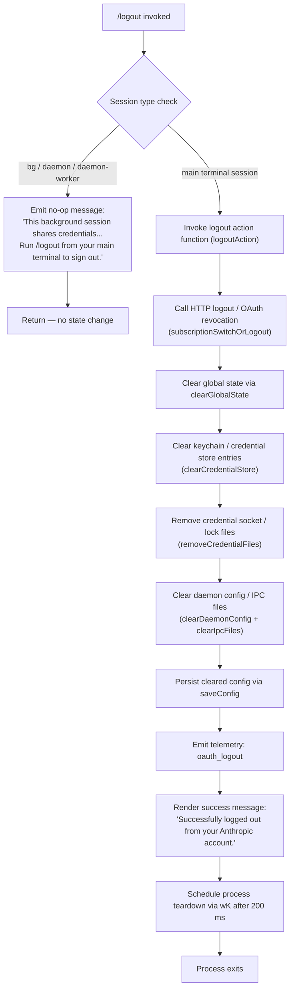

# `/logout`

> Analysis basis: CC v2.1.143 bundle.js (AST extraction + Claude interpretation)
> Minimum version: v2.1.143

---

## Overview

The `/logout` command signs the user out of their Anthropic account by clearing OAuth credentials, removing associated credential files, and resetting in-memory authentication state. It operates as a `local-jsx` command, meaning it renders feedback through the JSX UI layer before performing cleanup. In background (`bg`) or daemon-worker session types, the command is a no-op and informs the user to run `/logout` from their main terminal instead.

---

## Registration

| Field | Value |
|---|---|
| type | `local-jsx` |
| name | `logout` |
| description | `Sign out from your Anthropic account` |
| module_id | `wZ1` |

Analysis basis: CC v2.1.143 bundle.js:+10670718

---

## Input Branching

The command entry point (the render/execution function `tx4`) first checks the current session type. If the session is a background or daemon-worker context, the command short-circuits with an informational message and takes no action. Otherwise, it proceeds through the full OAuth logout and credential cleanup sequence.



Analysis basis: CC v2.1.143 bundle.js:+7541557, +7541630, +7541665, +7541667, +7541819, +7541866, +7541929, +7541961

---

## Behavioral Spec

### Session-Type Guard

Before executing any destructive action, the command inspects the current session mode. The session type string is normalized to lowercase before comparison.

```
function sessionTypeGuard(sessionType):
    normalizedType = sessionType.toLowerCase()
    if normalizedType in ["bg", "daemon", "daemon-worker"]:
        return NO_OP
    return PROCEED
```

Session type strings that trigger the no-op path: `"bg"`, `"daemon"`, `"daemon-worker"`.

Analysis basis: CC v2.1.143 bundle.js:+14528099 (toLowerCase), +2169283 ("bg"), +2169293 ("daemon"), +2169307 ("daemon-worker")

---

### OAuth Logout / Subscription-Switch Call

The logout action dispatches an HTTP-level logout request. This call is identified internally with the tag `"subscription-switch"` and, on the OAuth path, the tag `"oauth_logout"`.

```
async function performOAuthLogout():
    result = await subscriptionSwitchRequest(tag="subscription-switch")
    if result indicates oauth flow:
        tag = "oauth_logout"
    return result
```

Analysis basis: CC v2.1.143 bundle.js:+7541183 ("subscription-switch"), +7541338 ("oauth_logout"), +7541335 (call site of SH/stateUpdate)

---

### Global State Teardown

After the HTTP call, all in-memory application state is cleared via a dedicated teardown function. This includes:

- Stopping all active background tasks and intervals via `clearInterval` and `process.removeListener`.
- Removing process-level event listeners (including `"exit"` and `"beforeExit"` listeners).
- Clearing multiple internal Map and Set structures (session registry, request registry, cache maps, pending-flush sets).
- Emitting an internal shutdown event to notify subsystems.

```
function clearGlobalState():
    clearAllIntervals()
    removeProcessListeners(["exit", "beforeExit"])
    for each internalStore in [sessionMap, requestMap, cacheMap1, cacheMap2, pendingFlushSet]:
        internalStore.clear()
    emitShutdownEvent()
```

Analysis basis: CC v2.1.143 bundle.js:+3143663 (clearInterval), +3143698 (process.removeListener), +3143006 (process.off), +3143064 ("exit"), +3143721 ("beforeExit"), +3143125, +3143137, +3143149, +3143161, +3143173 (.clear calls), +3142878 (emit)

---

### Credential Store Clearance

The credential store module attempts to delete the keychain entry for the service account identified as `"claude-code-user"`. The key is derived using a SHA-256 hash (hex-encoded, first 8 characters) of the OS user info. If deletion fails, an error with the message `"Failed to delete keychain entry"` is surfaced (but does not abort the logout sequence).

```
function clearCredentialStore():
    userInfo = os.userInfo()
    key = sha256(userInfo).hex().slice(0, 8)
    serviceAccount = "claude-code-user"
    try:
        keychainDelete(serviceAccount, key)
    except error:
        log("Failed to delete keychain entry", error)
```

Analysis basis: CC v2.1.143 bundle.js:+2039414 (createHash), +2039429 ("sha256"), +2039456 ("hex"), +2039475 (8), +2039609 ("claude-code-user"), +2039577 (userInfo), +2040320 ("Failed to delete keychain entry")

---

### Socket and Lock File Removal

Credential-related socket files and IPC lock files are removed with `unlinkSync`. The file paths are constructed by joining a base directory path with filename components. Up to 5 backup copies are retained before rotation; files with `.backup.` in their name are part of this rotation scheme.

```
function removeCredentialFiles():
    socketPath = path.join(baseDir, socketFilename)
    try:
        fs.unlinkSync(socketPath)
    except ENOENT:
        pass   // already gone — not an error

    lockPath = path.join(baseDir, lockFilename)
    try:
        fs.unlinkSync(lockPath)
    except ENOENT:
        pass
```

Maximum backup files retained: 5 (Analysis basis: CC v2.1.143 bundle.js:+3163227)
Backup file name pattern includes substring `".backup."` (Analysis basis: CC v2.1.143 bundle.js:+3163094)

Analysis basis: CC v2.1.143 bundle.js:+14482768 (unlinkSync on socket), +6749910 (XZH.unlink), +10027012 (k26.unlink), +3163345 (L.unlinkSync)

---

### Config Persistence (saveConfig with Lock)

After credential clearance, the updated (empty-auth) configuration is written back to disk using an atomic write with a file lock. The lock mechanism warns if acquisition takes longer than expected. A safety guard prevents writing a config that is missing auth fields that the in-memory cache still holds — this prevents accidentally wiping `~/.claude.json` (referenced as GH #3117).

```
async function saveConfigWithLock(config):
    acquired = await acquireLock(timeoutMs=60000)
    if lockContentionDetected:
        emitTelemetry("tengu_config_lock_contention")
        log("Lock acquisition took longer than expected - another Claude instance may be running")

    existingConfig = readConfigFromDisk()
    if existingConfig.auth is present AND config.auth is missing:
        emitTelemetry("tengu_config_auth_loss_prevented")
        log("saveConfigWithLock: re-read config is missing auth that cache has; refusing to write to avoid wiping ~/.claude.json. See GH #3117.")
        return

    writeAtomically(config, mode=0o600)   // octal 600 = decimal 384
    releaseLock()
```

File write permission mode: `384` (octal `0o600`) (Analysis basis: CC v2.1.143 bundle.js:+3163509)
Lock timeout: `60000` ms (Analysis basis: CC v2.1.143 bundle.js:+3162978)
Warning string: `"Lock acquisition took longer than expected - another Claude instance may be running"` (Analysis basis: CC v2.1.143 bundle.js:+3162208)
Auth-loss prevention string: `"saveConfigWithLock: re-read config is missing auth that cache has; refusing to write to avoid wiping ~/.claude.json. See GH #3117."` (Analysis basis: CC v2.1.143 bundle.js:+3162624)

---

### Daemon Config and IPC File Clearance

Two additional cleanup functions run in sequence:

1. A daemon-config reset function that clears an internal daemon configuration cache (via `.clear()`) and removes any IPC socket files previously registered for inter-process communication.
2. An IPC path cleanup function that joins path segments and calls `unlink` on the resolved path, swallowing `ENOENT` errors.

```
function clearDaemonConfig():
    daemonConfigStore.clear()
    // daemonConfigStore corresponds to FY9

function clearIpcFiles(ipcBasePath):
    fullPath = path.join(ipcBasePath, ipcFilename)
    fs.unlink(fullPath, ignoreErrorCode="ENOENT")
```

Analysis basis: CC v2.1.143 bundle.js:+2905897 (FY9.clear), +7541415, +7541421, +7541427, +7541433, +7541458, +7541511, +7541523

---

### Process Teardown After Logout

After emitting the success message to the UI, the command schedules a clean process exit via the shutdown orchestrator (`wK`). This orchestrator:

1. Finalizes any pending output writes.
2. Waits for drain events with a grace period.
3. Calls `process.exit` or sends `SIGKILL` if the process does not exit within the timeout.

The teardown is scheduled with a `200` ms delay after the success message is rendered.

```
function scheduleProcessTeardown(delayMs=200):
    setTimeout(() => {
        shutdownOrchestrator(exitCode=0)
    }, delayMs)
```

Teardown delay: `200` ms (Analysis basis: CC v2.1.143 bundle.js:+7541961)
Grace period for output drain: `5000` ms maximum, `3500` ms target (Analysis basis: CC v2.1.143 bundle.js:+5229354, +5229361)
Fallback kill signal: `"SIGKILL"` (Analysis basis: CC v2.1.143 bundle.js:+5227919)

---

### Secure Storage Write Telemetry (Credential Layer)

The underlying credential write/delete layer emits fine-grained telemetry tags to track which storage path was used (primary keychain vs. plaintext fallback vs. both failed).

| Storage outcome | Telemetry tag |
|---|---|
| Primary keychain succeeded | `"secure_storage_credentials_write"` |
| Plaintext fallback used | `"plaintext_fallback_used"` |
| Both primary and fallback failed | `"primary_and_fallback_failed"` |

Analysis basis: CC v2.1.143 bundle.js:+2197680, +2197830, +2197933

---

## State & Side Effects

| Item | Detail |
|---|---|
| Telemetry — config lock contention | `tengu_config_lock_contention` emitted when lock acquisition is slow (bundle.js:+3162297) |
| Telemetry — stale config write | `tengu_config_stale_write` emitted when config on disk is newer than the write candidate (bundle.js:+3162433) |
| Telemetry — config parse error | `tengu_config_parse_error` emitted when `~/.claude.json` cannot be parsed (bundle.js:+3164878) |
| Telemetry — auth loss prevented | `tengu_config_auth_loss_prevented` emitted when a write would wipe existing auth tokens (bundle.js:+3162776) |
| Telemetry — feature ok/bad/sad | `tengu_feature_ok`, `tengu_feature_bad`, `tengu_feature_sad` emitted by the feature-flag gate wrapping the logout action (bundle.js:+955068, +955201, +955126) |
| Telemetry — daemon config reload | `tengu_daemon_config_reload` emitted when the daemon configuration is reloaded as part of teardown (bundle.js:+14517117) |
| Telemetry — startup perf | `tengu_startup_perf` emitted in the shutdown path's profiling report (bundle.js:+211017) |
| Telemetry — scroll summary | `tengu_scroll_summary` emitted by the scroll/output renderer during teardown (bundle.js:+5228657) |
| Telemetry — pewter brook | `tengu_pewter_brook` emitted by the fullscreen/terminal environment detection layer (bundle.js:+3332480) |
| Telemetry — cache eviction hint | `tengu_cache_eviction_hint` emitted during session-end cache cleanup (bundle.js:+5229690) |
| Process event listeners | `"exit"` and `"beforeExit"` listeners removed from `process` during global state teardown |
| In-memory stores cleared | Multiple internal Map/Set structures cleared: session registry, request queue, cache maps, pending-flush sets |
| File deletions | OAuth socket file, IPC lock file(s), daemon config files removed via `unlinkSync` / `unlink` |
| Keychain entry | `"claude-code-user"` keychain entry deleted (error is non-fatal) |
| Config file | `~/.claude.json` rewritten with auth fields removed (atomic write, mode `0o600`) |
| appState changes | Auth tokens and session identity cleared from global config store; `FY9` daemon config store cleared |
| Process lifecycle | `process.exit` called after `200` ms delay; `SIGKILL` sent as last-resort fallback |
| Sound | <!-- TODO: not found in depth-2 traversal; needs --depth 4 --> |
| Hook registration | <!-- TODO: not found in depth-2 traversal; needs --depth 4 --> |

---

## Version History

| Version | Change |
|---|---|
| v2.1.143 | Initial analysis |

---

## Common Mistakes

1. **Running `/logout` inside a background or daemon-worker session has no effect.** The command detects the session type and short-circuits with a message instructing the user to run `/logout` from their main terminal. Credentials are not cleared.

2. **Expecting `/logout` to be instantaneous.** The command schedules a 200 ms delay before initiating process teardown, and the teardown itself has a drain grace period of up to 5 000 ms. The terminal may remain open briefly after the success message appears.

3. **Assuming credential deletion is guaranteed.** Keychain deletion errors are caught and logged but do not abort the logout. If the keychain entry cannot be removed (e.g., permission denied), the rest of the logout still proceeds and the process exits, but stale keychain data may remain.

4. **Expecting `/logout` to clear project-level settings.** Only OAuth credentials and session-level auth state are removed. Project configuration files (`.claude/` directories) are unaffected.

5. **Re-running Claude immediately after `/logout` without allowing teardown to complete.** Because `saveConfigWithLock` uses a file lock with a 60 000 ms timeout, starting a new Claude process before the config write completes can result in lock contention and the `"another Claude instance may be running"` warning.

---

## Appendix — Identifier Mapping

> For bundle debugging only. Identifiers change across versions.

| Identifier | Role |
|---|---|
| `cD6` | Core logout action function (performs HTTP logout, clears state, orchestrates cleanup) |
| `tx4` | Command render/entry-point function (session-type guard + UI rendering) |
| `dD6` | Global state teardown orchestrator (calls all sub-cleanup functions) |
| `T1` | Session-type classifier (maps raw session string to typed enum) |
| `cB` | Session-type enum or helper used by classifier |
| `rz6` | First sub-cleanup function called by teardown orchestrator |
| `Il6` | Second sub-cleanup function called by teardown orchestrator |
| `Nl6` | Daemon config store clear function (calls `FY9.clear`) |
| `cMH` | Third sub-cleanup function called by teardown orchestrator |
| `Y0H` | Shutdown event emitter and process-listener removal coordinator |
| `Ts` | Terminal/environment string resolver |
| `xH` | String coercion utility |
| `jF` | Formatting helper used during environment resolution |
| `imH` | Internal cleanup orchestrator (clears intervals, process listeners, internal maps) |
| `_9_` | Interval and process-listener teardown helper |
| `NH` | Error logging / error-queue manager |
| `v_` | Error object constructor/wrapper |
| `zq` | Request queue accessor |
| `kNK` | Request queue rotation helper (shift/push) |
| `ID1` | IPC / daemon file removal function |
| `ND1` | Sub-function of IPC file removal |
| `NP_` | Path constructor for IPC files |
| `cDA` | IPC path component resolver |
| `k_H` | Path join utility used in IPC file removal |
| `w96` | IPC path builder (joins directory components) |
| `d0_` | Additional file cleanup function (removes credential socket) |
| `YC_` | Socket teardown helper (clears timeout, closes socket) |
| `jC_` | Socket object used by teardown helper |
| `ND8` | Path builder for socket file |
| `Po` | <!-- TODO: not found in depth-2 traversal; needs --depth 4 --> |
| `n8_` | Config persistence coordinator (save-with-lock + backup) |
| `aY9` | Config write dispatcher |
| `edA` | Keychain / credential store delete function |
| `PN` | SHA-256 key derivation helper |
| `KP` | Keychain platform abstraction |
| `nV` | OS user-info resolver |
| `v` | HTTP request utility (used for OAuth logout HTTP call) |
| `G5K` | HTTP request builder |
| `H` | Retry/jitter timer (uses `Math.random` + `setTimeout`) |
| `hH` | JSON serialization helper |
| `_` | String/path utility |
| `P7` | URL/path manipulation helper |
| `cSH` | Request header constructor |
| `Z5K` | HTTP response handler / streaming body processor |
| `XH` | String conversion utility |
| `a6` | Global config read/write function (`saveGlobalConfig`) |
| `P9_` | Config file write with lock implementation |
| `x6` | File-existence / stat utility |
| `heA` | Config object merge helper |
| `d` | Telemetry event emitter (used throughout) |
| `L8` | Logger utility |
| `H$H` | Config file reader with backup support |
| `d76` | Config diff / validation helper |
| `X9_` | Backup file path builder |
| `V` | Active-session registry Map |
| `X` | SDK/connection manager |
| `Z` | Supervisor or session controller |
| `yA6` | Atomic file write utility (uses temp file + rename) |
| `emH` | Event emitter for config changes |
| `OZ9` | Config entry iterator |
| `HpH` | Timestamp helper for config writes |
| `j9_` | Project-level config writer |
| `v8_` | Fallback config write path |
| `dK` | Secure storage (keychain) abstraction layer |
| `peA` | Credential read/write/delete orchestrator |
| `UxH` | Credential cache accessor |
| `Q$L` | Storage context runner (uses `AsyncLocalStorage`) |
| `SH` | Feature-flag gate emitting `tengu_feature_ok` |
| `J8` | Feature-flag gate emitting `tengu_feature_sad` |
| `mH` | Feature-flag gate emitting `tengu_feature_bad` |
| `mjH` | <!-- TODO: not found in depth-2 traversal; needs --depth 4 --> |
| `cFH` | Telemetry/OTEL attribute builder |
| `YE` | OTEL attribute value coercer |
| `OL` | OTEL metric event emitter |
| `DV8` | OTEL base metric descriptor |
| `dFH` | OTEL span/metric constructor |
| `pu` | Random-bytes-based ID generator for OTEL sessions |
| `V6` | Global value registry |
| `g3_` | String coercion for OTEL attribute keys |
| `L5` | OTEL attribute list builder |
| `Do9` | OTEL instrument type resolver |
| `v68` | Frozen OTEL attribute set builder |
| `wH6` | OTEL event sequence tracker |
| `wK` | Process shutdown orchestrator |
| `x9` | Core shutdown sequencer (drain, exit, kill) |
| `K` | Column/pad formatter used in output rendering |
| `CEH` | Terminal output finalizer (unmount, writeSync) |
| `qS` | <!-- TODO: not found in depth-2 traversal; needs --depth 4 --> |
| `za6` | Terminal escape-sequence writer (saves/restores cursor: `\x1b7` / `\x1b8`) |
| `dY_` | Startup/shutdown display renderer |
| `EV` | <!-- TODO: not found in depth-2 traversal; needs --depth 4 --> |
| `sh` | <!-- TODO: not found in depth-2 traversal; needs --depth 4 --> |
| `hO6` | File-system stat helper used during display |
| `g3` | Display column builder |
| `W91` | <!-- TODO: not found in depth-2 traversal; needs --depth 4 --> |
| `cY_` | Process exit executor (calls `process.exit` or `process.kill`) |
| `XSH` | Output stream drain helper |
| `Y` | Supervisor session manager (stop/start/updateConfig) |
| `XJH` | Session state serializer |
| `cIq` | Column width calculator |
| `T` | Input event interceptor (preventDefault + remoteControl) |
| `G_K` | Heartbeat manager |
| `I66` | Startup profiling reporter |
| `wN8` | Performance mark collector |
| `e6A` | Profiling log file writer |
| `N_8` | Scroll/render summary emitter |
| `X91` | <!-- TODO: not found in depth-2 traversal; needs --depth 4 --> |
| `P91` | Frame timing calculator (Date.now, Math.max, Math.round) |
| `rA` | Terminal environment detector (fullscreen/tmux/SSH) |
| `ieH` | <!-- TODO: not found in depth-2 traversal; needs --depth 4 --> |
| `k_8` | Parallel cleanup promise coordinator (Promise.all / Promise.race) |
| `r8` | Timeout-with-abort helper |