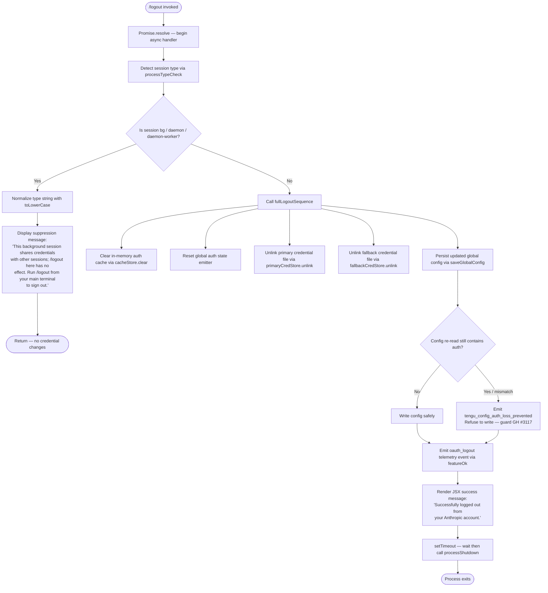

# `/logout`

> Analysis basis: CC v2.1.143 bundle.js (AST extraction + Claude interpretation)
> Minimum version: v2.1.143

---

## Overview

The `/logout` command signs the current user out of their Anthropic account by clearing stored OAuth credentials, unlinking credential files, resetting in-memory auth state, and emitting a structured logout event. It is a local JSX-rendered command that resolves immediately in background/daemon sessions without performing any credential erasure, and performs the full teardown only from a primary (non-background) terminal session.

---

## Registration

| Field | Value |
|---|---|
| type | `local-jsx` |
| name | `logout` |
| description | `Sign out from your Anthropic account` |
| module_id | `wZ1` |

Analysis basis: CC v2.1.143 bundle.js:+10670718

---

## Input Branching

The command entry point (`commandHandler`) first resolves a promise, then checks whether the current process is a background/daemon session. If it is, logout is suppressed and an informational message is displayed. If it is not, the full logout sequence is performed, a success message is displayed, and the process exits cleanly.



Analysis basis: CC v2.1.143 bundle.js:+7540769, +7540799, +7540820, +7541338, +7541580, +7541630, +7541667, +7541841, +7541866, +7541929

---

## Behavioral Spec

### Session-Type Guard

```
function sessionTypeGuard(sessionContext):
    rawType = sessionContext.getProcessType()       // reads process/session metadata
    normalizedType = rawType.toLowerCase()          // Analysis basis: +14528099
    if normalizedType is one of ["bg", "daemon", "daemon-worker"]:
        return SUPPRESSED
    return PROCEED
```

When the normalized session type matches `"bg"`, `"daemon"`, or `"daemon-worker"`, the command displays the suppression message and returns without modifying any credential state.

- Session type string constants: `"bg"` (bundle.js:+2169283), `"daemon"` (bundle.js:+2169293), `"daemon-worker"` (bundle.js:+2169307)
- `toLowerCase` normalization: bundle.js:+14528099
- Suppression message literal: bundle.js:+7541667

### Credential File Unlinking

Two credential stores are unlinked during a full logout:

```
function unlinkCredentialFiles():
    primaryCredStore.unlink()       // Analysis basis: +6749910
    fallbackCredStore.unlink()      // Analysis basis: +10027012
```

The primary store unlink is performed inside `primaryCredentialCleaner` (identifier `ID1`), which also calls helpers `ND1`, `NP_`, `k_H`, and `w96` before invoking `XZH.unlink`.

Analysis basis: CC v2.1.143 bundle.js:+6749846, +6749852, +6749875, +6749898, +6749910

The fallback store unlink is performed inside `fallbackCredentialCleaner` (identifier `d0_`), which calls `YC_` for path resolution, then `k26.unlink`, then `ND8`.

Analysis basis: CC v2.1.143 bundle.js:+10026996, +10027012, +10027023

### In-Memory Cache Eviction

```
function evictAuthCache():
    authCacheStore.clear()          // FY9.clear — Analysis basis: +2905897
```

The cache store (`FY9`) is cleared unconditionally as part of the full logout sequence. This ensures that any in-process credential cache does not survive the logout even if file unlinking succeeds.

Analysis basis: CC v2.1.143 bundle.js:+2905897

### Auth-State Reset and Event Emission

```
function resetAuthState():
    authStateManager.reset()        // Ts — +3142856
    authStateHelper()               // imH — +3142872
    authEventEmitter.emit(...)      // nmH.emit — +3142878
    postResetCallback()             // k0 — +3142893
    authGuard()                     // NH — +3142917
    validationHelper()              // v_ — +3142920
```

After cache eviction, the in-process auth state is reset and a reset event is emitted to any registered listeners.

Analysis basis: CC v2.1.143 bundle.js:+3142856, +3142878

### Config Persistence Safety Guard (GH #3117)

```
function saveGlobalConfigSafely(cachedConfig):
    latestConfig = reReadConfigFromDisk()
    if latestConfig is missing auth AND cachedConfig has auth:
        emit telemetry("tengu_config_auth_loss_prevented")
        log warning: "saveGlobalConfig fallback: re-read config is missing auth
                      that cache has; refusing to write. See GH #3117."
        return WITHOUT writing
    writeConfigToDisk(latestConfig)
```

This guard prevents a race condition where a re-read of the config file is missing auth data that the in-memory cache still holds, which would otherwise silently erase credentials from disk.

- Warning literal: bundle.js:+3159506
- Telemetry event `tengu_config_auth_loss_prevented`: bundle.js:+3159634

### OAuth Logout Telemetry and Feature Confirmation

```
function emitLogoutTelemetry():
    featureOk(event="oauth_logout")     // SH -> d -> tengu_feature_ok
```

After the credential teardown completes, the feature-success telemetry is emitted with event label `"oauth_logout"`.

- `"oauth_logout"` literal: bundle.js:+7541338
- `tengu_feature_ok` emission via `SH`: bundle.js:+7541335, +955068

### Secure Storage Write Path (Credential Store Layer)

The credential store abstraction (`peA`) supports both a secure storage path and a plaintext fallback:

```
function credentialStoreOperation(op):
    try:
        result = primaryStore.op()                  // H.read / H.update / H.delete
        if op is write:
            emit telemetry("secure_storage_credentials_write")
        return result
    except:
        result = fallbackStore.op()                 // _.read / _.update / _.delete
        if op is write:
            emit telemetry("plaintext_fallback_used")
        return result
    if both fail:
        emit telemetry("primary_and_fallback_failed")
        raise
```

- `"secure_storage_credentials_write"`: bundle.js:+2197680
- `"plaintext_fallback_used"`: bundle.js:+2197830
- `"primary_and_fallback_failed"`: bundle.js:+2197933
- `Promise.all` used for concurrent resolution: bundle.js:+2198008

### Success Render and Process Shutdown

```
function renderSuccessAndExit():
    renderJSX(
        type = "system",
        content = "Successfully logged out from your Anthropic account."
    )
    setTimeout(delay, function():
        initiateProcessShutdown()
    )
```

The success message is rendered as a JSX system message. A `setTimeout` defers the process shutdown to allow the UI to flush.

- `"system"` role literal: bundle.js:+7541819
- Success message literal: bundle.js:+7541866
- `setTimeout` call: bundle.js:+7541929

### Process Shutdown Sequence (`processShutdown`)

```
function processShutdown():
    writeSync(stdout, finalOutput)      // eOH.writeSync — flush remaining output
    unmountReactRoot()                  // H.unmount
    clearTimeout(pendingTimers)
    process.exit(code)                  // cY_ -> process.exit
    // Fallback if exit hangs:
    process.kill(pid, "SIGKILL")        // cY_ -> process.kill
    // Should never reach:
    throw Error("unreachable")
```

- `process.exit`: bundle.js:+5227869
- `process.kill` with `"SIGKILL"`: bundle.js:+5227894, +5227919
- `"unreachable"` sentinel: bundle.js:+5227942
- `session_end` event emitted during shutdown: bundle.js:+5229725

### Subscription-Switch Detection

The logout flow inspects a `"subscription-switch"` flag during the logout/re-auth cycle to determine whether a subscription type change is in progress.

- `"subscription-switch"` literal: bundle.js:+7541183

### HTTP Error Classification (used in OAuth token revocation path)

```
function classifyHttpError(error):
    if error is AxiosError:
        if status is 401 or 403: return "auth"
        if code is "ECONNABORTED": return "timeout"
        if code is "ECONNREFUSED" or "ENOTFOUND": return "network"
        return "http"
    return "other"
```

- HTTP status 401: bundle.js:+172750
- HTTP status 403: bundle.js:+172759
- `"ECONNABORTED"` / `"timeout"`: bundle.js:+172814, +172841
- `"ECONNREFUSED"` / `"ENOTFOUND"` / `"network"`: bundle.js:+172883, +172908, +172932
- `"auth"`, `"http"`, `"other"`: bundle.js:+172775, +172974, +172695

Analysis basis: CC v2.1.143 bundle.js:+172610, +172646

---

## State & Side Effects

| Item | Detail |
|---|---|
| Telemetry — `tengu_config_auth_loss_prevented` | Fired when config re-read is missing auth that cache holds; write is suppressed (bundle.js:+3159634) |
| Telemetry — `tengu_feature_ok` | Fired with label `"oauth_logout"` on successful logout completion (bundle.js:+955068) |
| Telemetry — `tengu_cache_eviction_hint` | Fired during process shutdown cache-cleanup path (bundle.js:+5229690) |
| Telemetry — `secure_storage_credentials_write` | Fired when credential write succeeds via the primary secure store (bundle.js:+2197680) |
| Telemetry — `plaintext_fallback_used` | Fired when credential write falls back to plaintext store (bundle.js:+2197830) |
| Telemetry — `primary_and_fallback_failed` | Fired when both credential stores fail (bundle.js:+2197933) |
| Credential files unlinked | Primary credential file (`XZH.unlink`) and fallback credential file (`k26.unlink`) are removed from disk (bundle.js:+6749910, +10027012) |
| In-memory cache cleared | `authCacheStore.clear()` (`FY9.clear`) is called unconditionally in non-background sessions (bundle.js:+2905897) |
| Auth state reset | In-process auth state is reset and an event is emitted to all listeners (bundle.js:+3142856, +3142878) |
| Config written | Global config is persisted with auth removed, subject to the GH #3117 safety guard (bundle.js:+3159506) |
| JSX render | A `"system"` role message is rendered: `"Successfully logged out from your Anthropic account."` (bundle.js:+7541866) |
| Process exit | After a `setTimeout` delay, the process is shut down; `SIGKILL` is sent as a hard fallback if `process.exit` does not terminate (bundle.js:+5227869, +5227894) |
| Background session | No side effects — command returns immediately with suppression message (bundle.js:+7541667) |
| Hook registration | <!-- TODO: not found in depth-2 traversal; needs --depth 4 --> |
| Sound | <!-- TODO: not found in depth-2 traversal; needs --depth 4 --> |

---

## Version History

| Version | Change |
|---|---|
| v2.1.143 | Initial analysis |

---

## Common Mistakes

1. **Running `/logout` from a background or daemon session**: The command detects session types `"bg"`, `"daemon"`, and `"daemon-worker"` and refuses to perform any credential changes in those contexts. You must run `/logout` from your primary (foreground) terminal session for the logout to take effect.

2. **Expecting immediate re-login prompt**: `/logout` terminates the process after displaying the success message. It does not drop you into a re-authentication flow in the same session; you must relaunch Claude Code to authenticate again.

3. **Assuming only one credential file is removed**: Two separate credential stores are unlinked — the primary secure store and the plaintext fallback store. If your environment uses only the plaintext fallback (e.g., keychain unavailable), the fallback file is still removed.

4. **Race conditions with config writes**: The GH #3117 guard means that if the config file on disk has already lost its auth section (e.g., modified by another process) by the time `/logout` attempts to write, the write will be suppressed and `tengu_config_auth_loss_prevented` will be emitted. This is intentional and not a bug.

5. **Expecting `/logout` to affect other open sessions**: Credential file unlinking affects the shared on-disk credential files, but other already-running Claude Code processes may retain in-memory auth state until they are restarted.

---

## Appendix — Identifier Mapping

> For bundle debugging only. Identifiers change across versions.

| Identifier | Role |
|---|---|
| `cD6` | Command handler — main logout execution function |
| `tx4` | Top-level command render/orchestration function (JSX wrapper) |
| `dD6` | Full logout sequence coordinator |
| `A` | Session-type normalizer (calls `f.toLowerCase`) |
| `f` | Connection/socket close helper (calls `A.close`, `q.close`) |
| `T1` | Process-type classifier / session detector |
| `cB` | Sub-helper called by process-type classifier |
| `rz6` | Logout sub-step (first step in `dD6` sequence) |
| `Il6` | Logout sub-step (second step in `dD6` sequence) |
| `Nl6` | Auth cache clearer (calls `FY9.clear`) |
| `cMH` | Logout sub-step (fourth step in `dD6` sequence) |
| `Y0H` | Auth-state reset and event emitter |
| `ID1` | Primary credential file unlinker (calls `XZH.unlink`) |
| `d0_` | Fallback credential file unlinker (calls `k26.unlink`) |
| `Po` | Intermediate helper called after `dD6` in command handler |
| `n8_` | Auth/config persistence orchestrator |
| `aY9` | Config error handler sub-routine |
| `a6` | `saveGlobalConfig` implementation (includes GH #3117 guard) |
| `v8_` | Config write helper called after `aY9` in `n8_` |
| `dK` | Credential store abstraction loader |
| `peA` | Credential store implementation (secure + plaintext fallback) |
| `mjH` | Intermediate helper called after `dK` in command handler |
| `SH` | Feature-success telemetry emitter (emits `tengu_feature_ok`) |
| `d` | Core telemetry dispatch function |
| `cFH` | Logout event emission helper (emits structured logout event) |
| `YE` | Event emission sub-helper (calls `XH`) |
| `OL` | Event field serializer / emitter (uses `Object.entries`, `A.emit`) |
| `H` | Random delay / jitter generator (calls `Math.random`, `setTimeout`) |
| `wK` | Process shutdown orchestrator |
| `x9` | Async process-exit sequence handler |
| `v` | HTTP / network error classifier |
| `CEH` | Terminal output flusher and React root unmounter |
| `dY_` | Final output writer / dim-formatter (calls `eOH.writeSync`) |
| `cY_` | Hard process terminator (calls `process.exit`, `process.kill`) |