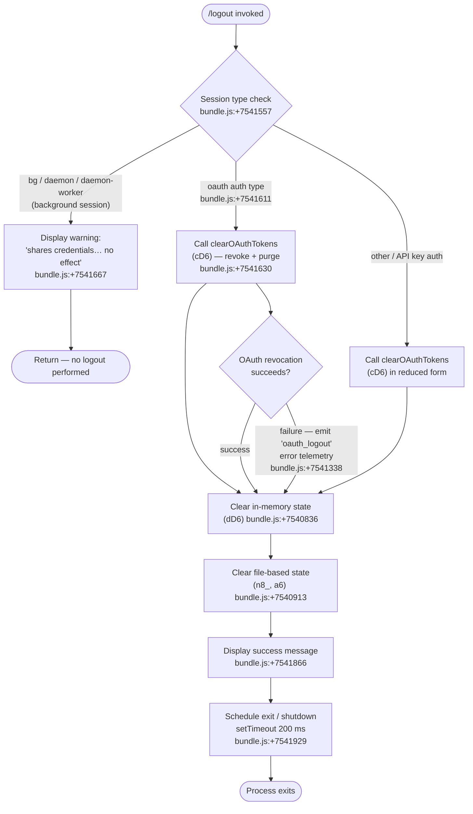

# `/logout`

> Analysis basis: CC v2.1.143 bundle.js (AST extraction + Claude interpretation)
> Minimum version: v2.1.143

---

## Overview

The `/logout` command signs the user out of their Anthropic account by clearing OAuth credentials, removing keychain entries, and purging all in-memory and on-disk authentication state. It is a `local-jsx` command whose handler is the async function `tx4` (resolved via `module_id` → `wZ1`). Background/daemon sessions detect shared credentials and block the logout, directing the user to their main terminal instead.

---

## Registration

| Field | Value |
|---|---|
| type | `local-jsx` |
| name | `logout` |
| description | Sign out from your Anthropic account |
| loc_byte | `10670718` |
| loc_byte_end | `10670906` |
| loc_line | `6317` |
| module_id | `wZ1` |
| load_inline | `true` |
| arbor_handler.name | `tx4` |
| arbor_handler.fqn | `claude-2.1.143::tx4` |
| arbor_handler.kind | `AsyncFunction` |
| arbor_handler.resolution_path | `module_id` |
| arbor_handler.n_hits | `0` |

Analysis basis: CC v2.1.143 bundle.js:+10670718

---

## Input Branching

Four distinct execution paths exist, warranting a Mermaid flowchart.



---

## Behavioral Spec

### 1. Session-Type Guard

Before any credential work, the handler checks the current session mode.

```
async function logoutHandler(context):
    sessionType = getSessionType(context)   // T1 → cB
    if sessionType in ["bg", "daemon", "daemon-worker"]:
        displayWarning(
            "This background session shares credentials with other sessions; " +
            "/logout here has no effect. Run /logout from your main terminal to sign out."
        )
        return   // abort — no side effects
```

Session type constants found in literals: `"bg"` (bundle.js:+2169283), `"daemon"` (bundle.js:+2169293), `"daemon-worker"` (bundle.js:+2169307).

Analysis basis: CC v2.1.143 bundle.js:+7541557

---

### 2. OAuth Token Revocation (`clearOAuthTokens`)

When the session type is `"oauth"` (bundle.js:+7541611), the handler calls the OAuth-clearing function (`cD6`).

```
async function clearOAuthTokens():
    await Promise.resolve()                  // micro-task fence
    closeOpenStreams()                       // F0_ — close active I/O
    normalizeAuthType()                      // A → f.toLowerCase
    shutdownDaemonConnections()              // dD6 sub-steps below
    unlinkOAuthLockFile()                    // ID1 → XZH.unlink
    clearConversationCache()                 // d0_ → k26.unlink
    emitTelemetry("oauth_logout")            // SH — bundle.js:+7541338
```

Analysis basis: CC v2.1.143 bundle.js:+7541630

---

### 3. In-Memory State Teardown (`dD6`)

Called unconditionally after credential revocation begins.

```
function clearInMemoryState():
    clearAuthCache()           // rz6
    clearSessionInfo()         // Il6
    clearNotificationMap()     // Nl6 → FY9.clear (bundle.js:+2905897)
    clearMetricsCollector()    // cMH
    shutdownEventLoop()        // Y0H:
        stopHeartbeatTimer()       // imH → _9_ → clearInterval
        removeProcessListeners()   // imH → process.removeListener (bundle.js:+3143698)
        process.off(...)           // imH → process.off (bundle.js:+3143006)
        clearMultipleRegistries()  // sMH, Ri6, x76, nA_, PF → .clear()
        emitShutdownEvent()        // nmH.emit
        flushPendingLogs()         // NH — network queue drain
```

Lock-acquisition warning: `"Lock acquisition took longer than expected - another Claude instance may be running"` (bundle.js:+3162208).

Config auth-loss guard: if the re-read config is missing auth that the cache holds, the write is refused with message referencing GH #3117 (bundle.js:+3162624).

Analysis basis: CC v2.1.143 bundle.js:+7540836

---

### 4. Keychain / File Credential Removal

Two parallel file-system cleanup paths run:

#### 4a. Keychain entry deletion (`n8_` → `aY9` → `edA`)

```
function deleteKeychainEntry():
    accountId = deriveAccountId()           // PN → adA.createHash("sha256") → hex slice [0:8]
    serviceLabel = "claude-code-user"       // bundle.js:+2039609
    try:
        removeKeychainEntry(accountId, serviceLabel)   // KP → KXH
        resolveUserInfo()                              // nV → sdA.userInfo
    except:
        log("Failed to delete keychain entry")         // bundle.js:+2040320
```

Hash algorithm: `"sha256"`, output encoding `"hex"`, prefix length `8` characters (bundle.js:+2039429, +2039456, +2039475).

Analysis basis: CC v2.1.143 bundle.js:+7540913

#### 4b. Global config credential purge (`a6`)

```
function purgeGlobalConfigCredentials():
    acquireConfigLock()       // P9_ — with 60 000 ms timeout (bundle.js:+3162978)
    reReadConfigFromDisk()    // H$H → q.readFileSync, encoding "utf-8"
    if cacheHasAuthButDiskDoesNot():
        log("saveGlobalConfig fallback: … refusing to write. See GH #3117.")  // bundle.js:+3159506
        return
    removeAuthFields()
    writeConfigAtomically()   // yA6 — uses randomBytes(6), temp file, fchmodSync, fsyncSync, renameSync
    rotateBackups()           // X9_ → lz.join("..", "backups"), keep max 5 (bundle.js:+3163227)
```

Backup directory name: `"backups"` (bundle.js:+3163809). Backup filename contains `".backup."` (bundle.js:+3163094). Config file mode: octal `0600` (decimal `384`, bundle.js:+3163509).

Analysis basis: CC v2.1.143 bundle.js:+7540961

---

### 5. Success Display and Process Exit

```
async function displaySuccessAndExit():
    renderJSXMessage("Successfully logged out from your Anthropic account.")
        // g0_.createElement, type="system" (bundle.js:+7541819, +7541866)
    await shutdownSubprocesses()    // wK → x9 → CEH / dY_ / cY_
    setTimeout(() => process.exit(), 200)   // bundle.js:+7541929, literal 200
```

The exit delay of 200 ms (bundle.js:+7541961) allows the JSX renderer to flush its final frame before the process terminates.

Analysis basis: CC v2.1.143 bundle.js:+7541841

---

### 6. Metrics / OTEL Flush (`cFH` → `OL`)

Before the process exits, telemetry attributes are serialized and emitted:

```
function flushOtelMetrics():
    buildAttributes():
        set("user.id", ...)
        set("session.id", ...)          // if OTEL_METRICS_INCLUDE_SESSION_ID
        set("app.version", "2.1.143")   // bundle.js:+4867428
        set("organization.id", ...)
        set("user.email", ...)          // if OTEL_METRICS_INCLUDE_ACCOUNT_UUID
        set("terminal.type", ...)
    emitEventBatch(A.emit)              // OL → A.emit (bundle.js:+4868680)
```

Build timestamp embedded in bundle: `"2026-05-15T17:39:39Z"` (bundle.js:+4867517).
Commit hash embedded in bundle: `"cfb8132e4c3551e2773f41a1900efd1cc93637db"` (bundle.js:+4867548).

Analysis basis: CC v2.1.143 bundle.js:+7541568

---

## State & Side Effects

| Item | Detail |
|---|---|
| Telemetry — config lock contention | `tengu_config_lock_contention` (bundle.js:+3162297) |
| Telemetry — stale config write | `tengu_config_stale_write` (bundle.js:+3162433) |
| Telemetry — config parse error | `tengu_config_parse_error` (bundle.js:+3164878) |
| Telemetry — auth loss prevented | `tengu_config_auth_loss_prevented` (bundle.js:+3162776) |
| Telemetry — feature ok | `tengu_feature_ok` (bundle.js:+955068) |
| Telemetry — feature sad | `tengu_feature_sad` (bundle.js:+955201) |
| Telemetry — feature bad | `tengu_feature_bad` (bundle.js:+955126) |
| Telemetry — daemon config reload | `tengu_daemon_config_reload` (bundle.js:+14517117) |
| Telemetry — startup perf | `tengu_startup_perf` (bundle.js:+211017) |
| Telemetry — scroll summary | `tengu_scroll_summary` (bundle.js:+5228657) |
| Telemetry — display mode | `tengu_pewter_brook` (bundle.js:+3332480) |
| Telemetry — cache eviction | `tengu_cache_eviction_hint` (bundle.js:+5229690) |
| Keychain removal | Deletes entry under service `"claude-code-user"` keyed by SHA-256 hash of account ID (first 8 hex chars) |
| Config file | Atomically removes auth fields from `~/.claude.json`; creates up to 5 rolling backups in `backups/` subdirectory |
| In-memory caches | Clears `FY9`, `sMH`, `Ri6`, `x76`, `nA_`, `PF` registries; removes all process event listeners |
| OTEL metrics | Flushed synchronously before exit via `OL → A.emit` |
| Process lifecycle | `process.exit()` called after 200 ms delay via `setTimeout` |
| Background session guard | No credential state is modified when session type is `bg`, `daemon`, or `daemon-worker` |
| Sound | <!-- TODO: not found in depth-2 traversal; needs --depth 4 --> |

---

## Version History

| Version | Change |
|---|---|
| v2.1.143 | Initial analysis |

---

## Common Mistakes

1. **Running `/logout` in a background or daemon session** — the command detects session types `"bg"`, `"daemon"`, and `"daemon-worker"` and exits immediately with a warning. Only the main terminal session performs the actual sign-out.
2. **Expecting an interactive confirmation prompt** — `/logout` begins credential removal immediately with no confirmation step; the first user-visible output may be the success message just before exit.
3. **Assuming the process stays alive after logout** — the handler schedules `process.exit()` with a 200 ms delay. Any code or hooks that need to run post-logout must complete within that window.
4. **Concurrent Claude instances holding config lock** — if another Claude instance is running, lock acquisition may emit `tengu_config_lock_contention` and display `"Lock acquisition took longer than expected"`. The logout will still proceed but config writes may be delayed.
5. **Auth-loss prevention refusing writes** — if the on-disk `~/.claude.json` already lost auth fields (e.g., manual edit) but the in-memory cache still has them, the atomic write is aborted to avoid data loss (GH #3117 guard). This is logged but does not surface as a user-visible error.

---

## Appendix — Identifier Mapping

> For bundle debugging only. Identifiers change across versions.

| Identifier | Role |
|---|---|
| `tx4` | Main logout handler (`AsyncFunction`, arbor-resolved via `module_id` → `wZ1`) |
| `cD6` | OAuth token clearing / credential revocation orchestrator |
| `dD6` | In-memory state teardown coordinator |
| `T1` | Session-type retrieval helper |
| `cB` | Session-type constant resolver |
| `F0_` | Open stream closer |
| `A` | Auth-type normalizer (calls `f.toLowerCase`) |
| `f` | Stream/handle object (has `.close`, `.finally`) |
| `q` | Secondary handle / file-system namespace (has `unlinkSync`, `add`, `delete`) |
| `L` | Lock / set manager (has `q.add`, `f.finally`, `q.delete`) |
| `rz6` | Auth cache clearer |
| `Il6` | Session info clearer |
| `Nl6` | Notification map clearer (calls `FY9.clear`) |
| `cMH` | Metrics collector clearer |
| `Y0H` | Event-loop / heartbeat shutdown orchestrator |
| `Ts` | Heartbeat/timer stop helper |
| `xH` | String conversion utility |
| `jF` | Timer flush helper |
| `imH` | Process-listener removal and multi-registry clear |
| `_9_` | Interval and process-listener teardown |
| `NH` | Network/log queue flusher (has `xRH.push`, `Wc.logError`) |
| `v_` | Error formatter |
| `zq` | Essential-traffic queue manager |
| `kNK` | Queue shift/push helper (`Ch6`) |
| `ID1` | OAuth lock-file and credential-file unlinker |
| `ND1` | OAuth credential directory resolver |
| `NP_` | Credential path builder |
| `cDA` | Credential directory access helper |
| `k_H` | Path join utility |
| `w96` | File path composer (`dDA.join`) |
| `d0_` | Conversation/cache file unlinker |
| `YC_` | Cache timeout clearance helper |
| `jC_` | Cache timer reference |
| `ND8` | Cache file path builder (`V1q.join`) |
| `Po` | Post-revocation cleanup step |
| `n8_` | Keychain + global-config credential removal dispatcher |
| `aY9` | Keychain entry deletion orchestrator |
| `edA` | Keychain low-level delete implementation |
| `PN` | Account-ID hash builder (`adA.createHash`) |
| `KP` | Keychain platform adapter |
| `KXH` | Native keychain binding |
| `nV` | User-info resolver (`sdA.userInfo`) |
| `v` | Telemetry / event dispatch helper |
| `G5K` | Telemetry attribute builder |
| `hH` | JSON serializer wrapper (`JSON.stringify`) |
| `P7` | URL / string path builder |
| `cSH` | Context/scope helper |
| `Z5K` | Telemetry flush / file writer |
| `XH` | String cast utility |
| `a6` | Global config credential purge handler |
| `P9_` | Config lock acquisition and atomic write orchestrator |
| `heA` | Config object merge helper (`Object.assign`) |
| `L8` | Config field validator |
| `H$H` | Config file reader and parser |
| `d76` | Config diff/delta helper |
| `X9_` | Backup rotation helper (`lz.join`, keeps 5 backups) |
| `yA6` | Atomic file write helper (temp file + `fchmodSync` + `fsyncSync` + `renameSync`) |
| `emH` | Event emitter registry |
| `OZ9` | Config entries iterator (`Object.entries`) |
| `HpH` | Timestamp helper (`Date.now`) |
| `j9_` | Project-level config write helper |
| `v8_` | Supplementary credential cleanup |
| `dK` | Secure storage / credential store manager |
| `peA` | Storage read/write/delete dispatcher |
| `UxH` | Storage read-async orchestrator |
| `Q$L` | Async-local-storage context runner (`CeA.getStore` / `CeA.run`) |
| `SH` | Feature-flag "ok" telemetry emitter |
| `J8` | Feature-flag "sad" telemetry emitter |
| `mH` | Feature-flag "bad" telemetry emitter |
| `mjH` | Miscellaneous post-logout cleanup |
| `cFH` | OTEL metrics flush / attribute serializer |
| `YE` | Error type classifier |
| `OL` | OTEL event batch emitter (`A.emit`) |
| `DV8` | OTEL exporter initializer |
| `dFH` | OTEL attribute set builder |
| `pu` | Random-bytes session-ID generator |
| `V6` | Version/build-info accessor |
| `g3_` | String-to-attribute converter |
| `L5` | OTEL meter/counter helper |
| `Do9` | OTEL gauge/histogram builders |
| `v68` | Frozen attribute-set factory (`Object.freeze`) |
| `wH6` | Workspace host-path serializer |
| `wK` | UI shutdown / process-exit orchestrator |
| `x9` | Full shutdown sequence runner |
| `K` | Column formatter (`L.map` / `f.padEnd`) |
| `CEH` | Terminal unmount / final render flusher |
| `qS` | Terminal cleanup helper |
| `za6` | Raw terminal write helper (`Qs.writeSync`) |
| `dY_` | Final output line writer (`eOH.writeSync`) |
| `EV` | Environment variable reader |
| `sh` | Shell helper |
| `hO6` | Working-directory stat helper |
| `g3` | KL-renderer integration helper |
| `W91` | Escape-sequence sanitizer |
| `cY_` | Process kill / SIGKILL dispatcher (`process.kill`) |
| `XSH` | Write-stream drain helper (`at_.drain`) |
| `Y` | Supervisor / remote-control loop runner |
| `XJH` | Session-state serializer |
| `cIq` | Column-width calculator (`Math.max`) |
| `T` | Remote-control event handler (`m.preventDefault`) |
| `G_K` | Heartbeat pulse emitter (`Zs`) |
| `I66` | Startup-perf profiling reporter |
| `wN8` | Perf mark recorder (`Math.round`) |
| `e6A` | Perf log file writer |
| `N_8` | Scroll-summary reporter |
| `X91` | Scroll metric accumulator |
| `P91` | Duration/ratio calculator (`Date.now`, `Math.round`) |
| `rA` | Display-mode detector (fullscreen vs. default) |
| `ieH` | Cache-eviction hint emitter |
| `k_8` | Parallel-shutdown task runner (`Promise.race`) |
| `r8` | Abort-aware timeout helper |

---

Note: index built via Arbor fallback; some signals (telemetry, literals) may be missing — see arbor-fallback.js.