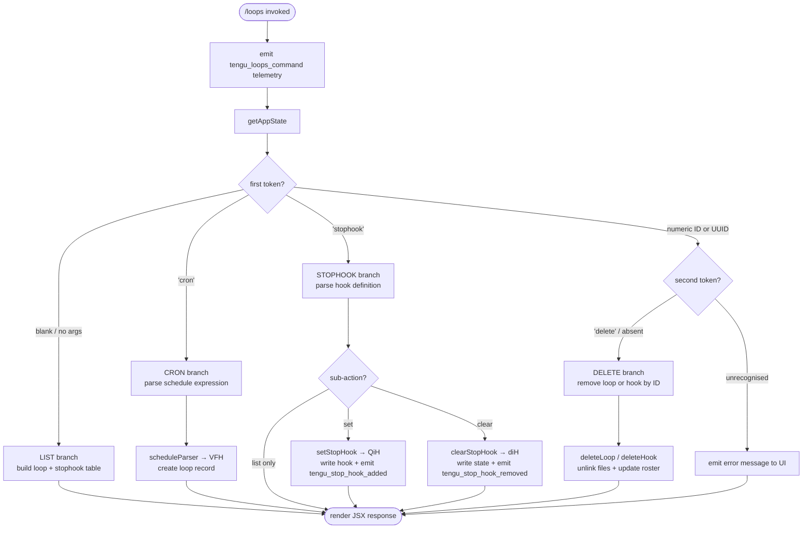

# `/loops`

> Analysis basis: CC v2.1.143 bundle.js (AST extraction + Claude interpretation)
> Minimum version: v2.1.143

---

## Overview

The `/loops` command provides a unified management interface for two related scheduling primitives in Claude Code: **recurring loops** (cron-style background tasks that execute prompts on a schedule) and **stop-hooks** (one-shot callbacks that fire when the current agent session ends). Invoked immediately on registration, the command reads current application state, parses sub-command tokens from the user's input, and dispatches to one of several handlers that create, list, or delete these entries, then reflects mutations back into persistent app state and the `.claude` project directory.

---

## Registration

| Field | Value |
|---|---|
| type | `local-jsx` |
| name | `loops` |
| description | `List, create, and delete recurring loops and stop-hooks` |
| immediate | `true` |
| module\_id | `YWq` |

Analysis basis: CC v2.1.143 bundle.js:+11482307

---

## Input Branching

The top-level dispatcher (`AN7`) reads the raw input string, trims whitespace, and tokenises it before selecting a branch.



Analysis basis: CC v2.1.143 bundle.js:+11481264, +11481311, +11481315, +11481331, +11481394, +11481427, +11481550, +11481688, +11481814, +11481912, +11482000

---

## Behavioral Spec

### 1. Command Entry and Telemetry

```
function loopsCommandHandler(input, context):
    emitTelemetry("tengu_loops_command")          // always first
    appState = context.getAppState()
    tokens   = tokenise(input.trim())
    return dispatch(tokens, appState, context)
```

Analysis basis: CC v2.1.143 bundle.js:+11481264, +11481266, +11481315

---

### 2. Tokenisation (`scheduleInputParser`)

Handles both human-readable schedule descriptions and raw cron expressions.

```
function scheduleInputParser(rawInput):
    trimmed = rawInput.trim()
    parts   = trimmed.split(whitespace)

    if parts[0] == "cron":
        cronFields = parts[1..]
        validate each field:
            minutes : 0–59   (max value 59)
            hours   : 0–23   (max value 23)
            days    : 1–31   (max value 31)
            months  : 1–12
            weekday : 0–7    (0 and 7 both = Sunday)
            // range notation "1-5" is supported
        return CronExpression(cronFields)

    if rawInput matches "Every minute":
        return CronExpression("* * * * *")

    if rawInput matches "Every hour":
        return CronExpression("0 * * * *")

    // fallback: attempt parseInt on first token for interval-minutes
    intervalMin = parseInt(parts[0], 10)
    if intervalMin is valid and in range 1–10:
        return IntervalExpression(intervalMin)

    raise ParseError
```

Analysis basis: CC v2.1.143 bundle.js:+4694540, +4693874, +4693894, +4693939, +4694000, +4695625, +4695745, +4695962, +11481222
Numeric field limits: minutes max 59 (+11481031), hours max 23 (+11481102), days max 31 (+11481155), seconds-per-minute 60 (+11480997)

---

### 3. Loop Creation (`createLoopRecord`)

```
function createLoopRecord(schedule, promptText, appState, context):
    id        = randomUUID()                    // crypto source
    createdAt = Date.now()
    record    = {
        id        : id,
        schedule  : schedule,
        prompt    : promptText,
        createdAt : createdAt,
        type      : "cron"
    }

    // ensure .claude/ directory exists
    ensureDir(projectRoot / ".claude")

    // write per-loop definition file
    writeLoopFile(projectRoot / ".claude", record)

    // update in-memory roster
    appState.loops.push(record)
    context.setAppState(appState)

    return record
```

Analysis basis: CC v2.1.143 bundle.js:+4699181, +4699243, +4699289, +4699333, +4699346, +4699440, +11481912
Directory name literal `.claude`: +4699022

---

### 4. Loop File Persistence (`writeLoopFiles`)

```
function writeLoopFiles(claudeDir, loopRecords):
    mkdir(claudeDir, recursive=true)
    for record in loopRecords:
        destPath = path.join(claudeDir, record.id + ".json")
        serialised = JSON.stringify(record, indent=2)
        writeFile(destPath, serialised, encoding="utf-8")
    // also re-serialise combined manifest via manifestEncoder
    updateManifest(claudeDir, loopRecords)
```

Analysis basis: CC v2.1.143 bundle.js:+4698990, +4699001, +4699011, +4699062, +4699098, +4699112, +4699119
Encoding literal `"utf-8"`: +4697881

---

### 5. Stop-Hook Set (`setStopHook`)

Sets or replaces the single active stop-hook for the current session.

```
function setStopHook(hookDefinition, appState, context):
    // validate hook definition structure
    trustGateCheck(hookDefinition)           // gate: "trust_gate"
    hooksGateCheck(hookDefinition)           // gate: "hooks_gate"

    goalRecord = {
        id   : randomUUID(),
        type : "goal",
        text : hookDefinition.prompt,
        role : "system"
    }

    // append goal message into conversation via applyMessageOp
    context.applyMessageOp({
        op      : "append",
        message : goalRecord
    })

    // persist to appState
    appState.stopHook = {
        id     : goalRecord.id,
        status : "goal_status",
        prompt : hookDefinition.prompt
    }
    context.setAppState(appState)

    emitTelemetry("tengu_stop_hook_added")
    return "Stop hook set"
```

Analysis basis: CC v2.1.143 bundle.js:+9108703, +9108731, +9108784, +9108788, +9108990, +9109032, +9109074, +9109087, +9109089
Literal `"Stop hook set"`: +11482024
Literals `"goal"`, `"goal_status"`, `"append"`, `"system"`, `"attachment"`: +9109488, +9109616, +9109423, +11481595, +9109529

---

### 6. Stop-Hook Clear (`clearStopHook`)

```
function clearStopHook(hookId, appState, context):
    if hookId not in appState.stopHooks:
        return "Stop hook not found"

    // remove goal message from conversation
    context.applyMessageOp({
        op : "remove",
        id : hookId
    })

    delete appState.stopHooks[hookId]
    context.setAppState(appState)

    emitTelemetry("tengu_stop_hook_removed")
    return "Stop hook cleared"
```

Analysis basis: CC v2.1.143 bundle.js:+9109191, +9109198, +9109202, +9109331, +9109400, +9109442, +9109455
Literal `"Stop hook not found"`: +11481706
Literal `"Stop hook cleared"`: +11481728

---

### 7. List Display (`buildLoopsTable`)

```
function buildLoopsTable(appState):
    rows = []

    // loops section
    for loop in appState.loops (sorted by createdAt):
        label = formatScheduleLabel(loop.schedule)    // e.g. "Every minute"
        row   = {
            id       : loop.id,
            kind     : "cron",
            schedule : label,
            prompt   : truncate(loop.prompt, 40)      // pad to 40 chars
        }
        rows.push(row)

    // stop-hooks section
    for hook in appState.stopHooks:
        row = {
            id     : hook.id,
            kind   : "stophook",
            prompt : truncate(hook.prompt, 40)
        }
        rows.push(row)

    return renderTable(rows, columnSeparator="  ")
```

Analysis basis: CC v2.1.143 bundle.js:+11481343, +11481394, +11481427, +8384731, +8384739, +9108403
Column truncation width 40: +14528173
Column pad-end separator `"  "`: +14526202

---

### 8. Delete Dispatch (`deleteEntry`)

```
function deleteEntry(rawId, appState, context):
    // try loop first
    loop = appState.loops.find(l => l.id == rawId)
    if loop:
        unlinkLoopFile(projectRoot / ".claude" / loop.id + ".json")
        appState.loops.remove(loop)
        context.setAppState(appState)
        return

    // try stop-hook
    hook = appState.stopHooks.find(h => h.id == rawId)
    if hook:
        clearStopHook(rawId, appState, context)
        return

    emitError("not found: " + rawId)
```

Analysis basis: CC v2.1.143 bundle.js:+11481550, +4699510, +4699559, +4699568, +4699583, +4699632

---

### 9. File-State Reader (`readLoopState`)

Called at command entry to hydrate `appState.loops` from disk when in-memory state is stale.

```
function readLoopState(claudeDir):
    manifest = path.join(claudeDir, manifestFile)
    try:
        raw = readFile(manifest, encoding="utf-8")
        parsed = JSON.parse(raw)
        if not Array.isArray(parsed):
            return []
        return parsed.map(validateLoopRecord)
    catch ENOENT | EACCES | EPERM | ENOTDIR | ELOOP:
        return []        // missing directory is not an error
```

Analysis basis: CC v2.1.143 bundle.js:+4697834, +4697853, +4697864, +4697903, +4697925, +4697997
Error code literals: `"ENOENT"` +172343, `"EACCES"` +172357, `"EPERM"` +172371, `"ENOTDIR"` +172384, `"ELOOP"` +172399

---

### 10. Schedule Next-Fire Calculator (`computeNextFire`)

Used for display only; not stored in the record.

```
function computeNextFire(cronExpr, fromDate):
    d = new Date(fromDate)
    // align to next whole minute
    d.setUTCHours(...)
    d.setUTCDate(...)

    // weekday normalisation
    utcDay = d.getUTCDay()
    if utcDay does not match cronExpr.weekday:
        advance d by (target - utcDay + 7) % 7 days

    // apply Math.max, Math.ceil, Math.round for interval loops
    nextMs = Math.max(
        Math.ceil(interval / 60) * 60000,
        Math.round(offset)
    )
    return new Date(fromDate + nextMs)
```

Analysis basis: CC v2.1.143 bundle.js:+4695625, +4695766, +4695801, +4695999, +4696036, +4696170, +4696404, +4696434, +4696502, +4696521, +4696534, +4696552, +4696581, +11480852, +11480889, +11480974, +11480985, +11481058

---

## State & Side Effects

| Item | Detail |
|---|---|
| Telemetry — primary | `tengu_loops_command` — emitted on every invocation (bundle.js:+11481266) |
| Telemetry — stop-hook added | `tengu_stop_hook_added` — emitted when a stop-hook is successfully written (bundle.js:+9109089) |
| Telemetry — stop-hook removed | `tengu_stop_hook_removed` — emitted when a stop-hook is cleared (bundle.js:+9109457) |
| Telemetry — daemon/bg (indirect) | `tengu_bg_dispatch_sigkill_escalate`, `tengu_daemon_control`, `tengu_feature_bad`, `tengu_feature_ok`, `tengu_bg_low_mem_mb`, `tengu_bg_dispatch_low_mem`, `tengu_daemon_idle_exit`, `tengu_bg_spare_enable`, `tengu_bg_sendclaim_failed`, `tengu_bg_spare_claim`, `tengu_bg_spare_spawn`, `tengu_bg_spare_claim_fail`, `tengu_daemon_yield`, `tengu_feature_sad` — emitted by background session infrastructure reachable from the call graph but not directly by the `/loops` command logic |
| Hook registration | Stop-hooks are stored in `appState.stopHooks` and persisted as a goal message via `applyMessageOp` (bundle.js:+9109032) |
| appState changes | `appState.loops` array mutated on create/delete; `appState.stopHook` object written or deleted on set/clear (bundle.js:+9108990, +11481315) |
| Filesystem side effects | Loop JSON files written to / removed from `<projectRoot>/.claude/` (bundle.js:+4699022); directory created with `mkdir` recursive if absent (bundle.js:+4699001) |
| Sound | <!-- TODO: not found in depth-2 traversal; needs --depth 4 --> |
| JSX rendering | Command renders output via `iU_.createElement` (bundle.js:+11482067); classified as `local-jsx` type |
| `immediate` flag | Set to `true` — command executes without waiting for a model turn (bundle.js:+11482307) |

---

## Version History

| Version | Change |
|---|---|
| v2.1.143 | Initial analysis — list, create, delete for cron loops and stop-hooks confirmed; `immediate: true` registration; `.claude/` persistence; `tengu_loops_command` telemetry |

---

## Common Mistakes

1. **Omitting the schedule argument for `cron` sub-command.** The parser (`scheduleInputParser`) expects a valid cron expression or a recognised human-readable label immediately after the `cron` token; an empty string causes a parse error with no loop created.

2. **Assuming multiple stop-hooks can coexist.** The data model stores a single `appState.stopHook` record. Issuing `/loops stophook set` a second time replaces the existing hook silently; the old goal message is not explicitly removed from the conversation unless `/loops stophook clear` is called first.

3. **Deleting a loop by prompt text instead of ID.** The delete branch matches against the UUID `id` field, not the human-readable prompt string. Use the ID shown in the list output.

4. **Expecting the `.claude/` directory to pre-exist.** The write path calls `mkdir` recursively, so the directory is created on demand. However, if the project root is read-only, the `EACCES` error is silently swallowed by `readLoopState` but will surface as an uncaught exception during `writeLoopFiles`.

5. **Using interval values outside 1–10 minutes.** The interval parser applies a hard cap of `10` (bundle.js:+4693953) before falling back to a parse error. Values of `0` or greater than `10` are rejected; use a full cron expression for finer or coarser granularity.

6. **Confusing `stophook` (the sub-command token) with `stop-hook` (the concept label).** The routing logic matches the literal string `"stophook"` (bundle.js:+11481447); any other spelling is treated as an unrecognised token and routed to the error branch.

---

## Appendix — Identifier Mapping

> For bundle debugging only. Identifiers change across versions.

| Identifier | Role |
|---|---|
| `AN7` | Top-level `/loops` command handler (entry point) |
| `bt` | App-state bootstrap / initialisation helper |
| `vTH` | Loop-state file reader (reads `.claude/` manifest) |
| `E1H` | Manifest path resolver (`FH8.join` wrapper) |
| `FK` | Filesystem permission checker (calls `GV`) |
| `C9` | Loop record validator (calls `L8`) |
| `NH` | Network/IPC error handler (log + retry) |
| `v_` | Error stringifier |
| `xH` | String coercion helper |
| `zq` | Traffic-priority classifier (`"essential-traffic"`) |
| `kNK` | Queue manager (shift/push on `Ch6`) |
| `v` | Message formatting / debug-level router |
| `G5K` | Schedule-to-display-string converter |
| `hH` | JSON serialiser wrapper (`JSON.stringify`) |
| `P7` | Prompt redaction helper (`[REDACTED]`) |
| `cSH` | Attachment builder (calls `X6A`) |
| `Z5K` | File write orchestrator (Buffer, writeFile, then-chain) |
| `SI` | Cron-field tokeniser (splits input, validates fields) |
| `O_4` | Individual cron-field parser (match, parseInt, Set.add) |
| `ME` | Module export helper (calls `GV`) |
| `giH` | Loop-table formatter (pads columns, maps rows) |
| `KDH` | Table cell setter (`K.set`) |
| `pm1` | Row mapper (`H.map`) |
| `V6` | UI element factory (calls `GV`) |
| `HZ` | Next-fire-time calculator (UTC date arithmetic) |
| `w` | Background-session worker (spawn, kill, retry loop) |
| `C` | Session lifecycle controller (kill, write, `Z_K`) |
| `Z_K` | Realpath/stat resolver |
| `MK5` | PTY setup helper |
| `z` | Daemon I/O stream (`daemon_stop`, write) |
| `mH` | Stream-error handler (calls `d`) |
| `SH` | Stream-ok handler (calls `d`) |
| `IG6` | Memory monitor (macOS freemem, 1024 MB threshold) |
| `G6` | Feature-flag gate evaluator |
| `x` | Settle/retire timer (clearTimeout, setTimeout, `retireIfSettled`) |
| `h` | Timer handle wrapper |
| `m` | Timer unref helper |
| `Oo_` | Claim-send orchestrator (connect, write, frame) |
| `Gd_` | Roster-entry writer (mkdir, writeFile, JSON.stringify) |
| `uq5` | Claim timeout handler (5000 ms, `"send-claim timeout"`) |
| `xq5` | Claim frame builder (`fU.buildClaimFrame`) |
| `XH` | String coercion utility |
| `mp` | Binary frame encoder (Buffer, writeUInt32BE, writeUInt8) |
| `jo_` | Loop/session deletion orchestrator (unlink, NH, roster) |
| `IK` | Path joiner + existence checker (`b0`) |
| `s1` | Filesystem stat + cache resolver (`f3H`) |
| `rw` | Active-state filter (filters on `"active"`) |
| `Bf` | Loop-file serialiser (path.join, hH, `o2`) |
| `SoH` | Stop-hook completion watcher (Date.now, `_j7`, catch) |
| `wLH` | Hook-path builder (`p$.join`, `DNH`) |
| `Bk` | Hook-file reader (split, DNH) |
| `gp` | Hook-dir scanner (`Wx_`, `koH`) |
| `zW6` | Hook-dir initialiser (`Ex_`, mkdir) |
| `D` | Spare-pool dispatcher (spawn, dispose, IG6) |
| `$` | Disposable wrapper (`JZq`) |
| `$o_` | Spare-session spawner (`Bun.spawn`, randomBytes, unlink) |
| `J` | Kill-all helper (`A.values`, `y.kill`) |
| `y` | Individual session killer (`z.write`, `d`) |
| `j` | Date proxy (delegates to `w`) |
| `Ct` | Persistence synchroniser (vTH, filter, ZFH) |
| `Wo` | Has-key guard (`_.has`) |
| `ZFH` | Loop-manifest writer (mkdir, writeFile, map) |
| `diH` | Stop-hook clear handler (setAppState, applyMessageOp) |
| `Go1` | UUID generator (`Po1.randomUUID`) |
| `_N7` | Schedule-expression parser (Math.max/ceil/round, SI) |
| `VFH` | Loop-creation handler (randomUUID, Date.now, vTH, ZFH) |
| `pjH` | Loop metadata builder |
| `M` | MCP server manager (SvH, THK) |
| `SvH` | MCP server-set synchroniser (connect, tools, state) |
| `KHH` | MCP capability merger (Object.assign) |
| `rI` | MCP response router (`X$`, `RG_`) |
| `H_` | Message hook dispatcher |
| `f26` | MCP filter predicate |
| `_57` | Timestamp annotator (`bh_`, Date.now) |
| `v78` | Tool-schema validator (`Ei`, Object.keys, `kj`) |
| `I78` | Tool-schema normaliser (`dK`) |
| `A8` | MCP debug logger (`xRH.push`, `Wc.logMCPDebug`) |
| `Yh_` | OAuth flow initiator (PB, Promise.race, `complete_authentication`) |
| `Dh_` | OAuth callback handler (PB, `callback_url`, `urH`) |
| `x8q` | MCP reconnect backer (`bh_`, `tY8`, hH) |
| `Oh_` | MCP tool executor (`kj`, `dK`, A8, XH) |
| `NG_` | MCP include-list checker (`a6`, `A.includes`) |
| `_7` | MCP error logger (`xRH.push`, `Wc.logMCPError`) |
| `S8q` | MCP session tracker (`Yn`) |
| `M26` | MCP integer parser (parseInt) |
| `xh_` | MCP timeout parser (parseInt) |
| `THK` | MCP update applier (`H.applyMcpUpdate`, `eY8`, `wv`) |
| `eY8` | MCP update serialiser (hH) |
| `wv` | MCP client cleanup (`drH`, `K.cleanup`) |
| `B95` | MCP roster reconciler (Object.entries, SvH, THK) |
| `k78` | MCP capability filter (`mm4.has`, `pm4.has`) |
| `r8` | Retry-with-timeout helper (setTimeout, clearTimeout) |
| `drH` | MCP debug serialiser (hH) |
| `ha` | Prompt trimmer (`lfH`) |
| `lfH` | Prompt cleaner (`Z_H`, `_.trim`) |
| `Z_H` | String slicer (`H.slice`, `wzA`, `S6`) |
| `QiH` | Stop-hook set handler (Yk_, giH, setAppState, applyMessageOp) |
| `Yk_` | Hook validation runner (`bm`, `aY`, `E_`, `L7`) |
| `bm` | Policy-settings gate reader (`I8`, `"policySettings"`) |
| `I8` | Config section reader (`jC6`, `WB`) |
| `aY` | Hook schema validator (`I8`, `_A`) |
| `E_` | Hook execution environment checker |
| `L7` | Trust-level resolver (`QhL`) |
| `QhL` | Gate evaluator chain (`xH`, `zSH`, `T1`, `N6`, `ApH`, `DB`, `S6`) |
| `J8` | Async result wrapper (`d`) |
| `tj` | Token-count accessor (`eyH`, `Object.values`, `"outputTokens"`) |