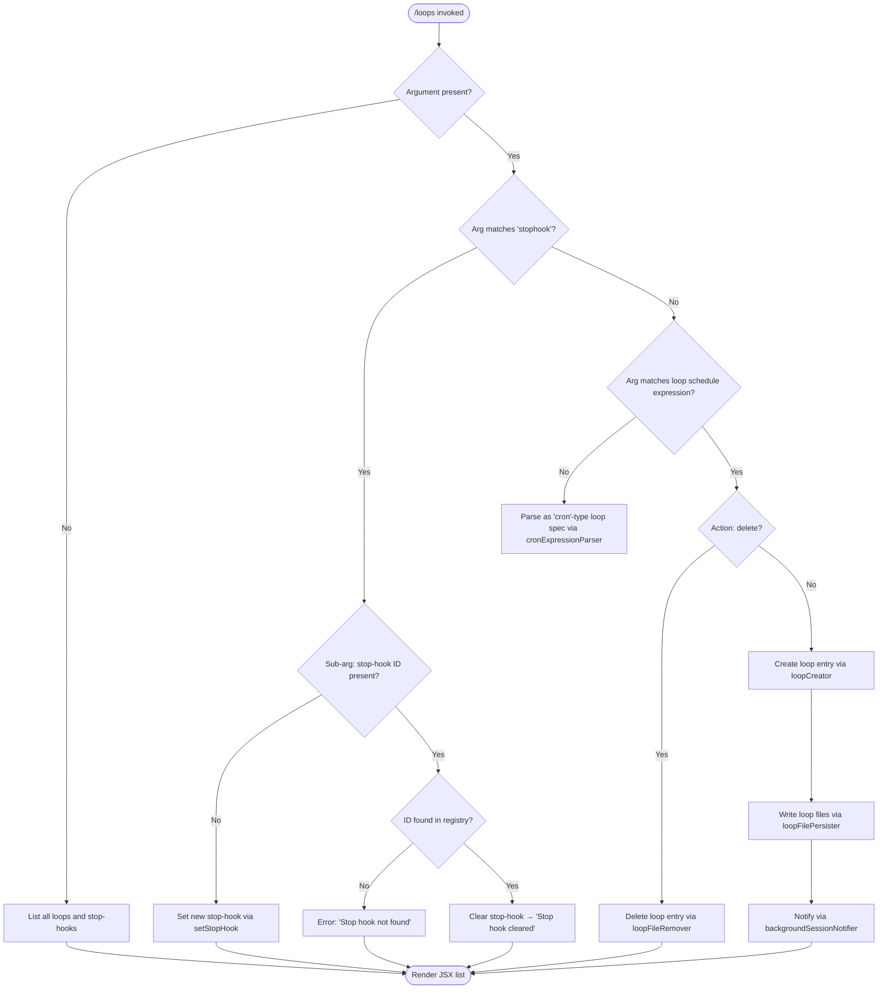

# `/loops`

> Analysis basis: CC v2.1.143 bundle.js (AST extraction + Claude interpretation)
> Minimum version: v2.1.143

---

## Overview

The `/loops` command is a management interface for two related scheduling primitives: **recurring loops** (cron-style background tasks that fire prompts on a schedule) and **stop-hooks** (one-shot or persistent script hooks that execute when a session ends). Users can list all active loops and stop-hooks, create new ones, or delete existing ones from within an active Claude Code session.

---

## Registration

| Field | Value |
|---|---|
| type | `local-jsx` |
| name | `loops` |
| description | `List, create, and delete recurring loops and stop-hooks` |
| immediate | `true` |
| module\_id | `YWq` |

Analysis basis: CC v2.1.143 bundle.js:+11482307

---

## Input Branching

The command entry point (`AN7`) inspects the user-supplied argument string and the current application state to determine which sub-operation to execute.



Analysis basis: CC v2.1.143 bundle.js:+11481264, +11481311, +11481394, +11481447, +11481550, +11481814, +11481912, +11482000

---

## Behavioral Spec

### 1. Command Entry and Telemetry Emission

When `/loops` is invoked, the entry function immediately fires a telemetry event and reads current application state before branching on the argument.

```
function loopsCommandEntry(args, appState):
    emit telemetry("tengu_loops_command")
    currentLoops   = appState.getAppState().loops      // cron-type entries
    currentStopHooks = appState.getAppState().stophooks
    arg = args.trim()
    if arg is empty:
        return renderLoopList(currentLoops, currentStopHooks)
    elif arg starts with "stophook":
        return handleStopHook(arg, currentStopHooks, appState)
    else:
        return handleLoopSchedule(arg, currentLoops, appState)
```

Analysis basis: CC v2.1.143 bundle.js:+11481264, +11481266, +11481315

---

### 2. Loop File Reader (`vTH`)

Before listing or creating loops, the system reads persisted loop definitions from disk. Files are read with UTF-8 encoding. The result is validated as an array before being pushed into the working list.

```
function readLoopFiles(loopDirectory):
    path = buildPath(loopDirectory)
    raw  = fs.readFile(path, encoding="utf-8")
    parsed = parseLoopRecord(raw)
    if not Array.isArray(parsed):
        return []
    for each entry in parsed:
        validate(entry)
        workingList.push(entry)
    return workingList
```

Analysis basis: CC v2.1.143 bundle.js:+4697834, +4697853, +4697864, +4697997, +4698340

---

### 3. Cron Expression Parser (`HZ` / `_N7`)

Loop schedule expressions are parsed into a normalized cron-like structure. The parser recognises at minimum two named human-readable intervals and falls back to full cron-field parsing.

```
function parseCronExpression(input):
    text = input.trim()

    // Named shorthand resolution
    if text matches "Every minute":
        return cronRecord(minute=5, label="Every minute")
    if text matches "Every hour":
        return cronRecord(hour=10, label="Every hour")

    // Numeric field parsing
    fields = text.match(cronFieldRegex)
    minute = parseInt(fields[0])      // valid range 0–59
    hour   = parseInt(fields[1])      // valid range 0–23
    dom    = parseInt(fields[2])      // valid range 1–31
    month  = parseInt(fields[3])
    dow    = parseInt(fields[4])      // 0–7 (0 and 7 = Sunday)

    minute = Math.max(0, Math.ceil(minute))
    minute = Math.round(minute)
    hour   = clamp(hour,   0, 23)
    dom    = clamp(dom,    1, 31)

    // Weekday alignment helpers
    next = new Date()
    next.setUTCDate(next.getUTCDate() + ...)
    next.setUTCHours(hour, minute, 0, 0)
    dayOfWeek = next.getDay()         // local day used for display

    return cronRecord(minute, hour, dom, dow, next)
```

Valid minute range: 0–59 (bundle.js:+11481031)
Valid hour range: 0–23 (bundle.js:+11481102)
Valid day-of-month range: 1–31 (bundle.js:+11481155)
Weekday modulus: 7 (bundle.js:+4696472)
Weekday range string `"1-5"` (Mon–Fri) is a recognised literal (bundle.js:+4696669)

Analysis basis: CC v2.1.143 bundle.js:+4695625, +4695745, +4695801, +4695962, +11480852, +11480889, +11480974, +11480985, +11481058

---

### 4. Loop Creator (`VFH`)

When a valid schedule is provided and no delete flag is present, a new loop record is created and persisted.

```
function createLoop(schedule, promptText, appState):
    id        = crypto.randomUUID()          // $n9.randomUUID
    createdAt = Date.now()
    record    = buildLoopRecord(id, createdAt, schedule, promptText)
    loopList  = readLoopFiles(loopDirectory)
    loopList.push(record)                    // M.push
    writeLoopFiles(loopDirectory, loopList)  // → loopFilePersister (ZFH)
    notifyBackgroundSession(appState)        // → backgroundSessionNotifier (V6)
    registerHookEntry(appState)              // → hookEntryRegistrar (ha)
    return record
```

UUID field length for loop ID: 8 characters minimum (bundle.js:+4699206, literal `8`)

Analysis basis: CC v2.1.143 bundle.js:+4699181, +4699243, +4699289, +4699333, +4699346, +4699378, +4699427, +4699440

---

### 5. Loop File Persister (`ZFH`)

Persists the current in-memory loop list to the `.claude` directory on disk.

```
function loopFilePersister(loopList, projectRoot):
    dir  = path.join(projectRoot, ".claude")  // literal ".claude"
    fs.mkdir(dir, recursive=true)
    dest = path.join(dir, loopFileName)
    content = serializeLoopList(loopList)      // maps each entry
    fs.writeFile(dest, content)
    logEntry(content)
```

Storage directory: `.claude` subdirectory of project root (bundle.js:+4699022)

Analysis basis: CC v2.1.143 bundle.js:+4698990, +4699001, +4699011, +4699062, +4699098, +4699112

---

### 6. Loop Deleter (`q` / `loopFileRemover`)

When a delete action is detected, the matching loop file entry is removed using a synchronous unlink call.

```
function deleteLoop(loopId, loopDirectory):
    filePath = resolveLoopFilePath(loopId, loopDirectory)
    fs.unlinkSync(filePath)          // n8K.unlinkSync — synchronous
    return success
```

Analysis basis: CC v2.1.143 bundle.js:+11481427, +14482768

---

### 7. Stop-Hook Handler (`diH` / `QiH`)

Stop-hooks are named hooks that execute when a session stops. The handler checks for an existing hook, applies the appropriate add or remove operation, and updates application state.

```
function handleStopHook(arg, currentStopHooks, appState):
    hookId = extractHookId(arg)       // arg after "stophook" token

    if hookId is present:
        // Attempt removal
        found = currentStopHooks.has(hookId)
        if not found:
            return renderMessage("Stop hook not found")
        newState = appState.getAppState()
        newState = removeHookEntry(newState, hookId)
        appState.setAppState(newState)
        appState.applyMessageOp("append", buildSystemMessage("Stop hook cleared"))
        emit telemetry("tengu_stop_hook_removed")
        return renderMessage("Stop hook cleared")
    else:
        // Create new stop-hook
        uuid     = crypto.randomUUID()       // Po1.randomUUID
        newState = appState.getAppState()
        hookRecord = buildHookRecord(uuid, kind="Stop", type="prompt")
        newState = addHookEntry(newState, hookRecord)
        appState.setAppState(newState)
        appState.applyMessageOp("append", buildSystemMessage(...))
        emit telemetry("tengu_stop_hook_added")
        return renderMessage("Stop hook set")
```

Hook type literals observed: `"Stop"` (bundle.js:+9108411), `"prompt"` (bundle.js:+9108518)
Confirmation messages: `"Stop hook not found"` (bundle.js:+11481706), `"Stop hook cleared"` (bundle.js:+11481728), `"Stop hook set"` (bundle.js:+11482024)

Analysis basis: CC v2.1.143 bundle.js:+9109191, +9109202, +9109331, +9109400, +9109442, +9109455, +9108703, +9108728, +9108784, +9108788, +9108952, +9108990, +9109032, +9109074, +9109087, +9109457, +9109089

---

### 8. Hook Gate Validation (`Yk_`)

Before committing a stop-hook, two gate checks are evaluated: a hooks gate and a trust gate. Both must pass for the hook to be written to state.

```
function validateHookGates(hookRecord, appState):
    hooksGateResult = evaluateGate("hooks_gate", hookRecord, appState)
    trustGateResult = evaluateGate("trust_gate", hookRecord, appState)
    if hooksGateResult == "goal_set":
        proceedWithGoalSet()
    emit relevant sub-state signals (E_, L7)
    return combinedGateResult
```

Gate name literals: `"hooks_gate"` (bundle.js:+9108599), `"trust_gate"` (bundle.js:+9108653), `"goal_set"` (bundle.js:+9108731)

Analysis basis: CC v2.1.143 bundle.js:+9108564, +9108570, +9108617, +9108624, +9108703

---

### 9. Background Session Notifier (`V6` / `bt`)

After creating a loop, the background session subsystem is notified. This may trigger a spare background worker to be claimed or spawned.

```
function notifyBackgroundSession(appState):
    sessionRef = backgroundSessionManager.get()     // GV
    if sessionRef is active:
        sessionRef.claim()                          // may emit tengu_bg_spare_claim
    else:
        spawnNewSpare()                             // may emit tengu_bg_spare_spawn
```

Relevant telemetry emitted from this path: `tengu_bg_spare_enable`, `tengu_bg_spare_claim`, `tengu_bg_spare_claim_fail`, `tengu_bg_spare_spawn`, `tengu_bg_dispatch_sigkill_escalate`, `tengu_bg_dispatch_low_mem`

Analysis basis: CC v2.1.143 bundle.js:+4699839, +4699875, +11481304, +11481331, +39546, +49567

---

### 10. List Renderer (`AN7` → JSX)

When no actionable argument is present, the command renders a JSX component listing all loops (type `"cron"`) and all stop-hooks (type `"stophook"`). Each loop entry is mapped to a display row with padded columns (column pad width: 40 characters).

```
function renderLoopList(loops, stopHooks):
    rows = loops.map(entry => formatLoopRow(entry))   // A.map
    stopHookRows = stopHooks.map(sh => formatStopHookRow(sh))  // q.map
    allRows = rows.concat(stopHookRows)
    return createElement(ListComponent, { rows: allRows })
```

Column pad width: 40 characters (bundle.js:+14528173)
Column separator: two spaces `"  "` (bundle.js:+14526202)
Loop type discriminator: `"cron"` (bundle.js:+11481361), `"stophook"` (bundle.js:+11481447)

Analysis basis: CC v2.1.143 bundle.js:+11481343, +11481427, +11482067, +14526168, +14526181, +14528099

---

### 11. Goal / Attachment Message Injection (`diH` / `QiH`)

When a stop-hook is added or removed, a structured system message is appended to the conversation. The message includes a `goal` field and a `goal_status` field.

```
function buildHookSystemMessage(action, hookRecord):
    msg = {
        role:    "system",
        content: [
            {
                type:        "attachment",
                goal:        hookRecord.goal,
                goal_status: determineGoalStatus(action)
            }
        ]
    }
    return msg
```

Message role literal: `"system"` (bundle.js:+11481595)
Content type: `"attachment"` (bundle.js:+9109529)
Goal field: `"goal"` (bundle.js:+9109488)
Goal status field: `"goal_status"` (bundle.js:+9109616)
Op type: `"append"` (bundle.js:+9109423)

Analysis basis: CC v2.1.143 bundle.js:+9109400, +9109442, +9109032

---

### 12. Skip / Close Handling (`f`)

The JSX component registers a close/skip handler. When the user dismisses the loops UI without taking action, pending resources are closed cleanly.

```
function onLoopsUiClose(event):
    if event == "skip":
        primaryStream.close()
        secondaryStream.close()
    forwardToParentHandler()
```

Skip literal: `"skip"` (bundle.js:+11482173)

Analysis basis: CC v2.1.143 bundle.js:+11482141, +14513628, +14513638, +14513778

---

## State & Side Effects

| Item | Detail |
|---|---|
| Telemetry — primary | `tengu_loops_command` — fired on every invocation (bundle.js:+11481266) |
| Telemetry — stop-hook added | `tengu_stop_hook_added` (bundle.js:+9109089) |
| Telemetry — stop-hook removed | `tengu_stop_hook_removed` (bundle.js:+9109457) |
| Telemetry — BG session | `tengu_bg_spare_enable`, `tengu_bg_spare_claim`, `tengu_bg_spare_claim_fail`, `tengu_bg_spare_spawn` |
| Telemetry — BG dispatch | `tengu_bg_dispatch_sigkill_escalate`, `tengu_bg_dispatch_low_mem` |
| Telemetry — feature health | `tengu_feature_ok` (bundle.js:+955068), `tengu_feature_sad` (bundle.js:+955201) |
| Hook registration | New stop-hooks written to `appState` via `setAppState`; hook entries registered via `K.set` |
| Loop file persistence | Loop records written to `<projectRoot>/.claude/` via `fs.writeFile`; deleted via `fs.unlinkSync` |
| `appState` changes | `getAppState` / `setAppState` called on both stop-hook add and remove paths; `applyMessageOp("append", ...)` appends system message to conversation |
| Background session | `notifyBackgroundSession` may trigger spare worker creation (`fU.spawn`) or claim; SIGKILL escalation path exists at bundle.js:+14503217, +14503265 |
| Sound | <!-- TODO: not found in depth-2 traversal; needs --depth 4 --> |
| UUID generation | `crypto.randomUUID()` used for both loop IDs and stop-hook IDs |
| File I/O encoding | UTF-8 for all loop file reads (bundle.js:+4697881) |

---

## Version History

| Version | Change |
|---|---|
| v2.1.143 | Initial analysis; supports `cron` loops and `stophook` management; `.claude` directory persistence; background session integration |

---

## Common Mistakes

1. **Omitting the schedule argument for a new loop** — invoking `/loops` with no arguments produces the list view, not a creation prompt. A schedule expression or the `stophook` keyword must be provided to create an entry.
2. **Supplying an invalid cron field range** — minute values must be 0–59, hours 0–23, and day-of-month 1–31. Values outside these ranges are clamped or rejected by the parser (bundle.js:+11480997, +11481031, +11481102, +11481155).
3. **Expecting asynchronous loop deletion** — deletion uses `fs.unlinkSync`, a synchronous call. Callers that assume a promise-based return will not receive one (bundle.js:+14482768).
4. **Referencing a stop-hook ID that does not exist** — the command returns the literal error `"Stop hook not found"` and does not throw; callers must inspect the rendered message (bundle.js:+11481706).
5. **Assuming loop files are stored in the project root** — files are written inside the `.claude` subdirectory, not the root itself (bundle.js:+4699022).
6. **Invoking `/loops stophook` without understanding gate checks** — both `hooks_gate` and `trust_gate` are evaluated before the hook is committed. If either gate fails the hook is not written to state (bundle.js:+9108599, +9108653).

---

## Appendix — Identifier Mapping

> For bundle debugging only. Identifiers change across versions.

| Identifier | Role |
|---|---|
| `AN7` | Loops command entry point / main handler function |
| `bt` | Background session bootstrap / pre-flight caller |
| `vTH` | Loop file reader (reads persisted loop records from disk) |
| `ME` | Background session manager initialiser |
| `giH` | Hook entry registrar (writes hook into registry map via `K.set`) |
| `KDH` | Registry map setter (calls `K.set` and `pm1`) |
| `V6` | Background session notifier (calls `GV`) |
| `GV` | Global background session accessor |
| `HZ` | Cron expression parser / schedule normaliser |
| `H` | Random jitter / setTimeout scheduling helper |
| `K` | Column formatter (pad + map for display rows) |
| `w` | Background process dispatcher (spawn, kill, SIGKILL escalation) |
| `L` | Async task queue manager (add / finally / delete) |
| `J` | Session terminator (iterates values, calls `y.kill`) |
| `D` | Background spare process spawner |
| `$` | Hook record parser (calls `JZq`) |
| `j` | Date/UTC alignment helper (used in weekday scheduling) |
| `q` | Loop file remover / stop-hook list filter |
| `Ct` | Loop list compositor (combines file list with active session data) |
| `Wo` | Existence checker (calls `_.has`) |
| `ZFH` | Loop file persister (mkdir + writeFile to `.claude` dir) |
| `diH` | Stop-hook removal handler (getAppState / setAppState / applyMessageOp) |
| `Go1` | UUID generator wrapper (calls `Po1.randomUUID`) |
| `_N7` | Cron numeric field validator and range clamper |
| `SI` | Prompt/argument tokeniser (trim + push tokens) |
| `VFH` | Loop creator (UUID, timestamp, persist, notify) |
| `pjH` | Loop record builder / struct factory |
| `M` | Loop list in-memory store with session metadata |
| `ha` | Hook entry finaliser (calls `lfH`) |
| `QiH` | Stop-hook addition handler (gate check → setAppState → applyMessageOp) |
| `Yk_` | Hook gate validator (`hooks_gate` + `trust_gate` evaluator) |
| `J8` | Feature health reporter (emits `tengu_feature_ok` / `tengu_feature_sad`) |
| `tj` | Token counter helper (reads `outputTokens` via `Object.values`) |
| `SH` | Feature success reporter (calls `d`, emits `tengu_feature_ok`) |
| `f` | Loops UI close / skip handler |
| `_` | Application state accessor namespace (`getAppState`, `setAppState`, `applyMessageOp`, `readFile`) |