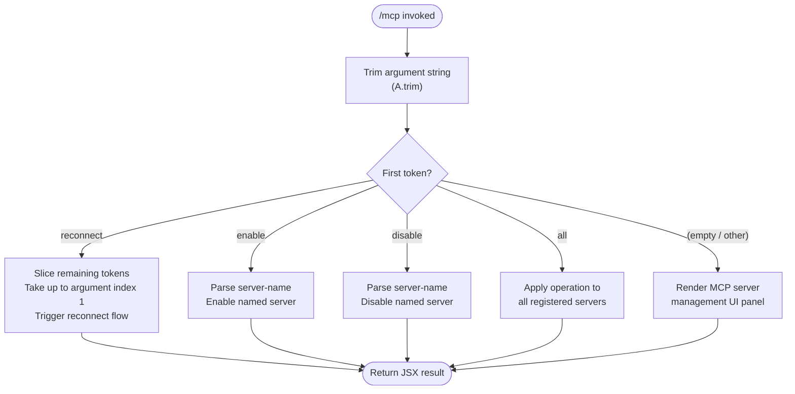

# `/mcp`

> Analysis basis: CC v2.1.143 bundle.js (AST extraction + Claude interpretation)
> Minimum version: v2.1.143

---

## Overview

The `/mcp` command provides in-session management of Model Context Protocol (MCP) servers. It supports enabling, disabling, and reconnecting named servers, and is rendered as a JSX component that fires immediately upon invocation without requiring the user to press Enter a second time.

---

## Registration

| Field | Value |
|---|---|
| type | `local-jsx` |
| name | `mcp` |
| description | `Manage MCP servers` |
| argumentHint | `[enable\|disable [server-name]]` |
| immediate | `true` |
| module_id | `R3q` |

Analysis basis: CC v2.1.143 bundle.js:+10966021

---

## Input Branching

The command handler trims the raw argument string, then routes to one of several sub-paths based on the first token.



Analysis basis: CC v2.1.143 bundle.js:+10965492 (trim), +10965601 (`reconnect` literal), +10965714 (`enable` literal), +10965731 (`disable` literal), +10965830 (`all` literal), +10965668 (slice)

---

## Behavioral Spec

### Argument Parsing

```
function parseArguments(rawInput):
    trimmed = rawInput.trim()                    // strip leading/trailing whitespace
    tokens  = trimmed.split(" ")
    verb    = tokens[0].toLowerCase()
    rest    = tokens.slice(1)                    // remaining tokens after verb
    return (verb, rest)
```

The argument string is trimmed before any token splitting occurs.
Analysis basis: CC v2.1.143 bundle.js:+10965492

Case-folding is applied to the verb token to allow `Enable`, `ENABLE`, etc.
Analysis basis: CC v2.1.143 bundle.js:+14528099

Slice is used to extract the remainder of the token list after the leading verb (index 1 onward).
Analysis basis: CC v2.1.143 bundle.js:+10965668

---

### Reconnect Sub-command

```
function handleReconnect(serverName):
    targetServer = resolveServer(serverName)     // look up server by name
    closeExistingConnection(targetServer)        // calls close on active transport
    initiateNewConnection(targetServer)          // re-establishes transport
```

The `"reconnect"` literal triggers this path.
Analysis basis: CC v2.1.143 bundle.js:+10965601

The argument index used when slicing for the reconnect sub-command is `1`.
Analysis basis: CC v2.1.143 bundle.js:+10965616

---

### Enable / Disable Sub-commands

```
function handleEnableDisable(verb, serverName):
    if verb == "enable":
        setServerEnabled(serverName, enabled=true)
    else if verb == "disable":
        setServerEnabled(serverName, enabled=false)

    if serverName == "all":
        applyToAllServers(verb)
```

The `"enable"` and `"disable"` literals are matched exactly (after case-folding).
Analysis basis: CC v2.1.143 bundle.js:+10965714, +10965731

The special server-name token `"all"` causes the operation to apply to every registered MCP server rather than a single named one.
Analysis basis: CC v2.1.143 bundle.js:+10965830

---

### Connection Lifecycle Management

When a server connection is closed (as part of reconnect or disable), two close calls are issued — one against the primary transport handle and one against an auxiliary handle — before any cleanup proceeds.

```
function closeServerConnection(primaryHandle, auxiliaryHandle):
    if primaryHandle.isOpen():
        primaryHandle.close()           // close primary transport
    if auxiliaryHandle.isOpen():
        auxiliaryHandle.close()         // close auxiliary transport
    cleanupSocketFile()                 // remove Unix socket / temp file via unlinkSync
```

Analysis basis: CC v2.1.143 bundle.js:+14513628 (primary close), +14513638 (auxiliary close), +14482768 (unlinkSync)

The numeric literal `0` appears adjacent to the close calls and likely represents the base connection index or a success-exit sentinel.
Analysis basis: CC v2.1.143 bundle.js:+14513626

---

### Connection Set Management

An active-connection set is maintained to track in-flight connections. Entries are added before a connection attempt and removed (via a `finally` block) once the attempt concludes, regardless of success or failure.

```
function trackConnection(connectionSet, connectionHandle):
    connectionSet.add(connectionHandle)
    try:
        performConnection(connectionHandle)
    finally:
        connectionSet.delete(connectionHandle)    // always clean up
```

Analysis basis: CC v2.1.143 bundle.js:+14507672 (set.add), +14507695 (set.delete), +14507681 (finally)

---

### "no-redirect" Transport Mode

The string literal `"no-redirect"` is present in the argument-parsing region and designates a transport mode that suppresses automatic stdio/socket redirection for the spawned MCP server process.

Analysis basis: CC v2.1.143 bundle.js:+10965524

<!-- TODO: full semantics of no-redirect mode not found in depth-2 traversal; needs --depth 4 -->

---

### Display Width Constraint

A numeric constant of `40` characters is present in the server-name rendering region and likely represents the maximum display width (in columns) for a server name in the management UI panel.

Analysis basis: CC v2.1.143 bundle.js:+14528173

---

## State & Side Effects

| Item | Detail |
|---|---|
| Telemetry | None detected in depth-2 traversal |
| Socket / temp-file cleanup | `unlinkSync` is called on the server's socket or temp file when a connection is closed (bundle.js:+14482768) |
| Active-connection set | Entries are added on connection start and deleted in a `finally` block on completion (bundle.js:+14507672, +14507695) |
| Server enabled/disabled state | Toggled in application state by the `enable` / `disable` sub-commands |
| Immediate rendering | `immediate: true` means the JSX panel renders as soon as the command is matched, with no confirmation keystroke required |
| Hook registration | <!-- TODO: not found in depth-2 traversal; needs --depth 4 --> |
| Sound | <!-- TODO: not found in depth-2 traversal; needs --depth 4 --> |

---

## Version History

| Version | Change |
|---|---|
| v2.1.143 | Initial analysis |

---

## Common Mistakes

1. **Omitting the server name with `enable`/`disable`** — The argument hint `[enable|disable [server-name]]` shows the server name is a second token; omitting it may cause the command to fall through to the UI panel instead of toggling the intended server.
2. **Case sensitivity** — Although the verb is lower-cased before matching, the server name passed to the lookup is taken from the raw token slice and may be case-sensitive depending on how servers were registered.
3. **Assuming `reconnect` closes only one handle** — The implementation closes both a primary and an auxiliary transport handle; external tooling that monitors open file descriptors should expect two close events per reconnect.
4. **Using `all` as an actual server name** — The token `"all"` is reserved and will apply the operation to every registered server rather than one named `"all"`.
5. **Expecting telemetry events** — No `tengu_*` telemetry events are emitted by this command at depth-2; integrations that rely on telemetry for auditability of MCP state changes must instrument elsewhere.

---

## Appendix — Identifier Mapping

> For bundle debugging only. Identifiers change across versions.

| Identifier | Role |
|---|---|
| `i27` | Top-level command handler / argument parser function |
| `A` | Parsed argument string variable; also used as the active server reference in connection context |
| `f` | Connection or server instance being operated on; orchestrates close and lifecycle calls |
| `q` | Auxiliary transport handle or active-connection tracking set (context-dependent) |
| `L` | Connection lifecycle wrapper — manages set tracking and the `finally` cleanup block |