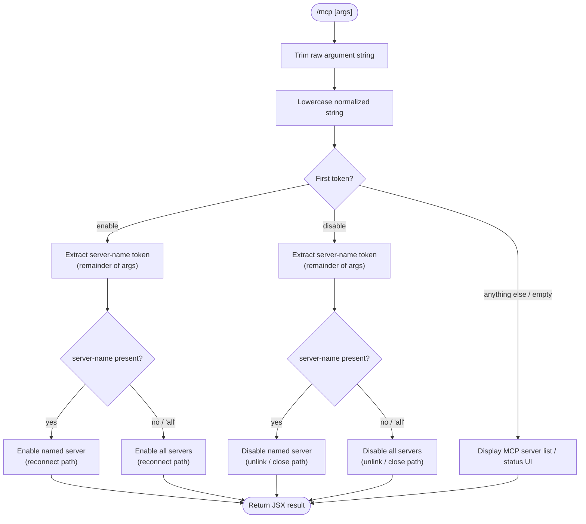

# `/mcp`

> Analysis basis: CC v2.1.143 bundle.js (AST extraction + Claude interpretation)
> Minimum version: v2.1.143

---

## Overview

The `/mcp` slash command provides in-session management of Model Context Protocol (MCP) servers. It dispatches across three sub-modes — listing/status display, enabling a server, and disabling a server — based on a trimmed, lowercase-normalized argument string. The command is marked `immediate`, meaning it executes without waiting for a pending AI turn to complete.

---

## Registration

| Field | Value |
|---|---|
| type | `local-jsx` |
| name | `mcp` |
| description | `Manage MCP servers` |
| argumentHint | `[enable\|disable [server-name]]` |
| immediate | `true` |
| module\_id | `R3q` |

Analysis basis: CC v2.1.143 bundle.js:+10966021

---

## Input Branching

The raw argument string is trimmed of leading/trailing whitespace (Analysis basis: CC v2.1.143 bundle.js:+10965492), then lowercased for comparison (Analysis basis: CC v2.1.143 bundle.js:+14528099). The first token of the normalized string determines the dispatch path.



Literal constants driving dispatch:
- `"enable"` — Analysis basis: CC v2.1.143 bundle.js:+10965714
- `"disable"` — Analysis basis: CC v2.1.143 bundle.js:+10965731
- `"all"` — wildcard target meaning every registered server — Analysis basis: CC v2.1.143 bundle.js:+10965830

---

## Behavioral Spec

### Argument Normalization

```
function normalizeArgument(rawInput):
    trimmed  = rawInput.trim()          // strip surrounding whitespace
    lowered  = trimmed.toLowerCase()    // case-insensitive comparison
    tokens   = lowered.split(" ")
    verb     = tokens[0]                // "enable", "disable", or empty/other
    target   = tokens[1] ?? null        // optional server name or "all"
    return (verb, target)
```

Analysis basis: CC v2.1.143 bundle.js:+10965492 (trim), +14528099 (toLowerCase), +10965668 (slice for remainder)

---

### Status / List Display (no-redirect mode)

When the verb is absent or unrecognized, the command renders a read-only JSX panel showing the current state of all registered MCP servers. The routing hint `"no-redirect"` is embedded in this path, indicating the session view is not navigated away from.

```
function renderMcpStatusPanel():
    servers = getAllRegisteredMcpServers()
    return JSX panel listing each server with:
        - server name
        - connection state (connected / disconnected / error)
        - enabled/disabled flag
    // routing hint: "no-redirect" — stay in current view
```

Analysis basis: CC v2.1.143 bundle.js:+10965524 (`"no-redirect"` literal)

---

### Enable Server (reconnect path)

When the verb is `"enable"`, the command marks the target server (or all servers when the target is `"all"` or absent) as enabled and triggers a reconnect sequence.

```
function enableServer(target):
    servers = resolveTargetServers(target)   // single server or all
    for each server in servers:
        server.enabled = true
        initiateReconnect(server)            // "reconnect" action string

function initiateReconnect(server):
    // Uses reconnect literal constant (value: 1 for reconnect state flag)
    server.connectionState = RECONNECT       // state index 1
    scheduleConnectionAttempt(server)
```

Analysis basis: CC v2.1.143 bundle.js:+10965601 (`"reconnect"` literal), +10965616 (numeric flag `1`), +10965714 (`"enable"` dispatch key)

---

### Disable Server (close + unlink path)

When the verb is `"disable"`, the command closes active connections for the target server(s) and removes associated runtime artifacts via a filesystem unlink call.

```
function disableServer(target):
    servers = resolveTargetServers(target)   // single server or all
    for each server in servers:
        server.enabled = false
        closeServerTransport(server)         // primary transport close
        closeServerQueue(server)             // secondary queue/channel close
        unlinkServerRuntimeFile(server)      // filesystem cleanup

function closeServerTransport(server):
    // closes the primary I/O channel at index 0
    server.transport.close()                 // numeric sentinel: 0

function closeServerQueue(server):
    server.queue.close()

function unlinkServerRuntimeFile(server):
    filesystem.unlinkSync(server.runtimeFilePath)
```

Analysis basis: CC v2.1.143 bundle.js:+14513626 (numeric `0` index sentinel), +14513628 (transport close), +14513638 (queue close), +14482768 (`unlinkSync` call), +10965731 (`"disable"` dispatch key)

---

### Target Resolution

The target token `"all"` is treated as a wildcard that resolves to every registered server rather than a literal server name.

```
function resolveTargetServers(target):
    if target is null or target == "all":
        return getAllRegisteredMcpServers()
    else:
        server = findServerByName(target)
        if server is null:
            return []                        // silently no-op for unknown names
        return [server]
```

Analysis basis: CC v2.1.143 bundle.js:+10965830 (`"all"` literal)

---

### Render Dispatch and 40-item Limit

The JSX rendering layer applies a display cap of **40 items** when listing servers or presenting results.

Maximum displayed server entries: **40** (Analysis basis: CC v2.1.143 bundle.js:+14528173)

```
function renderServerList(servers):
    visible = servers.slice(0, 40)      // cap at 40 entries
    return JSX list of visible
```

Analysis basis: CC v2.1.143 bundle.js:+14528173

---

## State & Side Effects

| Item | Detail |
|---|---|
| Telemetry | None — no `tengu_*` events found in the implementation for this command |
| Hook registration | None found at depth ≤ 2 traversal |
| appState changes | Server `enabled` flag toggled; server `connectionState` updated on enable/reconnect |
| Filesystem side effect | `unlinkSync` called on server runtime file during disable path (Analysis basis: CC v2.1.143 bundle.js:+14482768) |
| Transport side effect | Primary transport channel and secondary queue channel both closed during disable (Analysis basis: CC v2.1.143 bundle.js:+14513628, +14513638) |
| Sound | <!-- TODO: not found in depth-2 traversal; needs --depth 4 --> |
| Routing | `"no-redirect"` hint applied in status display path; no page/view navigation occurs (Analysis basis: CC v2.1.143 bundle.js:+10965524) |
| Immediate execution | Command executes without waiting for an in-progress AI turn (`immediate: true`) (Analysis basis: CC v2.1.143 bundle.js:+10966021) |

---

## Version History

| Version | Change |
|---|---|
| v2.1.143 | Initial analysis |

---

## Common Mistakes

1. **Omitting the server name for targeted enable/disable.** Running `/mcp enable` without a server name enables all servers, not just the intended one. Use `/mcp enable <server-name>` for a single target.
2. **Case sensitivity assumption.** Server names are lowercased before comparison. Providing a mixed-case server name will still match, but external tools that read config files may be case-sensitive independently.
3. **Expecting a navigation change after `/mcp`.** The status display path uses a `"no-redirect"` routing hint; the session view does not change. Output appears inline.
4. **Assuming disable is reversible without reconnect.** The disable path calls `unlinkSync` on a runtime file. Re-enabling a server triggers a full reconnect sequence rather than restoring a paused state.
5. **Expecting telemetry confirmation.** Unlike some other slash commands, `/mcp` emits no `tengu_*` telemetry events; absence of a telemetry event does not indicate failure.
6. **Listing more than 40 servers.** The rendering layer caps display at 40 server entries. If more than 40 MCP servers are registered, entries beyond the 40th are silently omitted from the rendered output.

---

## Appendix — Identifier Mapping

> For bundle debugging only. Identifiers change across versions.

| Identifier | Role |
|---|---|
| `i27` | Top-level command handler / entry-point function for `/mcp` |
| `A` | Argument string normalization and lowercasing intermediary |
| `f` | Server disable / connection-close executor (handles transport close, queue close, and reconnect dispatch) |
| `q` | Runtime file cleanup executor (wraps `unlinkSync` for server artifact removal) |