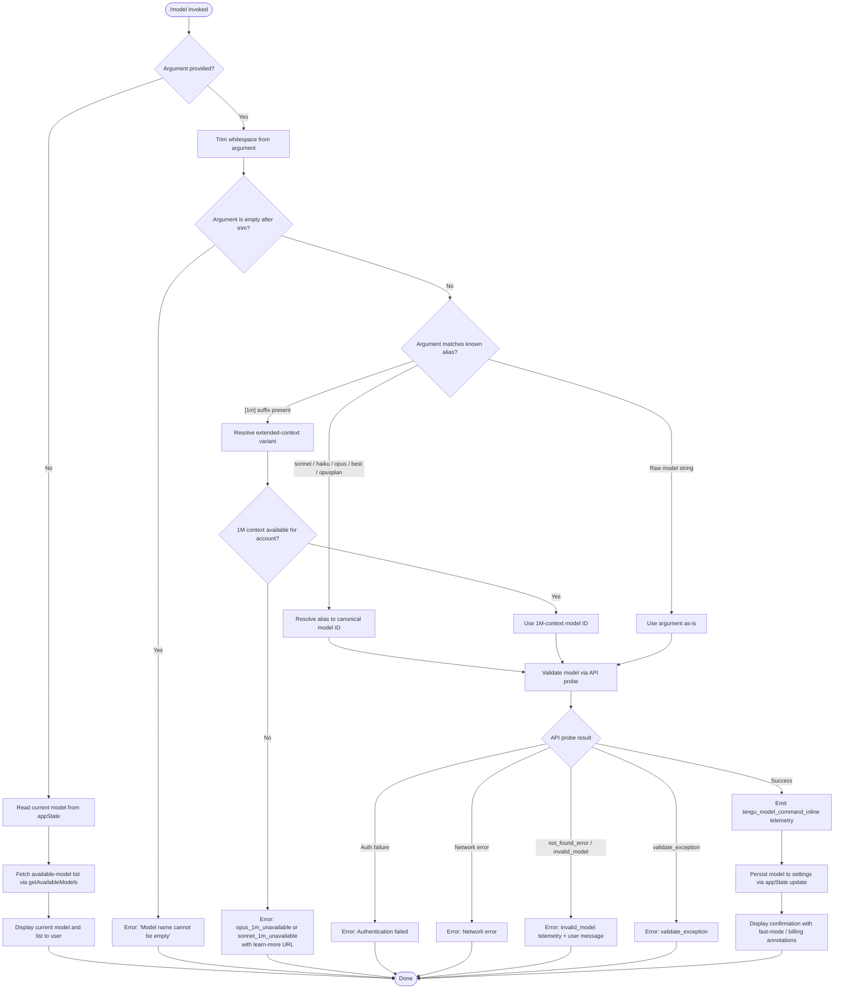

# `/model`

> Analysis basis: CC v2.1.143 bundle.js (AST extraction + Claude interpretation)
> Minimum version: v2.1.143

---

## Overview

The `/model` command allows users to view and change the active AI model used by Claude Code. It accepts an optional model name argument; when invoked without arguments it displays the current model and a list of available models, and when invoked with an argument it validates and applies the requested model, persisting the change to application state and configuration.

---

## Registration

| Field | Value |
|---|---|
| type | `local` |
| name | `model` |
| description | `Set the AI model for Claude Code` |
| argumentHint | `<model>` |
| supportsNonInteractive | `true` |
| module_id | `_Eq` |
| load_inline | `true` |
| loc_byte | `11667436` |
| loc_byte_end | `11667610` |
| loc_line | `7228` |
| arbor_handler.name | `LS7` |
| arbor_handler.fqn | `claude-2.1.143::LS7` |
| arbor_handler.kind | `AsyncFunction` |
| arbor_handler.resolution_path | `module_id` |
| arbor_handler.n_hits | `0` |

Analysis basis: CC v2.1.143 bundle.js:+11667436

---

## Input Branching

The command has 4+ distinct branches depending on whether an argument is provided, whether the model string is an alias or a full name, and whether the requested model passes validation. A Mermaid flowchart is used.



---

## Behavioral Spec

### Main Handler (`LS7`)

The main handler is an `AsyncFunction` resolved by Arbor via the `module_id` path (`_Eq`).

```
async function handleModelCommand(args, context):
    rawArg = args.trim()                          // bundle.js:+11660155

    // ── No-arg path: display current model ──────────────────────────
    if rawArg is empty or not provided:
        currentModel = context.getAppState().model // bundle.js:+11660194
        availableModels = buildAvailableModelList(context)  // CP8, bundle.js:+11660238
        displayModelInfo(currentModel, availableModels)
        return

    // ── Inline alias / 1m-suffix detection ──────────────────────────
    if knownInlineAliasList.includes(rawArg):     // vh6.includes, bundle.js:+11660171
        resolvedId = resolveAlias(rawArg)
    else:
        resolvedId = rawArg

    emit telemetry("tengu_model_command_inline")  // bundle.js:+11660313

    // ── Delegate to full validation + apply flow ─────────────────────
    await validateAndApplyModel(resolvedId, context)  // RP8, bundle.js:+11660378
```

Analysis basis: CC v2.1.143 bundle.js:+11660155

---

### Alias Resolution (`r1`)

Aliases are short, user-friendly names mapped to canonical model identifiers. The function normalises the input (trim, lowercase) before comparing.

```
function resolveAlias(input):
    normalised = input.trim().toLowerCase()       // bundle.js:+2162007, +2162018

    switch normalised:
        case "sonnet":  return canonicalSonnetId  // bundle.js:+2162144
        case "haiku":   return canonicalHaikuId   // bundle.js:+2162183
        case "opus":    return canonicalOpusId    // bundle.js:+2162222
        case "best":    return canonicalBestId    // bundle.js:+2162259
        case "opusplan":
            // "Opus in plan mode, else Sonnet"    // bundle.js:+2160678
            return buildOpusPlanId()              // bundle.js:+2160661

    if input contains "[1m]":                     // bundle.js:+2162129
        return resolveExtendedContext(input)

    return input   // pass-through for raw model strings
```

Analysis basis: CC v2.1.143 bundle.js:+2162007

---

### Extended-Context (1M) Availability Check (`Xy7`, `Wy7`)

When the user appends the `[1m]` suffix (or uses aliases `sonnet[1m]` / `sonnet-4-6[1m]`), the handler checks account entitlement before accepting the model.

```
function resolveExtendedContext(input):
    lowered = input.toLowerCase()                 // bundle.js:+11626542, +11626640

    if lowered starts with "opus" variant:        // Xy7, bundle.js:+11624830
        if not accountAllowsOpus1M():
            // Error code: "opus_1m_unavailable"  // bundle.js:+11624862
            // Message includes learn-more URL    // bundle.js:+11624900
            raise UnavailableError("opus_1m_unavailable")

    if lowered matches "sonnet[1m]" or "sonnet-4-6[1m]":   // Wy7, bundle.js:+11625047
        // Aliases: "sonnet[1m]" -> bundle.js:+11626682
        //          "sonnet-4-6[1m]" -> bundle.js:+11626708
        if not accountAllowsSonnet1M():
            // Error code: "sonnet_1m_unavailable"  // bundle.js:+11625079
            // Message includes learn-more URL      // bundle.js:+11625119
            raise UnavailableError("sonnet_1m_unavailable")

    return resolvedExtendedContextId
```

Analysis basis: CC v2.1.143 bundle.js:+11624830

---

### Model Validation via API Probe (`hP8`)

Before persisting, the command sends a minimal probe request to the API to confirm the model identifier is reachable.

```
async function validateModelViaProbe(modelId, context):
    trimmed = modelId.trim()                      // bundle.js:+11622898
    if trimmed is empty:
        return error("Model name cannot be empty")  // bundle.js:+11622935

    knownModels = buildKnownModelList()            // BB, bundle.js:+11622969
    normalised = trimmed.toLowerCase()            // bundle.js:+11623058

    // Provider-prefix check
    if normalised starts with "anthropic.":       // bundle.js:+2156262
        // Bedrock-style model ID
    if normalised starts with "claude-":          // bundle.js:+2155883
        // Native Claude model ID

    // Cache check: skip re-validation if already seen
    if validationCache.has(normalised):           // YTq.has, bundle.js:+11623179
        return cached result

    // Probe call  (Fg, bundle.js:+11623224)
    result = await probeModelWithMinimalRequest(modelId)
    //   Uses content-type "text", single "Hi" message,  // bundle.js:+11623343
    //   ephemeral cache control                          // bundle.js:+11623368

    switch result:
        case auth_failure:
            return error("Authentication failed. ...")   // bundle.js:+11623634
        case network_error:
            return error("Network error. ...")           // bundle.js:+11623736
        case not_found_error / message contains "model:":
            emit "invalid_model" telemetry               // bundle.js:+11623855, +11623937
            return error("invalid_model")                // bundle.js:+11625373
        case validate_exception:
            return error("validate_exception")           // bundle.js:+11625481
        case success:
            validationCache.set(normalised, result)      // YTq.set, bundle.js:+11623387
            emit "model_validation" telemetry            // bundle.js:+11623274
            return ok

    // emit telemetry "tengu_model_command_inline" already fired upstream
```

Analysis basis: CC v2.1.143 bundle.js:+11622898

---

### Available-Model List Builder (`CP8` → `Sh`, `BB`)

When displaying available models without an argument, the command assembles a list from the model registry and the subscription/tier context.

```
function buildAvailableModelList(context):
    modelList = []
    appState  = context.getAppState()            // bundle.js:+11626958

    // Tier-aware filtering (nJ, bundle.js:+11626755)
    for each candidateModel in modelRegistry:
        if candidateModel passes tierFilter(appState.subscriptionTier):
            // Subscription tier literals checked:
            // "max", "team", "default_claude_max_5x",
            // "enterprise", "enterprise_usage_based"   // bundle.js:+2928635–2928838
            modelList.push(candidateModel)

    // Deduplicate and format display aliases
    return formatModelList(modelList)             // mq6 → r1, bundle.js:+2160718
```

Analysis basis: CC v2.1.143 bundle.js:+11660238

---

### Model Selection Display (`DTq`)

After validation succeeds (or when listing), the command renders each model entry with tier/fast-mode annotations.

```
function renderModelEntry(model, context):
    label = model.displayName.bold()              // M6.bold, bundle.js:+11625738

    if model.isFastMode:
        label += " · Fast mode ON"                // bundle.js:+11625846
        if model.billedAsExtraUsage:
            label += " · Billed as extra usage"   // bundle.js:+11625897
    else if model hasFastModeCapability:
        label += " · Fast mode OFF"               // bundle.js:+11625940

    // Settings persistence path shown to user
    // (~/.claude/settings.json  or  settings.local.json)
    //   bundle.js:+1197610, +1197620, +1197682
    displayLine(label)
```

Analysis basis: CC v2.1.143 bundle.js:+11625738

---

### Permission / Policy Gate (`GXH` → `Au`)

Model switching may be blocked by organisation-level or seat-level policy settings.

```
function checkModelSwitchPermission(context):
    flags    = context.flagSettings               // bundle.js:+1086180
    policies = context.policySettings             // bundle.js:+1086202

    if flags or policies prohibit modelSwitch:
        // Error code "model_switch" / "not_allowed"
        //   bundle.js:+11624700, +11624715
        return PermissionDenied

    // Possible denial reasons surfaced to user:
    //   "out_of_credits", "overage_not_provisioned",
    //   "org_level_disabled", "org_level_disabled_until",
    //   "seat_tier_level_disabled", "member_level_disabled",
    //   "seat_tier_zero_credit_limit", "group_zero_credit_limit",
    //   "member_zero_credit_limit", "org_service_level_disabled",
    //   "no_limits_configured", "fetch_error", "unknown"
    //   bundle.js:+8165293 – +8165641
    return Allowed
```

Analysis basis: CC v2.1.143 bundle.js:+11624700

---

### Inline Model Application (`LS7` non-interactive path)

When `supportsNonInteractive: true`, the handler can be called from a script pipeline. The inline path emits a dedicated telemetry event.

```
async function handleNonInteractiveModelSwitch(modelId, context):
    // "text" content-type used for the validation probe
    //   bundle.js:+11660222
    resolvedId = resolveAlias(modelId)
    await validateModelViaProbe(resolvedId, context)
    emit("tengu_model_command_inline")            // bundle.js:+11660313
    context.appState.model = resolvedId
    // Persists to settings file via hy → settings path resolution
    //   bundle.js:+1197602
```

Analysis basis: CC v2.1.143 bundle.js:+11660311

---

## State & Side Effects

| Item | Detail |
|---|---|
| Telemetry | `tengu_model_command_inline` (bundle.js:+11660313) — fired on every model set via argument; `tengu_feature_bad` (bundle.js:+955126) — fired on handler-level failure; `tengu_feature_ok` (bundle.js:+955068) — fired on handler-level success; `tengu_prompt_cache_1h_config` (bundle.js:+12353959) — fired during probe request cache-control setup; `tengu_api_success` (bundle.js:+12394232) — fired when API probe returns successfully |
| Validation cache | `YTq` Map: validated model IDs are cached (`YTq.set`, bundle.js:+11623387) to avoid redundant probe calls within the same session (`YTq.has`, bundle.js:+11623179) |
| appState changes | `appState.model` updated with the new canonical model ID after successful validation (bundle.js:+11660194) |
| Settings persistence | Model persisted to `~/.claude/settings.json` (projectSettings) or `~/.claude/settings.local.json` (localSettings) via the settings-path resolver (bundle.js:+1197577, +1197610, +1197620, +1197641, +1197682) |
| API probe side-effect | A minimal single-message request (content `"Hi"`, ephemeral cache) is issued to validate the model ID — this consumes a small amount of API quota (bundle.js:+11623343, +11623368) |
| Sound | None observed in depth-2 traversal |
| Hook registration | None observed in depth-2 traversal |

---

## Version History

| Version | Change |
|---|---|
| v2.1.143 | Initial analysis |

---

## Common Mistakes

1. **Passing an alias with mixed capitalisation** — the handler normalises aliases to lowercase internally (`H.trim` + `toLowerCase`), so `Sonnet`, `OPUS`, etc. resolve correctly. Raw full model IDs (e.g. `claude-sonnet-4-6`) are passed through without lowercasing, so casing must match the API's expectation exactly.
2. **Expecting the `[1m]` suffix to work on all accounts** — extended-context variants require specific account entitlement. The command checks this before attempting validation and returns an explicit error with a documentation URL when the entitlement is absent (bundle.js:+11624862, +11625079).
3. **Using `/model` in non-interactive scripts without a valid API key** — even though `supportsNonInteractive: true`, the validation probe hits the Anthropic API, so a missing or invalid key will cause an authentication error and the model will not be changed (bundle.js:+11623634).
4. **Assuming the model is persisted immediately on entry** — persistence only occurs after the API probe succeeds. A network error or unknown model ID leaves the previous model active.
5. **Confusing `opusplan` with `opus`** — `opusplan` is a special composite alias meaning "Opus in plan mode, Sonnet otherwise" (bundle.js:+2160678) and resolves to a different internal model selector than the plain `opus` alias.

---

## Appendix — Identifier Mapping

> For bundle debugging only. Identifiers change across versions.

| Identifier | Role |
|---|---|
| `LS7` | Main handler (`AsyncFunction`) for the `/model` command; Arbor-resolved entry point |
| `H` | Generic utility / string helper; also used for delayed-execution wrapper (calls `Math.random`, `setTimeout`) |
| `CP8` | Builds the available-model list from appState and model registry |
| `Sh` | Intermediate model-list assembler called by `CP8` |
| `mq6` | Model-alias normalisation orchestrator |
| `iJ` | Sub-step in alias normalisation (called by `mq6`) |
| `r1` | Alias-to-canonical-ID resolver (trim, toLowerCase, switch on alias names) |
| `nJ` | Tier-aware model candidate filter |
| `HA` | Subscription/tier context reader |
| `gB` | Tier-check helper (reads "max" tier) |
| `cfH` | Tier-check helper (reads "team" / "default_claude_max_5x") |
| `hxH` | Tier-check helper (reads "enterprise" / "enterprise_usage_based") |
| `rV` | Model entry formatter (delegates to `BM`, `zM`) |
| `jP` | Model display-name builder |
| `BM` | Base model metadata accessor |
| `DA` | Provider-type discriminator (checks "bedrock", "foundry", "mantle", "vertex") |
| `zM` | Extended provider resolver (AWS/gateway routing) |
| `oV` | Model-option combiner |
| `RP8` | Validation + model-apply orchestrator (wraps `hP8`, `BB`, extended-context checks, `DTq`) |
| `BB` | Known-model-list builder (constructs set of accepted model IDs) |
| `A` | Internal array/string utility (multiple roles by context) |
| `f` | Stream/connection close helper |
| `M` | MCP server manager / connection state holder |
| `SvH` | MCP transport initialiser (handles stdio, sse, http, sse-ide, ws-ide) |
| `THK` | MCP server update applier |
| `L` | Promise-queue / async-lock helper |
| `v` | Model string normaliser (uppercase/lowercase, prefix checks) |
| `$` | Queue entry wrapper |
| `B95` | MCP client-list aggregator |
| `K` | Display-column formatter (padEnd, map) |
| `q` | File/resource cleanup helper |
| `BU6` | Model-ID prefix validator |
| `R_` | Prefix-check sub-helper |
| `kxH` | Extended-model-list membership checker |
| `ptA` | Position-lookup helper for model list |
| `H$L` | Model-string includes/alias checker |
| `zAH` | Known-alias membership checker (`OAH.includes`) |
| `_$L` | Alias + prefix composite validator |
| `mtA` | `startsWith` helper for model-ID prefix matching |
| `mH` | Feature-flag telemetry emitter (`tengu_feature_ok` / `tengu_feature_bad`) |
| `Xy7` | Opus 1M context availability checker |
| `VHH` | Account-entitlement reader for extended context |
| `wAH` | AppState field accessor |
| `YC1` | Entitlement data fetcher |
| `Wy7` | Sonnet 1M context availability checker |
| `zKH` | Account-entitlement reader (Sonnet variant) |
| `Py7` | Generic extended-context availability check |
| `DTq` | Model-selection UI renderer (labels, fast-mode annotations, settings-path display) |
| `GXH` | Permission-gate resolver (flagSettings / policySettings) |
| `Au` | Flag/policy set builder |
| `I8` | Settings-key lookup helper |
| `SH` | Feature-ok/bad telemetry dispatcher |
| `MK` | Model-metadata record constructor |
| `xH` | String coercion utility (`String(...)`) |
| `gfH` | Model display annotation helper |
| `cY` | Current-session model accessor (checks active opus-4-6 / opus-4-7 state) |
| `Qc` | Session-state query helper |
| `JwH` | Fast-mode / billing annotation builder |
| `rJ` | Model-row renderer combining `r1` + `nJ` |
| `nG` | AppState write helper for model field |
| `jy7` | Settings-path display renderer (`.claude/settings.json`) |
| `hy` | Settings-file path joiner |
| `FB` | Model-entry display formatter (combines `zAH`, `iJ`, `r1`) |
| `hP8` | Core validation function: trims input, probes API, caches result, returns error codes |
| `Fg` | Minimal API probe executor (sends single "Hi" message; handles auth, network, model errors) |
| `xu` | HTTP API client (builds headers, handles OAuth, Bedrock, Foundry, Vertex, gateway routing) |
| `P` | Low-level stream/buffer reader for API responses |
| `pWH` | Request-modifier for legacy claude-3 / claude-opus-4-0 / claude-sonnet-4-0 models |
| `G` | MCP client / tool registry |
| `PB7` | Tool-list search helper |
| `$d_` | Request-hash generator (SHA-256) |
| `oi6` | Response-body parser |
| `ri6` | Error-response extractor |
| `iVH` | Prompt-cache configuration builder (1h TTL, `repl_main_thread*` thread tag) |
| `RE` | Retry/backoff controller |
| `N` | Away-summary gate checker |
| `jhq` | Request-body serialiser |
| `PP` | Output string sanitiser |
| `Vl6` | Temperature / sampling-param builder |
| `VX` | Message-array mapper |
| `C3H` | System-prompt assembler |
| `e4H` | Error-message formatter |
| `QTH` | Cache-control "ephemeral" injector |
| `Tg` | Cache-control "1h" injector |
| `reH` | Response-streaming handler |
| `wy7` | Post-validation model-apply flow |
| `Jy7` | Model-apply executor (updates `BM`, lowercase normalisation, `zM` routing, `_.includes` check) |
| `XH` | String-coercion wrapper (`String(...)`) |