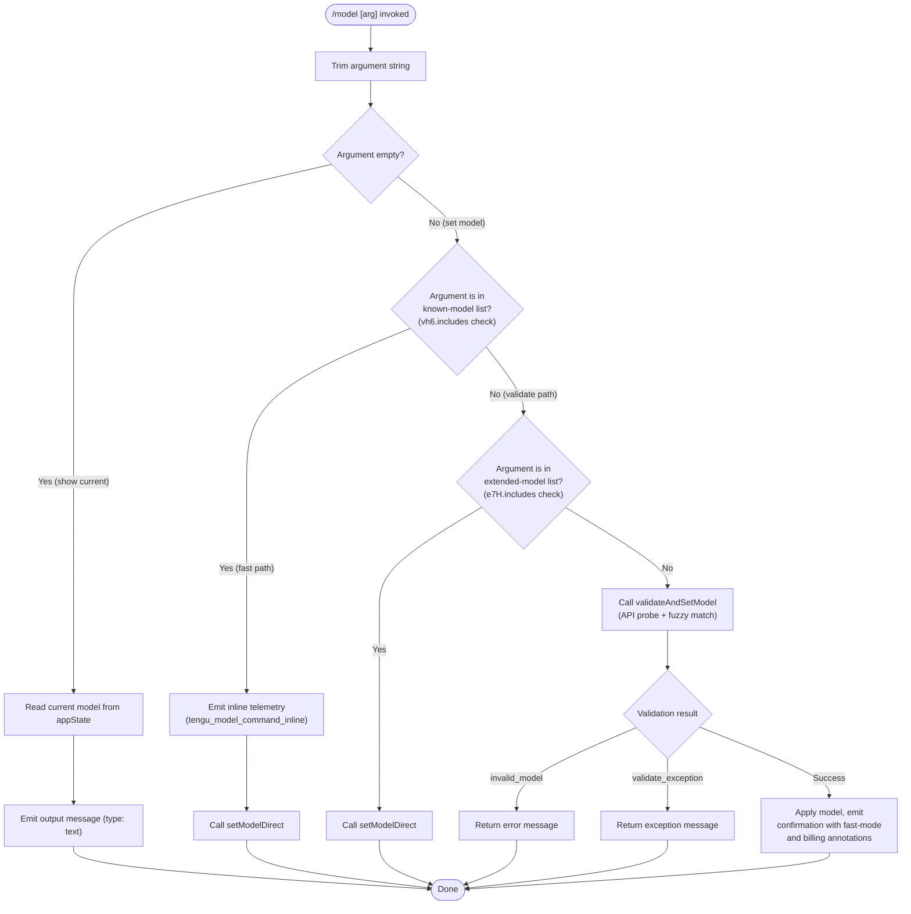

# `/model`

> Analysis basis: CC v2.1.143 bundle.js (AST extraction + Claude interpretation)
> Minimum version: v2.1.143

---

## Overview

The `/model` slash command lets users inspect or change the AI model Claude Code uses for the current session. When called with no argument it displays the currently active model; when called with a model name it validates the name and, if valid, switches the session to that model. The command supports both interactive and non-interactive (headless) execution modes.

---

## Registration

| Field | Value |
|---|---|
| type | `local` |
| name | `model` |
| description | `Set the AI model for Claude Code` |
| argumentHint | `<model>` |
| supportsNonInteractive | `true` |
| module\_id | `_Eq` |

Analysis basis: CC v2.1.143 bundle.js:+11667436

---

## Input Branching

The command entry-point (`commandHandler`) trims the raw argument string and routes execution across three top-level branches.



Analysis basis: CC v2.1.143 bundle.js:+11660155 (trim), +11660171 (vh6 check), +11660194 (appState read), +11660258 (e7H check), +11660311 (inline branch), +11660313 (telemetry), +11660378 (validateAndSetModel call)

---

## Behavioral Spec

### 1. Argument Normalisation

```
function normaliseArgument(rawArg):
    trimmed = rawArg.trim()
    return trimmed
```

The raw string provided after `/model` is trimmed of leading and trailing whitespace before any further logic runs.

Analysis basis: CC v2.1.143 bundle.js:+11660155

---

### 2. Show Current Model (no-argument path)

```
function showCurrentModel(appState):
    currentModel = appState.getAppState().model
    emit({ type: "text", content: formatModelDisplay(currentModel) })
    return
```

When the trimmed argument is empty the command reads the live model value from `appState` and emits a single `text`-typed output message.

Analysis basis: CC v2.1.143 bundle.js:+11660194 (getAppState), +11660222 (literal `"text"`)

---

### 3. Direct / Fast-Path Model Switch

```
function setModelDirect(modelName, appState):
    appState.setModel(modelName)
    callModelSwitchHook(modelName)   # CP8 → Sh
    emit confirmation message
    return
```

When the trimmed argument matches an entry in the pre-validated known-model list (`vh6`) the command bypasses API validation entirely and switches the model immediately. The `tengu_model_command_inline` telemetry event is emitted for this path.

Analysis basis: CC v2.1.143 bundle.js:+11660171 (vh6.includes), +11660238 (CP8 call), +11660313 (tengu_model_command_inline), +11626827 (Sh call inside CP8)

---

### 4. Extended-Model List Check

```
function extendedModelSwitch(modelName, appState):
    if e7H.includes(modelName):
        setModelDirect(modelName, appState)
        return true
    return false
```

A secondary pre-validated list (`e7H`) covers models not in the primary list. Matching entries take the same direct-switch path without an API probe.

Analysis basis: CC v2.1.143 bundle.js:+11660258

---

### 5. Model Validation via API Probe (`validateAndSetModel`)

```
function validateAndSetModel(modelName, appState):
    trimmedName = modelName.trim()

    if trimmedName == "":
        return error("Model name cannot be empty")

    # Fuzzy / alias resolution
    resolvedList = resolveModelAliases(trimmedName)   # BB
    lowerName    = trimmedName.toLowerCase()

    # Opus 1M context check
    if lowerName contains "opus" AND lowerName contains "[1m]":
        if NOT accountSupports1MOpus():
            emitTelemetry("model_switch", "not_allowed")
            return error("opus_1m_unavailable",
                "Opus with 1M context is not available for your account. " +
                "Learn more: https://code.claude.com/docs/en/model-config#extended-context-with-1m")

    # Sonnet 1M context check (covers both "sonnet[1m]" and "sonnet-4-6[1m]")
    if lowerName matches "sonnet[1m]" OR "sonnet-4-6[1m]":
        if NOT accountSupports1MSonnet():
            emitTelemetry("model_switch", "not_allowed")
            return error("sonnet_1m_unavailable",
                "Sonnet 4.6 with 1M context is not available for your account. " +
                "Learn more: https://code.claude.com/docs/en/model-config#extended-context-with-1m")

    # API validation probe
    try:
        validationResult = probeModelWithAPI(resolvedList, appState)  # hP8
        if validationResult.ok:
            applyValidatedModel(validationResult.model, appState)     # DTq
        else:
            return error("invalid_model")
    except Exception as ex:
        emitTelemetry("validate_exception")
        return error(ex)
```

Analysis basis: CC v2.1.143 bundle.js:+11622898 (trim in hP8), +11622935 (empty-name error), +11623058 (toLowerCase in hP8), +11624684 (BB call in RP8), +11624697 (mH call in RP8), +11624830 (Xy7 — opus 1M check), +11624862 (opus_1m_unavailable), +11624900 (opus error string), +11625047 (Wy7 — sonnet 1M check), +11625079 (sonnet_1m_unavailable), +11625119 (sonnet error string), +11625273 (Py7 call), +11625301 (DTq call), +11625329 (hP8 call), +11625373 (invalid_model), +11625481 (validate_exception)

---

### 6. Alias / Model-Name Resolution (`resolveModelAliases`)

```
function resolveModelAliases(modelName):
    # Expand short aliases defined in _A
    expanded = aliasTable.expand(modelName)    # _A
    candidates = expanded.map(entry => entry.trim())
    lowerName  = modelName.trim().toLowerCase()

    # Prefix check: names not starting with "anthropic." are flagged
    for each candidate in candidates:
        if candidate.startsWith("anthropic."):
            markAsFirstParty(candidate)
        if q.includes(candidate):
            applyFeatureFlags(candidate)    # BU6

    # Additional resolution helpers
    resolveViaKxH(candidate)    # kxH
    resolveViaPtA(candidate)    # ptA
    resolveViaH$L(candidate)    # H$L
    resolveViaZAH(candidate)    # zAH
    finalList = r1(candidates)
    return finalList
```

Analysis basis: CC v2.1.143 bundle.js:+2156109 (_A), +2156186 (A.map), +2156197 (M.trim), +2156223 (H.trim), +2156249 (K.startsWith), +2156262 (`"anthropic."` literal), +2156277 (q.includes), +2156306 (BU6), +2156356 (kxH), +2156365 (ptA), +2156420 (H$L), +2156441 (zAH), +2156455 (r1), +2156611 (_$L)

---

### 7. API Probe / Cache Layer (`modelProbe`)

```
function modelProbe(candidates, appState):
    lowerFirst = candidates[0].toLowerCase()

    # Check availability cache (YTq map)
    if availabilityCache.has(lowerFirst):
        return availabilityCache.get(lowerFirst)

    # Send minimal API probe: single "Hi" user message with ephemeral cache control
    probeMessage = {
        role: "user",
        content: "Hi",
        cache_control: "ephemeral"
    }
    result = Fg(probeMessage, candidates, appState)   # Fg

    # Store result in cache
    availabilityCache.set(lowerFirst, result)         # YTq.set

    # Invoke post-validation hook
    wy7(result)

    return result
```

Analysis basis: CC v2.1.143 bundle.js:+11623058 (toLowerCase), +11623077 (OAH.includes), +11623179 (YTq.has), +11623224 (Fg call), +11623309 (`"user"`), +11623343 (`"Hi"`), +11623368 (`"ephemeral"`), +11623387 (YTq.set), +11623428 (wy7 call)

The availability cache (`YTq`) stores results keyed by lower-cased model name; duplicate `/model` calls for the same name within a session avoid re-probing the API.

---

### 8. Model Application and Output Formatting (`applyValidatedModel`)

```
function applyValidatedModel(resolvedModel, appState):
    appState.setModel(resolvedModel, key: "model")   # DTq → _ , key literal "model"
    displayName = GXH(resolvedModel)                 # GXH
    fastModeActive = I8(resolvedModel)               # I8

    annotation = ""
    if fastModeActive and billedAsExtra(resolvedModel):   # A, SH
        annotation = " · Fast mode ON" + " · Billed as extra usage"
    elif fastModeActive:
        annotation = " · Fast mode ON"
    else:
        annotation = " · Fast mode OFF"

    boldName = displayName.bold()                    # M6.bold
    switchHook(resolvedModel)                        # Sh
    MK(resolvedModel)                                # MK — model-key helper
    gfH(resolvedModel)                               # gfH — feature-gate refresh
    cY(resolvedModel)                                # cY — context-window update

    outputLine = boldName + annotation
    JwH(outputLine)                                  # JwH — output emitter
    jP(outputLine)                                   # jP  — secondary emitter
    jy7()                                            # jy7 — post-switch finaliser
```

Analysis basis: CC v2.1.143 bundle.js:+11625583 (_ call), +11625598 (GXH), +11625602 (`"model"` key), +11625615 (I8), +11625635 (A), +11625697 (SH), +11625738 (M6.bold), +11625746 (Sh), +11625767 (MK), +11625776 (gfH), +11625783 (cY), +11625846 (`" · Fast mode ON"`), +11625875 (JwH), +11625888 (jP), +11625897 (`" · Billed as extra usage"`), +11625940 (`" · Fast mode OFF"`), +11625972 (jy7)

---

### 9. Model-Switch Hook (`modelSwitchHook`)

```
function modelSwitchHook(modelName):
    mq6(modelName)    # mq6 — hook dispatcher
    nJ(modelName)     # nJ  — notification emitter
```

Called from both the fast-path and the validated-path after the model is written to `appState`.

Analysis basis: CC v2.1.143 bundle.js:+11626748 (mq6), +11626755 (nJ), +11626827 (Sh body)

---

### 10. Opus 1M Availability Check (`checkOpus1MAvailability`)

```
function checkOpus1MAvailability(modelName):
    lower = modelName.toLowerCase()
    if VHH(lower) AND jP.includes(lower, "opus"):    # VHH — account feature set
        if lower.includes("opus") AND lower.includes("[1m]"):
            return false    # not available
    return true
```

Analysis basis: CC v2.1.143 bundle.js:+11626542 (toLowerCase in Xy7), +11626565 (VHH), +11626573 (jP), +11626579 (_.includes), +11626590 (`"opus"`), +11626610 (`"[1m]"`)

---

### 11. Sonnet 1M Availability Check (`checkSonnet1MAvailability`)

```
function checkSonnet1MAvailability(modelName):
    lower = modelName.toLowerCase()
    if lower matches "sonnet[1m]" OR "sonnet-4-6[1m]":
        if NOT zKH.accountSupports1MSonnet():    # zKH — account-feature predicate
            return false
    return true
```

Analysis basis: CC v2.1.143 bundle.js:+11626640 (toLowerCase in Wy7), +11626663 (zKH), +11626671 (_.includes), +11626682 (`"sonnet[1m]"`), +11626708 (`"sonnet-4-6[1m]"`)

---

### 12. Model Validation Telemetry (`modelValidationTelemetry`)

```
function modelValidationTelemetry(outcome, modelName):
    # outcome is one of: "model_validation", "invalid_model", "validate_exception"
    emitTelemetry("model_switch", outcome, { model: modelName })
```

Analysis basis: CC v2.1.143 bundle.js:+11623274 (`"model_validation"`), +11624700 (`"model_switch"`), +11624715 (`"not_allowed"`), +11625373 (`"invalid_model"`), +11625481 (`"validate_exception"`)

---

### 13. Feature-Bad Telemetry (`featureBadEvent`)

```
function featureBadEvent(context):
    emitTelemetry("tengu_feature_bad", context)
```

Emitted when an error condition occurs inside the model-probe helper (`mH`).

Analysis basis: CC v2.1.143 bundle.js:+955124 (d call in mH), +955126 (tengu_feature_bad)

---

### 14. String Conversion Helper (`stringConvert`)

```
function stringConvert(value):
    return String(value)
```

Used by `XH` to coerce non-string values (e.g., numeric model IDs) to strings before comparison.

Analysis basis: CC v2.1.143 bundle.js:+171669 (String call in XH)

---

### 15. Jitter / Retry Delay (`jitterDelay`)

```
function jitterDelay(baseMs):
    # constants: divisor 2 (loc +12638154), addend 1 (loc +12638170)
    jitter = Math.random() / 2 + 1
    setTimeout(callback, baseMs * jitter)
```

The `H` helper applies a small random jitter to retry delays during API probing; the divisor constant is `2` and the addend is `1`.

Analysis basis: CC v2.1.143 bundle.js:+12638154 (literal `2`), +12638156 (Math.random), +12638170 (literal `1`), +12638193 (setTimeout)

---

## State & Side Effects

| Item | Detail |
|---|---|
| Telemetry — inline switch | `tengu_model_command_inline` emitted when argument matches known-model fast path (bundle.js:+11660313) |
| Telemetry — feature bad | `tengu_feature_bad` emitted on probe error inside model-probe helper (bundle.js:+955126) |
| Telemetry — model switch blocked | `"model_switch"` / `"not_allowed"` emitted when 1M-context model is rejected for the account (bundle.js:+11624700, +11624715) |
| Telemetry — validation | `"model_validation"` emitted during API probe path (bundle.js:+11623274) |
| Telemetry — invalid model | `"invalid_model"` sub-event on failed validation (bundle.js:+11625373) |
| Telemetry — validate exception | `"validate_exception"` sub-event on probe exception (bundle.js:+11625481) |
| appState changes | `appState.model` updated with the resolved model name (bundle.js:+11625583, +11625602) |
| Availability cache | Per-session `YTq` Map keyed by lower-cased model name; avoids redundant API probes (bundle.js:+11623179, +11623387) |
| Hook registration | `modelSwitchHook` (`Sh`) invoked after every successful model change — dispatches to `mq6` and `nJ` (bundle.js:+11626827) |
| Post-switch finaliser | `jy7` called after model application to complete any deferred work (bundle.js:+11625972) |
| Context-window refresh | `cY` called to update context-window metadata for the new model (bundle.js:+11625783) |
| Feature-gate refresh | `gfH` called to re-evaluate feature gates for the new model (bundle.js:+11625776) |
| Sound | <!-- TODO: not found in depth-2 traversal; needs --depth 4 --> |

---

## Version History

| Version | Change |
|---|---|
| v2.1.143 | Initial analysis — command registered as `local`; supports non-interactive mode; dual known-model lists (`vh6`, `e7H`); 1M-context availability checks for Opus and Sonnet 4.6; per-session probe cache (`YTq`) |

---

## Common Mistakes

1. **Providing an empty string**: Passing a blank or whitespace-only argument (e.g., `/model   `) is caught after trimming and returns the error `"Model name cannot be empty"` — the model is not changed. Analysis basis: CC v2.1.143 bundle.js:+11622935
2. **Using a 1M-context model on an unsupported account**: Specifying `opus[1m]`, `sonnet[1m]`, or `sonnet-4-6[1m]` on an account that lacks extended-context entitlement triggers a `"not_allowed"` block with a documentation link, not a silent fallback. Analysis basis: CC v2.1.143 bundle.js:+11624900, +11625119
3. **Expecting instant availability for arbitrary model strings**: Model names not present in either pre-validated list (`vh6`, `e7H`) trigger a live API probe. In environments with restricted network access the probe may fail and return `"validate_exception"`. Analysis basis: CC v2.1.143 bundle.js:+11625481
4. **Assuming case-sensitive matching**: All comparison paths lower-case the argument before matching. `/model Claude-3-OPUS` is treated identically to `/model claude-3-opus`. Analysis basis: CC v2.1.143 bundle.js:+11623058, +11626542, +11626640
5. **Re-validating the same model repeatedly**: The availability cache (`YTq`) stores results for the session lifetime; re-issuing `/model <name>` for a previously validated name does not re-probe the API. Analysis basis: CC v2.1.143 bundle.js:+11623179

---

## Appendix — Identifier Mapping

> For bundle debugging only. Identifiers change across versions.

| Identifier | Role |
|---|---|
| `LS7` | Command handler — top-level entry point for `/model` |
| `H` | Jitter / retry-delay helper (uses `Math.random` + `setTimeout`) |
| `_` | AppState accessor / model writer |
| `CP8` | Fast-path model-switch dispatcher |
| `Sh` | Model-switch hook (calls `mq6` and `nJ` after every model change) |
| `d` | Error / logging utility used inside probe helper |
| `RP8` | Validate-and-set-model orchestrator |
| `BB` | Model alias and name-resolution helper |
| `mH` | Model-probe error handler (emits `tengu_feature_bad`) |
| `Xy7` | Opus 1M context availability checker |
| `Wy7` | Sonnet 1M context availability checker |
| `Py7` | Pre-validation list membership checker |
| `DTq` | Model application and output-formatting function |
| `hP8` | API probe / cache-layer function |
| `XH` | String coercion helper (wraps `String()`) |