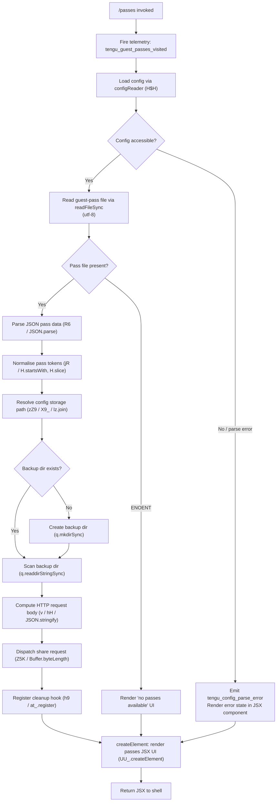

# `/passes`

> Analysis basis: CC v2.1.143 bundle.js (AST extraction + Claude interpretation)
> Minimum version: v2.1.143

---

## Overview

The `/passes` command surfaces a UI for sharing a free week of Claude Code with friends (guest passes). When invoked, the handler (`xv7`) fetches the current guest-pass state from disk/config, then renders a JSX component that allows the user to view and share available passes. A telemetry event (`tengu_guest_passes_visited`) is fired on each visit.

---

## Registration

| Field | Value |
|---|---|
| type | `local-jsx` |
| name | `passes` |
| description | `Share a free week of Claude Code with friends` |
| loc_byte | `11431342` |
| loc_byte_end | `11431662` |
| loc_line | `6981` |
| isHidden | `null` (not hidden) |
| module_id | `v2q` |
| load_inline | `true` |
| arbor_handler.name | `xv7` |
| arbor_handler.fqn | `claude-2.1.143::xv7` |
| arbor_handler.kind | `AsyncFunction` |
| arbor_handler.resolution_path | `module_id` |
| arbor_handler.n_hits | `2` |

Analysis basis: CC v2.1.143 bundle.js:+11431342

---

## Input Branching

The command has 3+ distinct branches driven by guest-pass state (available passes, config presence, and render path), so a Mermaid flowchart is used.



---

## Behavioral Spec

### Top-Level Handler (`xv7`)

Analysis basis: CC v2.1.143 bundle.js:+11431025

```
async function passesCommandHandler(context):
    fire telemetry event "tengu_guest_passes_visited"

    // Initialise config watcher and file-sync helpers
    configFileSync  = initConfigFileSync()          // N6
    passDataLoader  = initPassDataLoader()          // fj8 → L5
    storageAccessor = initStorageAccessor()         // a6

    // Read config; abort with error UI if inaccessible
    config = configFileSync.readConfig()            // H$H
    if config not accessible:
        emit "tengu_config_parse_error"
        return renderErrorJSX("Config accessed before allowed.")

    // Load raw pass file
    rawBytes = fs.readFileSync(passFilePath, "utf-8")
    if ENOENT:
        return renderPassesUI(passes=[], state="no_passes")

    // Parse and normalise
    passData  = JSON.parse(rawBytes)                // R6
    passTokens = normaliseTokens(passData)          // jR

    // Resolve persistent storage path
    storePath = resolveStorePath(backupDir, lz.join, lz.basename)  // zZ9 / X9_

    // Ensure backup directory exists
    if not exists(storePath / "backups"):
        fs.mkdirSync(storePath / "backups")

    // Enumerate previously-sent passes from backup dir
    existingBackups = fs.readdirStringSync(backupDir)

    // Prepare share payload and dispatch
    payload = buildHttpPayload(passTokens)          // v / Z5K
    result  = await dispatchShareRequest(payload)   // Z5K → Buffer.byteLength, Pv6.then

    // Register process-exit cleanup
    registerCleanupHook()                           // h9 / at_.register

    // Render and return JSX
    return UU_.createElement(PassesComponent, { passes: passTokens, result })
```

### Config Reader (`H$H`)

Analysis basis: CC v2.1.143 bundle.js:+3164235

```
function readConfigSafe(configPath):
    if config not yet initialised:
        throw new Error("Config accessed before allowed.")   // literal at +3164241

    raw = fs.readFileSync(configPath, "utf-8")               // +3164297, encoding "utf-8" at +3164324
    if ENOENT:
        return null                                          // +3164471

    parsed = JSON.parse(raw)                                 // R6 / +3164344
    tokens = normaliseTokenPrefix(parsed)                    // jR / +3164347

    if stat fails on configPath:
        log("error", ...)                                    // literal "error" at +3164792

    // Copy config to backup location
    backupPath = lz.join(backupDir, lz.basename(configPath)) // +3165030 / +3165047
    fs.mkdirSync(backupDir, { recursive:true })              // +3165057 — ignores EEXIST (+3165092)
    fs.readdirStringSync(backupDir)                          // +3165115
    fs.copyFileSync(configPath, backupPath)                  // +3165386

    return parsed
```

### Storage Path Resolver (`zZ9` / `X9_`)

Analysis basis: CC v2.1.143 bundle.js:+3163842

```
function resolveStoragePath(basePath):
    backupSubdir = lz.join(basePath, "backups")   // literal "backups" at +3163809
    base64Name   = lz.basename(basePath)
    fullPath     = buildJoinedPath(backupSubdir)  // X9_ / lz.join +3163796

    entries = fs.readdirStringSync(fullPath)      // +3163882
    for entry in entries:
        if entry.startsWith(".backup."):          // literal ".backup." at +3163094
            entryPath = lz.join(fullPath, entry)
            parentDir = lz.dirname(entryPath)
            if entryPath.startsWith(parentDir):
                stat = fs.statSync(entryPath)     // +3164158
    return fullPath
```

### Token Normaliser (`jR`)

Analysis basis: CC v2.1.143 bundle.js:+1081572

```
function normaliseTokenPrefix(tokenString):
    // Strip a known prefix when present
    if tokenString.startsWith(knownPrefix):
        return tokenString.slice(prefixLength)    // H.slice at +1081595
    return tokenString
```

### Config File Watcher / Snapshot Helper (`N6`)

Analysis basis: CC v2.1.143 bundle.js:+3161125

```
function initConfigFileSync(configPath, options):
    // Snapshot current timestamp
    timestamp = Date.now()                        // +3161214

    // Wire file-watch listener
    watcher = watchFileHelper(configPath)         // nhL +3161267

    watcher.on("change", (curr, prev) => {
        if curr.mtime !== prev.mtime:
            jR(...)                               // normalise on change, +3160804
            z9_(...)                              // state callback +3160862
    })

    watcher.once("close", () => {
        fs.unwatchFile(configPath)               // +3160964
    })

    registerCleanupHook(watcher)                 // h9 +3160951

    return { readFileSync: x6, now: N0 }         // +3161125, +3161139
```

### Pass Data Loader / Daemon Bridge (`fj8` → `L5` → `j3`)

Analysis basis: CC v2.1.143 bundle.js:+11088702

```
function initPassDataLoader(config):
    session = L5(config)                         // +11088702
    // L5 builds an Uw (connection wrapper) containing:
    //   - TK  : string helper
    //   - SN  : network node (nU6, TK, eAH, gc, fI)
    //   - Sw  : auth dispatcher (DA)
    //   - j3  : main request driver
    //     - validates ANTHROPIC_API_KEY presence    // literal +2911962
    //     - throws if neither ANTHROPIC_API_KEY
    //       nor CLAUDE_CODE_OAUTH_TOKEN set         // literal +2912383
    //   - eAH : IRH resolver
    // Returns session object with N6 file accessor  // +2928166

    bgSession = fj8(config, session)             // +11088750
    return bgSession
```

### Global Config Accessor (`a6` / `P9_`)

Analysis basis: CC v2.1.143 bundle.js:+3159299

```
function initStorageAccessor():
    // Determine config type from stored value
    storedType = readTypeField()              // literals: "unknown","local","migrated",
                                             // "native","installed","disabled","enabled",
                                             // "no_permissions","not_configured","global"
                                             // (+3159938 – +3160165)

    // Acquire write-lock
    lockResult = acquireLock(P9_)            // P9_ at +3159299
    if lockResult.elapsed > threshold:
        emit "tengu_config_lock_contention"  // +3162297
        // literal: "Lock acquisition took longer..." at +3162208

    // Re-read config after lock
    fresh = readConfigFromDisk()
    if fresh missing auth that cache has:
        emit "tengu_config_stale_write"      // +3162433
        emit "tengu_config_auth_loss_prevented" // +3162776
        // literal: "saveConfigWithLock: re-read..." at +3162624

    // Manage rotating backups (keep last 5)
    backups = fs.readdirStringSync(backupDir)  // +3162986
    backupsSorted = backups.filter(v => v.startsWith(".backup."))
    while backupsSorted.length > 5:            // literal 5 at +3163227
        fs.unlinkSync(oldest)                  // +3163345

    // Write new backup with mode 0o600 (384 decimal)
    atomicWrite(configPath, data, mode=384)    // literal 384 at +3163509 / yA6 +3163467
    return accessor
```

---

## State & Side Effects

| Item | Detail |
|---|---|
| Telemetry — guest passes | `tengu_guest_passes_visited` fired on every `/passes` invocation (+11431165) |
| Telemetry — config parse error | `tengu_config_parse_error` when config read fails (+3164878) |
| Telemetry — config lock contention | `tengu_config_lock_contention` when write-lock is slow (+3162297) |
| Telemetry — stale write | `tengu_config_stale_write` when disk config is stale (+3162433) |
| Telemetry — auth loss prevented | `tengu_config_auth_loss_prevented` if auth fields would be erased (+3162776) |
| Telemetry — bg spare enable | `tengu_bg_spare_enable` (background daemon path, +14504411) |
| Telemetry — bg spare claim | `tengu_bg_spare_claim` (+14504532) |
| Telemetry — bg spare spawn | `tengu_bg_spare_spawn` (+14502994) |
| Telemetry — bg spare claim fail | `tengu_bg_spare_claim_fail` (+14504795) |
| Telemetry — bg sendclaim failed | `tengu_bg_sendclaim_failed` (+14485198) |
| Telemetry — bg low mem | `tengu_bg_dispatch_low_mem` (+14503796) |
| Telemetry — bg low mem mb | `tengu_bg_low_mem_mb` (+11972252) |
| Telemetry — bg SIGKILL escalate | `tengu_bg_dispatch_sigkill_escalate` (+14503217) |
| Telemetry — daemon idle exit | `tengu_daemon_idle_exit` (+14522118) |
| Telemetry — feature ok/bad | `tengu_feature_ok` / `tengu_feature_bad` (background session health, +955068 / +955126) |
| File I/O | Reads pass JSON file (utf-8); creates/maintains `backups/` directory; retains at most 5 backup files; atomic config write with mode `0o600` (384) |
| Config write-lock | Acquired via `P9_` before any config mutation; contention emits telemetry |
| Auth-loss guard | Refuses to overwrite `~/.claude.json` if re-read would drop auth tokens (GH #3117) |
| Hook registration | Cleanup hook registered via `h9` / `at_.register` (+56977) to unwatch config file on process exit |
| File watch | `di6.watchFile` / `di6.unwatchFile` on config file path (+3160637 / +3160964) |
| JSX render | Returns `UU_.createElement(PassesComponent, …)` to the shell renderer (+11431214) |
| Background daemon | Optionally spawns/claims a spare background session (`fU.spawn` / `fU.claim`) if daemon infrastructure is active |
| appState changes | No direct `appState` mutations observed within depth-2 traversal |
| Sound | No sound effects observed within depth-2 traversal |

---

## Version History

| Version | Change |
|---|---|
| v2.1.143 | Initial analysis |

---

## Common Mistakes

1. **Invoking `/passes` without authentication** — The handler validates that `ANTHROPIC_API_KEY` or `CLAUDE_CODE_OAUTH_TOKEN` is set (literal at +2912383). If neither is present the command throws before rendering the JSX UI, resulting in a blank or error screen.
2. **Corrupted pass JSON file** — If the pass file exists but is not valid JSON, `JSON.parse` (via `R6`) will throw. The error is not silently swallowed; it propagates to the shell as an unhandled rejection, so ensure the pass file has not been manually edited.
3. **Stale config on disk** — If another Claude Code instance modified `~/.claude.json` concurrently, the auth-loss guard (`tengu_config_auth_loss_prevented`) will refuse to persist changes and log a warning referencing GH #3117. This is intentional safety behaviour, not a bug.
4. **Missing `backups/` directory permissions** — The handler calls `fs.mkdirSync` with `{ recursive: true }` and ignores `EEXIST`, but will fail on a genuine permission error. Ensure the config directory is writable by the current user.
5. **Expecting `/passes` to consume a sub-command argument** — The registration has no `userFacingName` argument schema; the command takes no additional tokens. Any text typed after `/passes` is silently ignored by the shell parser.

---

## Appendix — Identifier Mapping

> For bundle debugging only. Identifiers change across versions.

| Identifier | Role |
|---|---|
| `xv7` | Top-level passes command handler (AsyncFunction, arbor_handler) |
| `N6` | Config file-sync / snapshot initialiser |
| `x6` | Low-level file read helper |
| `z9_` | State-change callback (config watch) |
| `H$H` | Safe config reader (checks init flag, reads+backs up config file) |
| `q` | Filesystem operations wrapper (readFileSync, statSync, mkdirSync, etc.) |
| `R6` | JSON parse wrapper |
| `jR` | Token prefix normaliser (startsWith / slice) |
| `H` | Generic string / value variable (contextual) |
| `_` | Extended filesystem helper (readdirStringSync, statSync, toUpperCase) |
| `L8` | Logger / output helper |
| `zZ9` | Storage path resolver (backup dir scanner) |
| `X9_` | Joined path builder (lz.join wrapper) |
| `M` | MCP / module-map accessor (SvH, THK, L.get) |
| `$` | Global state / disposable container |
| `v` | HTTP payload builder / request dispatcher |
| `G5K` | Sub-request builder (IV, W5K, tt_) |
| `hH` | JSON.stringify wrapper |
| `P7` | URL / header formatter (replace, lastIndexOf, slice) |
| `cSH` | Content-type / header helper (X6A) |
| `Z5K` | HTTP send + Buffer.byteLength size checker |
| `NH` | Logging / error reporter (v_, xH, zq, kNK) |
| `v_` | Error string formatter |
| `xH` | String coercion helper |
| `zq` | Log queue accessor (A$A) |
| `kNK` | Ring-buffer log queue manager (Ch6.shift / push) |
| `d` | Debug / diagnostic state object |
| `w` | Background process manager (spawn, kill, retry, low-mem) |
| `A` | Process / session map |
| `C` | Child-process wrapper (Z_K, NH, MK5, z.write) |
| `mH` | Feature-bad reporter |
| `SH` | Feature-ok reporter |
| `IG6` | macOS memory reporter (d6, G6) |
| `x` | Daemon idle-exit timer (clearTimeout, setTimeout, Math.round) |
| `G6` | Background session dispatcher (m76, p76, Ts, Ci6) |
| `Oo_` | Spare-session claim sender (fU.claim, qE8.connect, f.on/once/write) |
| `jo_` | Session lifecycle manager (done/killed/stopped/failed/crashed states) |
| `L` | Shared session promise tracker (q.add/delete, f.finally) |
| `D` | Spare-spawn orchestrator (recursive retry, Date.now, 2000 ms interval) |
| `h` | Timer handle for daemon idle |
| `nhL` | File-watch wiring helper (di6.watchFile / unwatchFile) |
| `Tl` | Throttle/debounce utility |
| `h9` | Process-exit hook registrar (at_.register) |
| `fj8` | Pass data / background session loader (L5, N6) |
| `L5` | Session builder (Uw wrapper) |
| `Uw` | Connection wrapper (TK, SN, Sw, j3, eAH) |
| `TK` | String/ID helper used in session building |
| `SN` | Network node constructor (nU6, TK, eAH, gc, fI) |
| `Sw` | Auth dispatcher (DA — firstParty flag) |
| `j3` | Main request driver (validates API key, builds request) |
| `eAH` | IRH (request-header resolver) |
| `a6` | Global config accessor / storage initialiser |
| `P9_` | Config write-lock and atomic-save routine |
| `heA` | Config merge helper (Tr8, Object.assign) |
| `Tr8` | Config schema transformer (SeA) |
| `d76` | Config type discriminator helper |
| `V` | Config entry validator |
| `X` | MCP connection manager (iT8, Rk, vp, Promise.all, NH, v_) |
| `iT8` | MCP transport initialiser |
| `Z` | Slice helper for backup rotation |
| `yA6` | Atomic file write helper (randomBytes temp file, fchmodSync, fsyncSync, renameSync) |
| `O` | Symbolic-link stat helper (N8 — background session check) |
| `$8` | Error wrapper with L8 logging |
| `f` | Socket / stream handle (A.close, q.close, L) |
| `emH` | Config event emitter helper |
| `OZ9` | Object.entries iterator for config map |
| `HpH` | Timestamp accessor (Date.now) |
| `j9_` | Symlink-safe config path resolver (lz.dirname, tv, hH, yA6) |