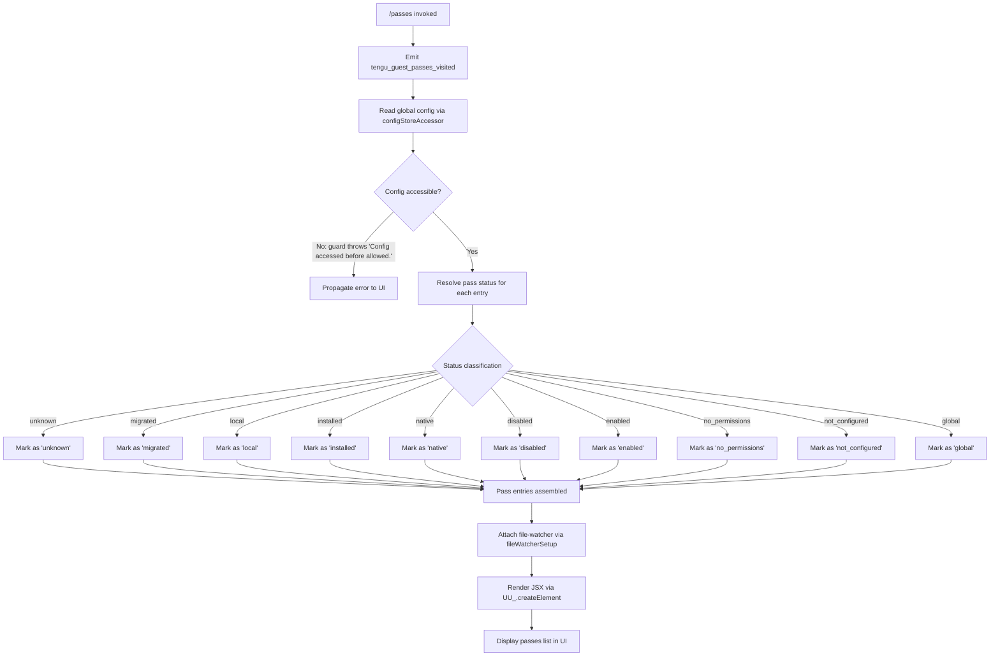

# `/passes`

> Analysis basis: CC v2.1.143 bundle.js (AST extraction + Claude interpretation)
> Minimum version: v2.1.143

---

## Overview

The `/passes` command renders a JSX-based view of **guest passes** — scoped access tokens or permission grants that allow external or guest users to interact with Claude Code under limited, delegated credentials. When invoked, it reads the current configuration state, resolves each pass's status, and displays a structured list of all passes with their lifecycle metadata. A `tengu_guest_passes_visited` telemetry event is emitted on every visit.

---

## Registration

| Field | Value |
|---|---|
| type | `local-jsx` |
| name | `passes` |
| description | `null` |
| loc\_line | 6981 |
| module\_id | `v2q` |

Analysis basis: CC v2.1.143 bundle.js:+11431342

---

## Input Branching

The command entry point (`commandRootHandler`) wires together three major sub-systems: the file-watcher initialiser (`fileWatcherSetup`), the config-store accessor (`configStoreAccessor`), and the JSX renderer (`passesRenderer`). No user-supplied argument parsing was observed at depth ≤ 2; the command is invoked without arguments.



Analysis basis: CC v2.1.143 bundle.js:+11431025, +11431059, +11431065, +11431163, +11431214

---

## Behavioral Spec

### Command Entry Point

```
function commandRootHandler(context):
    emit telemetry event "tengu_guest_passes_visited"

    config = configStoreAccessor()          // may throw if not yet allowed
    passEntries = resolveAllPasses(config)

    watcherHandle = fileWatcherSetup(config.configFilePath)

    return createElement(PassesView, {
        passes: passEntries,
        watcher: watcherHandle
    })
```

Analysis basis: CC v2.1.143 bundle.js:+11431025, +11431059, +11431065, +11431163, +11431165, +11431214

---

### Config Store Accessor (Guard + Read)

```
function configStoreAccessor():
    if configNotYetAllowed():
        throw new Error("Config accessed before allowed.")

    rawBytes = fs.readFileSync(configPath, "utf-8")

    try:
        parsed = JSON.parse(rawBytes)
    except ParseError:
        emit telemetry "tengu_config_parse_error"
        log level "error"
        parsed = fallbackEmptyConfig()

    if parsed is missing and errno is "ENOENT":
        return defaultConfig()

    return parsed
```

Analysis basis: CC v2.1.143 bundle.js:+3164241, +3164282, +3164297, +3164324, +3164471, +3164792, +3164878

---

### Pass Status Resolution

Each entry in the raw config is classified into one of ten status strings. The classifier function inspects the entry's fields and maps them to a canonical status.

```
function resolvePassStatus(entry):
    if entry has no recognisable type:
        return "unknown"                    // bundle.js:+3159959

    if entry.origin == "migrated":
        return "migrated"                   // bundle.js:+3160021

    if entry.scope == "local":
        return "local"                      // bundle.js:+3160034

    if entry.state == "installed":
        return "installed"                  // bundle.js:+3160052

    if entry.kind == "native":
        return "native"                     // bundle.js:+3160066

    if entry.enabled == false:
        return "disabled"                   // bundle.js:+3160085

    if entry.enabled == true:
        return "enabled"                    // bundle.js:+3160111

    if entry.permissionLevel == 0:
        return "no_permissions"             // bundle.js:+3160125

    if entry.configured == false:
        return "not_configured"             // bundle.js:+3160146

    if entry.scope == "global":
        return "global"                     // bundle.js:+3160165

    return "unknown"
```

Analysis basis: CC v2.1.143 bundle.js:+3159938, +3159959, +3160021, +3160034, +3160052, +3160066, +3160085, +3160099, +3160111, +3160125, +3160146, +3160165

---

### Config Save with Lock (saveConfigWithLock)

This function is called by the config-write path triggered when a pass is mutated from the UI.

```
function saveConfigWithLock(newConfig):
    lockAcquired = false
    attempts = 0

    while not lockAcquired:
        if attempts > 100:                  // bundle.js:+3162202
            warn("Lock acquisition took longer than expected - " +
                 "another Claude instance may be running")
                                            // bundle.js:+3162208
            emit "tengu_config_lock_contention"
                                            // bundle.js:+3162297
            break

        try to acquire file lock
        attempts += 1

    reReadConfig = readConfigFromDisk()

    if cachedConfig has auth AND reReadConfig is missing auth:
        emit "tengu_config_stale_write"     // bundle.js:+3162433
        // safety check: refuse the write to avoid data loss
        // (see GH #3117)                  // bundle.js:+3162624

    if newConfig is missing auth AND cachedConfig has auth:
        emit "tengu_config_auth_loss_prevented"
                                            // bundle.js:+3162776
        refuse write with log message referencing GH #3117

    atomicallyWrite(newConfig)
    releaseLock()
```

Analysis basis: CC v2.1.143 bundle.js:+3162202, +3162208, +3162297, +3162433, +3162624, +3162776

---

### Config Backup Management

```
function manageConfigBackups(configDir, configBasename):
    backupDir = path.join(configDir, configBasename + ".backup.")
                                            // bundle.js:+3163094
    ensureDir(backupDir)

    existingBackups = fs.readdirSync(backupDir)
        .filter(name => name.startsWith(".backup."))
                                            // bundle.js:+3163021
        .map(name => {
            parts = name.split(".")         // bundle.js:+3163086
            timestamp = Number(parts[...])
            if Number.isNaN(timestamp):     // bundle.js:+3163117
                discard entry
            return { name, timestamp }
        })
        .sortDescendingByTimestamp()

    copyFileSyncToBackup(currentConfigPath, newBackupPath)
                                            // bundle.js:+3163201

    MAX_BACKUPS = 5                         // bundle.js:+3163227

    if existingBackups.length > MAX_BACKUPS:
        toDelete = existingBackups.slice(MAX_BACKUPS)
                                            // bundle.js:+3163330
        for each old backup:
            fs.unlinkSync(old.path)         // bundle.js:+3163345

    BACKUP_MAX_AGE_MS = 60000               // bundle.js:+3162978
    // backups older than 60 000 ms are also eligible for pruning
```

Analysis basis: CC v2.1.143 bundle.js:+3162978, +3163021, +3163086, +3163094, +3163117, +3163201, +3163227, +3163330, +3163345

---

### File Watcher Setup

```
function fileWatcherSetup(configPath, onChangeCallback):
    currentConfig = readConfig()            // bundle.js:+3160632
    watcher = fs.watchFile(configPath, handler)
                                            // bundle.js:+3160637

    function handler(event):
        newConfig = readConfig()            // bundle.js:+3160718
        if newConfig differs from currentConfig:
            currentConfig = newConfig
            notify(onChangeCallback, newConfig)
                                            // bundle.js:+3160801
        if errorCondition:
            scheduleRetry(handler)          // bundle.js:+3160870

    return {
        stop: () => fs.unwatchFile(configPath)
                                            // bundle.js:+3160964
    }
```

Analysis basis: CC v2.1.143 bundle.js:+3160632, +3160637, +3160718, +3160801, +3160862, +3160870, +3160951, +3160964

---

### Global Config Save Fallback

```
function saveGlobalConfigFallback(newConfig):
    reRead = readConfigFromDisk()

    if reRead is missing auth AND cachedConfig has auth:
        log warning:
            "saveGlobalConfig fallback: re-read config is missing auth " +
            "that cache has; refusing to write. See GH #3117."
                                            // bundle.js:+3159506
        return without writing

    write newConfig to global config path
```

Analysis basis: CC v2.1.143 bundle.js:+3159506

---

### Random Jitter Utility

Used internally to stagger concurrent write retries and avoid thundering-herd on the config lock.

```
function jitteredDelay(baseMs):
    jitter = Math.random()                  // bundle.js:+12638156
    setTimeout(resolve, baseMs + jitter * baseMs)
                                            // bundle.js:+12638193
```

Analysis basis: CC v2.1.143 bundle.js:+12638156, +12638193

---

### Logger Utility

```
function log(level, message, ...meta):
    if level == "debug":                    // bundle.js:+201193
        // suppress in production unless debug flag set
        return

    formattedLevel = level.toUpperCase()   // bundle.js:+201319
    trimmedMessage = message.trim()        // bundle.js:+201342
    writeToLogSink(formattedLevel, trimmedMessage, meta)
```

Analysis basis: CC v2.1.143 bundle.js:+201193, +201319, +201342

---

### Pass Directory Initialisation

```
function initPassDirectory(basePath):
    dir = path.dirname(basePath)            // bundle.js:+3162003
    fs.mkdirSync(dir, { recursive: true })  // bundle.js:+3162024

    timestamp = Date.now()                  // bundle.js:+3162069

    statResult = fs.statSync(basePath)      // bundle.js:+3162373
    if statResult missing:
        // directory is new; no existing passes
        return emptyPassSet()

    return loadPassesFromDir(dir)
```

Analysis basis: CC v2.1.143 bundle.js:+3161997, +3162003, +3162019, +3162024, +3162069, +3162373

---

### Backup Copy Utility (Inner)

```
function copyConfigToBackup(srcPath, destDir):
    basename = path.basename(srcPath)       // bundle.js:+3165030
    destPath = path.join(destDir, basename + "." + Date.now())
                                            // bundle.js:+3165269, +3165368

    if destDir does not exist:
        try:
            fs.mkdirSync(destDir, { recursive: true })
                                            // bundle.js:+3165057
        except errno "EEXIST":              // bundle.js:+3165092
            // race condition; directory already created; ignore

    existingFiles = fs.readdirSync(destDir) // bundle.js:+3165115
        .filter(f => f.startsWith(".backup."))
                                            // bundle.js:+3165150

    fs.copyFileSync(srcPath, destPath)      // bundle.js:+3165386
```

Analysis basis: CC v2.1.143 bundle.js:+3165030, +3165047, +3165057, +3165092, +3165115, +3165150, +3165269, +3165368, +3165386

---

## Constants and Limits

| Constant | Value | Analysis Basis |
|---|---|---|
| Lock contention retry ceiling | 100 attempts | bundle.js:+3162202 |
| Maximum config backups retained | 5 | bundle.js:+3163227 |
| Backup maximum age | 60 000 ms | bundle.js:+3162978 |
| Backup filename separator | `.backup.` | bundle.js:+3163094 |
| Config file encoding | `utf-8` | bundle.js:+3164324 |
| Minimum permission level (numeric) | 0 | bundle.js:+3159938 |
| Numeric constant used in pass resolution | 1 | bundle.js:+3160099 |
| Backup rotation: oldest copies kept | 2 (slice lower bound) | bundle.js:+3163483 |
| Backup file permission bits | 384 (octal 0o600) | bundle.js:+3163509 |

---

## State & Side Effects

| Item | Detail |
|---|---|
| Telemetry emitted on visit | `tengu_guest_passes_visited` (bundle.js:+11431165) |
| Telemetry emitted on config parse failure | `tengu_config_parse_error` (bundle.js:+3164878) |
| Telemetry emitted on lock contention | `tengu_config_lock_contention` (bundle.js:+3162297) |
| Telemetry emitted on stale write detection | `tengu_config_stale_write` (bundle.js:+3162433) |
| Telemetry emitted on auth loss prevention | `tengu_config_auth_loss_prevented` (bundle.js:+3162776) |
| File system reads | `fs.readFileSync`, `fs.readdirSync`, `fs.statSync` on config paths |
| File system writes | `fs.copyFileSync`, `fs.mkdirSync`, `fs.unlinkSync` during backup management |
| File watcher registration | `fs.watchFile` registered on config file path; released via `fs.unwatchFile` on teardown |
| Config backup side effect | Up to 5 timestamped backup copies of the config file, pruned automatically |
| appState changes | Global config object updated in-memory when a pass mutation is saved |
| Sound | <!-- TODO: not found in depth-2 traversal; needs --depth 4 --> |
| Auth-loss safety guard | Write to config refused and logged if in-memory auth would be silently dropped (GH #3117) |

---

## Version History

| Version | Change |
|---|---|
| v2.1.143 | Initial analysis — registration, pass status classification, config lock, backup rotation, file-watcher, and telemetry events documented |

---

## Common Mistakes

1. **Invoking `/passes` before config is initialised** — the config guard throws `"Config accessed before allowed."` (bundle.js:+3164241) if the command is rendered before the application config layer has completed its bootstrap sequence. This results in a hard error visible in the UI rather than an empty passes list.

2. **Assuming the description field is populated** — the `description` field in the registration object is `null` (bundle.js:+11431342). Tooling that auto-generates help text from this field will produce a blank or missing entry for `/passes`.

3. **Concurrent Claude instances writing config** — the lock retry ceiling is 100 attempts (bundle.js:+3162202). Running two Claude Code instances against the same config file simultaneously will trigger `tengu_config_lock_contention` telemetry and a warning log; neither instance will corrupt the file, but the slower instance may observe stale pass data until the next file-watcher callback fires.

4. **Expecting more than 5 backup files** — the backup rotation hard limit is 5 copies (bundle.js:+3163227). Older backups are deleted unconditionally. Do not rely on the backup directory as an audit trail beyond the most recent 5 saves.

5. **Relying on pass status outside the known ten values** — the classifier falls through to `"unknown"` for any entry that does not match the ten documented status literals. Entries added by future versions of the server that introduce new status codes will appear as `"unknown"` until the client bundle is updated.

---

## Appendix — Identifier Mapping

> For bundle debugging only. Identifiers change across versions.

| Identifier | Role |
|---|---|
| `xv7` | Command root handler — entry point registered for `/passes` |
| `N6` | Config store accessor — reads and parses the on-disk config file |
| `x6` | Config path resolver — returns the absolute path to the config file |
| `z9_` | Config initialisation guard — enforces "allowed" state before access |
| `H$H` | Backup copy utility — copies config to a timestamped backup file |
| `nhL` | File watcher setup — registers `fs.watchFile` and returns a stop handle |
| `fj8` | Pass list loader — bridges the file-based store to the JSX layer |
| `L5` | Composite initialiser — calls file loader and config accessor together |
| `a6` | Pass manager — orchestrates status resolution, locking, and saving |
| `P9_` | Save config with lock — acquires file lock, validates auth, writes config |
| `H` | Jitter delay utility — applies random offset to retry intervals |
| `emH` | Pass entry factory — constructs a typed pass object from raw config data |
| `OZ9` | Pass entries iterator — walks `Object.entries` of the raw passes map |
| `HpH` | Timestamp helper — wraps `Date.now` for pass lifecycle timestamping |
| `v` | Logger — level-filtered log writer with uppercase level formatting |
| `d76` | Pass serialiser — converts a pass object back to its storable form |
| `d` | Debug logger shorthand — thin wrapper around the logger at debug level |
| `j9_` | Pass delete handler — removes a pass entry and persists the change |