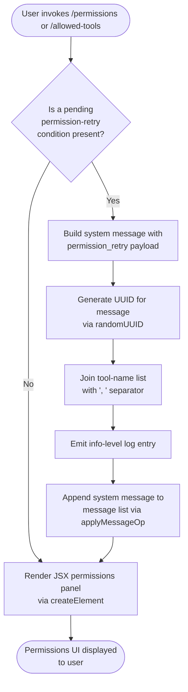

# `/permissions`

> Analysis basis: CC v2.1.143 bundle.js (AST extraction + Claude interpretation)
> Minimum version: v2.1.143

---

## Overview

The `/permissions` command (also reachable via `/allowed-tools`) provides an interactive interface for managing the allow and deny rules that govern which tools Claude Code may invoke during a session. It renders a JSX component into the conversation stream and, when a permission-retry condition is detected, synthesizes a system-level message that is appended to the message list so the model can re-evaluate its pending tool call.

---

## Registration

| Field | Value |
|---|---|
| type | `local-jsx` |
| name | `permissions` |
| description | `Manage allow & deny tool permission rules` |
| aliases | `["allowed-tools"]` |
| module\_id | `L2q` |

Analysis basis: CC v2.1.143 bundle.js:+11417715

---

## Input Branching

The command handler (`permissionsCommandHandler`) is invoked by the CLI dispatcher whenever the user types `/permissions` or `/allowed-tools`. Its internal branching is derived from the call graph and the literals present in the implementation.



Analysis basis: CC v2.1.143 bundle.js:+11417533, +11417586, +11417628, +9991177, +9991194, +9991232, +9991264, +9991321

---

## Behavioral Spec

### Permissions Panel Rendering

The command's primary action is to mount a JSX element that presents the current allow/deny rule set and lets the user modify it interactively.

```
function renderPermissionsPanel(context):
    element = createElement(PermissionsComponent, context.props)
    return element
```

Analysis basis: CC v2.1.143 bundle.js:+11417533

---

### Message Append (applyMessageOp)

After any system-level permission message is constructed, it is appended to the running message list using the `append` operation rather than replacing existing messages.

```
function appendPermissionMessage(messageList, payload):
    op = { kind: "append", message: payload }
    applyMessageOp(messageList, op)
```

The operation kind is the string literal `"append"`.

Analysis basis: CC v2.1.143 bundle.js:+11417586, +11417609

---

### Permission-Retry System Message Construction

When the command detects that a prior tool call is awaiting a permission decision, it builds a synthetic system message tagged with the role `"system"` and the sub-type `"permission_retry"`, then assigns it a fresh UUID and formats the list of affected tool names.

```
function buildPermissionRetryMessage(toolNames):
    id      = randomUUID()                      // gZ.randomUUID
    joined  = joinWithSeparator(toolNames, ", ") // H.join with literal ", "
    message = {
        role:    "system",
        subtype: "permission_retry",
        id:      id,
        content: joined
    }
    logAtLevel("info", message)
    return message
```

Analysis basis: CC v2.1.143 bundle.js:+9991177, +9991194, +9991232, +9991264, +9991321

---

### Randomised Delay Helper (H)

The identifier mapped to the delay utility (`delayHelper`) uses `Math.random()` scaled to produce a value in the range `[1, 2)` (numeric literals `1` and `2` are present at adjacent bytes), then passes the result to `setTimeout`. This pattern is consistent with jitter-based retry back-off rather than a fixed delay.

```
function delayWithJitter(callback):
    jitter   = Math.random() * (MAX_FACTOR - MIN_FACTOR) + MIN_FACTOR
    // MAX_FACTOR = 2, MIN_FACTOR = 1
    delayMs  = computeDelay(jitter)
    setTimeout(callback, delayMs)
```

Analysis basis: CC v2.1.143 bundle.js:+12638154, +12638156, +12638170, +12638193

---

## State & Side Effects

| Item | Detail |
|---|---|
| Telemetry | None — no `tengu_*` events found in depth-2 traversal |
| Message list mutation | One `"append"` operation applied via `applyMessageOp` when a permission-retry payload is present (bundle.js:+11417586) |
| UUID generation | `crypto.randomUUID()` called once per permission-retry message to assign a stable message ID (bundle.js:+9991321) |
| Logging | An `"info"`-level log entry is emitted after the system message is assembled (bundle.js:+9991264) |
| Retry back-off | `setTimeout` with jitter derived from `Math.random()` is used by the delay helper; no side effect on persistent state (bundle.js:+12638193) |
| Hook registration | <!-- TODO: not found in depth-2 traversal; needs --depth 4 --> |
| appState changes | <!-- TODO: not found in depth-2 traversal; needs --depth 4 --> |
| Sound | <!-- TODO: not found in depth-2 traversal; needs --depth 4 --> |

---

## Version History

| Version | Change |
|---|---|
| v2.1.143 | Initial analysis — command confirmed as `local-jsx` type with `allowed-tools` alias; permission-retry system message path and jitter delay helper documented |

---

## Common Mistakes

1. **Using `/allowed-tools` and expecting different behaviour** — the alias is registered identically to `/permissions`; both invoke the same handler and render the same panel.
2. **Assuming telemetry is fired** — no `tengu_*` events are emitted by this command at depth-2. Do not expect server-side analytics for permission changes triggered through this command alone.
3. **Expecting a blocking confirmation prompt** — the command appends a system message with `"append"` semantics; it does not replace or clear prior conversation context.
4. **Treating the permission-retry path as always active** — the `permission_retry` message construction is conditional. If no pending tool call awaits a permission decision, only the JSX panel is rendered and no system message is produced.
5. **Assuming a fixed retry delay** — the delay helper introduces random jitter (bounded by the numeric literals `1` and `2`), so retry timing is non-deterministic.

---

## Appendix — Identifier Mapping

> For bundle debugging only. Identifiers change across versions.

| Identifier | Role |
|---|---|
| `Ev7` | Top-level permissions command handler (entry point for `/permissions`) |
| `_` | Message-operation utility namespace exposing `applyMessageOp` |
| `_1q` | Permission-retry message builder; calls `randomUUID`, `join`, and logs at `"info"` level |
| `H` | Jitter delay helper; uses `Math.random` and `setTimeout` |