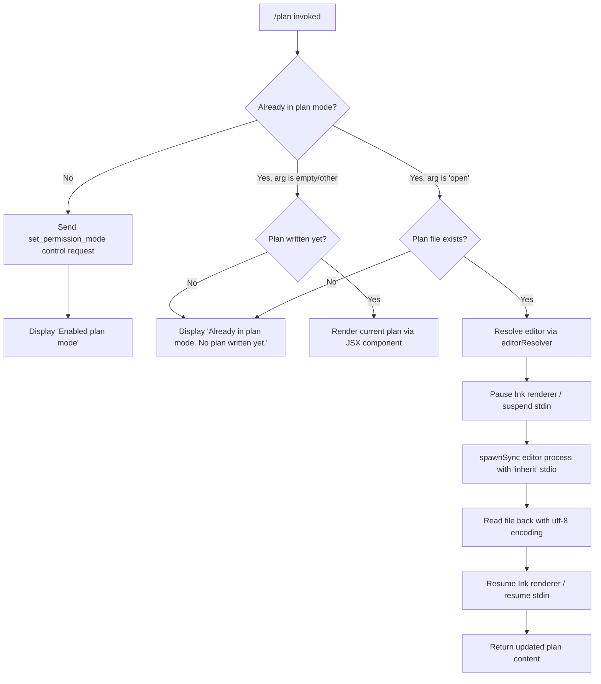

# `/plan`

> Analysis basis: CC v2.1.143 bundle.js (AST extraction + Claude interpretation)
> Minimum version: v2.1.143

---

## Overview

The `/plan` command enables "plan mode" for the current Claude Code session, or surfaces the existing session plan when one has already been written. When invoked with the `open` keyword or any descriptive text, it can open the plan document in an external editor. Internally it sends a `set_permission_mode` control request and coordinates with the session state to gate all subsequent tool operations through the plan gate.

---

## Registration

| Field | Value |
|---|---|
| type | `local-jsx` |
| name | `plan` |
| description | Enable plan mode or view the current session plan |
| argumentHint | `[open\|<description>]` |
| module_id | `z2q` |

Analysis basis: CC v2.1.143 bundle.js:+11419766

---

## Input Branching

The command handler (`planCommandHandler`) inspects the trimmed argument string and the current session state to decide which path to execute.



Analysis basis: CC v2.1.143 bundle.js:+11418848 (control request), +11418916 (enabled message), +11418944 (already-in-plan message), +11419165 (`open` keyword), +11419324 (no-plan-yet message), +11419146 (trim call), +11419282 (plan-render path)

---

## Behavioral Spec

### Plan Mode Activation

```
function activatePlanMode(sessionState, controlRequestSender):
    if sessionState.isPlanMode == true:
        return displayMessage("Already in plan mode.")

    controlRequestSender.sendControlRequest(
        type   = "session",
        action = "set_permission_mode"
    )
    displayMessage("Enabled plan mode")
```

Analysis basis: CC v2.1.143 bundle.js:+11418848 (`M.sendControlRequest`), +11418833 (`"session"` literal), +11418878 (`"set_permission_mode"` literal), +11418916 (`"Enabled plan mode"` literal), +11418944 (`"Already in plan mode."` literal)

---

### Permission / Mode Update Handling

When the control request is dispatched, the permission-mode update handler (`permissionModeUpdateHandler`) validates the requested mode. If `bypassPermissions` mode is requested but the session was not launched in that mode (or `disableBypassPermissionsMode` is set), the update is silently rejected and a debug-level log message is emitted.

```
function permissionModeUpdateHandler(update, sessionConfig):
    if update.action == "setMode":
        if update.mode == "bypassPermissions":
            if not sessionConfig.bypassPermissionsAvailable:
                log(level="debug",
                    msg="Ignoring permission update: setMode 'bypassPermissions' rejected — " +
                        "mode is not available (disableBypassPermissionsMode set, " +
                        "or session not launched in bypassPermissions mode)")
                return

    if update.action == "addRules":
        applyRules(update, ruleSet="alwaysAllowRules" | "alwaysDenyRules" | "alwaysAskRules")

    if update.action == "replaceRules":
        replaceExistingRules(update)

    if update.action == "removeRules":
        pruneRules(update)

    if update.action == "addDirectories":
        appendDirectories(update)

    if update.action == "removeDirectories":
        pruneDirectories(update)

    stateMap.set(derivedKey, updatedState)
```

Analysis basis: CC v2.1.143 bundle.js:+4033564 (`"setMode"`), +4033586 (`"bypassPermissions"`), +4033652 (rejection log string), +4033928 (`"addRules"`), +4034113 (`"allow"`), +4034121 (`"alwaysAllowRules"`), +4034153 (`"deny"`), +4034160 (`"alwaysDenyRules"`), +4034178 (`"alwaysAskRules"`), +4034276 (`"replaceRules"`), +4034587 (`"addDirectories"`), +4034933 (`"removeRules"`), +4035317 (`"removeDirectories"`), +4034846 (`A.set`), +4035243 (`K.filter`), +4035258 (`L.has`), +4035545 (`A.delete`)

---

### Plan-File Open (Editor Launch)

When the argument is exactly `"open"` and the session is already in plan mode, the command resolves the external editor and opens the plan file in it, suspending the Ink UI for the duration.

```
function openPlanInEditor(planFilePath, appState):
    if not fileSystem.statSync(planFilePath):
        return displayMessage("Already in plan mode. No plan written yet.")

    editor = resolveEditor(planFilePath)
    // resolveEditor inspects EDITOR/VISUAL env vars, falls back to system default
    // IDE-hosted sessions use "IDE" launch path (bundle.js:+5216283)

    appState.enterAlternateScreen()
    appState.pause()
    appState.suspendStdin()

    args = buildEditorArgs(planFilePath)
    // Splits argument string (L.split), slices as needed (f.slice)

    result = childProcess.spawnSync(editor, args, { stdio: "inherit" })

    content = fileSystem.readFileSync(planFilePath, encoding="utf-8")

    appState.exitAlternateScreen()
    appState.resumeStdin()
    appState.resume()

    return content
```

Analysis basis: CC v2.1.143 bundle.js:+10608652 (`_.statSync`), +10608712 (`A.enterAlternateScreen`), +10608742 (`A.pause`), +10608752 (`A.suspendStdin`), +10608791 (`L.split`), +10608816 (`f.slice`), +10608834 (`n5q.spawnSync`), +10608866 (`"inherit"` stdio), +10609136 (`_.readFileSync`), +10609214 (`A.exitAlternateScreen`), +10609243 (`A.resumeStdin`), +10609259 (`A.resume`), +11419165 (`"open"` literal), +11419324 (`"Already in plan mode. No plan written yet."` literal), +12174944 (`"utf-8"` encoding)

---

### Plan Content Rendering (JSX Path)

When the session is in plan mode and a plan has been written, the command renders the plan content using a JSX component tree. ANSI escape codes are stripped from the rendered output before display.

```
function renderPlanView(planContent, reactCreateElement):
    cleanContent = Bun.stripANSI(planContent)
    element = reactCreateElement(PlanViewComponent, { data: cleanContent })
    return element
```

Analysis basis: CC v2.1.143 bundle.js:+11419543 (`lT.createElement`), +7549355 (`ae.createElement`), +7549293 (`"data"` prop key), +3718834 (`Bun.stripANSI`), +11419539 (`vZ1`)

---

### MCP Connection Orchestration (Side Effect of Control Request)

Sending the `set_permission_mode` control request triggers the MCP connection manager (`mcpConnectionOrchestrator`) which (re-)validates all configured MCP server connections. Transport types `stdio`, `sse`, `http`, `sse-ide`, and `ws-ide` are each dispatched to sub-handlers. A connection cached as `"needs-auth"` is skipped with a log message. Servers that recover from failure trigger a retry-stop log.

```
function mcpConnectionOrchestrator(serverConfigs, connectionState):
    for each [serverName, config] in Object.entries(serverConfigs):
        if config.status == "disabled":
            continue

        switch config.transport:
            case "stdio":   launchStdioServer(config)
            case "sse":     connectSseServer(config)
            case "http":    connectHttpServer(config)
            case "sse-ide": connectSseIdeServer(config)
            case "ws-ide":  connectWsIdeServer(config)

        if connectionCache.get(serverName) == "needs-auth":
            log("Skipping connection (cached needs-auth)")
            continue

        connectionResults = await Promise.all(pendingConnections)

        for each result in connectionResults:
            if result.status == "connected":
                applyMcpUpdate(result)
            elif result.status == "failed":
                recordFailure(result)

    if allRemoteServersRecovered():
        log("[MCP] Retry: all remote servers recovered, stopping")
```

Analysis basis: CC v2.1.143 bundle.js:+9694745 (`"disabled"`), +9694847 (`"stdio"`), +9694881 (`"sse"`), +9694913 (`"http"`), +9694946 (`"sse-ide"`), +9694982 (`"ws-ide"`), +9695386 (`"Skipping connection (cached needs-auth)"`), +9695452 (`"needs-auth"`), +9695554 (`"connected"`), +9695814 (`Promise.all`), +9696127 (`"failed"`), +14234909 (`"[MCP] Retry: all remote servers recovered, stopping"`), +14234339 (`H.applyMcpUpdate`)

---

### Plan Context Compilation

Before the plan view is rendered or the control request is sent, a plan context compiler (`planContextCompiler`) iterates over session entries, serialises each through `hH` (which calls `JSON.stringify`), and assembles the full context block.

```
function planContextCompiler(sessionEntries):
    result = []
    for each [key, entry] in Object.entries(sessionEntries):
        serialized = jsonSerialize(entry)    // delegates to JSON.stringify
        result.push(serialized)
        if hasSubEntries(entry):
            subResults = mapSubEntries(entry)
            result.push(...subResults)
    return result
```

Analysis basis: CC v2.1.143 bundle.js:+9911576 (`Object.entries`), +9911626 (`_LH` → `Ff`), +9911654 (`K.map`), +9910919 (`Object.entries` in `QQ`), +9910998 (`_.push`), +181316 (`JSON.stringify` in `hH`)

---

### Temporary File Cleanup

A cleanup helper (`tempFileCleanup`) removes temporary files created during the plan-open flow using `unlinkSync`.

```
function tempFileCleanup(tempFilePath):
    fileSystem.unlinkSync(tempFilePath)
```

Analysis basis: CC v2.1.143 bundle.js:+14482768 (`n8K.unlinkSync`), +11418640 (`Iv7 → q`)

---

### Jitter / Retry Delay

A random jitter helper (`jitterDelay`) is used in the MCP retry path, generating a value in `[0, 2)` and scheduling via `setTimeout`.

```
function jitterDelay(baseMs):
    jitter = Math.random() * 2   // multiplier = 2 (bundle.js:+12638154)
    setTimeout(callback, baseMs + jitter)
```

Analysis basis: CC v2.1.143 bundle.js:+12638154 (`2` literal), +12638156 (`Math.random`), +12638193 (`setTimeout`)

---

## State & Side Effects

| Item | Detail |
|---|---|
| Telemetry | None — `telemetry` array is empty for this command. No `tengu_*` events were found in the depth-2 traversal. |
| Control request | Emits a `"session"` / `"set_permission_mode"` control request via `M.sendControlRequest` (bundle.js:+11418848) |
| Permission state map | Updated via `A.set` / `A.delete` when rule or mode changes are applied (bundle.js:+4034846, +4035545) |
| MCP connections | Triggers full MCP connection orchestration cycle as a side effect of the control request (bundle.js:+14234051) |
| Ink renderer | Suspended (`pause` + `suspendStdin` + `enterAlternateScreen`) while the external editor is open; resumed afterward (bundle.js:+10608712–+10609259) |
| File I/O | `statSync` to check plan file existence; `readFileSync` (utf-8) to reload plan after editing; `unlinkSync` to remove temporaries |
| stdout / stdio | External editor spawned with `{ stdio: "inherit" }` (bundle.js:+10608866) |
| Hook registration | <!-- TODO: not found in depth-2 traversal; needs --depth 4 --> |
| Sound | <!-- TODO: not found in depth-2 traversal; needs --depth 4 --> |

---

## Version History

| Version | Change |
|---|---|
| v2.1.143 | Initial analysis |

---

## Common Mistakes

1. **Invoking `/plan open` before any plan exists.** If the model has not yet written a plan file, issuing `/plan open` will display `"Already in plan mode. No plan written yet."` and will not launch the editor. The user must wait for the model to produce a plan document first.

2. **Expecting `/plan` to work in `bypassPermissions`-restricted sessions.** If the session was not launched with bypass-permissions mode enabled, the `setMode bypassPermissions` update is silently rejected (debug-level log only). The command will still activate basic plan mode, but bypass-permissions escalation will not occur.

3. **Assuming the argument is free-form text that gets passed to the model.** The argument hint `[open|<description>]` suggests free-form input, but the primary branch the implementation acts on is the exact string `"open"` (bundle.js:+11419165). Other text is trimmed (bundle.js:+11419146) but its exact downstream handling is <!-- TODO: not found in depth-2 traversal; needs --depth 4 -->.

4. **Running `/plan` in an IDE-hosted session and expecting a native terminal editor.** When the editor resolver detects an `"IDE"` environment (bundle.js:+5216283), it routes the open action through the IDE integration rather than spawning a terminal process directly.

5. **Conflating `/plan` with a no-op when already in plan mode.** A second `/plan` invocation (no argument) while already in plan mode does not re-send the control request; it either shows the current plan or the "no plan written yet" message depending on whether a plan document has been created.

---

## Appendix — Identifier Mapping

> For bundle debugging only. Identifiers change across versions.

| Identifier | Role |
|---|---|
| `Iv7` | Plan command handler (top-level entry point) |
| `q` | Temp-file cleanup helper (wraps `unlinkSync`) |
| `Z$` | Session / CCR context initialiser |
| `BjH` | CCR sub-initialiser (called from `Z$`) |
| `To` | Unknown helper called early in handler |
| `K` | Connection/entry map utility (uses `L.map`, `f.padEnd`) |
| `L` | Async task wrapper (add/delete from pending set, finally handler) |
| `f` | Stream or handle object (has `close`, `toLowerCase`) |
| `Ff` | Permission-mode update handler |
| `v` | Mode validation / logging utility |
| `Yf` | Rule serialisation helper |
| `hH` | JSON serialisation wrapper (delegates to `JSON.stringify`) |
| `A` | State map / app-state object (set, delete, enterAlternateScreen, etc.) |
| `gIH` | Plan context / info assembler |
| `dR_` | Sub-assembler used by `gIH` (uses `TR`, `pk`, `Hp8`) |
| `zy` | Unknown helper called from `gIH` |
| `_LH` | Entry-mapping helper (Object.entries + Ff + K.map) |
| `QQ` | Plan entry collector / serialiser |
| `M` | MCP / control-request manager |
| `SvH` | MCP connection sub-orchestrator (per-server dispatcher) |
| `THK` | MCP update applier (applyMcpUpdate, cleanup, wv, HJ) |
| `$` | JZq-based utility (purpose unclear at depth 2) |
| `B95` | MCP full reconnect orchestrator |
| `H` | Jitter / retry delay helper (Math.random + setTimeout) |
| `maH` | Plan-view pre-renderer (calls `_7H`, `V6`) |
| `_7H` | Unknown sub-helper of `maH` |
| `V6` | View-component factory (uses `GV`) |
| `uT` | Plan-display coordinator (calls `mT`, `x6`, `$8`, `NH`) |
| `mT` | Plan content formatter (yDH, V6, LU.join, RO) |
| `x6` | Unknown utility called from `uT` and `cp` |
| `$8` | File-read helper (delegates to `L8`, handles ENOENT) |
| `NH` | Error/notification handler (v_, xH, zq, kNK, logError) |
| `cp` | External editor launcher (statSync, spawnSync, Ink suspend/resume) |
| `lb` | Editor-path resolver helper (hJ, ij7) |
| `_` | File-system namespace (statSync, readFileSync, getClients) |
| `oj7` | Editor argument builder (uses `Ux_`) |
| `Vj` | Editor binary resolver (toLowerCase, uI.basename, EEH) |
| `vZ1` | Plan JSX render coordinator (calls `dcH`, `Q5`) |
| `dcH` | Plan stream/event component (K.on, f.toString, ae.createElement) |
| `Q5` | ANSI-strip wrapper (delegates to `Bun.stripANSI`) |