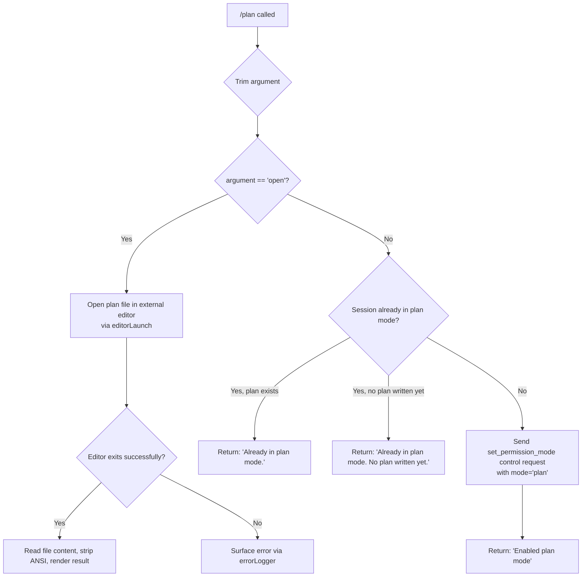

# `/plan`

> Analysis basis: CC v2.1.143 bundle.js (AST extraction + Claude interpretation)
> Minimum version: v2.1.143

---

## Overview

The `/plan` command enables "plan mode" for the current Claude Code session, or displays the current session plan if one already exists. When invoked with no argument or with a description, it transitions the session into a restricted, planning-only permission mode. When invoked with the argument `open`, it launches an external editor to display or edit the plan document. The command interacts with the permission-mode subsystem via a `set_permission_mode` control request.

---

## Registration

| Field | Value |
|---|---|
| type | `local-jsx` |
| name | `plan` |
| description | Enable plan mode or view the current session plan |
| argumentHint | `[open\|<description>]` |
| module_id | `z2q` |

Analysis basis: CC v2.1.143 bundle.js:+11419766

---

## Input Branching

The top-level handler (`commandHandler`) dispatches on the trimmed argument string.



Analysis basis: CC v2.1.143 bundle.js:+11419146 (trim), +11419165 (`open` literal), +11418878 (`set_permission_mode` literal), +11418916 (`Enabled plan mode` literal), +11418944 (`Already in plan mode.` literal), +11419324 (`Already in plan mode. No plan written yet.` literal)

---

## Behavioral Spec

### 1. Entry Point — Command Handler

```
function commandHandler(args, appState):
    argument = args.trim()

    if argument == "open":
        return openPlanInEditor(appState)

    permissionMode = getCurrentPermissionMode(appState)

    if permissionMode == "plan":
        planContent = readCurrentPlan(appState)
        if planContent is null or empty:
            return message("Already in plan mode. No plan written yet.")
        else:
            return message("Already in plan mode.")

    sendControlRequest(appState, {
        type: "set_permission_mode",
        mode: "plan"
    })
    return message("Enabled plan mode")
```

Analysis basis: CC v2.1.143 bundle.js:+11418848 (`sendControlRequest`), +11418878 (`set_permission_mode`), +11418914 (message literal branch), +11419146 (trim call), +11419165 (`open` branch)

---

### 2. Permission Mode Setter — Control Request Dispatch

The command calls `sendControlRequest` with a `set_permission_mode` action. The permission layer validates whether the requested mode is permissible for the session.

```
function sendPermissionModeControlRequest(appState, targetMode):
    if targetMode == "bypassPermissions":
        if session.disableBypassPermissionsMode OR NOT session.launchedInBypassPermissionsMode:
            log("Ignoring permission update: setMode 'bypassPermissions' rejected — " +
                "mode is not available (disableBypassPermissionsMode set, or " +
                "session not launched in bypassPermissions mode)")
            return
    applyPermissionMode(appState, targetMode)
```

Analysis basis: CC v2.1.143 bundle.js:+4033586 (`setMode` literal), +4033652 (rejection log message literal), +4033586 (`setMode`), +4033650 (permission-setter function entry)

---

### 3. `open` Subcommand — External Editor Launch

When the argument is exactly `"open"`, the handler invokes the editor-launch subsystem.

```
function openPlanInEditor(appState):
    inkInstance = getInkInstance(appState)
    if inkInstance is null:
        throw Error("Ink instance not found - cannot pause rendering")

    editorPath = resolveEditorPath(appState)   // checks $VISUAL, $EDITOR, then fallback
    planFilePath = getPlanFilePath(appState)

    inkInstance.enterAlternateScreen()
    inkInstance.pause()
    inkInstance.suspendStdin()

    result = spawnSync(editorPath, [planFilePath], { stdio: "inherit" })

    inkInstance.exitAlternateScreen()
    inkInstance.resumeStdin()
    inkInstance.resume()

    if result indicates success:
        rawContent = readFileSync(planFilePath, "utf-8")
        cleanContent = stripANSI(rawContent)
        renderPlanOutput(cleanContent)
    else:
        errorLogger(result.error)
```

Analysis basis: CC v2.1.143 bundle.js:+10608553 (`Error` throw), +10608559 (Ink-not-found literal), +10608712 (`enterAlternateScreen`), +10608742 (`pause`), +10608752 (`suspendStdin`), +10608834 (`spawnSync`), +10608866 (`inherit` stdio literal), +10609214 (`exitAlternateScreen`), +10609243 (`resumeStdin`), +10609259 (`resume`), +10609136 (`readFileSync`), +12174944 (`utf-8` encoding literal), +7549500 (render output entry)

---

### 4. Editor Resolution

```
function resolveEditorPath(appState):
    candidate = getEditorFromEnvironmentOrConfig()   // $VISUAL / $EDITOR / config
    name = basename(candidate).toLowerCase()

    // Normalise IDE-style launchers (e.g. "code", "cursor")
    if platformIs("IDE"):
        return normaliseIDELauncher(candidate, name)

    return candidate
```

Analysis basis: CC v2.1.143 bundle.js:+11419518 (editor-resolver call from handler), +5216283 (`IDE` literal), +5216338 (`toLowerCase`), +5216396 (`basename`), +11419509 (`lb` / `hJ` editor-helper call)

---

### 5. Plan File — Storage and Rotation

Plan content is persisted as a file. The storage layer handles directory creation, atomic rotation (rename on size overflow), and deletion of superseded files.

```
function writePlanContent(content, planFilePath):
    dir = dirname(planFilePath)
    ensureDirectory(dir)                         // lv.mkdir

    byteLen = Buffer.byteLength(content)

    if byteLen exceeds rotation threshold:
        rotatedPath = planFilePath + ".txt"      // ".txt" suffix on rotated file
        lv.rename(planFilePath, rotatedPath)
        cleanupOldRotations(dir)                 // lv.unlink excess files

    lv.appendFile(planFilePath, content)
    notifyFileWatcher(planFilePath)
```

Analysis basis: CC v2.1.143 bundle.js:+200459 (`mkdir`), +200518 (`appendFile`), +200163 (`.txt` literal), +200215 (`rename`), +200255 (`unlink`), +200913 (`Buffer.byteLength`), +200738 (`dirname`)

---

### 6. Plan Display Rendering — JSX Output

After editor exit (or when displaying the current plan inline), the result is rendered via an Ink JSX element. ANSI escape sequences are stripped from file content before rendering.

```
function renderPlanOutput(planText):
    cleanText = Bun.stripANSI(planText)
    element = createElement(PlanDisplayComponent, { content: cleanText })
    renderToInk(element)
```

Analysis basis: CC v2.1.143 bundle.js:+7549355 (`ae.createElement`), +7549500 (render-JSX entry), +3718834 (`Bun.stripANSI`), +11419543 (`lT.createElement` at handler return)

---

### 7. Permission Settings Layer — Mode Resolution

The permission system resolves the effective mode by consulting four ordered settings layers: `flagSettings`, `localSettings`, `userSettings`, and `policySettings`.

```
function resolveEffectiveMode(session):
    layers = [
        session.policySettings,
        session.flagSettings,
        session.localSettings,
        session.userSettings
    ]
    for layer in layers:
        if layer.defaultMode is defined:
            if layer.defaultMode == "auto" AND layer.hasAutoModeOptIn:
                log("[auto-mode] hasAutoModeOptIn=true policy defaultMode=auto implies consent")
            return layer.defaultMode
    return "default"
```

Analysis basis: CC v2.1.143 bundle.js:+1208632 (`policySettings`), +1208678 (`auto`), +1208694 (auto-mode log literal), +1208783 (`userSettings`), +1208830 (`localSettings`), +1208878 (`flagSettings`)

---

### 8. Session Logging — Error Capture

Errors surfaced during editor launch or file I/O pass through the session error logger, which maintains a rolling buffer.

```
function errorLogger(err):
    formattedMessage = formatErrorString(err)   // coerces via String() or Error()
    rollingBuffer.shift()                        // evict oldest if buffer full
    rollingBuffer.push(formattedMessage)
    externalLogger.logError(formattedMessage, level="error")
```

Analysis basis: CC v2.1.143 bundle.js:+960155 (error-format entry), +960497 (rolling-buffer shift/push), +959835 (`Ch6.shift`), +959847 (`Ch6.push`), +960530 (`error` level literal), +960555 (`Wc.logError`)

---

## State & Side Effects

| Item | Detail |
|---|---|
| Telemetry | None — `telemetry` array is empty; no `tengu_*` events fire for this command |
| Control request | Emits `set_permission_mode` control request when activating plan mode (bundle.js:+11418878) |
| Permission mode | Transitions session permission mode to `plan`; blocked if `bypassPermissions` is requested without appropriate session launch flags (bundle.js:+4033652) |
| File I/O | Plan content written/appended to a plan file; old revisions rotated with `.txt` suffix and pruned via `unlink` (bundle.js:+200163, +200255) |
| Terminal state | On `open`: alternate screen entered, stdin suspended, restored on editor exit (bundle.js:+10608712, +10609214) |
| External process | `spawnSync` with `stdio: "inherit"` launches the resolved editor (bundle.js:+10608834, +10608866) |
| ANSI stripping | `Bun.stripANSI` applied to file content before Ink rendering (bundle.js:+3718834) |
| Hook registration | `at_.register` called within the write pipeline — registers a file-watcher hook (bundle.js:+56977) |
| Sound | <!-- TODO: not found in depth-2 traversal; needs --depth 4 --> |
| appState changes | Session permission mode field updated; plan file path stored in appState map (bundle.js:+11419228, +12174642) |

---

## Version History

| Version | Change |
|---|---|
| v2.1.143 | Initial analysis |

---

## Common Mistakes

1. **Calling `/plan open` when no plan file exists yet.** The editor will open an empty or nonexistent file. No plan content will be displayed; this is expected behavior, not an error.
2. **Expecting telemetry events.** Unlike many other commands, `/plan` emits zero `tengu_*` telemetry events. Do not rely on telemetry to confirm plan-mode activation; check the permission-mode state directly.
3. **Assuming `/plan` works in `bypassPermissions` sessions launched without that flag.** The mode-setter silently ignores the request and logs a warning rather than throwing. The session remains in its prior mode.
4. **Passing a multi-word description as the argument.** The argument hint is `[open|<description>]`, but only the literal string `"open"` triggers the editor branch. Any other non-empty string is treated as a description and proceeds directly to plan-mode activation.
5. **Expecting idempotent re-activation.** Calling `/plan` a second time when already in plan mode does not reset or refresh the plan; it returns one of the "Already in plan mode" messages and takes no further action.
6. **Editor not resolving correctly in CI / headless environments.** The editor-resolution path falls back through `$VISUAL`, `$EDITOR`, and a config value. In environments where none are set and no Ink instance is available, the command will throw with "Ink instance not found - cannot pause rendering" (bundle.js:+10608559).

---

## Appendix — Identifier Mapping

> For bundle debugging only. Identifiers change across versions.

| Identifier | Role |
|---|---|
| `Iv7` | Top-level `/plan` command handler function |
| `q` | File-unlink helper (wraps `n8K.unlinkSync`) |
| `Z$` | Session/config accessor (calls `BjH`) |
| `BjH` | Config-object getter |
| `To` | Permission-mode state reader |
| `K` | Column-formatter / map utility (calls `L.map`, `f.padEnd`) |
| `L` | Async task runner (calls `q.add`, `f.finally`, `q.delete`) |
| `f` | Task closure (calls `A.close`, `q.close`, `L`) |
| `A` | Stream/connection object (calls `f.toLowerCase`) |
| `Ff` | Permission-control request dispatcher |
| `v` | Core message-send / telemetry helper |
| `G5K` | Message-routing function (calls `IV`, `W5K`, `tt_`) |
| `tt_` | Transport-layer sender (calls `TLK`, `ELK`) |
| `H` | Generic data-holding variable (context-dependent) |
| `hH` | JSON serializer wrapper (calls `JSON.stringify`) |
| `_` | Generic iterable / string variable (context-dependent) |
| `P7` | Content-redaction / sanitizer (inserts `[REDACTED]`) |
| `h6A` | Token-map builder (calls `w5K.map`) |
| `cSH` | Write-buffer flusher (calls `X6A` → `H.write`) |
| `X6A` | Low-level stream writer |
| `Z5K` | Plan-file write orchestrator |
| `PSH` | Debounced flush scheduler (uses `clearTimeout`, `setTimeout`, `setImmediate`) |
| `i8H` | Plan-file path assembler (calls `x6A`, `HPH.join`, `x8`, `V6`) |
| `x6` | Filesystem path resolver |
| `gv8` | Directory-existence checker (calls `L8`) |
| `U6A` | Path-join helper (calls `HPH.join`, `V6`) |
| `p6A` | Atomic file-rotation handler (calls `lv.stat`, `lv.rename`, `lv.unlink`) |
| `E5K` | File-append-and-rotate executor (calls `lv.mkdir`, `lv.appendFile`, `gv8`, `U6A`, `p6A`) |
| `h9` | File-watcher hook registrar (calls `at_.register`) |
| `Yf` | Rule-normaliser / string sanitiser (calls `khK`) |
| `khK` | Backslash / parenthesis escaper (calls `H.replaceAll`) |
| `gIH` | Permission-state renderer / JSX builder for settings display |
| `dR_` | Permission-settings resolver (calls `TR`, `pk`, `Hp8`) |
| `TR` | Policy-settings layer reader (calls `I8`, `v`) |
| `I8` | Settings-object accessor (calls `jC6`, `WB`) |
| `pk` | User/local/flag settings layer reader (calls `UR_`, `wmH`, `R1`) |
| `UR_` | Settings disabler / `disable` mode handler (calls `_A`) |
| `wmH` | Model-compatibility checker (calls `G1`, `DA`, `_.includes`, `gB`) |
| `R1` | Rule-set merger (calls `Na`, `r1`, `rJ`) |
| `Hp8` | Flag-settings layer reader (calls `I8`) |
| `zy` | Diff / change-detector for permission state |
| `_LH` | Permission-entry renderer (iterates via `Object.entries`, `Ff`, `K.map`) |
| `QQ` | Full permission-state JSX composer (calls `DO`, `uR_`, `v`, `Yf`, `X9q`) |
| `DO` | Individual permission-rule renderer (calls `ShK`, `EE`, `hhK`, `DO`, `yhK`) |
| `ShK` | Rule-label formatter |
| `EE` | Own-property guard (calls `Object.hasOwn`) |
| `hhK` | Rule-type classifier |
| `yhK` | Path-escape normaliser (calls `H.replaceAll`) |
| `uR_` | Allowed-tools list builder (calls `$9q`, `A.push`, `xR_`, `q.match`) |
| `$9q` | Tool-descriptor factory (calls `D9q`, `w9q`, `J9q`) |
| `xR_` | Relative-path tool-entry builder (calls `gJ.includes`, `wO`, `z9q.relative`, `S6`) |
| `X9q` | Session-tool-set manager (calls `M$7`, `q.get`, `M.push`, `q.set`, `Ff`) |
| `M$7` | Tool-permission inclusion checker (calls `PR.includes`) |
| `M` | Session-state map accessor (calls `SvH`, `THK`, `L.get`, `v`, `L.values`, `$`, `B95`) |
| `maH` | Plan-file-path resolver (calls `_7H`, `V6`) |
| `_7H` | Base-directory resolver |
| `V6` | Path-join utility (calls `GV`) |
| `GV` | Low-level path joiner |
| `uT` | Plan-content reader (calls `mT`, `x6`, `$8`, `NH`) |
| `mT` | Plan-file content loader (calls `yDH`, `V6`, `LU.join`, `RO`) |
| `yDH` | Plan-file reader with key-based caching (calls `V6`, `_7H`, `q.get`, `RO`, `q9_`, `rmH`, `ui6`, `LU.join`, `x6`, `q.set`) |
| `q9_` | Line-splitter (calls `H.split`) |
| `rmH` | Indent formatter (calls `U76`) |
| `ui6` | Bullet/heading formatter (calls `U76`) |
| `$8` | File-read wrapper (calls `L8`) |
| `L8` | Synchronous file-read primitive |
| `NH` | Structured error handler (calls `v_`, `xH`, `zq`, `kNK`, `xRH.push`, `Wc.logError`) |
| `v_` | Error-object coercer (calls `Error`, `String`) |
| `xH` | String-coercion utility (calls `String`) |
| `zq` | Error-message extractor (calls `A$A`) |
| `A$A` | Nested error formatter (calls `xH`) |
| `kNK` | Rolling error-buffer manager (calls `Ch6.shift`, `Ch6.push`) |
| `cp` | External editor launcher (manages Ink pause/resume, `spawnSync`) |
| `lb` | Editor-config reader (calls `hJ`, `ij7`) |
| `hJ` | User-config editor-field reader |
| `oj7` | Editor-path validator (calls `Ux_`) |
| `Ux_` | Editor-binary resolver (calls `Qw8.basename`, `m1`, `dj7.find`, `_.includes`) |
| `m1` | String-segment extractor (calls `H.indexOf`, `H.slice`) |
| `Vj` | IDE-launcher normaliser (calls `H.toLowerCase`, `m1`, `uI.basename`, `EEH`) |
| `vZ1` | Ink output renderer for plan content |
| `dcH` | Data-event listener and JSX renderer (calls `K.on`, `f.toString`, `tu`, `ae.createElement`) |
| `tu` | JSX element factory wrapper (calls `JL_`, `yL_`, `U9H`) |
| `yL_` | React/Ink element creator (calls `ZC9.createElement`) |
| `U9H` | Text-node builder (calls `xH`, `YUH`) |
| `Q5` | ANSI-strip wrapper (calls `Bun.stripANSI`) |