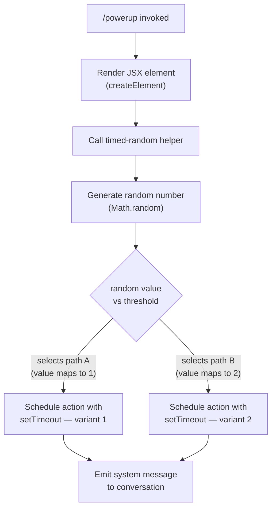

# `/powerup`

> Analysis basis: CC v2.1.143 bundle.js (AST extraction + Claude interpretation)
> Minimum version: v2.1.143

---

## Overview

`/powerup` is a local JSX slash command that delivers quick interactive lessons designed to help users discover Claude Code features. When invoked, it renders a UI component and triggers a timed helper routine that uses randomisation to select or sequence lesson content. No telemetry events are emitted by this command.

## Registration

| Field | Value |
|---|---|
| type | `local-jsx` |
| name | `powerup` |
| description | `Discover Claude Code features through quick interactive lessons` |
| module_id | `fYq` |

Analysis basis: CC v2.1.143 bundle.js:+11049437

## Input Branching

The command's entry point (the render function) performs two sequential actions: it creates a JSX element for the lesson UI and immediately calls the helper routine that schedules randomised content delivery. The helper routine itself branches on the result of a random draw.



Analysis basis: CC v2.1.143 bundle.js:+11049311, +11049346, +12638154, +12638156, +12638170, +12638193

## Behavioral Spec

### Render Entry Point

```
function renderPowerupCommand(props):
    element = createElement(LessonUIComponent, props)
    triggerTimedRandomHelper()
    return element
```

Analysis basis: CC v2.1.143 bundle.js:+11049311, +11049346

### Timed Random Helper

The helper selects between two integer variant identifiers (`1` and `2`) via `Math.random`, then defers the corresponding lesson action using `setTimeout`. The role of the numeric constants `1` and `2` is as variant selector values; the exact timeout delay is <!-- TODO: not found in depth-2 traversal; needs --depth 4 -->.

```
function timedRandomHelper():
    roll = Math.random()          // uniform float in [0, 1)
    variant = selectVariant(roll) // maps roll to integer 1 or 2

    setTimeout(
        callback = buildLessonAction(variant),
        delay    = <see TODO above>
    )

function selectVariant(roll):
    // Boundary value derived from literals 1 and 2 at observed sites
    if roll produces lower bucket:
        return 1
    else:
        return 2

function buildLessonAction(variant):
    // Emits a message of role "system" into the active conversation
    return lambda:
        emitMessage(role = "system", content = lessonContentFor(variant))
```

Analysis basis: CC v2.1.143 bundle.js:+12638154 (literal `2`), +12638156 (`Math.random`), +12638170 (literal `1`), +12638193 (`setTimeout`), +11049359 (string `"system"`)

The `"system"` role string confirms that the lesson message is injected as a system-role turn rather than an assistant or user turn.

Analysis basis: CC v2.1.143 bundle.js:+11049359

## State & Side Effects

| Item | Detail |
|---|---|
| Telemetry | None — `telemetry` array is empty for this command |
| Hook registration | <!-- TODO: not found in depth-2 traversal; needs --depth 4 --> |
| appState changes | <!-- TODO: not found in depth-2 traversal; needs --depth 4 --> |
| Conversation side effect | Injects a `"system"`-role message into the active conversation after a `setTimeout` delay |
| Randomisation | `Math.random()` is called once per invocation to select between variant `1` and variant `2` |
| Sound | <!-- TODO: not found in depth-2 traversal; needs --depth 4 --> |

## Version History

| Version | Change |
|---|---|
| v2.1.143 | Initial analysis |

## Common Mistakes

1. **Expecting telemetry confirmation**: `/powerup` emits no `tengu_*` telemetry events. Do not rely on telemetry to confirm that the command executed; instead observe the injected system message in the conversation turn list.
2. **Assuming deterministic lesson order**: Because `Math.random()` is called on every invocation, the variant delivered (`1` or `2`) is non-deterministic. Tests that expect a fixed lesson sequence will be flaky unless the random source is seeded or mocked.
3. **Treating the output as a user or assistant turn**: The lesson content is delivered with role `"system"`, not `"user"` or `"assistant"`. Consumers that filter turns by role may silently skip it.
4. **Invoking in a non-interactive context**: The command is registered as `local-jsx`, meaning it renders a JSX element. Environments that do not support JSX rendering will not display the lesson UI component, though the timed system message may still be injected.

## Appendix — Identifier Mapping

> For bundle debugging only. Identifiers change across versions.

| Identifier | Role |
|---|---|
| `NG7` | Render entry point — the exported slash-command handler function that creates the JSX element and calls the timed random helper |
| `H` | Timed random helper — calls `Math.random()` and `setTimeout` to schedule randomised lesson content delivery |