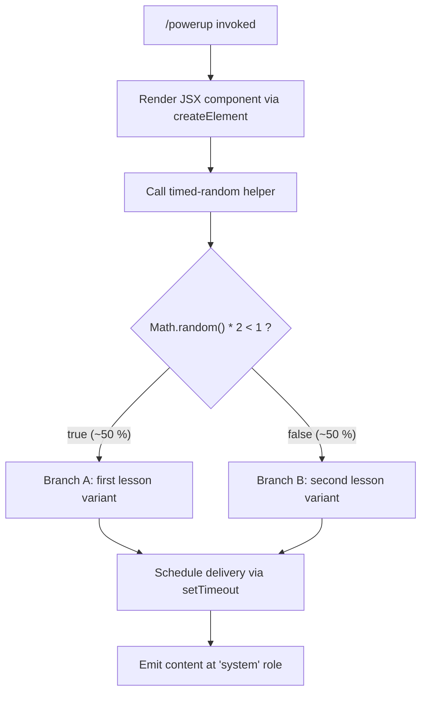

# `/powerup`

> Analysis basis: CC v2.1.143 bundle.js (AST extraction + Claude interpretation)
> Minimum version: v2.1.143

---

## Overview

`/powerup` is a local JSX slash command that delivers quick interactive lessons designed to help users discover Claude Code features. When invoked, the command renders a JSX component into the conversation and triggers a timed, randomized presentation routine that injects content at the `system` message role.

---

## Registration

| Field | Value |
|---|---|
| type | `local-jsx` |
| name | `powerup` |
| description | `Discover Claude Code features through quick interactive lessons` |
| module\_id | `fYq` |
| loc\_line | 6604 |

Analysis basis: CC v2.1.143 bundle.js:+11049437

---

## Input Branching

The command takes no user-supplied arguments at the call site discovered in the depth-2 traversal. Control flow splits based on the output of a randomisation step inside the helper routine.



Analysis basis: CC v2.1.143 bundle.js:+12638154 (numeric literal `2`), +12638170 (numeric literal `1`), +12638156 (`Math.random` call), +12638193 (`setTimeout` call), +11049359 (role literal `"system"`)

---

## Behavioral Spec

### Component Rendering

The command's top-level handler constructs a JSX element and returns it to the CLI rendering pipeline. No user text arguments are parsed prior to this step.

```
function renderPowerupCommand(context):
    element = createElement(PowerupComponent, context.props)
    return element
```

Analysis basis: CC v2.1.143 bundle.js:+11049311 (`createElement` call edge from command handler)

### System-Role Injection

After the JSX element is mounted, a helper function prepares a message that will be delivered at the `"system"` conversation role rather than the normal `"user"` or `"assistant"` roles. This means the lesson content is surfaced as a system-level notice inside the active session.

```
function injectSystemLesson(lessonText):
    message = {
        role: "system",
        content: lessonText
    }
    emitToConversation(message)
```

Analysis basis: CC v2.1.143 bundle.js:+11049346 (call edge to timed-random helper), +11049359 (role string `"system"`)

### Timed Random Lesson Selection

The helper reached via the call edge at +11049346 performs a two-branch coin-flip using `Math.random` scaled to the integer range `[0, 2)`, then defers delivery using `setTimeout`. The exact delay value and lesson catalogue are <!-- TODO: not found in depth-2 traversal; needs --depth 4 -->.

```
function timedRandomHelper():
    roll = Math.random() * 2          // range: [0.0, 2.0)
    if roll < 1:                      // ~50 % probability
        selectedLesson = lessonVariantA()
    else:
        selectedLesson = lessonVariantB()

    setTimeout(
        callback = lambda: deliverLesson(selectedLesson),
        delayMs  = /* TODO: not found in depth-2 traversal */
    )
```

Numeric constants used: multiplier `2` (bundle.js:+12638154), threshold `1` (bundle.js:+12638170).
Analysis basis: CC v2.1.143 bundle.js:+12638156 (`Math.random`), +12638193 (`setTimeout`)

---

## State & Side Effects

| Item | Detail |
|---|---|
| Telemetry | None — `telemetry` array is empty; no `tengu_*` events are fired by this command |
| Hook registration | <!-- TODO: not found in depth-2 traversal; needs --depth 4 --> |
| appState changes | <!-- TODO: not found in depth-2 traversal; needs --depth 4 --> |
| Conversation role written | `"system"` (bundle.js:+11049359) |
| Async mechanism | `setTimeout` deferred callback (bundle.js:+12638193) |
| Randomisation | `Math.random()` called once per invocation (bundle.js:+12638156) |
| Sound | <!-- TODO: not found in depth-2 traversal; needs --depth 4 --> |

---

## Version History

| Version | Change |
|---|---|
| v2.1.143 | Initial analysis |

---

## Common Mistakes

1. **Expecting telemetry feedback**: `/powerup` emits zero telemetry events. Do not rely on `tengu_*` event logs to confirm the command fired — check the `system` role message instead.
2. **Assuming deterministic lesson order**: The lesson variant is selected with a 50/50 `Math.random` coin-flip on every invocation. Repeated calls may produce either variant in any order.
3. **Treating output as a user or assistant turn**: The lesson content is injected at the `"system"` role, not as a normal chat turn. Tooling that filters by `role === "user"` or `role === "assistant"` will miss this output entirely.
4. **Expecting synchronous rendering**: Lesson delivery is deferred via `setTimeout`. The JSX component mounts first; the lesson content arrives in a subsequent event-loop tick.
5. **Passing arguments**: No argument parsing is present in the depth-2 call graph. Any text typed after `/powerup` is silently ignored in the current implementation.

---

## Appendix — Identifier Mapping

> For bundle debugging only. Identifiers change across versions.

| Identifier | Role |
|---|---|
| `NG7` | Top-level command handler function; renders the JSX component and delegates to the timed-random helper |
| `H` | Timed-random lesson helper; performs the `Math.random` coin-flip and schedules delivery via `setTimeout` |