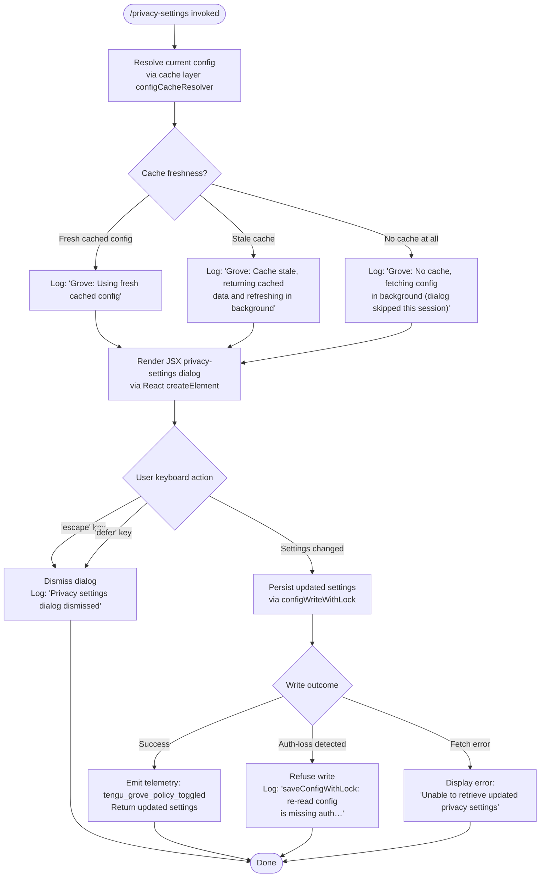

# `/privacy-settings`

> Analysis basis: CC v2.1.143 bundle.js (AST extraction + Claude interpretation)
> Minimum version: v2.1.143

---

## Overview

`/privacy-settings` opens an interactive JSX dialog that lets users view and modify their privacy configuration (e.g., telemetry/data-sharing toggles, collectively referred to as "Grove" policy settings). The command is implemented as an async handler that reads the current configuration via a caching layer, renders a settings UI component, and persists any changes back to disk with file-locking and backup guarantees.

---

## Registration

| Field | Value |
|---|---|
| type | `local-jsx` |
| name | `privacy-settings` |
| description | `View and update your privacy settings` |
| module_id | `h2q` |
| load_inline | `true` |
| loc_byte | `11442723` |
| loc_byte_end | `11442915` |
| loc_line | `6991` |
| arbor_handler.name | `Bv7` |
| arbor_handler.fqn | `claude-2.1.143::Bv7` |
| arbor_handler.kind | `AsyncFunction` |
| arbor_handler.resolution_path | `module_id` |
| arbor_handler.n_hits | `0` |

Analysis basis: CC v2.1.143 bundle.js:+11442723

---

## Input Branching

The handler has four meaningful branches driven by keyboard input and config-fetch outcome, so a flowchart is used.



Analysis basis: CC v2.1.143 bundle.js:+11441727 (handler entry), +11441890 (escape literal), +11441904 (defer literal), +11441915 (dismissal message), +11442041 (error message), +11442263 (telemetry emit)

---

## Behavioral Spec

### Handler Entry — `privacySettingsHandler` (Bv7)

The primary async function is the Arbor-resolved handler `Bv7`. It is an `AsyncFunction` reached via `module_id` resolution into module `h2q`.

```
async function privacySettingsHandler(context):
    // 1. Parallel initialization
    await Promise.all([
        initializeAppState(context),      // side-effect setup
        loadVzHDependency()               // vzH dependency resolved
    ])

    // 2. Fetch config through cache (configCacheResolver / jdH)
    configData = await configCacheResolver(context)

    // 3. Render JSX dialog
    element = ReactCreateElement(privacySettingsComponent, {
        settings: configData,
        onDismiss: handleDismiss,
        onSave:    handleSave
    })

    return element
```

Analysis basis: CC v2.1.143 bundle.js:+11441727, +11441767 (Promise.all), +11441780 (_i init), +11441785 (vzH dep), +11442370 (createElement)

---

### Config Cache Resolution — `configCacheResolver` (jdH)

Wraps the underlying config reader with a multi-tier staleness check. Three log strings found in the literals array describe the three possible outcomes.

```
async function configCacheResolver(context):
    configReader  = buildConfigReader(context)    // FWH
    staleness     = checkStaleness(context)       // L5 + N6

    timestamp = Date.now()

    if staleness == FRESH:
        debugLog("Grove: Using fresh cached config")   // +6634248
        return cachedConfig

    if staleness == STALE:
        debugLog("Grove: Cache stale, returning cached data and refreshing in background")  // +6634142
        triggerBackgroundRefresh(context)         // AY1 path
        return cachedConfig

    // No cache
    debugLog("Grove: No cache, fetching config in background (dialog skipped this session)")  // +6634022
    scheduleBackgroundFetch(context)              // AY1 path
    return null
```

Analysis basis: CC v2.1.143 bundle.js:+6633907 (FWH call), +6633928 (L5 call), +6633967 (N6 call), +6633996 (Date.now), +6634020 (v/log), +6634022, +6634142, +6634248

---

### Config File Reader — `configFileReader` (H$H)

Low-level synchronous file reader with backup-rotation logic.

```
function configFileReader(path):
    if not pathExists(path):
        throw Error("Config accessed before allowed.")   // +3164241

    raw = fs.readFileSync(path, "utf-8")                // +3164297, +3164324

    try:
        parsed = JSON.parse(raw)
    except:
        emitTelemetry("tengu_config_parse_error")       // +3164878
        // attempt restore from backup
        backupDir = path.join(basename(path), ...)
        if backupExists:
            fs.copyFileSync(latestBackup, path)
        raise

    if error_condition:
        logError("error")                               // +3164792

    // Backup rotation: keep up to 5 backups           // +3163227
    rotateBackups(path)
    return parsed
```

Analysis basis: CC v2.1.143 bundle.js:+3164235 (Error), +3164241 (message), +3164297 (readFileSync), +3164344 (R6), +3164487 (ENOENT literal at +3164471)

---

### Config Write with Lock — `configWriteWithLock` (P9_)

Atomic write using a lock file, staleness guard, and backup rotation.

```
async function configWriteWithLock(newSettings):
    lockDir = path.dirname(configPath)
    fs.mkdirSync(lockDir, {recursive: true})            // +3162024

    lockStart = Date.now()
    // acquire lock (heA)
    if lockTime > EXPECTED_THRESHOLD:
        warn("Lock acquisition took longer than expected…")  // +3162208

    // re-read on-disk config to detect concurrent writes
    onDiskConfig = readConfigSync()

    if onDiskConfig.auth missing AND cache.auth present:
        emitTelemetry("tengu_config_auth_loss_prevented")    // +3162776
        warn("saveConfigWithLock: re-read config is missing auth…")  // +3162624
        return  // refuse write to protect credentials

    // write with 60 000 ms watch timeout                // +3162978
    // keep 5 backup copies                              // +3163227
    // each backup ≤ 384 bytes in name prefix            // +3163509

    emitTelemetry("tengu_config_stale_write")           // +3162433 if stale
    emitTelemetry("tengu_grove_policy_toggled")         // +11442263 on success

    fs.copyFileSync(tmpPath, configPath)
    return updatedSettings
```

Analysis basis: CC v2.1.143 bundle.js:+3162069 (Date.now), +3162082 (heA lock), +3162208 (contention warn), +3162433 (stale telemetry), +3162586 (H$H re-read), +3162624 (auth-loss warn), +3162776 (auth-loss telemetry), +3162978 (60 000 ms timeout), +3163227 (5 backups), +3163345 (unlinkSync old backup), +11442263 (policy toggle telemetry)

---

### Background Refresh Coordinator — `backgroundRefreshCoordinator` (AY1)

Handles the stale and no-cache paths by scheduling an async config fetch that does not block the dialog render.

```
async function backgroundRefreshCoordinator(context):
    vzH_dependency = resolveVzH()          // vzH helper
    freshConfig    = await configCacheResolver(context)   // N6 re-entry
    timestamp      = Date.now()

    configWriterEntry = persistConfig(freshConfig)        // a6

    debugLog(context, freshConfig)                        // v / debug level
```

Analysis basis: CC v2.1.143 bundle.js:+6634338 (vzH), +6634394 (N6), +6634446 (Date.now), +6634481 (a6), +6634592 (v)

---

### Global Config Save — `globalConfigSave` (a6)

Fallback global-scope config persister that also guards against auth-field loss.

```
function globalConfigSave(newConfig):
    currentOnDisk = readCurrentConfig()          // N0

    if onDisk.auth missing AND cache.auth present:
        warn("saveGlobalConfig fallback: re-read config is missing auth…")  // +3159506
        return

    mergedConfig = merge(currentOnDisk, newConfig)  // H$H
    writeAtomic(mergedConfig)                    // d76, d

    logEntries(mergedConfig)                     // OZ9, emH
    updateTimestamp(mergedConfig)                // HpH → Date.now()
    scheduleWatcher(mergedConfig)                // j9_
```

Analysis basis: CC v2.1.143 bundle.js:+3159299 (P9_ call), +3159355 (emH), +3159374 (OZ9), +3159399 (HpH), +3159480 (H$H), +3159496 (d76), +3159506 (auth-loss literal), +3159632 (d), +3159746 (j9_)

---

### File Watcher Setup — `fileWatcherSetup` (nhL)

Attaches a live-reload watcher to the config file so in-flight changes by other Claude instances are detected promptly.

```
function fileWatcherSetup(configPath):
    currentConfig = readCurrentConfig()           // N0
    watcher = fs.watchFile(configPath, callback)  // di6.watchFile

    watcher.on("change", () => {
        freshData = readFileSafe(configPath)      // x6
        if changed:
            notifySubscribers(freshData)          // A1, jR
            invalidateStaleness()                 // z9_
            triggerUpdate(freshData)              // Tl, h9
    })

    return () => fs.unwatchFile(configPath)       // di6.unwatchFile
```

Analysis basis: CC v2.1.143 bundle.js:+3160632 (N0), +3160637 (watchFile), +3160718 (x6), +3160801 (A1), +3160804 (jR), +3160862 (z9_), +3160870 (Tl), +3160951 (h9), +3160964 (unwatchFile)

---

### MCP Server Initializer — `mcpServerInitializer` (M)

Called during handler startup via `Promise.all`. Loads MCP server configurations and connects them.

```
async function mcpServerInitializer(context):
    // Enumerate configured MCP servers
    serverMap = collectMcpServers(context)    // SvH → Object.entries

    for each [serverId, serverConfig] in serverMap:
        client = buildMcpClient(serverConfig)   // KHH
        if alreadyConnected:
            continue
        connection = await connectServer(client)  // Yh_

    // Apply any pending updates
    applyMcpUpdates(serverMap)                  // THK
    return serverMap
```

Analysis basis: CC v2.1.143 bundle.js:+14234051 (SvH), +14234061 (THK), +14234070 (L.get), +14234173 (L.values), +14234188 (B95), +14234713 (Object.entries)

---

### Dismissal Handler

When the user presses `escape` or `defer`, the dialog closes without writing any changes.

```
function handleDismiss(keyEvent):
    if keyEvent.key == "escape" OR keyEvent.key == "defer":
        log("Privacy settings dialog dismissed")   // +11441915
        closeDialog()
        return
```

Analysis basis: CC v2.1.143 bundle.js:+11441890 ("escape"), +11441904 ("defer"), +11441915 ("Privacy settings dialog dismissed")

---

### Error Display

If the config fetch fails entirely, a user-facing error string is rendered inside the dialog component.

```
function handleFetchError():
    displayError("Unable to retrieve updated privacy settings")  // +11442041
```

Analysis basis: CC v2.1.143 bundle.js:+11442041

---

### Settings Section Key

The dialog renders a section identified by the string `"settings"`.

Analysis basis: CC v2.1.143 bundle.js:+11442324

---

## State & Side Effects

| Item | Detail |
|---|---|
| Telemetry — `tengu_grove_policy_toggled` | Emitted when a privacy toggle is successfully saved (bundle.js:+11442263) |
| Telemetry — `tengu_config_parse_error` | Emitted when the config JSON cannot be parsed from disk (bundle.js:+3164878) |
| Telemetry — `tengu_config_lock_contention` | Emitted when lock acquisition takes longer than expected (bundle.js:+3162297) |
| Telemetry — `tengu_config_stale_write` | Emitted when a stale-config write is detected and rejected (bundle.js:+3162433) |
| Telemetry — `tengu_config_auth_loss_prevented` | Emitted when a write is aborted to prevent credential loss (bundle.js:+3162776) |
| Telemetry — `tengu_mcp_oauth_flow_start` | Emitted if an MCP OAuth flow starts during server initialization (bundle.js:+9630015) |
| Telemetry — `tengu_mcp_oauth_flow_success` | Emitted on successful MCP OAuth completion (bundle.js:+9634491) |
| Telemetry — `tengu_mcp_oauth_flow_error` | Emitted on MCP OAuth failure (bundle.js:+9635875) |
| Telemetry — `tengu_bg_spare_enable` | Background spare process enablement (bundle.js:+14502634) |
| Telemetry — `tengu_bg_spare_spawn` | Background spare process spawned (bundle.js:+14502994) |
| Telemetry — `tengu_daemon_config_reload` | Daemon detects config reload (bundle.js:+14517117) |
| Telemetry — `tengu_daemon_yield` | Daemon yields to foreground/service daemon (bundle.js:+14521203) |
| Config file write | Atomic write with lock, backup rotation (up to 5 copies), and auth-loss guard |
| File watcher | `fs.watchFile` registered on config path; cleaned up via `fs.unwatchFile` |
| Hook registration | `at_.register` called via `h9` during log-writer setup (bundle.js:+56977) |
| appState changes | Privacy policy flags updated in-memory after successful save |
| Background fetch | Stale/no-cache paths trigger a background config refresh that does not block the dialog |
| JSX render | `h06.createElement` used to produce the dialog element (bundle.js:+11442370) |
| Sound | None observed in traversal |

---

## Version History

| Version | Change |
|---|---|
| v2.1.143 | Initial analysis |

---

## Common Mistakes

1. **Pressing Escape expecting a save** — both `escape` and `defer` keys dismiss the dialog without writing changes; only explicit confirmation triggers a save.
2. **Running two Claude instances simultaneously** — the file-lock mechanism will emit `tengu_config_lock_contention` and warn in logs if another instance holds the lock; settings may not be written until the lock is released.
3. **Manually editing `~/.claude.json` while the dialog is open** — the auth-loss prevention guard (`tengu_config_auth_loss_prevented`) will silently refuse to overwrite if it detects credentials missing from the re-read version, protecting the file but discarding the in-dialog edits.
4. **Expecting the dialog to appear when there is no cached config** — when no cache exists the dialog is skipped for that session (log: `"Grove: No cache, fetching config in background (dialog skipped this session)"`); the config is fetched asynchronously and will be available on the next invocation.
5. **Confusing `/privacy-settings` with MCP configuration** — this command controls Grove/telemetry policy; MCP server management is handled separately and only appears here as a side-effect of the startup `Promise.all`.

---

## Appendix — Identifier Mapping

> For bundle debugging only. Identifiers change across versions.

| Identifier | Role |
|---|---|
| `Bv7` | `privacySettingsHandler` — main async handler (AsyncFunction, Arbor-resolved) |
| `jdH` | `configCacheResolver` — multi-tier cache staleness checker |
| `FWH` | `configReaderBuilder` — constructs the base config reader |
| `fq` | `configReaderCore` — core config read logic |
| `Cl8` | `configReaderHelperA` — helper called within configReaderCore |
| `Rl8` | `configReaderHelperB` — helper called within configReaderCore |
| `Uw` | `apiKeyResolver` — resolves API key / auth context |
| `HA` | `configMerger` — merges config objects |
| `SR` | `arrayIncludesChecker` — Array.isArray + includes helper |
| `HD9` | `configReaderPostProcess` — post-processing step in configReaderBuilder |
| `L5` | `stalenessChecker` — checks cache staleness |
| `N6` | `configFileWatcherManager` — manages file watchers for config |
| `x6` | `safeFsRead` — safe filesystem read helper |
| `z9_` | `cacheInvalidator` — invalidates the staleness cache entry |
| `H$H` | `configFileReader` — low-level sync file reader with backup rotation |
| `nhL` | `fileWatcherSetup` — registers fs.watchFile on config path |
| `v` | `debugLogger` — structured debug-level logger |
| `G5K` | `logTransportBuilder` — builds the log transport |
| `tt_` | `logLevelFilter` — filters by log level (TLK/ELK) |
| `H` | `randomBackoffTimer` — Math.random + setTimeout utility |
| `hH` | `jsonStringifyHelper` — JSON.stringify wrapper |
| `_` | `utilityHelper` — general utility (toUpperCase etc.) |
| `P7` | `pathRedactor` — redacts sensitive path segments (`[REDACTED]`) |
| `h6A` | `pathMapper` — maps path segments |
| `q` | `fsModule` — Node.js `fs`-like module reference |
| `A` | `lowercasePathHelper` — toLowerCase on path strings |
| `cSH` | `terminalWriter` — writes output to terminal |
| `X6A` | `terminalWriteHelper` — H.write wrapper |
| `Z5K` | `fileAppendWriter` — async log file append writer |
| `PSH` | `writeQueue` — batched write queue with setTimeout/setImmediate |
| `i8H` | `writePathResolver` — resolves write destination path |
| `gv8` | `writeErrorHandler` — handles EISDIR and write errors |
| `U6A` | `logFilePathBuilder` — joins log directory with filename |
| `p6A` | `logFileRotator` — renames/rotates `.txt` log files |
| `E5K` | `fileAppendCore` — core mkdir + appendFile logic |
| `h9` | `atRegisterHook` — calls at_.register for cleanup hooks |
| `AY1` | `backgroundRefreshCoordinator` — handles stale/no-cache background fetch |
| `a6` | `globalConfigSave` — fallback global config persister |
| `P9_` | `configWriteWithLock` — atomic locked config write with backup rotation |
| `emH` | `configChangeLogger` — logs config change entries |
| `OZ9` | `objectEntriesIterator` — Object.entries iteration helper |
| `HpH` | `timestampUpdater` — records Date.now() on config writes |
| `d76` | `configDiffHelper` — computes config diff before write |
| `d` | `generalUtility` — multipurpose utility (various call sites) |
| `j9_` | `configWatcherScheduler` — schedules file watcher after write |
| `M` | `mcpServerInitializer` — initializes MCP servers at startup |
| `SvH` | `mcpServerCollector` — collects and connects MCP servers |
| `KHH` | `mcpClientBuilder` — builds individual MCP clients |
| `cqH` | `mcpConfigLoader` — loads MCP configuration per server |
| `qHH` | `mcpSdkEntryBuilder` — builds SDK-type MCP entries |
| `ww6` | `mcpSseHttpConnector` — handles SSE/HTTP MCP connections |
| `rI` | `mcpClientInitializer` — initializes an MCP client with X$/RG_ |
| `X$` | `mcpClientFactory` — creates MCP client objects |
| `RG_` | `mcpClientRegistrar` — registers MCP client in the registry |
| `K` | `paddedMapHelper` — L.map + f.padEnd utility |
| `L` | `addDeleteFinallyHelper` — Set.add/delete with finally cleanup |
| `f` | `closeHelper` — A.close + q.close helper |
| `H_` | `underscoreProxy` — thin proxy over `_` utility |
| `f26` | `mcpFilterHelper` — filters the MCP server list |
| `_57` | `mcpSnapshotHelper` — snapshots MCP server state |
| `bh_` | `mcpCacheReader` — reads needs-auth cache (d1 + tY8 + R6) |
| `v78` | `mcpHashedKeyBuilder` — builds hashed key for MCP servers |
| `Ei` | `mcpEntryValidator` — validates MCP entry format |
| `kj` | `sha256Hasher` — SHA-256 hex hasher (eV1.createHash) |
| `I78` | `dKWrapper` — wraps dK with type checking |
| `dK` | `peaResolver` — resolves peA dependency |
| `A8` | `mcpDebugLogger` — pushes to xRH and calls Wc.logMCPDebug |
| `Yh_` | `mcpServerConnector` — connects a single MCP server (OAuth-aware) |
| `w77` | `mcpConnectCore` — core connect logic |
| `PB` | `kuAlResolver` — resolves Ku + aL credentials |
| `tHH` | `mcpOAuthFlowRunner` — full OAuth flow with local callback server |
| `mrH` | `mcpOAuthStateTracker` — tracks OAuth state via CY8 Map |
| `D` | `bgSpareManager` — background spare process manager |
| `BY8` | `needsAuthCacheBuilder` — builds needs-auth cache entry |
| `UQ` | `mcpReconnectHandler` — handles MCP reconnect logic |
| `Ku` | `credentialResolver` — resolves aL credentials |
| `Y` | `daemonConfigReloader` — daemon config reload handler |
| `_7` | `mcpErrorLogger` — pushes to xRH and calls Wc.logMCPError |
| `XH` | `stringCoercer` — String() coercion helper |
| `J77` | `mcpConnectResult` — holds connection result |
| `D77` | `sshTransportDetector` — checks N_.isSSH and selects transport |
| `Dh_` | `mcpServerInfoCollector` — collects per-server info for display |
| `urH` | `RY8GetHelper` — RY8.get accessor |
| `prH` | `CY8GetHelper` — CY8.get accessor |
| `x8q` | `needsAuthCacheCheck` — checks the needs-auth cache file |
| `d1` | `asyncLocalStoreGetter` — znL.getStore() accessor |
| `tY8` | `needsAuthCachePathBuilder` — joins sY8 + "mcp-needs-auth-cache.json" |
| `Oh_` | `mcpToolHasher` — hashes tool list for change detection |
| `NG_` | `mcpAllowListChecker` — checks server against allow-list (a6 + A.includes) |
| `J` | `processKillHelper` — A.values + y.kill process terminator |
| `y` | `processWriteHelper` — z.write + d process write helper |
| `S8q` | `mcpPortParser` — parseInt-based port parsing (via Yn) |
| `Yn` | `promisePoolMapper` — concurrent promise mapper with back-pressure |
| `M26` | `parseInt10Helper` — parseInt base-10 helper |
| `xh_` | `parseInt20Helper` — parseInt base-20 helper |
| `THK` | `mcpUpdateApplier` — applies pending MCP config updates |
| `eY8` | `mcpUpdateSerializer` — JSON.stringify for MCP update payload |
| `wv` | `mcpCleanupRunner` — runs cleanup on MCP client connections |
| `drH` | `hHSerializer` — hH-based serializer for MCP data |
| `$` | `daemonStatusWriter` — writes daemon.status.json via JZq |
| `JZq` | `daemonStatusWriterCore` — ha + Date.now + d1 + r06 + hH |
| `ha` | `lfHHelper` — wraps lfH utility |
| `r06` | `daemonStatusPathBuilder` — joins wZq + "daemon.status.json" + x8 |
| `B95` | `mcpServerReconciler` — reconciles running vs. configured MCP servers |
| `k78` | `mcpDuplicateChecker` — mm4.has + pm4.has duplicate check |
| `r8` | `timedRetryHelper` — K + Error + q + setTimeout/clearTimeout retry |
| `O` | `N8Wrapper` — wraps N8 utility |