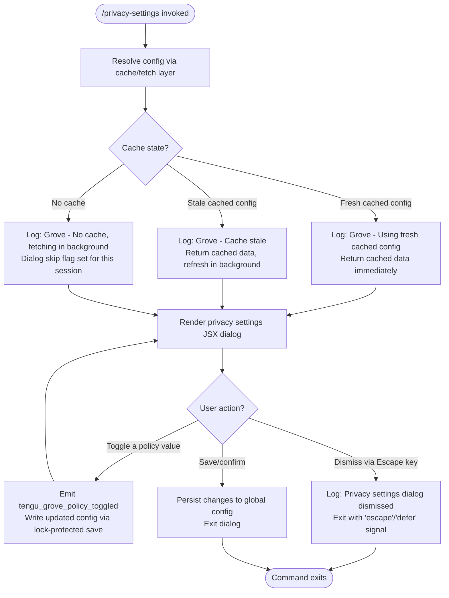

# `/privacy-settings`

> Analysis basis: CC v2.1.143 bundle.js (AST extraction + Claude interpretation)
> Minimum version: v2.1.143

---

## Overview

The `/privacy-settings` command opens an interactive dialog that allows the user to view and update their privacy configuration within Claude Code. It operates as a local JSX-rendered UI component that reads the current configuration from a cached or freshly fetched config file, presents relevant policy toggles, and persists any changes back to the global config with lock-protected writes. A telemetry event is emitted whenever a privacy policy toggle is changed.

---

## Registration

| Field | Value |
|---|---|
| type | `local-jsx` |
| name | `privacy-settings` |
| description | `View and update your privacy settings` |
| module_id | `h2q` |
| loc_line | 6991 |

Analysis basis: CC v2.1.143 bundle.js:+11442723

---

## Input Branching

The command entry point (the command handler, `Bv7`) is invoked with no user-supplied arguments. All branching is driven by internal state — whether a cached config is available and fresh, whether the user dismisses the dialog, and whether a policy value is toggled.



Analysis basis: CC v2.1.143 bundle.js:+11441727, +6633907, +6634022, +6634142, +6634248, +11441890, +11441904, +11441915, +11442263

---

## Behavioral Spec

### 1. Command Entry Point and Initialization

```
function privacySettingsCommandHandler(context):
    // Kick off parallel initialization: load config, set up file watcher
    results = Promise.all([
        loadConfigWithFileWatcher(),
        resolveConfigCacheLayer()
    ])

    // Register escape-key handler for dialog dismissal
    registerKeyHandler("escape", onEscapePressed)

    // Render the JSX privacy dialog component
    renderPrivacyDialog(results)
```

Analysis basis: CC v2.1.143 bundle.js:+11441727, +11441767, +11441780, +11441785, +11441890

---

### 2. Config Cache Resolution (Grove Layer)

The config fetch goes through a multi-tier cache strategy referred to internally as "Grove."

```
function resolveConfigCacheLayer():
    cached = readFromConfigCache()

    if cached is null:
        log("Grove: No cache, fetching config in background (dialog skipped this session)")
        triggerBackgroundFetch()
        return null

    ageMs = Date.now() - cached.timestamp

    if ageMs <= FRESHNESS_THRESHOLD:
        log("Grove: Using fresh cached config")
        return cached.data

    else:
        log("Grove: Cache stale, returning cached data and refreshing in background")
        triggerBackgroundFetch()
        return cached.data
```

- Log string `"Grove: No cache, fetching config in background (dialog skipped this session)"`: CC v2.1.143 bundle.js:+6634022
- Log string `"Grove: Cache stale, returning cached data and refreshing in background"`: CC v2.1.143 bundle.js:+6634142
- Log string `"Grove: Using fresh cached config"`: CC v2.1.143 bundle.js:+6634248

Analysis basis: CC v2.1.143 bundle.js:+6633928, +6633967, +6633996, +6634020

---

### 3. Config File Read with Access Guard

The underlying config reader enforces an access-allowed guard before any file I/O.

```
function readConfigFile(configPath):
    if not accessAllowed:
        throw Error("Config accessed before allowed.")

    try:
        raw = fs.readFileSync(configPath, "utf-8")
        return JSON.parse(raw)
    catch err:
        if err.code == "ENOENT":
            return defaultConfig()
        emit telemetry "tengu_config_parse_error"
        log level "error"
        return defaultConfig()
```

- Guard error string `"Config accessed before allowed."`: CC v2.1.143 bundle.js:+3164241
- Encoding `"utf-8"`: CC v2.1.143 bundle.js:+3164324
- Error code `"ENOENT"`: CC v2.1.143 bundle.js:+3164471
- Telemetry `tengu_config_parse_error`: CC v2.1.143 bundle.js:+3164878

Analysis basis: CC v2.1.143 bundle.js:+3164235, +3164282, +3164297, +3164344

---

### 4. Config Write with Lock Protection

Saving updated privacy settings uses a file-lock mechanism with backup rotation. Up to 5 backups are retained.

```
function saveConfigWithLock(newConfig):
    acquireLock(configPath):
        if lockWaitMs > LOCK_CONTENTION_THRESHOLD:
            emit telemetry "tengu_config_lock_contention"
            log "Lock acquisition took longer than expected - another Claude instance may be running"

        // Re-read on-disk config to detect concurrent changes
        onDisk = readConfigFile(configPath)

        // Auth-loss safety check (GH #3117)
        if cache has auth AND onDisk is missing auth:
            emit telemetry "tengu_config_auth_loss_prevented"
            log "saveConfigWithLock: re-read config is missing auth that cache has; refusing to write to avoid wiping ~/.claude.json. See GH #3117."
            return

        // Rotate backups before write (keep last 5)
        rotateBackups(configPath, maxCount=5)

        // Atomic write via rename
        writeTempFile(newConfig)
        atomicRename(tempFile, configPath)

        emit telemetry "tengu_config_stale_write" if applicable
```

- Lock contention log: CC v2.1.143 bundle.js:+3162208
- Auth-loss refusal log: CC v2.1.143 bundle.js:+3162624
- Global config fallback refusal log: CC v2.1.143 bundle.js:+3159506
- Backup suffix `".backup."`: CC v2.1.143 bundle.js:+3163094
- Max backup count: `5` (CC v2.1.143 bundle.js:+3163227)
- Lock timeout: `60000` ms (CC v2.1.143 bundle.js:+3162978)
- Telemetry `tengu_config_lock_contention`: CC v2.1.143 bundle.js:+3162297
- Telemetry `tengu_config_stale_write`: CC v2.1.143 bundle.js:+3162433
- Telemetry `tengu_config_auth_loss_prevented`: CC v2.1.143 bundle.js:+3162776

Analysis basis: CC v2.1.143 bundle.js:+3162069, +3162082, +3162124, +3162295, +3162358, +3162373, +3162555, +3162586

---

### 5. File Watcher Registration

After the config is loaded, a file watcher is registered on the config path so that external changes are reflected in the dialog without a restart.

```
function registerConfigWatcher(configPath, onChange):
    watchHandle = fs.watchFile(configPath, handler)

    handler = function(currentStat, previousStat):
        if currentStat.mtime != previousStat.mtime:
            newData = readConfigFile(configPath)
            onChange(newData)

    // Cleanup function returned for teardown
    return function stopWatcher():
        fs.unwatchFile(configPath, handler)
```

Analysis basis: CC v2.1.143 bundle.js:+3160632, +3160637, +3160718, +3160801, +3160862, +3160870, +3160964

---

### 6. Dialog Dismiss / Escape Handling

```
function onEscapePressed(keyEvent):
    if keyEvent == "escape":
        log "Privacy settings dialog dismissed"
        exitDialog(reason="defer")
```

- Dismiss log string: `"Privacy settings dialog dismissed"` — CC v2.1.143 bundle.js:+11441915
- Exit signal strings `"escape"` and `"defer"`: CC v2.1.143 bundle.js:+11441890, +11441904

Analysis basis: CC v2.1.143 bundle.js:+11441890, +11441904, +11441915

---

### 7. Policy Toggle and Telemetry Emission

```
function onPolicyToggled(policyKey, newValue):
    updateLocalState(policyKey, newValue)
    emit telemetry "tengu_grove_policy_toggled" with {
        policy: policyKey,
        value: newValue
    }
    saveConfigWithLock(getUpdatedConfig())
```

Telemetry `tengu_grove_policy_toggled`: CC v2.1.143 bundle.js:+11442263

Analysis basis: CC v2.1.143 bundle.js:+11442263

---

### 8. Error Handling: Settings Retrieval Failure

If the config cannot be retrieved (e.g., all cache tiers fail and background fetch errors), the dialog renders an error state.

```
function handleSettingsRetrievalError(err):
    displayErrorMessage("Unable to retrieve updated privacy settings")
    log err
```

- Error string `"Unable to retrieve updated privacy settings"`: CC v2.1.143 bundle.js:+11442041

Analysis basis: CC v2.1.143 bundle.js:+11442041

---

### 9. API Key Redaction in Config Display

When displaying config values that contain API keys, the value is replaced with a redacted placeholder.

```
function redactSensitiveConfigField(key, value):
    if key == "ANTHROPIC_API_KEY" or key == "apiKeyHelper":
        return "[REDACTED]"
    return value
```

- Sentinel key `"ANTHROPIC_API_KEY"`: CC v2.1.143 bundle.js:+2910507
- Sentinel key `"apiKeyHelper"`: CC v2.1.143 bundle.js:+2910532
- Redaction placeholder `"[REDACTED]"`: CC v2.1.143 bundle.js:+193318

Analysis basis: CC v2.1.143 bundle.js:+2910497, +2910507, +2910532

---

### 10. Subscription Tier Context

The privacy dialog is aware of the user's subscription tier. Two tier values are present in the implementation scope:

- `"max"` — CC v2.1.143 bundle.js:+2930484
- `"pro"` — CC v2.1.143 bundle.js:+2930495

These values influence which policy options are presented or enabled in the dialog.

Analysis basis: CC v2.1.143 bundle.js:+2930484, +2930495

---

### 11. Settings Page Context Key

The dialog registers itself under the context key `"settings"` within the application state.

Analysis basis: CC v2.1.143 bundle.js:+11442324 (`"settings"`)

---

## State & Side Effects

| Item | Detail |
|---|---|
| Telemetry: `tengu_grove_policy_toggled` | Emitted on every privacy policy toggle action (bundle.js:+11442263) |
| Telemetry: `tengu_config_parse_error` | Emitted when the config JSON cannot be parsed (bundle.js:+3164878) |
| Telemetry: `tengu_config_lock_contention` | Emitted when lock acquisition exceeds threshold (bundle.js:+3162297) |
| Telemetry: `tengu_config_stale_write` | Emitted when a potentially stale write is detected (bundle.js:+3162433) |
| Telemetry: `tengu_config_auth_loss_prevented` | Emitted when a write is blocked to prevent auth data loss (bundle.js:+3162776) |
| File watcher registration | A `fs.watchFile` watcher is registered on the global config path during dialog lifetime; torn down via `fs.unwatchFile` on dialog close (bundle.js:+3160637, +3160964) |
| Config file write | Lock-protected atomic rename write to global config (`~/.claude.json`); up to 5 rotating backups created with suffix `".backup."` (bundle.js:+3163094, +3163227) |
| appState changes | Dialog registers under the `"settings"` key in application state (bundle.js:+11442324) |
| Background config fetch | May be triggered asynchronously when cache is absent or stale; does not block dialog render (bundle.js:+6634022, +6634142) |
| Sound | <!-- TODO: not found in depth-2 traversal; needs --depth 4 --> |

---

## Version History

| Version | Change |
|---|---|
| v2.1.143 | Initial analysis — `local-jsx` command, Grove cache layer, lock-protected writes, auth-loss prevention (GH #3117 guard), policy toggle telemetry |

---

## Common Mistakes

1. **Invoking with arguments** — `/privacy-settings` accepts no user arguments. Any text after the command name is ignored; the dialog always renders from current config state.

2. **Expecting immediate config reflection after external edits** — The dialog uses a stale-while-revalidate cache (Grove layer). If the config file is modified externally while the dialog is open, the file watcher will detect the change and update the dialog asynchronously, not instantly.

3. **Assuming writes are immediate** — Config persistence uses a file lock and atomic rename. Under lock contention (e.g., another Claude Code instance running), the write may be delayed or skipped with a warning. The `tengu_config_lock_contention` telemetry event signals this condition.

4. **Expecting API key values to appear in the dialog** — Fields matching `"ANTHROPIC_API_KEY"` and `"apiKeyHelper"` are always replaced with `"[REDACTED]"` before display.

5. **Dismissing with Escape and expecting settings to be saved** — Pressing Escape signals `"defer"` and dismisses the dialog without persisting any unsaved toggle changes. Only explicit confirmation/save triggers a write.

6. **Ignoring the auth-loss guard** — If the on-disk config is detected to be missing auth data that the in-memory cache has, the write is blocked entirely (GH #3117 safety guard). This is by design to prevent wiping authentication credentials.

---

## Appendix — Identifier Mapping

> For bundle debugging only. Identifiers change across versions.

| Identifier | Role |
|---|---|
| `Bv7` | Privacy settings command handler (top-level entry point) |
| `jdH` | Config and dialog initialization orchestrator |
| `FWH` | Config source resolver / tier selector |
| `fq` | Config read/fetch core function |
| `Cl8` | Config cache reader |
| `Rl8` | Config cache writer |
| `Uw` | Config field accessor / getter layer |
| `HA` | Config array/include membership checker |
| `SR` | Array membership validator (`Array.isArray` + `.includes`) |
| `HD9` | Config supplementary data handler |
| `L5` | Config watcher setup coordinator |
| `N6` | Config load-with-watcher main function |
| `x6` | Config path resolver |
| `z9_` | Config watcher callback |
| `H$H` | Config file read with backup rotation |
| `nhL` | File watcher registration and lifecycle manager |
| `v` | Telemetry event emitter |
| `G5K` | Telemetry payload builder |
| `tt_` | Telemetry transport layer |
| `H` | Random-delay / jitter utility (used in telemetry flush) |
| `hH` | JSON serializer wrapper |
| `_` | Utility / generic helper |
| `P7` | API key path extractor / redactor |
| `h6A` | Key-value map transformer |
| `q` | File system sync operations namespace |
| `A` | String normalization utility |
| `cSH` | Terminal/stdout write wrapper |
| `X6A` | Raw output writer |
| `Z5K` | Async log/append file writer |
| `PSH` | Buffered write scheduler (debounce/setTimeout based) |
| `i8H` | Log file path builder |
| `gv8` | Log directory ensurer |
| `U6A` | Log file path joiner |
| `p6A` | Log file rotation handler (`.txt` suffix, 4-file rotation) |
| `E5K` | Async file append with mkdir and rotation |
| `h9` | Signal/hook registration (`at_.register`) |
| `AY1` | Background config refresh orchestrator |
| `a6` | Global config save function |
| `P9_` | Config save with lock, backup, and auth-loss guard |
| `emH` | Config merge/extend helper |
| `OZ9` | Config entries iterator |
| `HpH` | Config timestamp recorder |
| `d76` | Config diff/delta calculator |
| `d` | Generic async delay / promise utility |
| `j9_` | Config write (JSON serialization + file write) |
| `M` | MCP server manager / supervisor |
| `SvH` | MCP connection pool coordinator |
| `KHH` | MCP server config loader and merger |
| `cqH` | MCP server config parser (enterprise/user/project/mcp layers) |
| `qHH` | MCP SDK server config collector |
| `ww6` | MCP SSE/HTTP server registry builder |
| `rI` | MCP client factory |
| `X$` | MCP client initializer with config watcher |
| `RG_` | MCP reconnect policy handler |
| `K` | Padded output formatter |
| `L` | Async task queue with add/delete/finally |
| `f` | Stream/connection close handler |
| `H_` | Generic identity/passthrough helper |
| `f26` | MCP server filter predicate |
| `_57` | MCP server startup sequencer |
| `bh_` | MCP telemetry metadata builder |
| `v78` | MCP server type classifier |
| `Ei` | MCP connection error classifier |
| `kj` | SHA-256 hash utility |
| `I78` | MCP server deduplication key builder |
| `dK` | Platform capability detector |
| `A8` | MCP debug log appender |
| `Yh_` | MCP single server connection lifecycle manager |
| `w77` | MCP server pre-connect validator |
| `PB` | MCP OAuth credential store accessor |
| `tHH` | MCP OAuth flow handler (local callback server) |
| `mrH` | MCP pending-auth connection cache manager |
| `D` | Background spare process / memory manager |
| `BY8` | MCP telemetry result recorder |
| `UQ` | MCP server reconnect orchestrator |
| `Ku` | OAuth token storage accessor |
| `Y` | Daemon supervisor config update handler |
| `_7` | MCP error log appender |
| `XH` | String coercion utility |
| `J77` | MCP connection race-condition resolver |
| `D77` | SSH/remote session detector for OAuth redirect |
| `Dh_` | MCP `complete_authentication` tool provider |
| `urH` | MCP pending reconnect registry getter |
| `prH` | MCP pending-auth cache getter |
| `x8q` | MCP needs-auth cache read/write |
| `d1` | AsyncLocalStorage store getter |
| `tY8` | Needs-auth cache path builder |
| `Oh_` | MCP connection health checker |
| `NG_` | MCP server name inclusion filter |
| `J` | Background worker process kill coordinator |
| `y` | Subprocess write/signal wrapper |
| `S8q` | MCP connection pool size manager |
| `Yn` | Promise pool / concurrent execution limiter |
| `M26` | MCP server count parser (base-10) |
| `xh_` | MCP server index parser (base-10) |
| `THK` | MCP config hot-reload applier |
| `eY8` | MCP config serializer |
| `wv` | MCP server cleanup coordinator |
| `drH` | MCP server teardown serializer |
| `$` | Daemon IPC message dispatcher |
| `JZq` | Daemon status file writer |
| `ha` | Daemon log file path resolver |
| `r06` | Daemon status JSON path builder |
| `B95` | MCP full server lifecycle bootstrapper |
| `k78` | MCP binary manifest validator |
| `r8` | Subprocess spawn with timeout/abort |
| `O` | Native process registry |