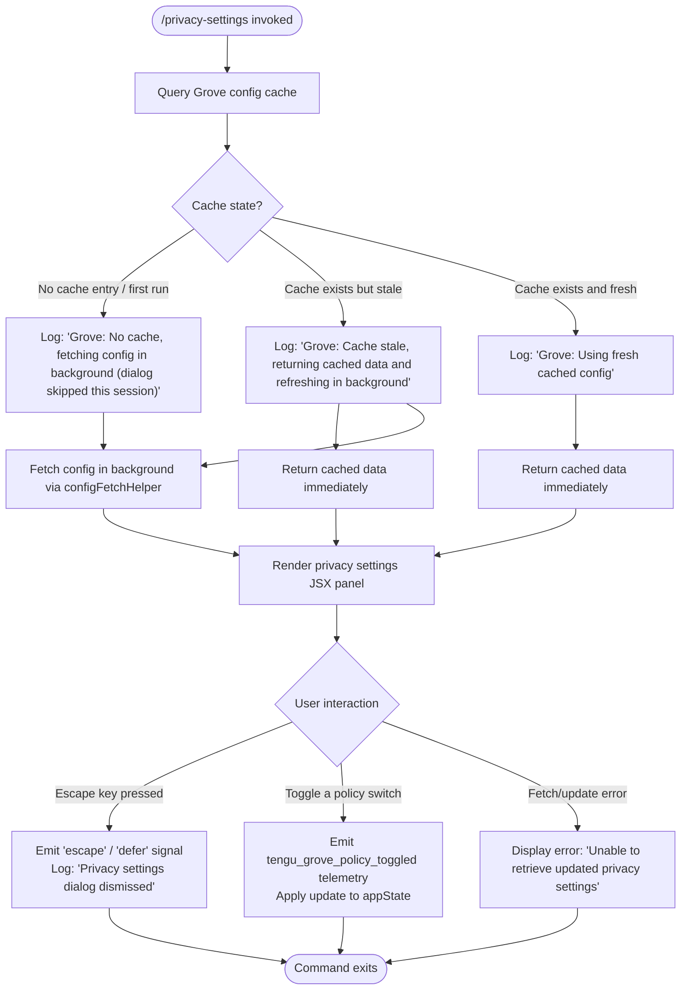

# `/privacy-settings`

> Analysis basis: CC v2.1.143 bundle.js (AST extraction + Claude interpretation)
> Minimum version: v2.1.143

---

## Overview

The `/privacy-settings` command opens an interactive dialog that allows the user to view and update their privacy settings (referred to internally as "Grove" policy configuration). It fetches the current policy configuration from a cache-aware layer, renders a JSX settings panel, and emits a telemetry event when any policy toggle is changed. The command is classified as a `local-jsx` command, meaning it renders its UI entirely within the CLI process without requiring a network round-trip to generate output.

---

## Registration

| Field | Value |
|---|---|
| type | `local-jsx` |
| name | `privacy-settings` |
| description | `View and update your privacy settings` |
| module_id | `h2q` |

Analysis basis: CC v2.1.143 bundle.js:+11442723

---

## Input Branching

The command's execution path branches primarily on the state of the Grove policy configuration cache. Upon invocation, the command handler queries the cache, and the subsequent behavior depends on whether a valid cached value exists and whether it is still fresh.



Analysis basis: CC v2.1.143 bundle.js:+6633907 (cache layer), +6634022 (no-cache log), +6634142 (stale-cache log), +6634248 (fresh-cache log), +11441890 (escape handling), +11441915 (dismiss log), +11442041 (error string)

---

## Behavioral Spec

### 1. Command Entry Point

The top-level command handler (`commandEntryPoint`) is the root of execution. It invokes the config loader, sets up key-event listeners, and constructs the JSX element tree for the settings panel.

```
function commandEntryPoint(context):
    configData = loadGroveConfig(context)
    registerKeyHandler("escape", onEscapePressed)
    panelElement = createElement(settingsPanel, { config: configData })
    return panelElement
```

Analysis basis: CC v2.1.143 bundle.js:+11441727, +11441740, +11442370

---

### 2. Grove Config Loader (Cache-Aware Fetch)

The config loader (`groveConfigLoader`) implements a stale-while-revalidate pattern. It records the current timestamp via `Date.now` to evaluate cache freshness. Depending on the cache state, it either returns cached data immediately, initiates a background refresh, or fetches fresh data while deferring the dialog for this session.

```
function groveConfigLoader(context):
    now = Date.now()
    cached = readFromConfigCache()

    if cached is null or undefined:
        log("debug", "Grove: No cache, fetching config in background (dialog skipped this session)")
        fetchConfigInBackground(now)
        return null

    if isCacheStale(cached, now):
        log("debug", "Grove: Cache stale, returning cached data and refreshing in background")
        fetchConfigInBackground(now)
        return cached.data

    log("debug", "Grove: Using fresh cached config")
    return cached.data
```

Analysis basis: CC v2.1.143 bundle.js:+6633907, +6633928, +6633967, +6633996, +6634022, +6634142, +6634248, +201193

---

### 3. Config Background Fetcher

`configBackgroundFetcher` resolves the current config from a remote or local source. It normalizes the fetched value and stores it back into the cache. It also invokes sub-helpers to resolve feature flags and apply any pending MCP-related configuration updates.

```
function configBackgroundFetcher(timestamp):
    rawConfig = fetchRawConfig()
    normalized = normalizeConfigValue(rawConfig)
    writeToConfigCache(normalized, timestamp)
    applyMcpUpdatesIfNeeded(normalized)
    return normalized
```

Analysis basis: CC v2.1.143 bundle.js:+6634338, +6634394, +6634446, +6634481, +6634592

---

### 4. Escape / Dismiss Handler

When the user presses the Escape key while the dialog is open, the command emits a `"defer"` signal alongside an `"escape"` key event, logs a dismissal message, and exits the dialog cleanly without applying any changes.

```
function onEscapePressed(event):
    if event.key == "escape":
        log("Privacy settings dialog dismissed")
        emitSignal("defer")
        closeDialog()
```

Analysis basis: CC v2.1.143 bundle.js:+11441890, +11441904, +11441915

---

### 5. Policy Toggle Handler

When the user toggles a privacy policy switch inside the rendered settings panel, the handler fires the `tengu_grove_policy_toggled` telemetry event, applies the change to `appState`, and triggers a background sync.

```
function onPolicyToggled(policyKey, newValue):
    emitTelemetry("tengu_grove_policy_toggled", { key: policyKey, value: newValue })
    updateAppState("settings", policyKey, newValue)
    syncPolicyInBackground(policyKey, newValue)
```

Analysis basis: CC v2.1.143 bundle.js:+11442263, +11442324

---

### 6. MCP Server State Reconciler

A deeper sub-system (`mcpServerStateReconciler`) is invoked during config application. It iterates over all registered MCP server entries, checks their current connection state, and updates each according to the resolved policy. Recognized transport types are: `stdio`, `sse`, `http`, `sse-ide`, and `ws-ide`. Servers in `disabled` or `needs-auth` state are skipped or queued for deferred reconnection. A `claudeai-proxy` server type receives special handling.

```
function mcpServerStateReconciler(serverEntries, resolvedConfig):
    for each [serverName, serverConfig] in Object.entries(serverEntries):
        if serverConfig.state == "disabled":
            skip(serverName)
            continue

        if serverConfig.state == "needs-auth":
            log("Skipping connection (cached needs-auth)")
            continue

        transport = serverConfig.transport  // one of: stdio, sse, http, sse-ide, ws-ide
        if transport == "claudeai-proxy":
            applyProxyPolicy(serverName, resolvedConfig)
        else:
            applyStandardPolicy(serverName, transport, resolvedConfig)

        if serverConfig.state == "connected":
            markServerRecovered(serverName)
        elif serverConfig.state == "failed":
            scheduleRetry(serverName)

    if allRemoteServersRecovered():
        log("[MCP] Retry: all remote servers recovered, stopping")
        stopRetryLoop()
```

Analysis basis: CC v2.1.143 bundle.js:+9694646, +9694671, +9694710, +9694745, +9694847, +9694881, +9694913, +9694946, +9694982, +9695254, +9695386, +9695452, +9695554, +9696127

---

### 7. MCP Update Applicator

`mcpUpdateApplicator` applies incremental MCP config updates received via the active session. It calls `applyMcpUpdate` on the current session handle, triggers a cleanup pass, and emits a status notification.

```
function mcpUpdateApplicator(updatePayload):
    session = getActiveSession()
    session.applyMcpUpdate(updatePayload, fieldName="name")
    triggerCleanup(session)
    notifyUpdateComplete(session)
```

Analysis basis: CC v2.1.143 bundle.js:+14234339, +14234413, +14234468, +14234494, +14234604, +14234625

---

### 8. Pending Operation Queue

A lightweight pending-operation queue (`pendingOperationQueue`) ensures that concurrent config fetch or update operations are deduplicated. Each operation is added to a `Set` on start and removed in a `finally` block upon completion.

```
function pendingOperationQueue(operationKey, operationFn):
    activeSet.add(operationKey)
    try:
        result = await operationFn()
        return result
    finally:
        activeSet.delete(operationKey)
```

Analysis basis: CC v2.1.143 bundle.js:+14507672, +14507681, +14507695

---

### 9. Jitter Delay Helper

A jitter delay helper (`jitterDelay`) is used when scheduling background refreshes to avoid thundering-herd effects. It generates a random multiplier (factor of 2) and applies it via `setTimeout`.

```
function jitterDelay(baseDelayMs):
    jitter = Math.random() * 2
    actualDelay = baseDelayMs * jitter
    return new Promise(resolve => setTimeout(resolve, actualDelay))
```

Analysis basis: CC v2.1.143 bundle.js:+12638154, +12638156, +12638193

---

### 10. Error Display

If any step in the config fetch or update pipeline fails, the error message `"Unable to retrieve updated privacy settings"` is surfaced to the user in the rendered panel.

```
function handleConfigError(error):
    displayErrorInPanel("Unable to retrieve updated privacy settings")
    log("debug", error)
```

Analysis basis: CC v2.1.143 bundle.js:+11442041

---

### 11. Promise Coordination

The command uses `Promise.all` at two points: once in the command entry point to coordinate parallel initialization tasks, and once inside the MCP server state reconciler to await concurrent server connection checks.

```
function coordinateParallelTasks(taskList):
    results = await Promise.all(taskList)
    return results
```

Analysis basis: CC v2.1.143 bundle.js:+11441767, +9695814

---

## State & Side Effects

| Item | Detail |
|---|---|
| Telemetry | `tengu_grove_policy_toggled` — fired on each policy toggle action (bundle.js:+11442263) |
| appState changes | The `"settings"` key in appState is updated when a policy toggle is confirmed (bundle.js:+11442324) |
| Cache writes | The Grove config cache is written on every successful background fetch, stamped with `Date.now()` (bundle.js:+6633996, +6634446) |
| MCP server state | MCP server entries may transition to `connected`, `failed`, `needs-auth`, or `disabled` as a side effect of config application (bundle.js:+9695554, +9696127, +9695452, +9694745) |
| Pending operation set | A `Set` of in-flight operation keys is mutated on every config fetch start/end (bundle.js:+14507672, +14507695) |
| Key listener registration | An `"escape"` key handler is registered on dialog open and implicitly unregistered on close (bundle.js:+11441890) |
| Background fetch scheduling | A jitter-delayed `setTimeout` is scheduled when a background refresh is triggered (bundle.js:+12638193) |
| Sound | <!-- TODO: not found in depth-2 traversal; needs --depth 4 --> |

---

## Version History

| Version | Change |
|---|---|
| v2.1.143 | Initial analysis |

---

## Common Mistakes

1. **Assuming the dialog always shows fresh data on first open.** When there is no cache entry, the command fetches configuration in the background and skips the dialog for that session. The user may need to re-invoke `/privacy-settings` to see the fetched data.

2. **Expecting synchronous policy updates.** After toggling a policy, the change is applied to local `appState` immediately but the background sync to the remote config store is asynchronous. Closing the session immediately after toggling may result in the change not persisting.

3. **Ignoring the `"defer"` signal on Escape.** Pressing Escape does not cancel or revert any toggles already confirmed. It only closes the dialog. Changes applied before pressing Escape are retained.

4. **Assuming MCP server reconnection is instant.** The MCP reconciler uses `Promise.all` with jitter delays. Servers in `failed` state are scheduled for retry, not immediately reconnected, when privacy config is applied.

5. **Confusing `needs-auth` with `disabled`.** A server in `needs-auth` state is explicitly skipped with a log message; it is not treated as permanently disabled. `disabled` servers are silently skipped without logging.

---

## Appendix — Identifier Mapping

> For bundle debugging only. Identifiers change across versions.

| Identifier | Role |
|---|---|
| `Bv7` | Command entry point — top-level handler for `/privacy-settings` |
| `jdH` | Grove config loader — cache-aware config fetch orchestrator |
| `FWH` | Cache read helper — reads and validates the Grove config cache entry |
| `L5` | Cache freshness evaluator — checks staleness using timestamp comparison |
| `N6` | Config background fetcher — fetches raw config and writes back to cache |
| `v` | Config value normalizer — normalizes and formats raw config data |
| `AY1` | Config fetch coordinator — orchestrates the full background fetch pipeline |
| `H` | Jitter delay helper — generates random delay for background refresh scheduling |
| `M` | MCP config application orchestrator — coordinates server state reconciliation and update application |
| `SvH` | MCP server state reconciler — iterates server entries and applies transport-specific policy |
| `THK` | MCP update applicator — applies incremental MCP config updates to the active session |
| `L` | Pending operation queue — deduplicates concurrent config operations via a Set |
| `$` | Pending operation set accessor — retrieves or initializes the active operations Set |
| `B95` | MCP server batch processor — filters and processes multiple MCP server entries in parallel |
| `d` | Settings panel JSX renderer — renders the privacy settings UI component |