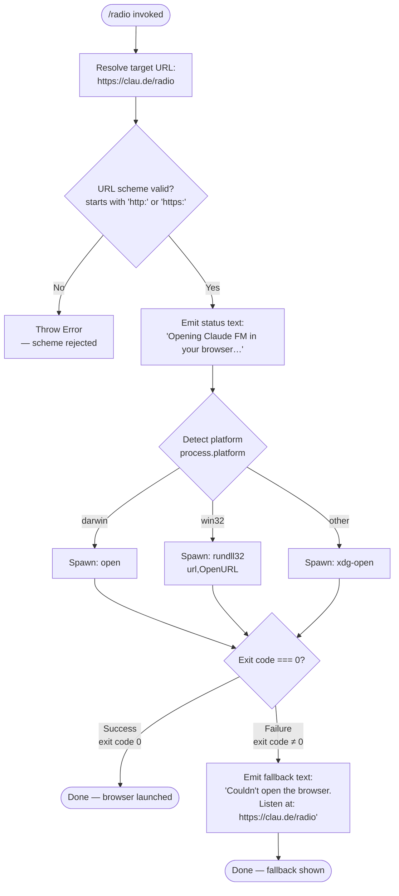

# `/radio`

> Analysis basis: CC v2.1.143 bundle.js (AST extraction + Claude interpretation)
> Minimum version: v2.1.143

---

## Overview

The `/radio` command opens the Claude FM lo-fi radio stream in the user's default web browser by navigating to a fixed URL (`https://clau.de/radio`). It is a local, interactive-only command that performs a cross-platform browser launch and emits a status message regardless of success or failure.

---

## Registration

| Field | Value |
|---|---|
| type | `local` |
| name | `radio` |
| description | `Listen to Claude FM lo-fi radio` |
| supportsNonInteractive | `false` |
| module\_id | `$Tq` |

Analysis basis: CC v2.1.143 bundle.js:+11622654

---

## Input Branching

The command accepts no user-supplied arguments. All branching is internal, driven by URL scheme validation and runtime platform detection.



Analysis basis: CC v2.1.143 bundle.js:+11622412, +7543066, +7543088, +7543303, +7543316, +7543375, +7543391, +7543424

---

## Behavioral Spec

### Command Entry Point

```
function radioCommandHandler():
    url = "https://clau.de/radio"
    openUrlInBrowser(url)
    emit({ type: "text", content: "Opening Claude FM in your browser…" })
    return
```

Analysis basis: CC v2.1.143 bundle.js:+11622415, +11622452, +11622465

---

### URL Scheme Validation

Before any browser launch attempt, the URL is checked against an allowlist of permitted schemes.

```
function validateUrlScheme(url):
    scheme = extractScheme(url)          // portion before and including ":"
    if scheme is not in ["http:", "https:"]:
        raise Error("URL scheme not permitted")
    return url
```

Analysis basis: CC v2.1.143 bundle.js:+7543066, +7543088, +7543016, +7543303

---

### Platform-Aware Browser Launch

After scheme validation succeeds, the runtime platform is read and the appropriate system command is selected to open the URL.

```
function openUrlInBrowser(url):
    validateUrlScheme(url)               // raises on invalid scheme
    platform = process.platform

    if platform == "darwin":
        cmd  = "open"
        args = [url]
    else if platform == "win32":
        cmd  = "rundll32"
        args = ["url,OpenURL", url]
    else:                                // Linux and all other POSIX platforms
        cmd  = "xdg-open"
        args = [url]

    exitCode = spawnSync(cmd, args)

    if exitCode != 0:
        emitFallbackMessage()
```

Numeric sentinel for success exit code: `0` (Analysis basis: CC v2.1.143 bundle.js:+7543341)
Numeric sentinel for failure exit code: `1` (Analysis basis: CC v2.1.143 bundle.js:+7543623)

Analysis basis: CC v2.1.143 bundle.js:+7543316, +7543375, +7543391, +7543424, +7543475, +7543487, +7543549, +7543556

---

### Fallback Message Emission

When the browser spawn exits with a non-zero code, the command falls back to printing the direct URL so the user can navigate manually.

```
function emitFallbackMessage():
    emit({
        type: "text",
        content: "Couldn't open the browser. Listen at: https://clau.de/radio"
    })
```

Analysis basis: CC v2.1.143 bundle.js:+11622533

---

### URL Open Helper Internals

The open-URL helper delegates to a spawn wrapper (`openUrlSpawner`) which itself contains error-constructor integration (`spawnErrorFactory`) for structured error reporting on scheme rejection.

```
function openUrlSpawner(url):
    spawnErrorFactory = buildSpawnError   // wraps native Error
    validateUrlScheme(url)               // calls spawnErrorFactory on failure
    platform = detectPlatform()
    return selectAndSpawn(platform, url)
```

<!-- TODO: internal retry logic or timeout not found in depth-2 traversal; needs --depth 4 -->

Analysis basis: CC v2.1.143 bundle.js:+7543303, +7543316, +7543424

---

### Spawn Utility (`$_` / `S6`)

The platform-spawn path calls two lower-level utilities reachable from the `openUrlSpawner`:

- **spawnSyncWrapper** (`$_`) — wraps the synchronous child-process spawn, enforcing a maximum retry/argument count of **10** (Analysis basis: CC v2.1.143 bundle.js:+1038172, +1038227).
- **spawnResultHandler** (`S6`) — processes the raw spawn result and surfaces the exit code upstream (Analysis basis: CC v2.1.143 bundle.js:+1038338).

```
function spawnSyncWrapper(cmd, args):
    if length(args) > 10:
        raise Error("argument list exceeds limit")
    result = nativeSpawnSync(cmd, args)
    return spawnResultHandler(result)

function spawnResultHandler(result):
    return result.exitCode
```

Maximum argument count: **10** (Analysis basis: CC v2.1.143 bundle.js:+1038172)

---

## State & Side Effects

| Item | Detail |
|---|---|
| Telemetry | None — no `tengu_*` events are emitted by this command |
| Hook registration | None detected at depth ≤ 2 |
| appState changes | None detected at depth ≤ 2 |
| Sound | None — audio is browser-side only; the CLI itself plays no audio |
| Network | No network request from the CLI process; browser navigation is delegated entirely to the OS launcher |
| Process spawn | One synchronous child process (`open` / `rundll32` / `xdg-open`) is spawned per invocation |
| stdout / UI output | Always emits `"Opening Claude FM in your browser…"` (type `text`) on invocation; conditionally emits the fallback URL string on spawn failure |
| Interactive requirement | `supportsNonInteractive: false` — command is rejected when the CLI is run in non-interactive / pipe mode |

---

## Version History

| Version | Change |
|---|---|
| v2.1.143 | Initial analysis — command registered, URL `https://clau.de/radio`, cross-platform browser launch, no telemetry |

---

## Common Mistakes

1. **Running `/radio` in non-interactive mode** (e.g., piped input or `--no-interactive` flag) will cause the command to be unavailable, because `supportsNonInteractive` is `false`. Use the URL `https://clau.de/radio` directly in that context.
2. **Expecting in-process audio** — the CLI does not stream or play audio itself. It only opens a browser tab. If the default browser is a headless or text-mode browser, no audio will be heard.
3. **Assuming telemetry is emitted** — unlike most other commands, `/radio` emits zero telemetry events. Do not rely on `tengu_*` events to confirm invocation in logs.
4. **Assuming the command accepts arguments** — the target URL is hard-coded to `https://clau.de/radio`. Any text typed after `/radio` is not forwarded and has no effect.
5. **Expecting asynchronous spawn** — the browser-launch spawn is synchronous (`spawnSync`). The CLI process blocks until the launcher exits (typically near-instant), which means a hung launcher would block the CLI session.

---

## Appendix — Identifier Mapping

> For bundle debugging only. Identifiers change across versions.

| Identifier | Role |
|---|---|
| `Yy7` | Radio command handler — top-level entry point registered under `/radio` |
| `qK` | Open-URL dispatcher — orchestrates scheme validation and platform-aware browser launch |
| `ex4` | Spawn error factory — constructs structured Error objects for invalid URL schemes |
| `hJ` | Platform detector — reads `process.platform` and returns the appropriate launcher command |
| `Y8` | Spawn sync wrapper — executes the OS-level browser-open command synchronously |