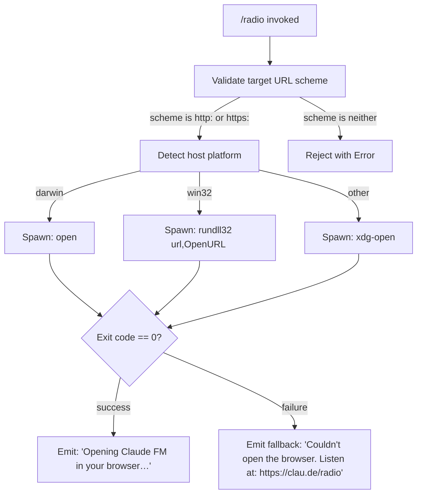

# `/radio`

> Analysis basis: CC v2.1.143 bundle.js (AST extraction + Claude interpretation)
> Minimum version: v2.1.143

---

## Overview

The `/radio` command opens the Claude FM lo-fi radio stream (`https://clau.de/radio`) in the user's default system browser. It is a purely side-effectful, interactive-only command: it launches a platform-appropriate browser-open utility, emits a confirmation message on success, and falls back to a plain-text URL on failure. No AI inference is involved.

---

## Registration

| Field | Value |
|---|---|
| type | `local` |
| name | `radio` |
| description | `Listen to Claude FM lo-fi radio` |
| supportsNonInteractive | `false` |
| module\_id | `$Tq` |

Analysis basis: CC v2.1.143 bundle.js:+11622654

---

## Input Branching

The command accepts no user-supplied arguments. All branching is driven by runtime platform detection and whether the browser-open call succeeds.



Analysis basis: CC v2.1.143 bundle.js:+7543066 (scheme check), +7543375 (darwin), +7543391 (win32), +7543475 (rundll32), +7543549 (open), +7543556 (xdg-open), +11622415 (target URL), +7543341 (exit-code zero check)

---

## Behavioral Spec

### URL Validation

Before attempting to open any URL, the open-URL utility validates that the protocol is either `http:` or `https:`. If neither matches, the utility rejects with an `Error` object rather than proceeding.

```
function validateUrlScheme(targetUrl):
    parsed = parseUrl(targetUrl)
    if parsed.protocol not in ["http:", "https:"]:
        throw Error("unsupported protocol")
    return parsed
```

Analysis basis: CC v2.1.143 bundle.js:+7543066, +7543088, +7543016

---

### Platform Detection and Browser Launch

After URL validation, the implementation inspects `process.platform` to select the correct system command for opening a URL in the default browser.

```
function openUrlInBrowser(targetUrl):
    validateUrlScheme(targetUrl)
    platform = process.platform
    if platform == "darwin":
        command = "open"
        args    = [targetUrl]
    else if platform == "win32":
        command = "rundll32"
        args    = ["url,OpenURL", targetUrl]
    else:
        command = "xdg-open"
        args    = [targetUrl]
    result = spawnProcess(command, args)
    return result
```

Analysis basis: CC v2.1.143 bundle.js:+7543375 (darwin branch), +7543391 (win32 branch), +7543475 (rundll32), +7543487 (url,OpenURL argument), +7543549 (open), +7543556 (xdg-open)

---

### Command Handler

The top-level command handler calls the browser-launch utility with the fixed target URL and selects the appropriate user-facing message based on the outcome.

```
function radioCommandHandler():
    TARGET_URL = "https://clau.de/radio"
    try:
        openUrlInBrowser(TARGET_URL)
        yield textMessage("Opening Claude FM in your browser…")
    catch error:
        yield textMessage(
            "Couldn't open the browser. Listen at: https://clau.de/radio"
        )
```

Analysis basis: CC v2.1.143 bundle.js:+11622415 (target URL), +11622452 (text message type), +11622465 (success message), +11622533 (fallback message), +11622412 (handler entry point)

---

### Async Render / Output Sink

The text messages yielded by the handler are passed to the terminal output pipeline via an async rendering layer. This layer collects streamed output items and forwards them to the display subsystem. An internal concurrency limit of 10 parallel tasks is applied within this pipeline.

Analysis basis: CC v2.1.143 bundle.js:+1038172 (concurrency limit 10)

---

### Background Process Management (Side Path)

During execution, the runtime's background-spare-process manager may be consulted. It checks available system memory (threshold: 1 000 000 bytes) and uses a polling interval of 2 000 ms when deciding whether to spawn or recycle a spare background worker.

```
function backgroundSpareCheck():
    freeMem = os.freemem()
    if freeMem >= 1_000_000:
        emitTelemetry("tengu_bg_spare_enable")
        scheduleSpawn(intervalMs=2000)
    ...
    emitTelemetry("tengu_bg_spare_spawn")
```

This path is not specific to `/radio`; it is part of the shared runtime lifecycle invoked whenever the command executor runs.

Analysis basis: CC v2.1.143 bundle.js:+14502714 (freemem call), +1038694 (1 000 000 threshold), +14502927 (2 000 ms interval), +14502634 (tengu\_bg\_spare\_enable), +14502994 (tengu\_bg\_spare\_spawn)

---

### Error Logging

If the spawned process emits an error-level event, the runtime logs it via the shared error-logging facility. The string literal `"error"` is used as the event discriminator for this path.

Analysis basis: CC v2.1.143 bundle.js:+960530, +960555

---

## State & Side Effects

| Item | Detail |
|---|---|
| Telemetry | `tengu_bg_spare_enable` (bundle.js:+14502634), `tengu_bg_spare_spawn` (bundle.js:+14502994) — both emitted by the shared background-process manager, not by the radio handler directly |
| Hook registration | None detected at depth-2 traversal |
| appState changes | None detected at depth-2 traversal |
| Sound / media | None — the command only opens a browser URL; audio playback is handled entirely by the browser at `https://clau.de/radio` |
| Process spawn | One short-lived child process (`open`, `rundll32`, or `xdg-open`) is spawned per invocation and not persisted |
| Non-interactive support | `false` — the command cannot be used in `--print` / pipe mode |

---

## Version History

| Version | Change |
|---|---|
| v2.1.143 | Initial analysis — command registered; opens `https://clau.de/radio` via platform-native browser launcher |

---

## Common Mistakes

1. **Running in non-interactive mode.** Because `supportsNonInteractive` is `false`, invoking `/radio` inside a script or with `--print` will be rejected before the handler runs. Use an interactive terminal session.
2. **Expecting audio inside the terminal.** The command opens a browser tab; no audio is routed through the CLI. If the browser does not launch (e.g., headless server), the fallback message provides the direct URL to use manually.
3. **Firewall / sandbox blocking `xdg-open` on Linux.** In restricted environments (containers, CI), the xdg-open call may fail silently or return a non-zero exit code. The fallback message will be displayed; copy the URL manually.
4. **Passing arguments.** The command signature accepts no arguments. Any text after `/radio` is ignored or may cause a parse error depending on the shell integration layer.

---

## Appendix — Identifier Mapping

> For bundle debugging only. Identifiers change across versions.

| Identifier | Role |
|---|---|
| `Yy7` | Radio command entry-point / handler function |
| `qK` | Open-URL utility (URL validation + platform dispatch + spawn) |
| `ex4` | URL scheme validator (throws Error on unsupported protocol) |
| `hJ` | Process-spawn helper called after platform selection |
| `Y8` | Async output-render pipeline coordinator |
| `$_` | Async task queue / concurrency-limited executor |
| `KXH` | Core async queue implementation (manages task scheduling) |
| `D` | Background spare-process manager (telemetry, freemem, polling) |
| `_SK` | String conversion utility used within the task queue |
| `NH` | Error-event handler / error-logging dispatcher |
| `S6` | Output sink that routes rendered items to the display layer |
| `Uh6` | AsyncLocalStorage store accessor for the current execution context |
| `__` | Base display/render primitive (leaf renderer) |