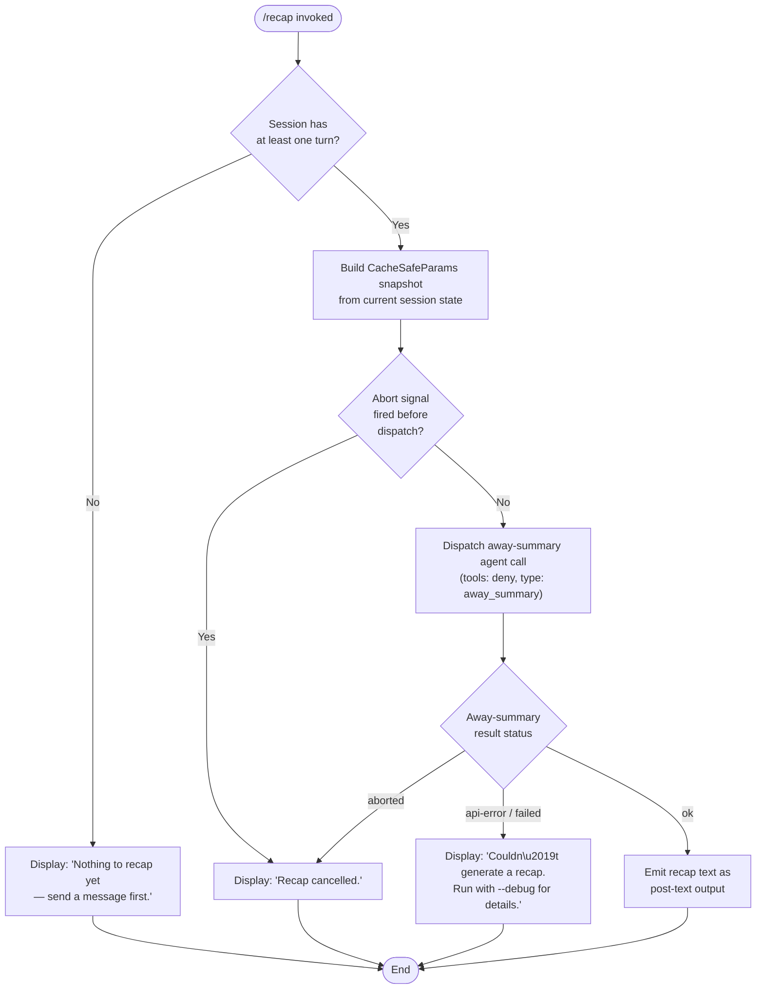

# `/recap`

> Analysis basis: CC v2.1.143 bundle.js (AST extraction + Claude interpretation)
> Minimum version: v2.1.143

---

## Overview

`/recap` triggers an immediate one-line session recap by invoking the "away summary" subsystem on demand. When the current session has no turns yet, the command exits early with an informational message; otherwise it dispatches a constrained agent call (tools denied, result type `away_summary`) and surfaces the result as post-text output to the CLI.

---

## Registration

| Field | Value |
|---|---|
| type | `local` |
| name | `recap` |
| description | `Generate a one-line session recap now` |
| loc_byte | `11932233` |
| loc_byte_end | `11932449` |
| loc_line | `7760` |
| supportsNonInteractive | `false` |
| thinClientDispatch | `post-text` |
| load_inline | `true` |
| load_ident | `mb7` |
| arbor_handler.name | `mb7` |
| arbor_handler.fqn | `claude-2.1.143::mb7` |
| arbor_handler.kind | `AsyncFunction` |
| arbor_handler.resolution_path | `load_ident` |
| arbor_handler.n_hits | `0` |

Analysis basis: CC v2.1.143 bundle.js:+11932233

---

## Input Branching

The command has four distinct outcome branches (no session turns → early exit; abort signal fires → cancellation; away-summary returns an error or aborted state → failure message; success → recap text displayed). A Mermaid flowchart is used.



Analysis basis: CC v2.1.143 bundle.js:+11931841, +11931983, +11932075, +11932133, +6655202, +6655260, +6655316, +6655493, +6655576, +6655720, +6655809, +6655870, +6655889

---

## Behavioral Spec

### Top-level handler (`mb7`)

The handler is an `AsyncFunction` resolved via the `load_ident` path. It is inlined as `load: () => Promise.resolve({ call: mb7 })` in the registration object.

```
async function recapCommandHandler(context):
    sessionSummaryParams = getAwaySessionParams(context)  // W18 → oEH

    if sessionSummaryParams is null or missing:
        log.debug("[awaySummary] no CacheSafeParams saved, skipping")
        displayMessage("Nothing to recap yet — send a message first.")
        return

    if context.abortSignal is already aborted:
        displayMessage("Recap cancelled.")
        return

    register abortSignal listener:
        on "abort" → displayMessage("Recap cancelled.")

    result = await dispatchAwaySummary(sessionSummaryParams, {
        toolPermission: "deny",
        toolDenyReason: "Away summary cannot use tools",
        summaryType: "away_summary",
    })   // XZ → Sw_ → FA7 chain

    switch result.status:
        case "aborted":
            displayMessage("Recap cancelled.")
        case "api-error":
        case "failed":
            displayMessage("Couldn't generate a recap. Run with --debug for details.")
        case "ok":
            emitPostText(result.recapText)
```

Analysis basis: CC v2.1.143 bundle.js:+11931841, +11931983, +11932075, +11932133, +6655202, +6655316, +6655493, +6655508, +6655576, +6655720, +6655809, +6655870, +6655889

---

### Pre-flight guard — `awaySummaryParamsCheck` (`W18` → `oEH`)

The first thing the handler does is retrieve the most-recently cached `CacheSafeParams` snapshot from session state. If the snapshot is absent (no conversation turns have been completed), execution halts with the "Nothing to recap yet" message. The string `"[awaySummary] no CacheSafeParams saved, skipping"` is emitted at debug level.

```
function getAwaySummaryParams(context):
    params = loadCachedParams(context)   // oEH
    if params is undefined or null:
        emitDebugLog("[awaySummary] no CacheSafeParams…")
        return null
    return params
```

Analysis basis: CC v2.1.143 bundle.js:+6655181, +6655200, +6655202

---

### Abort handling

The handler attaches an `addEventListener("abort", …)` listener to `context.abortSignal` before dispatching so that a mid-flight cancellation (e.g. user presses Ctrl-C) is caught and surfaces the "Recap cancelled." message. The string `"abort"` is used as the event name.

```
function registerAbortListener(abortSignal, onCancel):
    abortSignal.addEventListener("abort", () => {
        abortSignal.abort()   // propagate
        onCancel("Recap cancelled.")
    })
```

Analysis basis: CC v2.1.143 bundle.js:+6655297, +6655316, +6655328

---

### Away-summary dispatch (`XZ`)

`XZ` is the core dispatch function that orchestrates a constrained agent sub-call specifically for generating session recaps. It:

1. Captures `Date.now()` as a start timestamp.
2. Constructs a minimal agent context from the cached params, restricting tool permission to `"deny"` and tagging the call as `"away_summary"`.
3. Invokes `Sw_` (the streaming agent loop wrapper) which in turn calls the full agent pipeline (`FA7`).
4. Inspects the turn result and maps it to the status strings `"no-turn"`, `"aborted"`, `"api-error"`, `"ok"`, or `"failed"`.
5. Locates the last assistant message in the result via `.at(-1)` and extracts the text.
6. Feeds any final text through `kY1` (a flat-map post-processor over the message list).

```
async function dispatchAwaySummary(cachedParams, options):
    startTime = Date.now()

    agentCtx = buildMinimalAgentContext(cachedParams, {
        toolMode: "deny",
        denyMessage: "Away summary cannot use tools",
        summaryTag: "away_summary",
        threadLabel: "main",
    })

    turnResult = await runStreamingAgentLoop(agentCtx)  // Sw_

    status = classifyTurnResult(turnResult)
    // possible values: "no-turn", "aborted", "api-error", "ok", "failed"

    if status != "ok":
        return { status }

    lastMessage = turnResult.messages.at(-1)
    recapText = extractTextContent(lastMessage)   // kY1 flatMap

    return { status: "ok", recapText }
```

Analysis basis: CC v2.1.143 bundle.js:+5428347, +5428463, +5428652, +5428677, +5428703, +5428727, +5428746, +5428816, +5429057, +5429147, +5429176, +5429550, +5429862, +6655260, +6655493, +6655576, +6655737, +6655826

---

### Streaming agent loop (`Sw_` / `FA7`)

`Sw_` wraps the full agentic streaming pipeline. For `/recap`, it is invoked with `toolPermission = "deny"`, which means:

- `getToolPermissionContext` will return a context that blocks all tool calls.
- `getAppState` / `setAppState` are still called to maintain session coherence.
- The model is called via `D.callModel` inside `FA7`.
- Compact / micro-compact checks run (they may be skipped for a short one-turn recap call but the infrastructure is present).
- The result is a single assistant turn containing a short text block — the one-line recap.

Key internal status transitions observed in literals:
- `"stream_request_start"`, `"query_fn_entry"`, `"query_started"` — pipeline entry markers.
- `"query_api_loop_start"`, `"query_api_streaming_start"`, `"query_api_streaming_end"` — API call lifecycle.
- `"completed"` — normal completion state.
- `"aborted_streaming"` — early stop.
- `"interrupt"` — user interrupt.

Analysis basis: CC v2.1.143 bundle.js:+5425120, +5425223, +5425520, +5425687, +5425962, +5426068, +5426268, +9202976, +9203003, +9203035, +9207080

---

### Transcript / session-log persistence (`Z5K` / `E5K`)

While the recap agent call is running, the standard session-log machinery (`Z5K`, `E5K`) is still active. It handles:

- `lv.mkdir` — creates the log directory if absent.
- `lv.appendFile` — appends new turn data.
- `.txt` suffix check (literal `".txt"`, offset +200163).
- `lv.rename` / `lv.unlink` — rotates or removes stale log files.
- `Buffer.byteLength` — measures content size before flush.
- `clearTimeout` / `setTimeout` / `setImmediate` — debounced flush scheduling (batch window: 1 000 ms / 100 ms, literals at +56279 and +56300).

This machinery runs identically to any other agent call; no special bypass exists for the recap path.

```
function schedulePersistence(content, logPath):
    clearTimeout(pendingTimer)
    pendingTimer = setTimeout(async () => {
        await ensureDir(logPath)
        await appendToLog(logPath, content)
        await rotateIfNeeded(logPath)
    }, DEBOUNCE_MS)   // 1000 ms
```

Analysis basis: CC v2.1.143 bundle.js:+200705, +200730, +200768, +200875, +200907, +200913, +200963, +56279, +56300, +56391, +56555, +56648, +200059, +200163, +200215, +200255

---

### Result classification (`kY1`)

After the sub-agent turn completes, `kY1` applies a `flatMap` over the message list to extract text content blocks from the final assistant message. This is the same extractor used by the main conversation display path.

```
function extractFlatText(messageList):
    return messageList.flatMap(msg => getTextBlocks(msg))
```

Analysis basis: CC v2.1.143 bundle.js:+6655826, +6656036

---

## State & Side Effects

| Item | Detail |
|---|---|
| Telemetry — auto-compact | `tengu_auto_compact_rapid_refill_breaker` (+9203956), `tengu_auto_compact_succeeded` (+9204430) — fired if compact runs during the sub-call |
| Telemetry — query lifecycle | `tengu_query_error` (+9210891), `tengu_model_fallback_triggered` (+9210566), `tengu_model_response_keyword_detected` (+9211535) |
| Telemetry — tool execution | `tengu_streaming_tool_execution_used` (+9217050), `tengu_streaming_tool_execution_not_used` (+9217153) — always "not used" for recap (tools denied) |
| Telemetry — stop hooks | `tengu_stop_hook_block_count` (+9215707) |
| Telemetry — compact | `tengu_ptl_surfaced_to_user` (+9206443), `tengu_orphaned_messages_tombstoned` (+9208588) |
| Telemetry — forked agent | `tengu_forked_agent_default_turns_exceeded` (+5430086), `tengu_fork_agent_query` (+5430529) |
| Telemetry — background daemon | `tengu_bg_spare_enable` (+14502634), `tengu_bg_spare_spawn` (+14502994), `tengu_bg_spare_claim` (+14504532), `tengu_bg_spare_claim_fail` (+14504795), `tengu_bg_dispatch_sigkill_escalate` (+14503217), `tengu_bg_dispatch_low_mem` (+14503796), `tengu_bg_low_mem_mb` (+11972252), `tengu_daemon_yield` (+14521203) |
| Telemetry — feature flags | `tengu_feature_ok` (+955068), `tengu_feature_bad` (+955126) |
| Telemetry — MCP | `tengu_mcp_tools_refreshed_mid_turn` (+9222281) |
| Telemetry — post-autocompact | `tengu_post_autocompact_turn` (+9219451) |
| Telemetry — query attachments | `tengu_query_before_attachments` (+9219565), `tengu_query_after_attachments` (+9221978) |
| Hook registration | `h9` calls `at_.register` (+56977) — stop-hook registration runs as part of the agent sub-call lifecycle |
| appState changes | `H.getAppState` and `H.setAppState` are called inside `Sw_` (+5425223, +5426268); `G.getAppState` inside `FA7` (+9205964) |
| Tool permission context | Locked to `"deny"` for the recap call; denial reason string `"Away summary cannot use tools"` (+6655508) |
| Session log | `lv.appendFile`, `lv.rename`, `lv.unlink` via `E5K` — recap turn is persisted to the standard session log |
| Sound | <!-- TODO: not found in depth-2 traversal; needs --depth 4 --> |
| thinClientDispatch | `"post-text"` — output is appended after the current prompt line, not rendered inline |
| supportsNonInteractive | `false` — command is blocked in non-interactive (pipe/script) mode |

---

## Version History

| Version | Change |
|---|---|
| v2.1.143 | Initial analysis |

---

## Common Mistakes

1. **Running `/recap` before sending any message.** The command checks for a `CacheSafeParams` snapshot and exits immediately with "Nothing to recap yet — send a message first." if no completed turn exists. At least one full conversation turn must have been processed.

2. **Expecting tool use in the recap output.** Tool execution is unconditionally denied for the recap sub-call (`toolPermission = "deny"`). If a prompt or template somehow requests tool use, the sub-agent will receive the denial reason and the recap will be text-only.

3. **Assuming the command works in non-interactive mode.** `supportsNonInteractive: false` means piping or scripting `/recap` via stdin in a non-interactive shell will not execute; the command is silently skipped or errors out depending on the runner.

4. **Expecting rich multi-line output.** The command is registered as generating a *one-line* recap. The `kY1` extractor surfaces only the final assistant turn's text blocks; any multi-turn elaboration within the sub-call is collapsed.

5. **Interrupting and expecting immediate termination.** The abort signal listener is registered *after* the initial guard check but *before* dispatch. A very fast abort between those two points may not surface the "Recap cancelled." message if the guard already returned a null result.

---

## Appendix — Identifier Mapping

> For bundle debugging only. Identifiers change across versions.

| Identifier | Role |
|---|---|
| `mb7` | Top-level recap command handler (AsyncFunction; entry point via `load_ident`) |
| `W18` | Away-summary orchestrator — retrieves cached params and drives the recap flow |
| `oEH` | Cached-params loader — fetches `CacheSafeParams` from session state |
| `v` | Session-log / message-formatting utility called by the orchestrator |
| `G5K` | Log-entry builder (depth-1 helper of `v`) |
| `tt_` | Log serialisation helper inside `G5K` |
| `hH` | JSON-stringify wrapper used for message serialisation |
| `P7` | Path / filename utility (uses `lastIndexOf`, `slice`, `replace`) |
| `h6A` | Path segment mapper (`w5K.map` pattern) |
| `cSH` | Console/stream write wrapper |
| `X6A` | Low-level stream write helper (`H.write`) |
| `Z5K` | Session-log persistence manager (mkdir, appendFile, rotate) |
| `PSH` | Debounced flush scheduler (clearTimeout / setTimeout / setImmediate) |
| `i8H` | Log-line formatter (joins path segments, calls `x8`, `V6`) |
| `gv8` | Log utility calling `L8` |
| `U6A` | Path join helper (`HPH.join`, `V6`) |
| `p6A` | Log file rotation handler (stat, rename, unlink) |
| `E5K` | Log file append worker (mkdir, appendFile, rotate, size check) |
| `h9` | Stop-hook registration helper (`at_.register`) |
| `XZ` | Away-summary dispatcher — builds agent context, runs sub-call, classifies result |
| `Sw_` | Streaming agent loop wrapper (calls `eN` and full pipeline) |
| `eN` | Streaming request executor (xq, abort propagation, A84/q84 bindings) |
| `k1H` | Session state loader/dumper (`NC`, `_.load`, `H.dump`) |
| `YOH` | Agent context assembly helper |
| `Br9` | Pre-dispatch validation / setup helper |
| `L` | Active-request tracker (add/delete with finally) |
| `rA8` | Request metadata builder |
| `pm` | Random-hex generator (`GK1.randomBytes`, 8 bytes, hex encoding) |
| `G` | Turn-result array (contains `f26`, `iT8` entries) |
| `f26` | Turn result entry type A |
| `iT8` | Turn result entry type B |
| `je` | Post-turn processor (calls `KL`, `vvH`) |
| `KL` | Completion handler inside `je` (calls `h9`) |
| `vvH` | Message-list filter/map (filter, `j28`, `I28`, `im7`; provider tag `"ant"`) |
| `iC` | Turn dispatcher — routes to `FA7`, `K98`, `SH`, `mH` |
| `FA7` | Full agentic query pipeline (model call, compact, tool execution, hooks) |
| `K98` | Sub-agent exit handler (`q98`, `rC` map get/delete, `xw_.delete`) |
| `SH` | Feature-flag check helper (calls `d`; related to `tengu_feature_ok/bad`) |
| `mH` | Feature-flag negative helper (calls `d`) |
| `nA8` | Has-pending-request check (`$z4.has`) |
| `JzH` | Turn-result post-processor |
| `sA8` | Additional turn-state helper |
| `D` | Background-daemon manager (spare pool, G6, IG6, freemem, spawn) |
| `G6` | Daemon process entry (m76, p76, Ts, sMH, Ci6, x76, PF, N6) |
| `$` | Disposable resource (calls `JZq` on dispose) |
| `IG6` | Daemon index updater (`d6`, `G6`) |
| `$o_` | Background spare daemon spawner (Bun.spawn, unlink, mkdir, randomBytes) |
| `d` | Low-level diagnostic/logging primitive |
| `NH` | Error reporter (v_, xH, zq, kNK, xRH, Wc.logError) |
| `Dz4` | Forked-agent telemetry emitter (`tengu_fork_agent_query`) |
| `w8` | Agent session creator (randomUUID, calls `j` and `J`) |
| `j` | Agent session lifecycle manager (calls `w`) |
| `w` | Background-session worker (kill, freemem, IG6, G6, NH, spawn) |
| `J` | Session terminator (A.values, y.kill) |
| `y` | Session write/close helper (z.write, `d`) |
| `kY1` | Recap-text extractor — flatMaps message list to extract final text content |

---

Note: index built via Arbor fallback; some signals (telemetry, literals) may be missing — see arbor-fallback.js.