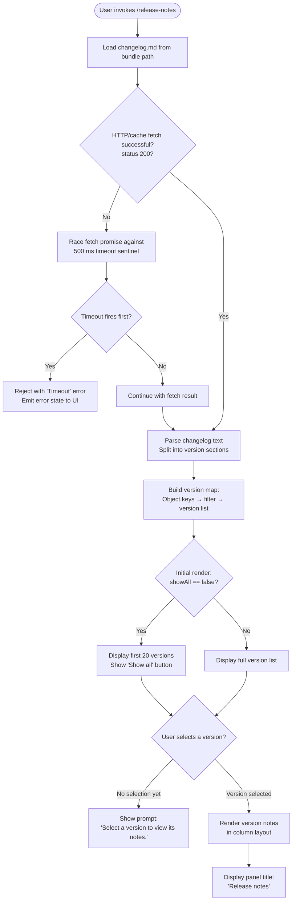

# `/release-notes`

> Analysis basis: CC v2.1.143 bundle.js (AST extraction + Claude interpretation)
> Minimum version: v2.1.143

---

## Overview

The `/release-notes` command renders an interactive, version-selectable panel displaying the contents of the bundled `changelog.md` file. It parses the changelog into per-version sections, presents a scrollable version list (defaulting to a compact view with a "Show all" toggle), and renders the notes for the selected version in a columnar layout. The command operates entirely locally — no network calls are made to fulfill the display.

---

## Registration

| Field | Value |
|---|---|
| type | `local-jsx` |
| name | `release-notes` |
| description | `View release notes` |
| module_id | `GYq` |

Analysis basis: CC v2.1.143 bundle.js:+11054761

---

## Input Branching

The command's rendering logic branches across several states. The mermaid diagram below captures the primary paths observed from the call graph and literal constants.



Analysis basis: CC v2.1.143 bundle.js:+11053067 (Promise.race), +11053041 ("Timeout"), +11053053 (500 ms), +11053334 (20 versions), +11053407 ("Show all"), +11054049 ("Select a version to view its notes."), +11054433 ("Release notes")

---

## Behavioral Spec

### 1. Changelog File Resolution

The command resolves the changelog path by joining a directory base (derived from the module's own file path via `path.dirname`) with the filename `changelog.md`.

```
function resolveChangelogPath(moduleFilePath):
    baseDir = path.dirname(moduleFilePath)
    return path.join(baseDir, "changelog.md")
```

Analysis basis: CC v2.1.143 bundle.js:+11049664 ("changelog.md"), +11050036 (`A06.dirname`)

---

### 2. Changelog Fetch with Timeout

The fetch operation is wrapped in a `Promise.race` between the actual read and a hard timeout. The timeout duration is **500 milliseconds**. If the timeout wins, the promise rejects with an `Error` whose message is `"Timeout"`.

```
function fetchWithTimeout(fetchPromise):
    timeoutPromise = new Promise((_, reject) =>
        setTimeout(() => reject(new Error("Timeout")), 500)
    )
    return Promise.race([fetchPromise, timeoutPromise])
```

- Timeout sentinel string: `"Timeout"` (bundle.js:+11053041)
- Timeout duration: 500 ms (bundle.js:+11053053)

Analysis basis: CC v2.1.143 bundle.js:+11053067, +11053041, +11053053

---

### 3. HTTP Cache Layer

Before issuing a fresh read, the implementation consults a module-level cache keyed on the resolved path. The cache is identified by the string key `"cache"`. A successful cached result short-circuits the file read. The expected success indicator from the underlying fetch layer is HTTP status **200**.

```
function getCachedOrFetch(resolvedPath, cache):
    cached = cache.get(resolvedPath)
    if cached exists:
        return cached
    result = fetchChangelogFile(resolvedPath)
    if result.status == 200:
        cache.set(resolvedPath, result)
    return result
```

- Cache key string: `"cache"` (bundle.js:+11049656)
- Success status: `200` (bundle.js:+11049971)

Analysis basis: CC v2.1.143 bundle.js:+11049947, +11049656, +11049971

---

### 4. Changelog Parsing into Version Sections

The raw changelog text is split and parsed into a map of version strings to note bodies. Lines are trimmed; entries are separated by `" - "` (space-hyphen-space) as an inline delimiter and `"- "` (hyphen-space) as a list-item prefix.

```
function parseChangelog(rawText):
    lines = rawText.split(newlineDelimiter)
    versionMap = {}
    currentVersion = null
    currentLines = []

    for each line in lines:
        trimmed = line.trim()
        if trimmed matches version header pattern:
            if currentVersion != null:
                versionMap[currentVersion] = currentLines
            currentVersion = extractVersion(trimmed)
            currentLines = []
        else if trimmed starts with "- ":
            entry = trimmed.slice(after prefix)
            parts = entry.split(" - ")
            currentLines.push(formatEntry(parts))
        else:
            currentLines.push(trimmed)

    if currentVersion != null:
        versionMap[currentVersion] = currentLines

    return versionMap
```

- Inline separator: `" - "` (bundle.js:+11050472)
- List prefix: `"- "` (bundle.js:+11050550)

Analysis basis: CC v2.1.143 bundle.js:+11050341, +11050390, +11050467, +11050472, +11050507, +11050530, +11050550

---

### 5. Version List Rendering (Compact vs. Full)

The version list is initially capped at **20 entries**. A "Show all" toggle button is shown when the list is in compact mode. Clicking it re-renders with the full list.

```
function renderVersionList(versionKeys, showAll):
    displayKeys = showAll ? versionKeys : versionKeys.slice(0, 20)
    items = displayKeys.map(key => renderVersionItem(key))

    if not showAll and versionKeys.length > 20:
        items.append(renderButton("Show all", onClick=() => setShowAll(true)))

    return items
```

- Default compact limit: `20` (bundle.js:+11053334)
- Toggle button label: `"Show all"` (bundle.js:+11053407)

Analysis basis: CC v2.1.143 bundle.js:+11053328, +11053334, +11053407

---

### 6. Version Notes Panel

When no version is selected, the panel displays the placeholder string `"Select a version to view its notes."`. Once a version is selected, it renders the parsed notes for that version in a `"column"` flex layout under the heading `"Release notes"`.

```
function renderNotesPanel(selectedVersion, versionMap):
    if selectedVersion == null:
        return renderText("Select a version to view its notes.")

    notes = versionMap[selectedVersion]
    return renderContainer(
        layout = "column",
        title  = "Release notes",
        body   = renderNoteLines(notes)
    )
```

- Empty-state prompt: `"Select a version to view its notes."` (bundle.js:+11054049)
- Layout direction: `"column"` (bundle.js:+11053982)
- Panel title: `"Release notes"` (bundle.js:+11054433)

Analysis basis: CC v2.1.143 bundle.js:+11054049, +11053982, +11054433

---

### 7. Version Item Skip Logic

During version list mapping, items whose disposition resolves to `"skip"` are excluded from the displayed list. This allows internal or pre-release markers to be filtered out.

```
function filterVersionItems(parsedItems):
    return parsedItems.filter(item =>
        item.disposition != "skip"
    )
```

- Skip sentinel: `"skip"` (bundle.js:+11053712)

Analysis basis: CC v2.1.143 bundle.js:+11053712, +11051111

---

### 8. Network Traffic Classification

The underlying fetch transport classifies release-notes requests under the `"essential-traffic"` network category. This classification affects how the request is prioritised or permitted through any traffic-management layer.

- Traffic class string: `"essential-traffic"` (bundle.js:+959252)

Analysis basis: CC v2.1.143 bundle.js:+959244, +959252

---

### 9. Config Auth-Loss Guard (Side Effect During Save)

A global config save guard is active during the session. If a config re-read after a write is found to be missing authentication data that the in-memory cache holds, the write is refused and a telemetry event is emitted. This is not directly triggered by `/release-notes` itself, but the guard is active in the same execution context.

```
function saveGlobalConfigGuarded(cachedConfig, reReadConfig):
    if cachedConfig.hasAuth and not reReadConfig.hasAuth:
        emitTelemetry("tengu_config_auth_loss_prevented")
        log("error", "saveGlobalConfig fallback: re-read config is missing auth " +
            "that cache has; refusing to write. See GH #3117.")
        return  // refuse write
    proceedWithSave(reReadConfig)
```

- Guard error string: `"saveGlobalConfig fallback: re-read config is missing auth that cache has; refusing to write. See GH #3117."` (bundle.js:+3159506)

Analysis basis: CC v2.1.143 bundle.js:+3159299, +3159464, +3159506, +3159634

---

### 10. React Memoisation Sentinel

The JSX component uses React's `useMemoCache` pattern, identified by the sentinel symbol `"react.memo_cache_sentinel"` registered via `Symbol.for`. Cache slots indexed 3 through 19 are allocated for memoised sub-expressions within the component tree.

- Memo sentinel: `"react.memo_cache_sentinel"` (bundle.js:+11053908)
- Cache slot range: indices 3–19 (bundle.js:+11053490 through +11054484)

Analysis basis: CC v2.1.143 bundle.js:+11053897, +11053908

---

## State & Side Effects

| Item | Detail |
|---|---|
| Telemetry | `tengu_config_auth_loss_prevented` — fired when a global config save is blocked due to auth-field loss (bundle.js:+3159634) |
| Hook registration | React memo cache registered via `Symbol.for("react.memo_cache_sentinel")` with up to 20 cache slots (indices 0–19) |
| appState changes | `showAll` boolean toggle controls version list expansion; `selectedVersion` tracks the currently active version in the panel |
| Network | Requests classified as `"essential-traffic"`; result cached in module-level cache keyed by resolved file path |
| File I/O | Reads `changelog.md` relative to the module's own directory; uses `path.dirname` of the module file path |
| Timeout | Fetch aborted (via `Promise.race`) after **500 ms**; error state surfaced to UI |
| Sound | <!-- TODO: not found in depth-2 traversal; needs --depth 4 --> |
| Async cleanup | Open handles closed via `A.close` / `q.close`; temporary files removed via `unlinkSync`; tracked handles managed through add/delete on a live set with `finally` guarantee |

---

## Version History

| Version | Change |
|---|---|
| v2.1.143 | Initial analysis — `local-jsx` command, module `GYq`, changelog parsing, 500 ms timeout, 20-item compact list, "Show all" toggle, column-layout notes panel |

---

## Common Mistakes

1. **Expecting network content**: `/release-notes` reads a file bundled with the CLI (`changelog.md`), not a remote endpoint. The notes reflect the version of CC installed, not the latest published version.
2. **Assuming immediate render on slow systems**: The 500 ms timeout is absolute. On an unusually slow I/O path (e.g., network-mounted home directory), the command may time out and show an error instead of notes.
3. **Passing arguments**: The command is registered with no argument schema. Any text typed after `/release-notes` is ignored; version selection is done interactively in the rendered UI, not on the command line.
4. **Expecting all versions to appear immediately**: The list defaults to the first **20 versions**. Older versions require clicking "Show all" to become visible.
5. **Confusing the "skip" filter**: Some version entries are marked internally as `"skip"` and will not appear in the list even after "Show all" is clicked. This is intentional for pre-release or internal markers.
6. **Assuming the panel is stateless**: The selected version is held in component state; navigating away and returning resets the selection to none, showing the `"Select a version to view its notes."` prompt again.

---

## Appendix — Identifier Mapping

> For bundle debugging only. Identifiers change across versions.

| Identifier | Role |
|---|---|
| `mm_` | Version item mapper — maps raw parsed entries to renderable version item objects |
| `XYq` | Version list slice helper — slices the full version array to the compact display limit |
| `hG7` | Async changelog loader — orchestrates fetch, timeout race, parsing, and error handling |
| `xm_` | Changelog file fetcher — resolves path, consults cache, issues read, checks status 200 |
| `bm_` | Path joiner — joins directory segments and the `changelog.md` filename |
| `d1` | Async store accessor — retrieves the current async-local storage context |
| `a6` | Global config writer — saves global config with auth-loss guard |
| `um_` | Cached path resolver — resolves the changelog path using `bm_` and `d1` |
| `DYq` | Changelog parser — splits raw text into a version-keyed section map |
| `lJ8` | Version header detector — identifies lines that begin a new version section |
| `q06` | Section line parser — trims, splits, and formats individual changelog lines |
| `NH` | Structured logger / note emitter — writes parsed notes into output structures |
| `v_` | Error wrapper — constructs typed Error objects from string messages |
| `WYq` | Release-notes JSX component — top-level React component rendering the full panel |
| `E_` | Essential-traffic fetch wrapper — issues the underlying file/HTTP request under the `"essential-traffic"` classification |
| `zq` | Request router / dispatcher — routes fetch calls to appropriate transport |
| `bX` | UI state dispatcher — dispatches state update actions to the component |
| `K` | Column formatter — pads and maps note lines into fixed-width column strings |