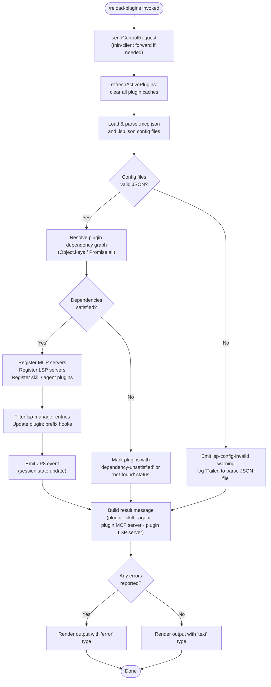

# `/reload-plugins`

> Analysis basis: CC v2.1.143 bundle.js (AST extraction + Claude interpretation)
> Minimum version: v2.1.143

---

## Overview

The `/reload-plugins` command activates any pending plugin changes within the currently running Claude Code session without requiring a full restart. It does so by flushing all plugin caches, re-reading plugin configuration files (`.mcp.json` and `.lsp.json`), resolving dependencies, and then re-registering the resulting plugin set — including MCP servers, LSP servers, skill plugins, and agent plugins — against the live session state. The command is dispatched as a `control-request` in thin-client environments, ensuring the reload logic executes on the authoritative host process.

---

## Registration

| Field | Value |
|---|---|
| type | `local` |
| name | `reload-plugins` |
| description | `Activate pending plugin changes in the current session` |
| supportsNonInteractive | `false` |
| thinClientDispatch | `control-request` |
| module\_id | `t0q` |

Analysis basis: CC v2.1.143 bundle.js:+11572698

---

## Input Branching

The command entry point (`commandHandler`) accepts the standard slash-command invocation context. No user-supplied arguments are parsed; all branching is driven by the results of the cache-clear and reload phases.



Analysis basis: CC v2.1.143 bundle.js:+11571721, +11571758, +11571833, +11572129, +11572161, +11572204

---

## Behavioral Spec

### 1. Command Entry Point and Control-Request Dispatch

```
function commandHandler(context, appState):
    // For thin-client sessions, forward to host via control channel
    // using protocol key "ccr"
    controlResult = sendControlRequest(context, protocolKey="ccr")

    // Proceed with local reload sequence
    clearPluginCaches(appState)
    pluginLoadResult = loadAndActivatePlugins(appState)
    dependencyResult = resolveDependencies(pluginLoadResult)
    registrationResult = registerPlugins(appState, dependencyResult)
    return buildResultMessage(registrationResult)
```

Analysis basis: CC v2.1.143 bundle.js:+11571721, +11571739, +11571758

---

### 2. Cache Flush (`refreshActivePlugins`)

```
function refreshActivePlugins(appState):
    log("debug", "refreshActivePlugins: clearing all plugin caches")
    clearInstalledPluginsCache()    // logs "Cleared installed plugins cache"
    clearMcpServerRegistry()
    clearLspServerRegistry()
    clearSkillRegistry()
    clearAgentRegistry()
```

The log message `"refreshActivePlugins: clearing all plugin caches"` is emitted at debug level before any cache mutation occurs.
Analysis basis: CC v2.1.143 bundle.js:+11569811, +11569809, +201193

---

### 3. Configuration File Loading

Two configuration file formats are supported in the same reload pass:

| Config file | Encoding | Error tag on parse failure |
|---|---|---|
| `.mcp.json` | utf-8 | *(no explicit tag; silently skipped)* |
| `.lsp.json` | utf-8 | `lsp-config-invalid` |

```
function loadConfigFiles(projectRoot):
    mcpPath  = join(projectRoot, ".mcp.json")
    lspPath  = join(projectRoot, ".lsp.json")

    mcpConfig = readAndParseJson(mcpPath, encoding="utf-8")
    lspConfig = readAndParseJson(lspPath, encoding="utf-8")
        on parse error:
            emitWarning(tag="lsp-config-invalid")
            log("warn", "Failed to parse JSON file", lspPath)
            lspConfig = empty

    return { mcpConfig, lspConfig }
```

Analysis basis: CC v2.1.143 bundle.js:+7609306, +8409238, +8409282, +8409508, +8409955

---

### 4. Plugin Type Classification

Plugins are classified into four string-keyed categories during the reload:

| Category key | Display label |
|---|---|
| `"plugin"` | plugin |
| `"skill"` | skill |
| `"agent"` | agent |
| `"plugin MCP server"` | plugin MCP server |
| `"plugin LSP server"` | plugin LSP server |

The result summary line joins category counts with the separator `" · "`.

Analysis basis: CC v2.1.143 bundle.js:+11571853, +11571884, +11571912, +11571944, +11571971, +11572436

---

### 5. Dependency Resolution

```
function resolveDependencies(pluginManifestList):
    resolved   = empty map
    unresolved = empty set

    for each plugin in pluginManifestList:
        deps = plugin.dependency or plugin.dependencies   // both keys checked
        if deps is undefined or empty:
            resolved.add(plugin)
            continue

        for each dep in deps (up to depth 5):
            status = checkDepStatus(dep)
            switch status:
                case "not-found":
                    markPlugin(plugin, status="not-found")
                case "dependency-unsatisfied":
                    markPlugin(plugin, status="dependency-unsatisfied")
                case "dependency-resolution":
                    markPlugin(plugin, status="dependency-resolution")
                default:
                    resolved.add(plugin)

    return { resolved, unresolved }
```

Maximum dependency traversal depth: 5 (bundle.js:+4879673)
Separator between dependency names in messages: `", "` (bundle.js:+5095561)

Analysis basis: CC v2.1.143 bundle.js:+4879677, +4879688, +4879714, +4879730, +4879782, +4879787, +4879800, +10786994

---

### 6. Plugin Scope and Policy Enforcement

During registration, each plugin's installation scope is checked before writing to settings:

```
function enforcePluginPolicy(plugin, scope):
    if scope == "managed":
        throw Error("Cannot install plugins to managed scope")

    if plugin.source == "marketplace" and policyBlocks(plugin):
        markPlugin(plugin, status="marketplace-blocked-by-policy")
        return

    if plugin.source == "local" and plugin.location is undefined:
        markPlugin(plugin, status="local-source-no-location")
        return

    if dependencyBlockedByPolicy(plugin):
        markPlugin(plugin, status="dependency-blocked-by-policy")
        return

    if dependencyMarketplaceBlockedByPolicy(plugin):
        markPlugin(plugin, status="dependency-marketplace-blocked-by-policy")
        return
```

Analysis basis: CC v2.1.143 bundle.js:+4865480, +4865502, +5091819, +5091911, +5092035, +5093145, +5093255

---

### 7. Additional Resolution Failure States

```
function checkAdditionalFailureStates(plugin):
    if settingsWriteFailed(plugin):
        markPlugin(plugin, status="settings-write-failed")
    if rangeConflict(plugin):
        markPlugin(plugin, status="range-conflict")
    if noMatchingTag(plugin):
        markPlugin(plugin, status="no-matching-tag")
    if installedUnsatisfied(plugin):
        markPlugin(plugin, status="installed-unsatisfied")
    if resolutionFailed(plugin):
        markPlugin(plugin, status="resolution-failed")
    if blockedByPolicy(plugin):
        markPlugin(plugin, status="blocked-by-policy")
```

Analysis basis: CC v2.1.143 bundle.js:+5091819, +5093030, +5093532, +5094597, +5094780, +5096124

---

### 8. MCP Server Registration

```
function registerMcpServers(mcpConfig, appState):
    for each serverEntry in Object.keys(mcpConfig):
        serverDef = mcpConfig[serverEntry]
        if Array.isArray(serverDef.tools):
            // parallel activation
            results = await Promise.all(serverDef.tools.map(activateTool))
        else:
            results = await activateSingleServer(serverDef)
        updateAppStateRegistry(appState, serverEntry, results)
```

Analysis basis: CC v2.1.143 bundle.js:+7609295, +7609418, +7609437, +7609525, +7609555, +7609567, +7609697, +7609851

---

### 9. LSP Manager Filtering and Hook Registration

```
function registerLspAndHooks(rawPluginList, appState):
    lspEntries    = rawPluginList.filter(entry => entry.source == "lsp-manager")
    pluginEntries = rawPluginList.filter(entry => entry.id.startsWith("plugin:"))

    // Map LSP entries into LSP server descriptors (padEnd width = 40)
    lspDescriptors = lspEntries.map(formatLspEntry)   // pads to 40 chars

    // Register hooks for plugin-prefixed entries
    for each entry in pluginEntries:
        hookType = resolveHookType(entry)   // yields "hook" or "plugin LSP server"
        registerHook(appState, hookType, entry)

    // Re-register background sessions that were in "stopped" state
    stoppedSessions = appState.sessions.filter(s => s.state == "stopped"
                                                 and s.label == "background session")
    for each session in stoppedSessions:
        restartSession(session)
```

The `padEnd` call uses a fixed width of **40** characters.
Analysis basis: CC v2.1.143 bundle.js:+11571289, +11571324, +14526168, +14526181, +14528173, +11572377, +11572436, +14538107, +14538150

---

### 10. Session State Event Emission

```
function emitSessionStateUpdate(eventBus, pluginResults):
    // Build aggregated update payload from all Object.values(pluginResults)
    payload = Object.values(pluginResults).reduce(mergeResultPayload, initialPayload)
    eventBus.emit(payload)   // ZP8 event bus
```

Analysis basis: CC v2.1.143 bundle.js:+11570772, +11570873

---

### 11. Result Message Construction

```
function buildResultMessage(registrationResult):
    parts = []
    for each category in ["plugin", "skill", "agent",
                          "plugin MCP server", "plugin LSP server"]:
        count = registrationResult.countByCategory(category)
        if count > 0:
            parts.push(formatCount(count, category))

    summary = parts.join(" · ")

    if registrationResult.hasErrors():
        return { type: "error", text: summary }
    else:
        return { type: "text",  text: summary }
```

Analysis basis: CC v2.1.143 bundle.js:+11571853, +11571884, +11571912, +11571944, +11571971, +11572026, +11572101

---

### 12. Host-Pattern and Path-Pattern Resolution for Skill Plugins

```
function resolveSkillPlugin(plugin):
    if plugin.has("hostPattern"):
        applyHostPattern(plugin.hostPattern)
    if plugin.has("pathPattern"):
        applyPathPattern(plugin.pathPattern)
    if plugin.skillsDir is defined:
        resolveSkillsDir(plugin, dir="skills-dir")
```

Analysis basis: CC v2.1.143 bundle.js:+4887224, +4887268, +4887312

---

### 13. Telemetry for Plugin Installation (side path)

When the reload path triggers a net-new plugin installation (e.g., a dependency that did not previously exist), the following telemetry event is emitted:

| Event | Properties |
|---|---|
| `plugin_installed` | `plugin.name`, `plugin.version`, `marketplace.name`, `marketplace.is_official`, `install.trigger` |

Analysis basis: CC v2.1.143 bundle.js:+5097538, +5097565, +5097605, +5097643, +5097665, +5097708

---

## State & Side Effects

| Item | Detail |
|---|---|
| Telemetry | No `tengu_*` events found in the depth-2 traversal for the reload-plugins command itself. `plugin_installed` (bundle.js:+5097538) fires on the install sub-path only. |
| Hook registration | Plugin-prefixed entries are registered as session hooks; hook type resolved from entry metadata (bundle.js:+11572377) |
| appState changes | Plugin, MCP server, LSP server, skill, and agent registries are fully replaced in the live appState (bundle.js:+11570873) |
| Event bus emission | The `ZP8` event bus receives a merged payload after all registrations complete (bundle.js:+11570873) |
| Sound | <!-- TODO: not found in depth-2 traversal; needs --depth 4 --> |
| Background sessions | Sessions in `"stopped"` state labelled `"background session"` are restarted as part of reload (bundle.js:+14538107, +14538150) |
| File I/O | Reads `.mcp.json` and `.lsp.json` from the project root; uses `utf-8` encoding; parse errors are non-fatal (bundle.js:+7609306, +8409238, +8409282) |
| Timing / jitter | A `setTimeout` with base value `2` and a `Math.random` multiplier is used internally to jitter concurrent reconnection attempts (bundle.js:+12638154, +12638193) |
| Managed-scope guard | Attempting to write a plugin into the `"managed"` scope throws immediately and aborts that plugin's registration (bundle.js:+4865480, +4865502) |

---

## Version History

| Version | Change |
|---|---|
| v2.1.143 | Initial analysis |

---

## Common Mistakes

1. **Invoking in non-interactive mode**: `supportsNonInteractive` is `false` (bundle.js:+11572698). Running `/reload-plugins` from a non-interactive script or pipe will fail silently or be rejected outright.

2. **Expecting a restart-free config change for managed-scope plugins**: Plugins installed under the `"managed"` scope cannot be reloaded or re-registered via this command; the managed-scope guard throws immediately (bundle.js:+4865502).

3. **Malformed `.lsp.json` blocking the entire reload**: A JSON parse failure in `.lsp.json` emits a `lsp-config-invalid` warning and skips LSP server registration for that file, but the remainder of the reload continues. Users may mistakenly believe the whole command succeeded when LSP servers were silently dropped (bundle.js:+8409508, +8409955).

4. **Assuming thin-client dispatch is transparent**: In thin-client mode, the command is forwarded via `control-request` using protocol key `"ccr"` (bundle.js:+11571739). Any network interruption between thin client and host will cause the reload to fail without performing any local cache flush.

5. **Missing dependency declarations causing silent no-ops**: Plugins whose dependencies resolve to `"not-found"` or `"dependency-unsatisfied"` are silently excluded from the active set and their absence is only visible in the summary message — not as an error exit code (bundle.js:+10786019, +10785982).

6. **Confusing `"dependency"` vs `"dependencies"` key**: The resolver checks both the singular and plural forms of the dependency key in plugin manifests (bundle.js:+4879787, +4879800). Supplying neither means the plugin is treated as having no dependencies, which may cause unexpected behavior for plugins that implicitly rely on others.

---

## Appendix — Identifier Mapping

> For bundle debugging only. Identifiers change across versions.

| Identifier | Role |
|---|---|
| `Pk7` | Command handler / entry point for `/reload-plugins` |
| `Z$` | Control-request sender helper |
| `BjH` | Underlying transport send primitive |
| `zd` | Plugin cache clear coordinator |
| `N8` | Cache invalidation utility |
| `$JH` | `refreshActivePlugins` — main cache flush and reload orchestrator |
| `v` | Debug/log-level message emitter |
| `fe1` | Installed-plugins cache clear function |
| `k$` | Plugin registry clear helper (clears multiple sub-registries) |
| `l17` | Sub-registry clear step 1 |
| `rHH` | Sub-registry clear step 2 |
| `YY_` | Sub-registry clear step 3 |
| `GY_` | Sub-registry clear step 4 |
| `JrH` | Sub-registry clear step 5 |
| `ZR1` | Config file path resolver |
| `HF1` | Config loader / pre-parse helper |
| `__` | Async utility / promise wrapper |
| `GV` | Internal async scheduler |
| `K` | Plugin list / result accumulator (context-dependent) |
| `Ti` | MCP server registration orchestrator |
| `wG_` | MCP server file path builder (appends `.mcp.json`) |
| `Rg` | MCP server entry validator |
| `$V1` | MCP tool activator |
| `XIH` | LSP config file loader and parser |
| `fDH` | LSP config path segment array |
| `sZ_` | File-system read abstraction |
| `R6` | JSON parse wrapper |
| `wCH` | LSP config schema validator |
| `$8` | LSP server entry builder |
| `Mi4` | LSP server registration sink |
| `$` | Plugin result reducer (context-dependent) |
| `JZq` | Result merge helper |
| `O` | Secondary plugin result reducer |
| `H` | Jitter / random-delay utility (also used as array in other contexts) |
| `jk7` | LSP manager filter and hook registration function |
| `s0q` | Hook type resolver |
| `NH` | Background session restart coordinator |
| `v_` | Session state reader |
| `xH` | Session restart trigger |
| `zq` | Session reconnect scheduler |
| `kNK` | Reconnect error handler |
| `xRH` | Reconnect error accumulator |
| `Wc` | Error logger |
| `XH` | String coercion / display formatter |
| `XLH` | Plugin dependency resolution and registration orchestrator |
| `_` | Working plugin list / scratch array (context-dependent) |
| `bg` | Dependency graph walker |
| `S5` | Dependency node resolver |
| `lTH` | Plugin manifest entry iterator |
| `I8` | Manifest field extractor |
| `MZ` | Managed-scope error thrower |
| `IA` | Plugin scope / path parser |
| `L` | Promise lifecycle tracker (add / finally / delete) |
| `xP` | Skill plugin pattern resolver |
| `z36` | Host-pattern matcher |
| `lt` | Path-pattern matcher |
| `uo9` | Host-pattern applicator |
| `mo9` | Path-pattern applicator |
| `U14` | Skills-dir resolver |
| `d1H` | Plugin file reader (reads individual plugin definition files) |
| `x6` | Plugin file path builder |
| `pz8` | Plugin file schema validator |
| `GX6` | Plugin file post-processor |
| `d0` | Plugin scope writer (writes resolved plugin to settings) |
| `AY_` | Settings path resolver |
| `YZ` | Settings write executor |
| `PX7` | Duplicate-plugin guard (uses `q.has`) |
| `HO6` | Full plugin install/registration pipeline |
| `zZ` | Policy check helper |
| `a88` | Marketplace policy evaluator |
| `L96` | Local-source location validator |
| `S6` | User-scope installer |
| `WT` | Settings schema validator for install |
| `lM` | Plugin Map updater |
| `SC` | Array-vs-object branch selector for plugin tools |
| `S68` | Plugin tool set merger |
| `Vo9` | Plugin tool activator (individual) |
| `p_` | Resolution failure recorder |
| `s88` | Settings write failure handler |
| `K36` | Range-conflict detector |
| `l88` | No-matching-tag handler |
| `n88` | Installed-unsatisfied handler |
| `e36` | Final error state aggregator |
| `S` | Plugin status string builder |
| `U54` | Installed-unsatisfied resolver |
| `_k` | Plugin telemetry property extractor |
| `jM` | Marketplace metadata extractor |
| `OL` | Install trigger tagger |
| `dt` | Dependency name formatter (slice depth 5, joins with separator) |
| `q` | Set/queue used for deduplication and dependency tracking |