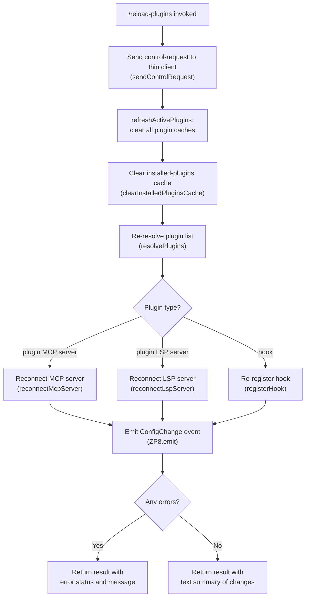

# `/reload-plugins`

> Analysis basis: CC v2.1.143 bundle.js (AST extraction + Claude interpretation)
> Minimum version: v2.1.143

---

## Overview

The `/reload-plugins` command activates pending plugin changes within the currently running session without requiring a full restart. It does this by clearing all in-memory plugin caches, re-resolving installed plugins and their dependencies, reconnecting any affected MCP servers and LSP servers, and emitting a configuration-change event so the rest of the application reflects the updated plugin state.

---

## Registration

| Field | Value |
|---|---|
| type | `local` |
| name | `reload-plugins` |
| description | `Activate pending plugin changes in the current session` |
| supportsNonInteractive | `false` |
| thinClientDispatch | `control-request` |
| module_id | `t0q` |

Analysis basis: CC v2.1.143 bundle.js:+11572698

---

## Input Branching

The command accepts no user-supplied arguments. All branching is internal and driven by the current plugin state discovered at execution time.



Analysis basis: CC v2.1.143 bundle.js:+11571721, +11571758, +11571833, +11572129, +11572161, +11572204, +11570873

---

## Behavioral Spec

### Cache Clearing and Plugin Refresh

```
function reloadPluginsCommand(context):
    // Step 1: send control-request to thin client transport
    sendControlRequest(context, "ccr")                  // loc +11571739, +11571758

    // Step 2: announce intent to debug log
    log("debug", "refreshActivePlugins: clearing all plugin caches")  // loc +11569811

    // Step 3: clear installed plugins cache
    clearInstalledPluginsCache()
    log("info", "Cleared installed plugins cache")      // loc +9393839

    // Step 4: re-resolve plugins
    pluginList = resolvePlugins(context)
```

Analysis basis: CC v2.1.143 bundle.js:+11569811, +9393839, +11571788

---

### Plugin Resolution

```
function resolvePlugins(context):
    // Load all plugin configurations from disk
    mcpConfig   = loadMcpConfig()         // reads .mcp.json  loc +7609306
    lspConfig   = loadLspConfig()         // reads .lsp.json  loc +8409238
    skillConfig = loadSkillConfig()       // reads known_marketplaces.json  loc +9365735

    // Classify each plugin entry
    resolved = []
    for each entry in allPluginEntries:
        pluginType = classifyPluginEntry(entry)
        // pluginType is one of: "plugin", "skill", "agent"
        // loc +11571853, +11571884, +11571912
        resolved.append({entry, pluginType})

    return resolved
```

Analysis basis: CC v2.1.143 bundle.js:+11571853, +11571884, +11571912, +7609306, +8409238, +9365735

---

### MCP Server Reconnection

```
function reconnectMcpServer(pluginEntry):
    serverLabel = "plugin MCP server"                  // loc +11571944
    serverConfig = buildMcpServerConfig(pluginEntry)

    // Close existing connection if present
    closeExistingConnection(serverConfig)              // loc +14513628, +14513638

    // Reopen connection
    newConnection = openMcpConnection(serverConfig)
    trackActiveConnection(newConnection)               // loc +14507672, +14507695

    return newConnection
```

Analysis basis: CC v2.1.143 bundle.js:+11571944, +14513628, +14513638, +14507672

---

### LSP Server Reconnection

```
function reconnectLspServer(pluginEntry):
    serverLabel = "plugin LSP server"                  // loc +11572436
    // Filter active LSP managers tagged "lsp-manager"  loc +11571289
    lspManagers = filterLspManagers("lsp-manager")

    for each mgr in lspManagers:
        // Only reconnect managers whose key starts with "plugin:"  loc +11571324
        if mgr.key.startsWith("plugin:"):
            mgr.disconnect()
            mgr.reconnect(pluginEntry.config)

    clearLspConnectionCache()                          // vz8.clear  loc +9338371
```

Analysis basis: CC v2.1.143 bundle.js:+11572436, +11571289, +11571324, +9338371

---

### Hook Re-registration

```
function reRegisterHooks(pluginEntry):
    hookType = "hook"                                  // loc +11572377
    // Register hook with the hook registry
    hookRegistry.register(pluginEntry.hookSpec)        // at_.register  loc +56977
```

Analysis basis: CC v2.1.143 bundle.js:+11572377, +56977

---

### Dependency Resolution

```
function resolvePluginDependencies(pluginList):
    for each plugin in pluginList:
        depResult = checkDependencies(plugin)
        if depResult.status == "dependency-unsatisfied":    // loc +10785982
            recordError(plugin, "dependency-unsatisfied")
        if depResult.status == "not-found":                 // loc +10786019
            recordError(plugin, "not-found")
        if depResult.status == "dependency-resolution":     // loc +10786994
            recordError(plugin, "dependency-resolution")
    return errors
```

Analysis basis: CC v2.1.143 bundle.js:+10785982, +10786019, +10786994

---

### Result Formatting

```
function formatReloadResult(resolvedPlugins, errors):
    separator = " · "                                  // loc +11571971
    lines = []

    for each plugin in resolvedPlugins:
        label = plugin.name.padEnd(40, " ")            // column width 40, loc +14528173
        lines.append(label + separator + plugin.status)

    if errors is not empty:
        return {type: "error", text: errors.join(separator)}   // loc +11572026, +11572101
    else:
        return {type: "text", text: lines.join("\n")}          // loc +11572101
```

Analysis basis: CC v2.1.143 bundle.js:+11571971, +11572026, +11572101, +14528173

---

### Error Classification

```
function classifyPluginError(errorCode):
    switch errorCode:
        case "generic-error":                    // loc +11571436
            return userFacingGenericError()
        case "dependency-unsatisfied":           // loc +10785982
            return dependencyError()
        case "not-found":                        // loc +10786019
            return notFoundError()
        case "resolution-failed":               // loc +5093030
            return resolutionFailedError()
        case "dependency-blocked-by-policy":    // loc +5093145
            return policyBlockedError()
        case "dependency-marketplace-blocked-by-policy":  // loc +5093255
            return marketplacePolicyBlockedError()
        case "settings-write-failed":           // loc +5093532
            return settingsWriteError()
        default:
            return unknownError()
```

Analysis basis: CC v2.1.143 bundle.js:+11571436, +10785982, +10786019, +5093030, +5093145, +5093255, +5093532

---

### Settings Reload Side Effect

```
function reloadSettingsIfChanged():
    // Fired as part of plugin refresh; reloads all settings layers
    settingsLayers = [
        "flagSettings",      // loc +1206320
        "userSettings",      // loc +1206856
        "projectSettings",   // loc +1206971
        "localSettings",     // loc +1206994
    ]
    for each layer in settingsLayers:
        reloadLayer(layer)
    emitEvent("loadSettingsFromDisk_start")   // loc +1204991
    // ... disk reads ...
    emitEvent("loadSettingsFromDisk_end")     // loc +1205047
```

Analysis basis: CC v2.1.143 bundle.js:+1206320, +1206856, +1206971, +1206994, +1204991, +1205047

---

## State & Side Effects

| Item | Detail |
|---|---|
| Telemetry | No `tengu_*` events are fired directly by `/reload-plugins` itself. Indirectly reachable telemetry within depth-2 traversal includes: `tengu_daemon_yield` (bundle.js:+14521203), `tengu_daemon_control` (bundle.js:+14538273), `tengu_bg_dispatch_sigkill_escalate` (bundle.js:+14503217), `tengu_bg_dispatch_low_mem` (bundle.js:+14503796), `tengu_bg_spare_enable` (bundle.js:+14504411), `tengu_bg_spare_claim` (bundle.js:+14504532), `tengu_bg_spare_claim_fail` (bundle.js:+14504795). These belong to daemon/background subsystems exercised during MCP reconnection, not the command itself. |
| Plugin cache | All in-memory plugin caches are cleared unconditionally. Log message: `"refreshActivePlugins: clearing all plugin caches"` (bundle.js:+11569811); `"Cleared installed plugins cache"` (bundle.js:+9393839). |
| MCP connections | Existing MCP server connections are closed and re-opened for every plugin-type MCP server (bundle.js:+14513628, +14513638, +14507672). |
| LSP connections | Active LSP manager connections whose key begins with `"plugin:"` are disconnected and reconnected; the LSP connection cache (`vz8`) is cleared (bundle.js:+9338371). |
| Hook registration | Plugin hooks are re-registered with the hook registry (`at_.register`) (bundle.js:+56977). |
| ConfigChange event | A `ConfigChange` event is emitted on the global event bus (`ZP8.emit`) after re-resolution completes (bundle.js:+11570873). The event carries the string `"policy_settings"` as a sub-type where applicable (bundle.js:+12223973). |
| Settings reload | All four settings layers (`flagSettings`, `userSettings`, `projectSettings`, `localSettings`) are reloaded from disk as a side effect (bundle.js:+1206320, +1206856, +1206971, +1206994). |
| Telemetry (plugin install) | If a plugin is considered newly active during the refresh, a `plugin_installed` telemetry event is emitted with attributes `plugin.name`, `plugin.version`, `marketplace.name`, `marketplace.is_official`, `install.trigger` (bundle.js:+5097538, +5097565, +5097605, +5097643, +5097665, +5097708). |
| appState changes | Plugin state in appState is updated via `O.set` / `X.set` (bundle.js:+5092086, +5092439). |
| Sound | <!-- TODO: not found in depth-2 traversal; needs --depth 4 --> |
| Non-interactive support | `supportsNonInteractive: false` — the command cannot be run in non-interactive (pipe/script) mode (bundle.js:+11572698). |
| Thin-client dispatch | `thinClientDispatch: "control-request"` — in thin-client configurations the command is forwarded as a control-request rather than executed locally (bundle.js:+11572698). |

---

## Version History

| Version | Change |
|---|---|
| v2.1.143 | Initial analysis. Command registered as `local` type with `thinClientDispatch: "control-request"`. Clears plugin caches, re-resolves MCP/LSP/hook plugin types, emits `ConfigChange`. |

---

## Common Mistakes

1. **Running in non-interactive mode**: `/reload-plugins` sets `supportsNonInteractive: false`. Attempting to invoke it from a script or pipe will be rejected. Use an interactive terminal session.
2. **Expecting a full process restart**: The command reloads plugin state in-memory only. Changes that require a new Node.js process context (e.g., native module re-linking) will not take effect until the CLI is fully restarted.
3. **Forgetting that settings are also reloaded**: Because settings layers are reloaded as a side effect, any unsaved in-memory settings overrides will be overwritten by the on-disk values after `/reload-plugins` runs.
4. **Assuming MCP servers remain connected during reload**: All plugin-type MCP server connections are closed and re-established. Any in-flight MCP tool calls at the moment of reload may be interrupted.
5. **Ignoring dependency errors in the output**: If a plugin has an unsatisfied dependency (`"dependency-unsatisfied"`) or a policy block (`"dependency-blocked-by-policy"`), the reload will complete but the affected plugin will not be active. Always check the returned status text for per-plugin error codes.
6. **Using in managed scope**: Installing or reloading plugins in a `"managed"` scope is blocked (`"Cannot install plugins to managed scope"`, bundle.js:+4865502). `/reload-plugins` will surface this as an error for any managed-scope entry.

---

## Appendix — Identifier Mapping

> For bundle debugging only. Identifiers change across versions.

| Identifier | Role |
|---|---|
| `Pk7` | Top-level command handler for `/reload-plugins` |
| `Z$` | Control-request sender (wraps transport) |
| `BjH` | Inner control-request implementation |
| `zd` | Plugin type classifier / label resolver |
| `N8` | String normaliser used during classification |
| `$JH` | `refreshActivePlugins` — main cache-clear and re-resolution orchestrator |
| `v` | Logger / structured-log emitter |
| `G5K` | Log-level dispatcher |
| `tt_` | Log-level router (debug/info/warn/error) |
| `TLK` | Log transport "info" handler |
| `ELK` | Log transport "error" handler |
| `hH` | JSON serialiser for log payloads |
| `P7` | Log-line formatter (redaction, truncation) |
| `h6A` | Log field mapper |
| `cSH` | Log output writer |
| `X6A` | Raw write-to-stream helper |
| `Z5K` | Rotating/append log-file writer |
| `PSH` | Buffered log flush manager |
| `i8H` | Log-file path builder |
| `gv8` | Log directory creator |
| `U6A` | Log file path joiner |
| `p6A` | Log file rotation handler |
| `E5K` | Log file append-and-rotate executor |
| `h9` | Hook registry registrar |
| `fe1` | Installed-plugins cache clearer |
| `k$` | Plugin list loader / installed-plugins resolver |
| `l17` | Plugin loading orchestrator |
| `GT` | Individual plugin loader |
| `Cz8` | Plugin config validator |
| `f_8` | Plugin manifest parser |
| `xA8` | Plugin schema checker |
| `Ow_` | Plugin root directory scanner |
| `NH` | Plugin error logger |
| `g88` | Plugin metadata extractor |
| `my_` | Plugin dependency merger |
| `nt1` | Plugin post-load normaliser |
| `rHH` | Plugin cache updater |
| `PqH` | Plugin cache store getter |
| `Ft1` | Plugin cache key builder |
| `LY8` | Plugin cache write helper |
| `YY_` | Plugin manifest re-parser |
| `GY_` | Plugin activation gating check |
| `JrH` | LSP connection cache clearer (`vz8.clear`) |
| `ZR1` | Plugin resolution entry-point |
| `HF1` | Plugin resolution validator |
| `__` | Global event bus accessor |
| `GV` | Global event bus instance |
| `K` | Plugin column formatter (padEnd 40) |
| `Ti` | MCP server config loader |
| `wG_` | MCP JSON config file reader (`.mcp.json`) |
| `$8` | ENOENT-safe file reader helper |
| `R6` | JSON parse helper |
| `Rg` | File-extension classifier (`.mcpb`, `.dxt`) |
| `$V1` | MCP plugin downloader/installer |
| `r36` | MCPB archive extractor |
| `XH` | String coercion helper |
| `XIH` | LSP config loader (`.lsp.json`) |
| `Mi4` | LSP entry processor |
| `fi4` | LSP path relative-checker |
| `$` | Telemetry event batcher |
| `JZq` | Telemetry event constructor |
| `ha` | Telemetry context accessor |
| `d1` | Async-local-storage store getter |
| `r06` | Daemon status file path builder (`daemon.status.json`) |
| `O` | Plugin result reducer |
| `jk7` | Plugin filter/map pipeline (lsp-manager / plugin: prefix filter) |
| `s0q` | Plugin set membership checker |
| `XLH` | Plugin dependency resolution engine |
| `bg` | Known-marketplaces loader |
| `S5` | Marketplace JSON reader |
| `pz8` | Marketplace path joiner |
| `lTH` | Tool-permission entry processor |
| `I8` | Permission record constructor |
| `jC6` | Permission validator |
| `WB` | Full permission-set builder |
| `MZ` | Error factory for dependency errors |
| `IA` | Permission scope splitter/checker |
| `xP` | Policy settings checker |
| `z36` | Host-pattern policy matcher |
| `b68` | Permission record lookup |
| `uo9` | Host-pattern evaluator |
| `mo9` | Path-pattern evaluator |
| `B14` | GitHub-source policy evaluator |
| `lt` | Permission record lookup variant |
| `U14` | Directory-source policy evaluator |
| `d1H` | Plugin install-record reader (`.claude-plugin`) |
| `GX6` | Plugin marketplace record reader |
| `By_` | Plugin marketplace JSON safe-parser |
| `L8` | EISDIR/ENOTDIR error handler |
| `d0` | Plugin settings reader (multi-source) |
| `AY_` | Project-level plugin settings reader |
| `PX7` | Dependency set membership tester |
| `HO6` | Plugin installation/activation engine (core resolver) |
| `zZ` | Permission record instanciator |
| `a88` | Permission scope + policy checker (combined) |
| `L96` | Local-path prefix checker (`./`) |
| `S6` | Async-local-storage settings accessor |
| `Uh6` | Settings store getter |
| `WT` | Plugin config file sync-reader |
| `gy_` | Sync config file reader |
| `Qy_` | Config entry iterator |
| `J` | Active MCP connection set |
| `y` | MCP process handle |
| `X` | MCP connection map |
| `iT8` | MCP connection constructor |
| `v_` | Error/string coercion helper |
| `SC` | Permission scope parser |
| `FS` | File-scope permission evaluator |
| `S68` | Semver version validator (uses `Eg`) |
| `W` | ConfigChange event debouncer/emitter |
| `z` | Active-plugin set |
| `I3H` | ConfigChange payload builder |
| `IBH` | ConfigChange relevance filter |
| `Vo9` | Dependency cycle / cross-marketplace checker |
| `M` | Plugin version registry |
| `p_` | Full plugin-load pipeline (disk → validate → register) |
| `wO` | Plugin record constructor |
| `lm8` | Plugin directory initialiser |
| `AP` | Plugin install-path builder |
| `nu8` | Plugin access-time recorder |
| `XXH` | Plugin record finaliser |
| `yA6` | Atomic file writer (temp + rename) |
| `hz` | Cache-clear helper (kV6 + EZ8) |
| `VR6` | Settings-file writer (mkdir + appendFile + writeFile) |
| `hy` | Settings path builder (`.claude/settings.json`) |
| `Lu` | Settings loader orchestrator |
| `s88` | Plugin path safety checker (no path traversal) |
| `g` | Active-tool-use set |
| `F` | Tool-use filter |
| `Q` | Plugin temp-file registry |
| `LW6` | Plugin temp-file reader |
| `B7q` | Plugin temp-file unlinker |
| `DH` | Plugin output queue |
| `zH` | Plugin output enqueuer |
| `w` | Background session/daemon process manager |
| `c` | Conversation context filter |
| `o` | Voice/audio session manager |
| `K36` | Semver range validator and conflict checker |
| `l3_` | Semver range pre-validator |
| `l88` | Plugin git-subdir handler |
| `n81` | Git-subdir path extractor |
| `n88` | npm/git/URL package resolver |
| `C54` | npm registry query builder |
| `Y8` | Shell command executor for npm/git |
| `e36` | Plugin extraction/build pipeline |
| `CgH` | Plugin archive extractor |
| `e88` | Plugin post-extract config writer |
| `q_1` | Plugin build step runner |
| `Q1H` | Plugin content hash generator (sha256) |
| `UC` | Plugin environment builder |
| `P` | Streaming process output accumulator |
| `x68` | Node package-manager lock-file detector |
| `Cg` | Plugin compile/transpile step |
| `jEH` | Plugin env variable injector |
| `o88` | Plugin temp-directory cleanup |
| `tz_` | Plugin install-record updater (Updated/Added) |
| `S` | Away-summary generator (blur/focus) |
| `NF` | Away-summary trigger evaluator |
| `N` | Away-summary content builder |
| `V` | Away-summary rate-limit checker |
| `jlq` | Away-summary API caller |
| `OH` | Plugin output handler dispatcher |
| `r` | Permission allow/deny evaluator |
| `l` | Permission rule matcher |
| `R` | MCP stdio transport writer |
| `C` | MCP stdio process wrapper |
| `AH` | Voice focus-silence timer |
| `G` | MCP connection instance factory |
| `U54` | Permission scope union builder |
| `m` | Plugin display name mapper |
| `_k` | Platform-name normaliser (toLowerCase) |
| `jM` | Cross-platform identifier normaliser |
| `xH` | String-to-string coercion primitive |
| `OL` | OTEL metrics emitter |
| `DV8` | OTEL attribute builder |
| `dFH` | OTEL span attribute populator |
| `wH6` | OTEL event emitter helper |
| `dt` | Dependency display formatter (depth ≤ 5) |