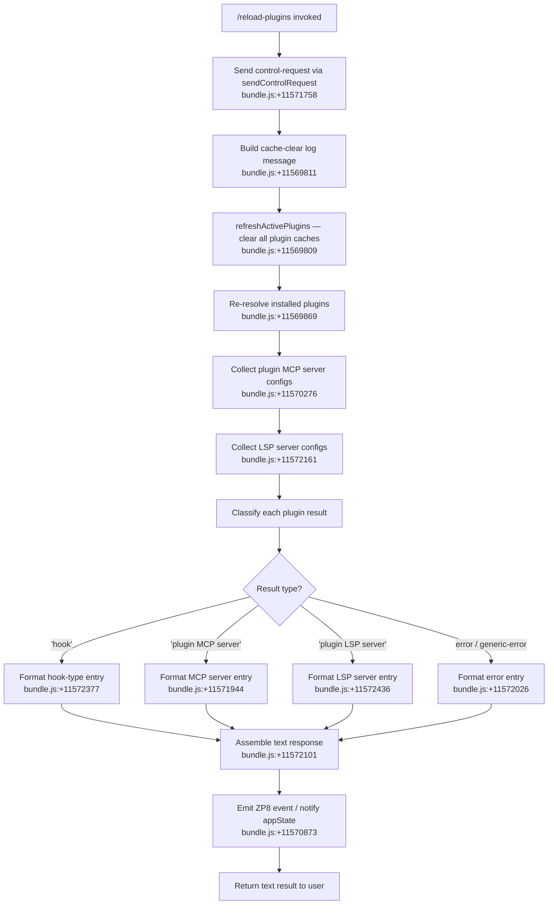

# `/reload-plugins`

> Analysis basis: CC v2.1.143 bundle.js (AST extraction + Claude interpretation)
> Minimum version: v2.1.143

---

## Overview

`/reload-plugins` activates pending plugin changes in the current Claude Code session without restarting the process. It clears all plugin caches, re-resolves installed plugins and their LSP/MCP server configurations, dispatches a control request to the daemon layer, and returns a structured text summary of which plugins were reloaded, updated, or errored.

---

## Registration

| Field | Value |
|---|---|
| type | `local` |
| name | `reload-plugins` |
| description | `Activate pending plugin changes in the current session` |
| loc_byte | `11572698` |
| loc_byte_end | `11572917` |
| loc_line | `7190` |
| supportsNonInteractive | `false` |
| thinClientDispatch | `control-request` |
| module_id | `t0q` |
| load_inline | `true` |
| arbor_handler.name | `Pk7` |
| arbor_handler.fqn | `claude-2.1.143::Pk7` |
| arbor_handler.kind | `AsyncFunction` |
| arbor_handler.resolution_path | `module_id` |
| arbor_handler.n_hits | `0` |

Analysis basis: CC v2.1.143 bundle.js:+11572698

---

## Input Branching

The handler (`Pk7`) follows four distinct top-level branches based on the result of the plugin refresh operation: (1) successful reload with plugin results, (2) hook-type component results, (3) LSP-server type components, and (4) error/failed plugin entries. A fifth path handles the control-request dispatch separately.



---

## Behavioral Spec

### Main Handler — `reloadPluginsHandler` (Pk7)

Analysis basis: CC v2.1.143 bundle.js:+11571721

```
async function reloadPluginsHandler(context):
    // 1. Dispatch control request to daemon layer
    sendControlRequest(context, "ccr")              // +11571739, +11571758

    // 2. Log intent
    debug("refreshActivePlugins: clearing all plugin caches")  // +11569811

    // 3. Invoke full plugin refresh pipeline
    results = await refreshActivePlugins(context)   // +11571833 (zd → N8 path)

    // 4. Collect MCP server configurations
    mcpConfigs = await collectMcpServerConfigs(context)  // +11570276

    // 5. Collect LSP/language-server configs
    lspConfigs = await collectPluginLspConfigs(context)  // +11572161

    // 6. Merge results from all three sources
    allEntries = merge(results, mcpConfigs, lspConfigs)

    // 7. Classify and format each entry
    lines = []
    for entry in allEntries:
        if entry.type == "hook":
            lines.append(formatHookEntry(entry))     // +11572377
        elif entry.type == "plugin MCP server":
            lines.append(formatMcpEntry(entry))      // +11571944
        elif entry.type == "plugin LSP server":
            lines.append(formatLspEntry(entry))      // +11572436
        elif entry.type == "error" or entry.status == "generic-error":
            lines.append(formatErrorEntry(entry))    // +11572026, +11571436

    // 8. Emit application state change event
    emitConfigChangeEvent()                          // +11570873

    // 9. Return text block
    return { type: "text", content: lines.join(" · ") }  // +11571971, +11572101
```

### Cache Clearing — `refreshActivePlugins` (zd → N8)

Analysis basis: CC v2.1.143 bundle.js:+11571833

```
async function refreshActivePlugins(context):
    // Clears installed-plugins cache
    clearInstalledPluginsCache()   // +9393839 "Cleared installed plugins cache"

    // Re-resolves all plugin roots from settings
    pluginRoots = getPluginRoots(context)   // "pluginRoot" +5392564

    // Iterates each plugin root to build fresh plugin list
    pluginList = []
    for root in pluginRoots:
        entries = resolvePluginsFromRoot(root)
        pluginList.extend(entries)

    return pluginList
```

### Plugin Resolution Pipeline — `resolvePluginsFromRoot` (k$ → l17 subtree)

Analysis basis: CC v2.1.143 bundle.js:+11569869

```
async function resolvePluginsFromRoot(root):
    // Resolve plugin manifests (manifest.json / .mcpb / .dxt)
    // +5075612, +5069592, +5069613
    manifests = loadManifests(root)

    // For each manifest, validate and build plugin descriptor
    for manifest in manifests:
        descriptor = buildPluginDescriptor(manifest)

        // Check policy gating
        if isBlockedByPolicy(descriptor):        // "blocked-by-policy" +5091819
            descriptor.status = "blocked-by-policy"
            continue

        // Check dependency satisfaction
        deps = resolveDependencies(descriptor)   // "dependency-resolution" +10786994
        if not deps.satisfied:
            descriptor.status = "dependency-unsatisfied"  // +10785982

        // Check version range compatibility
        checkVersionRange(descriptor)            // K36 subgraph, +5094560

    return descriptors
```

### MCP Server Config Collection — `collectMcpServerConfigs` (XIH)

Analysis basis: CC v2.1.143 bundle.js:+11570276

```
async function collectMcpServerConfigs(context):
    // Reads .lsp.json config file from plugin directories
    // +8409238 ".lsp.json"
    rawConfig = readFile(join(pluginDir, ".lsp.json"))
    if parseFails:
        logError("lsp-config-invalid")    // +8409508
        return []

    // Validates entries are within plugin directory bounds
    // "Invalid path: must be relative and within plugin directory" +8410438
    for entry in rawConfig.entries:
        resolvedPath = resolvePath(entry)
        relativePath = relativize(resolvedPath, pluginDir)
        if relativePath.startsWith(".."):
            skip(entry)

    return validatedEntries
```

### Plugin Dependency Resolver — `dependencyResolver` (XLH)

Analysis basis: CC v2.1.143 bundle.js:+11572161

```
async function dependencyResolver(pluginSet):
    // Build dependency graph
    graph = buildDependencyGraph(pluginSet)    // lTH +10786231

    // Detect cycles
    for node in graph:
        if hasCycle(node):
            node.status = "cycle"              // "cycle" literal at 4876559

    // Resolve not-found dependencies
    for dep in unresolved:
        if not found:
            dep.status = "not-found"           // "not-found" +10786019

    // Check range conflicts
    for dep in resolved:
        if rangeConflict(dep):
            dep.status = "range-conflict"      // "range-conflict" +5094597

    // Check cross-marketplace constraints
    for dep in resolved:
        if crossMarketplace(dep):
            dep.status = "cross-marketplace"   // "cross-marketplace" +4876475

    return resolvedGraph
```

### Result Formatting — `buildResultLines` (jk7)

Analysis basis: CC v2.1.143 bundle.js:+11570468

```
function buildResultLines(allResults):
    // Filter to entries relevant to lsp-manager
    lspEntries = allResults.filter(e => e.source == "lsp-manager")  // +11571289

    // Filter to plugin: prefixed entries
    pluginEntries = allResults.filter(e => e.source.startsWith("plugin:"))  // +11571324

    // For each errored entry, tag with generic-error
    for entry in pluginEntries:
        if entry.hasError:
            entry.tag = "generic-error"        // +11571436

    // Map entries to display strings with separator " · "  // +11571971
    lines = entries.map(e => formatDisplayLine(e))
    return lines
```

---

## State & Side Effects

| Item | Detail |
|---|---|
| Telemetry | No `tengu_*` events found directly in `Pk7` at depth ≤ 2; reachable daemon subsystems emit: `tengu_daemon_control` (+14538273), `tengu_daemon_yield` (+14521203), `tengu_bg_spare_claim` (+14504532), `tengu_bg_spare_claim_fail` (+14504795) |
| Plugin cache clear | All installed-plugin caches cleared on every invocation ("Cleared installed plugins cache" +9393839) |
| Control request dispatch | Issues a `"ccr"` typed control request to the daemon via `sendControlRequest` (+11571758); `thinClientDispatch: "control-request"` means thin clients route this command out-of-band |
| AppState / event emission | Emits a `ZP8` config-change event (+11570873) after refresh, updating session-visible plugin state |
| Settings read | Reads `settings.json` and `settings.local.json` from `~/.claude/` (+1197620, +1197682) to determine plugin roots |
| File I/O | Reads `.lsp.json` (+8409238), `.mcp.json` (+7609306), `manifest.json` (+5075612), `known_marketplaces.json` (+9365735); may rename or unlink staging files (+200215, +200255) |
| LSP server restart | Plugin LSP server entries trigger component re-registration via `at_.register` (+56977) |
| Hook type | Components tagged `"hook"` are reloaded separately from MCP and LSP servers (+11572377) |
| Non-interactive | `supportsNonInteractive: false` — command is blocked in non-interactive/piped mode |

---

## Version History

| Version | Change |
|---|---|
| v2.1.143 | Initial analysis |

---

## Common Mistakes

1. **Running in non-interactive mode**: `/reload-plugins` has `supportsNonInteractive: false`; invoking it in a piped or headless context will be rejected.
2. **Expecting immediate MCP reconnection**: The command clears caches and re-resolves configuration but depends on the daemon's control-request path (`"ccr"`); if the daemon is not running or the control channel is unavailable, plugin servers will not reconnect.
3. **Forgetting policy blocks**: Plugins blocked by enterprise policy (`blocked-by-policy`, `marketplace-blocked-by-policy`) will appear in the error section of the output rather than being silently skipped — check the returned text for these statuses.
4. **Assuming dependency resolution is synchronous**: The dependency resolver (`XLH`) performs async file reads of `known_marketplaces.json` and per-plugin manifests; on large plugin sets there may be a visible delay.
5. **Misinterpreting `"lsp-manager"` entries**: Entries tagged with the `"lsp-manager"` source are language-server components, not MCP tools; they appear in the reload summary but are managed by a separate subsystem.

---

## Appendix — Identifier Mapping

> For bundle debugging only. Identifiers change across versions.

| Identifier | Role |
|---|---|
| `Pk7` | Main async handler for `/reload-plugins` (reloadPluginsHandler) |
| `Z$` | Send-control-request helper |
| `BjH` | Control request internal dispatcher |
| `zd` | Entry point for refreshActivePlugins |
| `N8` | Core plugin cache invalidation routine |
| `$JH` | Full plugin refresh pipeline orchestrator |
| `v` | General logging / debug utility |
| `G5K` | Debug log formatter |
| `tt_` | Transport-level log emitter |
| `hH` | JSON-stringify helper |
| `P7` | Log line path-redaction helper |
| `h6A` | Path segment mapper |
| `cSH` | Log write dispatcher |
| `X6A` | Write-to-handle utility |
| `Z5K` | Append-file/log-rotation handler |
| `PSH` | Batched I/O flush helper |
| `i8H` | Log header formatter |
| `gv8` | Log rotation trigger |
| `U6A` | Log directory path builder |
| `p6A` | Log file rename/unlink helper |
| `E5K` | Log file append-and-rotate worker |
| `h9` | Signal / hook registrar (at_.register) |
| `fe1` | Installed-plugins cache clear entry ("Cleared installed plugins cache") |
| `k$` | Plugin root resolution orchestrator |
| `l17` | Plugin descriptor builder (loads manifests, policies) |
| `GT` | Plugin-root lookup helper |
| `Cz8` | Plugin scope validator |
| `f_8` | Plugin flag/setting reader |
| `xA8` | Plugin metadata normalizer |
| `Ow_` | Plugin-root iterator (Object.entries over roots) |
| `NH` | Error logger (Wc.logError path) |
| `g88` | Plugin state aggregator |
| `my_` | Plugin enablement checker |
| `nt1` | Plugin readiness notifier |
| `rHH` | Plugin reload sequence coordinator |
| `PqH` | Pre-reload snapshot helper |
| `Ft1` | Post-reload finalization helper |
| `LY8` | Plugin state writer |
| `YY_` | Plugin flag reader (f_8 wrapper) |
| `GY_` | Plugin graph builder |
| `JrH` | Plugin cache clear (vz8.clear) |
| `ZR1` | Plugin reload state initializer |
| `HF1` | Plugin reload result aggregator |
| `__` | General-purpose environment/context accessor (GV) |
| `GV` | Global environment object |
| `K` | MCP server padded-display formatter (L.map + f.padEnd) |
| `Ti` | MCP server config loader (wG_ + $V1 pipeline) |
| `wG_` | MCP .mcp.json file reader and parser |
| `$8` | ENOENT-tolerant file error handler |
| `R6` | JSON.parse wrapper |
| `Rg` | Extension-type classifier (.mcpb, .dxt) |
| `$V1` | MCP plugin status builder (http/download/network paths) |
| `r36` | MCPB archive extractor |
| `XH` | String coercion utility |
| `XIH` | LSP config file reader (.lsp.json) |
| `Mi4` | LSP config entry validator (path safety check) |
| `fi4` | Relative-path resolver/validator |
| `$` | Background session connection factory |
| `JZq` | Daemon status file writer (daemon.status.json) |
| `ha` | Status record formatter |
| `d1` | Async-local-storage store accessor (znL.getStore) |
| `r06` | Status file path builder (wZq.join) |
| `O` | Plugin N8-based state container |
| `jk7` | Result-line builder (lsp-manager / plugin: filter) |
| `s0q` | Error-entry tagger |
| `XLH` | Dependency resolution engine |
| `bg` | Dependency graph fetcher (S5 path) |
| `S5` | Known-marketplaces.json loader |
| `pz8` | Marketplace data path builder (E4.join) |
| `lTH` | Dependency descriptor unpacker (Object.entries + I8) |
| `I8` | Individual dependency record builder (jC6 + WB) |
| `jC6` | Dependency type classifier |
| `WB` | Dependency metadata assembler |
| `MZ` | Dependency error thrower |
| `IA` | Scope/path splitter (H.includes + H.split) |
| `xP` | Policy-constraint checker |
| `z36` | Host-pattern policy evaluator |
| `b68` | Policy record accessor (I8) |
| `uo9` | Pattern-match helper (a3_) |
| `mo9` | Pattern-match negative helper |
| `B14` | Policy-block emitter (EOH + bo9) |
| `lt` | Fallback policy record accessor |
| `U14` | Skills-dir policy checker (D3) |
| `d1H` | Per-plugin marketplace.json reader |
| `GX6` | Marketplace entry path builder (E4.join + By_) |
| `By_` | Marketplace entry schema validator |
| `L8` | EISDIR / ENOENT error classifier |
| `d0` | Plugin config reader (AY_ + S5 + YZ) |
| `AY_` | Plugin .claude-plugin config file reader |
| `PX7` | Dependency presence checker (q.has) |
| `HO6` | Full per-plugin install/reload handler |
| `zZ` | Plugin dependency record initializer (I8) |
| `a88` | Policy-path resolver (IA + xP) |
| `L96` | Scope-prefix checker (H.startsWith "./") |
| `S6` | Current-context accessor (Uh6 + Fd) |
| `Uh6` | AsyncLocalStorage context getter (ph6.getStore) |
| `WT` | Plugin.json loader (gy_ + M96 + f96 + Qy_) |
| `gy_` | plugin.json raw file reader (readFileSync) |
| `Qy_` | plugin.json field iterator (Object.entries + UC) |
| `J` | Background worker process registry (A.values + y.kill) |
| `y` | Background worker write interface (z.write + d) |
| `X` | MCP server connection manager (iT8 + Rk + vp + Promise.all) |
| `iT8` | MCP transport initializer |
| `v_` | Error/String coercion helper |
| `SC` | Install scope classifier (IA + FS) |
| `FS` | Filesystem scope resolver |
| `S68` | Semver range validator (Eg.valid + Eg.coerce + Eg.satisfies) |
| `W` | Plugin reload debounce scheduler (z.add + clearTimeout + setTimeout) |
| `z` | Plugin server registry (SH + mH + xN + Ox) |
| `I3H` | Config-change event emitter (L4 + j2 + K.map) |
| `IBH` | Plugin server change detector (H.some) |
| `Vo9` | Dependency-cycle detector (IA + A.has + q.has + $.includes + M.has) |
| `M` | Plugin dependency graph node store |
| `p_` | Settings file writer / atomic write helper (yA6 path) |
| `wO` | Settings write context builder (k5H + WB) |
| `lm8` | Settings file path resolver (oDA + k5H + XB + nDA + Gc) |
| `AP` | Settings persistence trigger (Tc) |
| `nu8` | Settings write timestamp recorder (RR6.set + Date.now) |
| `XXH` | Settings write coordinator (JC6 + WB) |
| `yA6` | Atomic file write helper (readlinkSync + openSync + writeFileSync + fsyncSync + renameSync) |
| `hz` | Cache invalidation (kV6.clear + EZ8.clear) |
| `VR6` | Settings file I/O handler (S6 + O5H.mkdir + O5H.readFile + O5H.writeFile) |
| `hy` | Settings path builder (pV.join + ".claude") |
| `Lu` | Settings load orchestrator (ah + P1 + nm8 + WB + yV6) |
| `s88` | Plugin directory safety validator (pC.resolve + A.startsWith) |
| `g` | MCP tool filter registry (F + $) |
| `F` | Active tool filter (c6.filter + P6.has) |
| `Q` | Plugin daemon status file handler (LW6 + B7q) |
| `LW6` | Daemon status file reader (cb.readFile + ZwH) |
| `B7q` | Daemon status file unlinker (cb.unlink + ZwH) |
| `DH` | Plugin event dispatcher (zH + w) |
| `zH` | Downstream plugin event queue pusher |
| `w` | Background worker lifecycle manager (SIGKILL + fU.spawn) |
| `c` | Active MCP connection tracker (o.filter) |
| `o` | Voice/audio session manager (X4H.startRecording, etc.) |
| `K36` | Semver range-conflict checker (Eg.validRange + Eg.minVersion) |
| `l3_` | Range-conflict inner validator |
| `l88` | Plugin install lock helper (n81) |
| `n81` | Install lock xH accessor |
| `n88` | Plugin package version resolver (c88.maxSatisfying) |
| `C54` | Package scope extractor |
| `Y8` | Plugin async runner ($_ + S6) |
| `e36` | Plugin download/extract installer (CgH + e88 + Q1H + UC + x68) |
| `CgH` | Plugin archive extraction coordinator |
| `e88` | Plugin post-extract setup (pA6) |
| `q_1` | Plugin install queue entry builder |
| `Q1H` | Plugin content hasher (i81.createHash sha256, +5082041) |
| `UC` | Plugin path/env builder (q_8 + e2) |
| `P` | HTTP/SSE transport handler (Buffer.concat + Vf + cq5) |
| `x68` | Plugin directory scanner (Bo9.readdir + C9) |
| `Cg` | Plugin compile step (xH) |
| `jEH` | Plugin post-compile config builder (UC) |
| `o88` | Plugin temp-dir cleanup (p54 + i88 + Q0.rm) |
| `tz_` | Plugin registry updater (WT + L.findIndex + L.push + VX6) |
| `S` | Away-summary / focus-blur scheduler (NF + Math.min + N + V + jlq) |
| `NF` | Focus-blur event detector |
| `N` | Away-summary generator |
| `V` | Away-summary cache writer |
| `jlq` | Away-summary debounce helper |
| `OH` | Plugin-down event handler (o) |
| `r` | Tool permission resolver (w + l) |
| `l` | Permission allow/deny decision maker (Oc_) |
| `R` | MCP connection state machine (C) |
| `C` | MCP write coordinator (Z_K + NH + MK5 + z.write) |
| `AH` | Voice focus-silence timeout manager (G.current + Q.setTimeout) |
| `G` | MCP server handle container (f26 + iT8) |
| `U54` | Plugin install-scope resolver (SC + IA + v + zZ + a88 + d0) |
| `m` | Plugin list display mapper |
| `_k` | Plugin name case-normalizer (_a.has + H.toLowerCase) |
| `jM` | Plugin display-name formatter (xH) |
| `xH` | String-to-string coercion wrapper (String) |
| `OL` | OTEL metrics attribute emitter (DV8 + dFH + wH6) |
| `DV8` | OTEL attribute key resolver |
| `dFH` | OTEL attribute value formatter (pu + V6 + g3_ + L5 + Do9) |
| `wH6` | OTEL event emitter (A.emit) |
| `dt` | Dependency display-line formatter (H.map + IA + q.join + N8) |